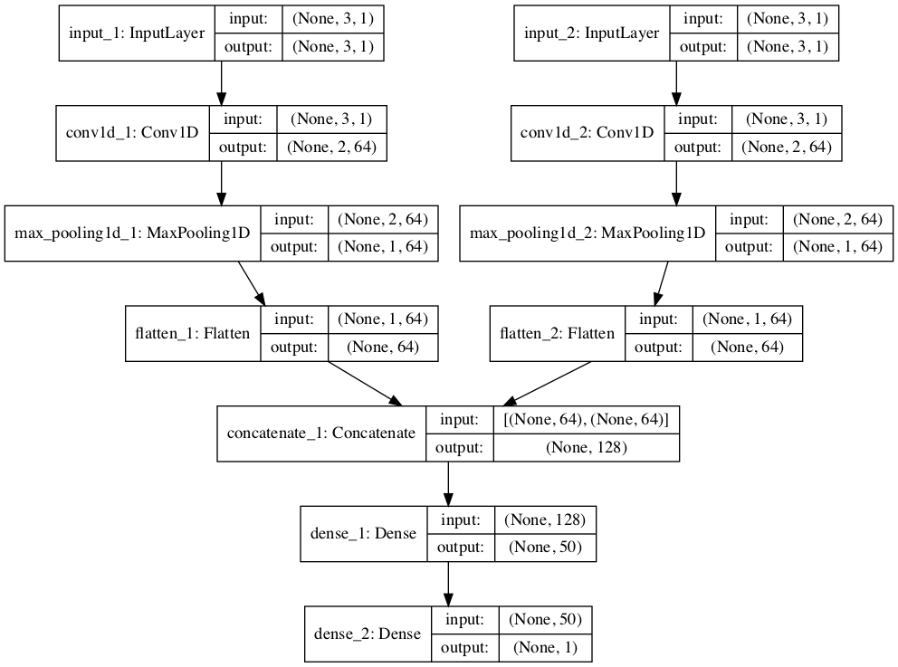
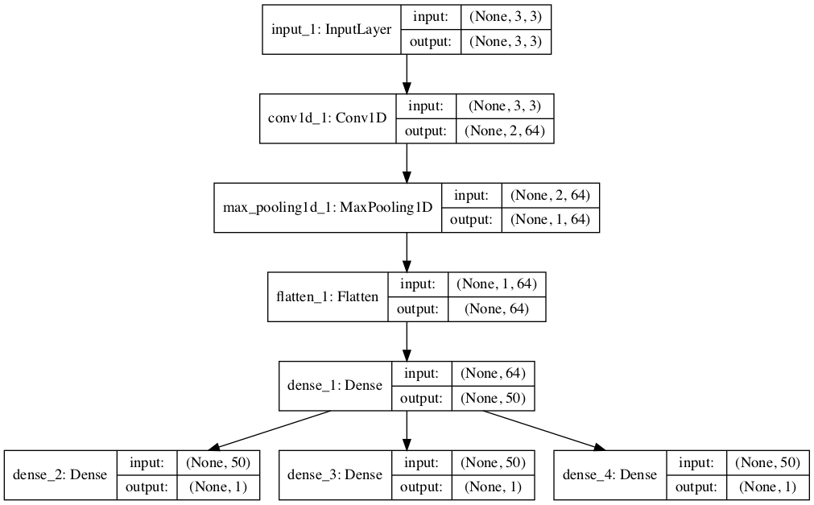

### How to Develop CNNs for Time Series Forecasting

Convolutional Neural Network models, or CNNs for short, can be applied to time series
forecasting. There are many types of CNN models that can be used for each specific type of
time series forecasting problem. In this tutorial, you will discover how to develop a suite of
CNN models for a range of standard time series forecasting problems. The objective of this
tutorial is to provide standalone examples of each model on each type of time series problem as
a template that you can copy and adapt for your specific time series forecasting problem. After
completing this tutorial, you will know:

- How to develop CNN models for univariate time series forecasting.
- How to develop CNN models for multivariate time series forecasting.
- How to develop CNN models for multi-step time series forecasting.

Let’s get started.

#### Tutorial Overview
In this tutorial, we will explore how to develop CNN models for time series forecasting. The
models are demonstrated on small contrived time series problems intended to give the flavor
of the type of time series problem being addressed. The chosen configuration of the models is
arbitrary and not optimized for each problem; that was not the goal. This tutorial is divided
into four parts; they are:

1. Univariate CNN Models
2. Multivariate CNN Models
3. Multi-step CNN Models
4. Multivariate Multi-step CNN Models

#### Univariate CNN Models
Although traditionally developed for two-dimensional image data, CNNs can be used to model
univariate time series forecasting problems. Univariate time series are datasets comprised of a
single series of observations with a temporal ordering and a model is required to learn from the
series of past observations to predict the next value in the sequence. This section is divided into
two parts; they are:

1. Data Preparation
2. CNN Model

#### Data Preparation

Before a univariate series can be modeled, it must be prepared. The CNN model will learn a
function that maps a sequence of past observations as input to an output observation. As such,
the sequence of observations must be transformed into multiple examples from which the model
can learn. Consider a given univariate sequence:

```
[10, 20, 30, 40, 50, 60, 70, 80, 90]

```

We can divide the sequence into multiple input/output patterns called samples, where three
time steps are used as input and one time step is used as output for the one-step prediction
that is being learned.

```
X, y
10, 20, 30, 40
20, 30, 40, 50
30, 40, 50, 60
...

```

The splitsequence() function below implements this behavior and will split a given
univariate sequence into multiple samples where each sample has a specified number of time
steps and the output is a single time step.

```

# split a univariate sequence into samples
def split_sequence(sequence, n_steps):
X, y = list(), list()
for i in range(len(sequence)):
# find the end of this pattern
end_ix = i + n_steps
# check if we are beyond the sequence
if end_ix > len(sequence)-1:
break
# gather input and output parts of the pattern
seq_x, seq_y = sequence[i:end_ix], sequence[end_ix]
X.append(seq_x)
y.append(seq_y)
return array(X), array(y)

```


We can demonstrate this function on our small contrived dataset above. The complete
example is listed below.

```
# univariate data preparation
from numpy import array

# split a univariate sequence into samples
def split_sequence(sequence, n_steps):
X, y = list(), list()
for i in range(len(sequence)):
# find the end of this pattern
end_ix = i + n_steps
# check if we are beyond the sequence
if end_ix > len(sequence)-1:
break
# gather input and output parts of the pattern
seq_x, seq_y = sequence[i:end_ix], sequence[end_ix]
X.append(seq_x)
y.append(seq_y)
return array(X), array(y)

# define input sequence
raw_seq = [10, 20, 30, 40, 50, 60, 70, 80, 90]
# choose a number of time steps
n_steps = 3
# split into samples
X, y = split_sequence(raw_seq, n_steps)
# summarize the data
for i in range(len(X)):
print(X[i], y[i])

```

Running the example splits the univariate series into six samples where each sample has
three input time steps and one output time step.

```

[10 20 30] 40
[20 30 40] 50
[30 40 50] 60
[40 50 60] 70
[50 60 70] 80
[60 70 80] 90

```

Now that we know how to prepare a univariate series for modeling, let’s look at developing
a CNN model that can learn the mapping of inputs to outputs.

#### CNN Model

A one-dimensional CNN is a CNN model that has a convolutional hidden
layer that operates
over a 1D sequence. This is followed by perhaps a second convolutional layer in some cases,
such as very long input sequences, and then a pooling layer whose job it is to distill the output
of the convolutional layer to the most salient elements. The convolutional and pooling layers
are followed by a dense fully connected layer that interprets the features extracted by the
convolutional part of the model. A flatten layer is used between the convolutional layers and
the dense layer to reduce the feature maps to a single one-dimensional vector. We can define a
1D CNN Model for univariate time series forecasting as follows.

```
# define model
model = Sequential()
model.add(Conv1D(filters=64, kernel_size=2, activation='relu', input_shape=(n_steps,
n_features)))
model.add(MaxPooling1D(pool_size=2))
model.add(Flatten())
model.add(Dense(50, activation='relu'))
model.add(Dense(1))
model.compile(optimizer='adam', loss='mse')

```

Key in the definition is the shape of the input; that is what the model expects as input for
each sample in terms of the number of time steps and the number of features. We are working
with a univariate series, so the number of features is one, for one
variable. The number of
time steps as input is the number we chose when preparing our dataset as an argument to the
splitsequence() function.

The input shape for each sample is specified in the input shape argument on the definition
of the first hidden layer. We almost always have multiple samples, therefore, the model will
expect the input component of training data to have the dimensions or shape: [samples,
timesteps, features]. Oursplitsequence() function in the previous section outputs the
X with the shape[samples, timesteps], so we can easily reshape it to have an additional
dimension for the one feature.

```
# reshape from [samples, timesteps] into [samples, timesteps, features]
n_features = 1
X = X.reshape((X.shape[0], X.shape[1], n_features))

```

The CNN does not actually view the data as having time steps, instead, it is treated as a
sequence over which convolutional read operations can be performed, like a one-dimensional
image. In this example, we define a convolutional layer with 64 filter maps and a kernel size
of 2. This is followed by a max pooling layer and a dense layer to interpret the input feature.

An output layer is specified that predicts a single numerical value. The
model is fit using the
efficient Adam version of stochastic gradient descent and optimized using the mean squared
error, or‘mse’, loss function. Once the model is defined, we can fit it on the training dataset.

```

# fit model
model.fit(X, y, epochs=1000, verbose=0)

```
After the model is fit, we can use it to make a prediction. We can predict the next value
in the sequence by providing the input:[70, 80, 90]. And expecting the model to predict
something like: [100]. The model expects the input shape to be three-dimensional with
[samples, timesteps, features], therefore, we must reshape the single input sample before
making the prediction.

```
x_input = array([70, 80, 90])
x_input = x_input.reshape((1, n_steps, n_features))
yhat = model.predict(x_input, verbose=0)

```

We can tie all of this together and demonstrate how to develop a 1D CNN model for
univariate time series forecasting and make a single prediction.

```
from numpy import array
from keras.models import Sequential
from keras.layers import Dense
from keras.layers import Flatten
from keras.layers.convolutional import Conv1D
from keras.layers.convolutional import MaxPooling1D

def split_sequence(sequence, n_steps):
X, y = list(), list()
for i in range(len(sequence)):

end_ix = i + n_steps

if end_ix > len(sequence)-1:
break

seq_x, seq_y = sequence[i:end_ix], sequence[end_ix]
X.append(seq_x)
y.append(seq_y)
return array(X), array(y)

raw_seq = [10, 20, 30, 40, 50, 60, 70, 80, 90]

n_steps = 3

X, y = split_sequence(raw_seq, n_steps)

n_features = 1
X = X.reshape((X.shape[0], X.shape[1], n_features))
model = Sequential()
model.add(Conv1D(filters=64, kernel_size=2, activation='relu',
input_shape=(n_steps,
n_features)))
model.add(MaxPooling1D(pool_size=2))
model.add(Flatten())
model.add(Dense(50, activation='relu'))
model.add(Dense(1))
model.compile(optimizer='adam', loss='mse')
model.fit(X, y, epochs=1000, verbose=0)

x_input = array([70, 80, 90])
x_input = x_input.reshape((1, n_steps, n_features))


yhat = model.predict(x_input, verbose=0)
print(yhat)

```

Running the example prepares the data, fits the model, and makes a prediction. We can see
that the model predicts the next value in the sequence.

**Note:** Given the stochastic nature of the algorithm, your specific results may vary. Consider
running the example a few times.

```
[[101.67965]]

```

For an example of a CNN applied to a real-world univariate time series forecasting problem
see Chapter 14. For an example of grid searching CNN hyperparameters on a univariate time
series forecasting problem, see Chapter 15.

### Multivariate CNN Models

Multivariate time series data means data where there is more than one observation for each
time step. There are two main models that we may require with multivariate time series data;
they are:

1.  Multiple Input Series.
2.  Multiple Parallel Series.

Let’s take a look at each in turn.

#### Multiple Input Series

A problem may have two or more parallel input time series and an output
time series that is
dependent on the input time series. The input time series are parallel because each series has
observations at the same time steps. We can demonstrate this with a simple example of two
parallel input time series where the output series is the simple addition of the input series.

```

# define input sequence
in_seq1 = array([10, 20, 30, 40, 50, 60, 70, 80, 90])
in_seq2 = array([15, 25, 35, 45, 55, 65, 75, 85, 95])
out_seq = array([in_seq1[i]+in_seq2[i] for i in range(len(in_seq1))])

```

We can reshape these three arrays of data as a single dataset where each row is a time step
and each column is a separate time series. This is a standard way of storing parallel time series
in a CSV file.

```

in_seq1 = in_seq1.reshape((len(in_seq1), 1))
in_seq2 = in_seq2.reshape((len(in_seq2), 1))
out_seq = out_seq.reshape((len(out_seq), 1))

dataset = hstack((in_seq1, in_seq2, out_seq))

```

The complete example is listed below.

```

from numpy import array
from numpy import hstack

in_seq1 = array([10, 20, 30, 40, 50, 60, 70, 80, 90])
in_seq2 = array([15, 25, 35, 45, 55, 65, 75, 85, 95])
out_seq = array([in_seq1[i]+in_seq2[i] for i in
range(len(in_seq1))])

in_seq1 = in_seq1.reshape((len(in_seq1), 1))
in_seq2 = in_seq2.reshape((len(in_seq2), 1))
out_seq = out_seq.reshape((len(out_seq), 1))

dataset = hstack((in_seq1, in_seq2, out_seq))
print(dataset)

```

Running the example prints the dataset with one row per time step and
one column for each
of the two input and one output parallel time series.

```

[[ 10 15 25]
[ 20 25 45]
[ 30 35 65]
[ 40 45 85]
[ 50 55 105]
[ 60 65 125]
[ 70 75 145]
[ 80 85 165]
[ 90 95 185]]

```

As with the univariate time series, we must structure these data into samples with input
and output samples. A 1D CNN model needs sufficient context to learn a
mapping from an
input sequence to an output value. CNNs can support parallel input time
series as separate
channels, like red, green, and blue components of an image. Therefore,
we need to split the
data into samples maintaining the order of observations across the two
input sequences. If we
chose three input time steps, then the first sample would look as
follows:

```

Input:

10, 15
20, 25
30, 35

```


```

Output:

65

```

That is, the first three time steps of each parallel series are provided
as input to the model
and the model associates this with the value in the output series at the
third time step, in this
case, 65. We can see that, in transforming the time series into
input/output samples to train
the model, that we will have to discard some values from the output time
series where we do
not have values in the input time series at prior time steps. In turn,
the choice of the size of
the number of input time steps will have an important effect on how much
of the training data
is used. We can define a function namedsplitsequences() that will take a
dataset as we
have defined it with rows for time steps and columns for parallel series
and return input/outputsamples.

```

def split_sequences(sequences, n_steps):
X, y = list(), list()
for i in range(len(sequences)):

end_ix = i + n_steps

if end_ix > len(sequences):
break

seq_x, seq_y = sequences[i:end_ix, :-1], sequences[end_ix-1, -1]
X.append(seq_x)
y.append(seq_y)
return array(X), array(y)

```

We can test this function on our dataset using three time steps for each
input time series as input. The complete example is listed below.

```
from numpy import array
from numpy import hstack

def split_sequences(sequences, n_steps):
X, y = list(), list()
for i in range(len(sequences)):

end_ix = i + n_steps

if end_ix > len(sequences):
break

seq_x, seq_y = sequences[i:end_ix, :-1], sequences[end_ix-1, -1]
X.append(seq_x)
y.append(seq_y)
return array(X), array(y)

in_seq1 = array([10, 20, 30, 40, 50, 60, 70, 80, 90])
in_seq2 = array([15, 25, 35, 45, 55, 65, 75, 85, 95])
out_seq = array([in_seq1[i]+in_seq2[i] for i in range(len(in_seq1))])

# convert to [rows, columns] structure
in_seq1 = in_seq1.reshape((len(in_seq1), 1))
in_seq2 = in_seq2.reshape((len(in_seq2), 1))
out_seq = out_seq.reshape((len(out_seq), 1))
# horizontally stack columns
dataset = hstack((in_seq1, in_seq2, out_seq))
# choose a number of time steps
n_steps = 3
# convert into input/output
X, y = split_sequences(dataset, n_steps)
print(X.shape, y.shape)
# summarize the data
for i in range(len(X)):
print(X[i], y[i])

```
Running the example first prints the shape of the `X` and `y` components. We can see that the
Xcomponent has a three-dimensional structure. The first dimension is the number of samples,
in this case 7. The second dimension is the number of time steps per sample, in this case 3, the
value specified to the function. Finally, the last dimension specifies
the number of parallel time
series or the number of variables, in this case 2 for the two parallel series.
This is the exact three-dimensional structure expected by a 1D CNN as input. The data
is ready to use without further reshaping. We can then see that the input and output for
each sample is printed, showing the three time steps for each of the two input series and the
associated output for each sample.

```

(7, 3, 2) (7,)

[[10 15]
[20 25]
[30 35]] 65
[[20 25]
[30 35]
[40 45]] 85
[[30 35]
[40 45]
[50 55]] 105
[[40 45]
[50 55]
[60 65]] 125
[[50 55]
[60 65]
[70 75]] 145
[[60 65]
[70 75]
[80 85]] 165
[[70 75]
[80 85]
[90 95]] 185

```


#### CNN Model

We are now ready to fit a 1D CNN model on this data, specifying the
expected number of time
steps and features to expect for each input sample, in this case three and two respectively.

```
# define model
model = Sequential()
model.add(Conv1D(filters=64, kernel_size=2, activation='relu', input_shape=(n_steps,
n_features)))
model.add(MaxPooling1D(pool_size=2))
model.add(Flatten())
model.add(Dense(50, activation='relu'))
model.add(Dense(1))
model.compile(optimizer='adam', loss='mse')

```

When making a prediction, the model expects three time steps for two input time series.
We can predict the next value in the output series providing the input
values of:

```

80, 85
90, 95
100, 105

```

The shape of the one sample with three time steps and two variables must
be [1, 3, 2].
We would expect the next value in the sequence to be 100 + 105 or 205.

```

# demonstrate prediction
x_input = array([[80, 85], [90, 95], [100, 105]])
x_input = x_input.reshape((1, n_steps, n_features))
yhat = model.predict(x_input, verbose=0)

```

The complete example is listed below.

```

# multivariate cnn example
from numpy import array
from numpy import hstack
from keras.models import Sequential
from keras.layers import Dense
from keras.layers import Flatten
from keras.layers.convolutional import Conv1D
from keras.layers.convolutional import MaxPooling1D

# split a multivariate sequence into samples
def split_sequences(sequences, n_steps):
X, y = list(), list()
for i in range(len(sequences)):
# find the end of this pattern
end_ix = i + n_steps
# check if we are beyond the dataset
if end_ix > len(sequences):
break
# gather input and output parts of the pattern
seq_x, seq_y = sequences[i:end_ix, :-1], sequences[end_ix-1, -1]


X.append(seq_x)
y.append(seq_y)
return array(X), array(y)

# define input sequence
in_seq1 = array([10, 20, 30, 40, 50, 60, 70, 80, 90])
in_seq2 = array([15, 25, 35, 45, 55, 65, 75, 85, 95])
out_seq = array([in_seq1[i]+in_seq2[i] for i in range(len(in_seq1))])
# convert to [rows, columns] structure
in_seq1 = in_seq1.reshape((len(in_seq1), 1))
in_seq2 = in_seq2.reshape((len(in_seq2), 1))
out_seq = out_seq.reshape((len(out_seq), 1))
# horizontally stack columns
dataset = hstack((in_seq1, in_seq2, out_seq))
# choose a number of time steps
n_steps = 3
# convert into input/output
X, y = split_sequences(dataset, n_steps)
# the dataset knows the number of features, e.g. 2
n_features = X.shape[2]
# define model
model = Sequential()
model.add(Conv1D(filters=64, kernel_size=2, activation='relu', input_shape=(n_steps,
n_features)))
model.add(MaxPooling1D(pool_size=2))
model.add(Flatten())
model.add(Dense(50, activation='relu'))
model.add(Dense(1))
model.compile(optimizer='adam', loss='mse')
# fit model
model.fit(X, y, epochs=1000, verbose=0)
# demonstrate prediction
x_input = array([[80, 85], [90, 95], [100, 105]])
x_input = x_input.reshape((1, n_steps, n_features))
yhat = model.predict(x_input, verbose=0)
print(yhat)

```

Running the example prepares the data, fits the model, and makes a
prediction.

**Note:** Given the stochastic nature of the algorithm, your specific results may vary. Consider
running the example a few times.

```

[[206.0161]]

```

#### Multi-headed CNN Model

There is another, more elaborate way to model the problem. Each input
series can be handled by
a separate CNN and the output of each of these submodels can be combined before a prediction
is made for the output sequence. We can refer to this as a multi-headed CNN model. It may
offer more flexibility or better performance depending on the specifics of the problem that is
being modeled. For example, it allows you to configure each submodel
differently for each input
series, such as the number of filter maps and the kernel size. This type
of model can be defined
in Keras using the Keras functional API. First, we can define the first
input model as a 1D
CNN with an input layer that expects vectors withnstepsand 1 feature.

```

visible1 = Input(shape=(n_steps, n_features))
cnn1 = Conv1D(filters=64, kernel_size=2, activation='relu')(visible1)
cnn1 = MaxPooling1D(pool_size=2)(cnn1)
cnn1 = Flatten()(cnn1)

```
We can define the second input submodel in the same way.

```

visible2 = Input(shape=(n_steps, n_features))
cnn2 = Conv1D(filters=64, kernel_size=2, activation='relu')(visible2)
cnn2 = MaxPooling1D(pool_size=2)(cnn2)
cnn2 = Flatten()(cnn2)

```

Now that both input submodels have been defined, we can merge the output from each
model into one long vector which can be interpreted before making a
prediction for the output sequence.

```

merge = concatenate([cnn1, cnn2])
dense = Dense(50, activation='relu')(merge)
output = Dense(1)(dense)

```
We can then tie the inputs and outputs together.

```

model = Model(inputs=[visible1, visible2], outputs=output)

```

The image below provides a schematic for how this model looks, including
the shape of the inputs and outputs of each layer.



This model requires input to be provided as a list of two elements where
each element in the
list contains data for one of the submodels. In order to achieve this,
we can split the 3D input
data into two separate arrays of input data; that is from one array with
the shape[7, 3, 2]
to two 3D arrays with [7, 3, 1].

```

n_features = 1

X1 = X[:, :, 0].reshape(X.shape[0], X.shape[1], n_features)
X2 = X[:, :, 1].reshape(X.shape[0], X.shape[1], n_features)

```

These data can then be provided in order to fit the model.

```
model.fit([X1, X2], y, epochs=1000, verbose=0)

```

Similarly, we must prepare the data for a single sample as two separate two-dimensional
arrays when making a single one-step prediction.

```

x_input = array([[80, 85], [90, 95], [100, 105]])
x1 = x_input[:, 0].reshape((1, n_steps, n_features))
x2 = x_input[:, 1].reshape((1, n_steps, n_features))

```


We can tie all of this together; the complete example is listed below.

```

from numpy import array
from numpy import hstack
from keras.models import Model
from keras.layers import Input
from keras.layers import Dense
from keras.layers import Flatten
from keras.layers.convolutional import Conv1D
from keras.layers.convolutional import MaxPooling1D
from keras.layers.merge import concatenate

def split_sequences(sequences, n_steps):
X, y = list(), list()
for i in range(len(sequences)):

end_ix = i + n_steps

if end_ix > len(sequences):
break

seq_x, seq_y = sequences[i:end_ix, :-1], sequences[end_ix-1, -1]
X.append(seq_x)
y.append(seq_y)
return array(X), array(y)

in_seq1 = array([10, 20, 30, 40, 50, 60, 70, 80, 90])
in_seq2 = array([15, 25, 35, 45, 55, 65, 75, 85, 95])
out_seq = array([in_seq1[i]+in_seq2[i] for i in
range(len(in_seq1))])

in_seq1 = in_seq1.reshape((len(in_seq1), 1))
in_seq2 = in_seq2.reshape((len(in_seq2), 1))
out_seq = out_seq.reshape((len(out_seq), 1))

dataset = hstack((in_seq1, in_seq2, out_seq))

n_steps = 3

X, y = split_sequences(dataset, n_steps)

n_features = 1

X1 = X[:, :, 0].reshape(X.shape[0], X.shape[1], n_features)
X2 = X[:, :, 1].reshape(X.shape[0], X.shape[1], n_features)

visible1 = Input(shape=(n_steps, n_features))
cnn1 = Conv1D(filters=64, kernel_size=2, activation='relu')(visible1)
cnn1 = MaxPooling1D(pool_size=2)(cnn1)
cnn1 = Flatten()(cnn1)

visible2 = Input(shape=(n_steps, n_features))
cnn2 = Conv1D(filters=64, kernel_size=2, activation='relu')(visible2)
cnn2 = MaxPooling1D(pool_size=2)(cnn2)


cnn2 = Flatten()(cnn2)
# merge input models
merge = concatenate([cnn1, cnn2])
dense = Dense(50, activation='relu')(merge)
output = Dense(1)(dense)
model = Model(inputs=[visible1, visible2], outputs=output)
model.compile(optimizer='adam', loss='mse')
# fit model
model.fit([X1, X2], y, epochs=1000, verbose=0)
# demonstrate prediction
x_input = array([[80, 85], [90, 95], [100, 105]])
x1 = x_input[:, 0].reshape((1, n_steps, n_features))
x2 = x_input[:, 1].reshape((1, n_steps, n_features))
yhat = model.predict([x1, x2], verbose=0)
print(yhat)

```

Running the example prepares the data, fits the model, and makes a
prediction.

**Note:** Given the stochastic nature of the algorithm, your specific results may vary. Consider
running the example a few times.

```

[[205.871]]

```

For an example of CNN models developed for a multivariate time series classification problem,
see Chapter 24.

#### Multiple Parallel Series

An alternate time series problem is the case where there are multiple
parallel time series and a

value must be predicted for each. For example, given the data from the
previous section:

```

[[ 10 15 25]
[ 20 25 45]
[ 30 35 65]
[ 40 45 85]
[ 50 55 105]
[ 60 65 125]
[ 70 75 145]
[ 80 85 165]
[ 90 95 185]]

```
We may want to predict the value for each of the three time series for the next time step. This
might be referred to as multivariate forecasting. Again, the data must be split into input/output
samples in order to train a model. The first sample of this dataset would be:

```

Input:

10, 15, 25

20, 25, 45

30, 35, 65

```


```

Output:
40, 45, 85

```

The splitsequences() function below will split multiple parallel time
series with rows for
time steps and one series per column into the required input/output
shape.

```

def split_sequences(sequences, n_steps):
X, y = list(), list()
for i in range(len(sequences)):

end_ix = i + n_steps

if end_ix > len(sequences)-1:
break

seq_x, seq_y = sequences[i:end_ix, :], sequences[end_ix, :]
X.append(seq_x)
y.append(seq_y)
return array(X), array(y)

```

We can demonstrate this on the contrived problem; the complete example
is listed below.

```

from numpy import array
from numpy import hstack

def split_sequences(sequences, n_steps):
X, y = list(), list()
for i in range(len(sequences)):

end_ix = i + n_steps

if end_ix > len(sequences)-1:
break

seq_x, seq_y = sequences[i:end_ix, :], sequences[end_ix, :]
X.append(seq_x)
y.append(seq_y)
return array(X), array(y)

in_seq1 = array([10, 20, 30, 40, 50, 60, 70, 80, 90])
in_seq2 = array([15, 25, 35, 45, 55, 65, 75, 85, 95])
out_seq = array([in_seq1[i]+in_seq2[i] for i in
range(len(in_seq1))])


# convert to [rows, columns] structure
in_seq1 = in_seq1.reshape((len(in_seq1), 1))
in_seq2 = in_seq2.reshape((len(in_seq2), 1))
out_seq = out_seq.reshape((len(out_seq), 1))
# horizontally stack columns
dataset = hstack((in_seq1, in_seq2, out_seq))
# choose a number of time steps
n_steps = 3
# convert into input/output
X, y = split_sequences(dataset, n_steps)
print(X.shape, y.shape)
# summarize the data
for i in range(len(X)):
print(X[i], y[i])

```

Running the example first prints the shape of the prepared `X` and `y` components. The
shape ofXis three-dimensional, including the number of samples (6), the number of time steps
chosen per sample (3), and the number of parallel time series or features (3). The shape ofy
is two-dimensional as we might expect for the number of samples (6) and the number of time
variables per sample to be predicted (3). The data is ready to use in a
1D CNN model that
expects three-dimensional input and two-dimensional output shapes for the `X` and `y` components
of each sample. Then, each of the samples is printed showing the input and output components
of each sample.

```

(6, 3, 3) (6, 3)

[[10 15 25]
[20 25 45]
[30 35 65]] [40 45 85]
[[20 25 45]
[30 35 65]
[40 45 85]] [ 50 55 105]
[[ 30 35 65]
[ 40 45 85]
[ 50 55 105]] [ 60 65 125]
[[ 40 45 85]
[ 50 55 105]
[ 60 65 125]] [ 70 75 145]
[[ 50 55 105]
[ 60 65 125]
[ 70 75 145]] [ 80 85 165]
[[ 60 65 125]
[ 70 75 145]
[ 80 85 165]] [ 90 95 185]

```

#### Vector-Output CNN Model

We are now ready to fit a 1D CNN model on this data. In this model, the
number of time steps
and parallel series (features) are specified for the input layer via
the input shape argument.
The number of parallel series is also used in the specification of the
number of values to predict
by the model in the output layer; again, this is three.

```

# define model
model = Sequential()
model.add(Conv1D(filters=64, kernel_size=2, activation='relu', input_shape=(n_steps,
n_features)))
model.add(MaxPooling1D(pool_size=2))
model.add(Flatten())
model.add(Dense(50, activation='relu'))
model.add(Dense(n_features))
model.compile(optimizer='adam', loss='mse')

```

We can predict the next value in each of the three parallel series by providing an input of
three time steps for each series.

```
70, 75, 145
80, 85, 165
90, 95, 185

```

The shape of the input for making a single prediction must be 1 sample, 3 time steps, and 3
features, or[1, 3, 3].

```

# demonstrate prediction
x_input = array([[70,75,145], [80,85,165], [90,95,185]])
x_input = x_input.reshape((1, n_steps, n_features))
yhat = model.predict(x_input, verbose=0)

```
We would expect the vector output to be: [100, 105, 205]. We can tie all of this together
and demonstrate a 1D CNN for multivariate output time series forecasting below.

```

# multivariate output 1d cnn example
from numpy import array
from numpy import hstack
from keras.models import Sequential
from keras.layers import Dense
from keras.layers import Flatten
from keras.layers.convolutional import Conv1D
from keras.layers.convolutional import MaxPooling1D

# split a multivariate sequence into samples
def split_sequences(sequences, n_steps):
X, y = list(), list()
for i in range(len(sequences)):
# find the end of this pattern
end_ix = i + n_steps
# check if we are beyond the dataset
if end_ix > len(sequences)-1:
break
# gather input and output parts of the pattern
seq_x, seq_y = sequences[i:end_ix, :], sequences[end_ix, :]
X.append(seq_x)


y.append(seq_y)
return array(X), array(y)

# define input sequence
in_seq1 = array([10, 20, 30, 40, 50, 60, 70, 80, 90])
in_seq2 = array([15, 25, 35, 45, 55, 65, 75, 85, 95])
out_seq = array([in_seq1[i]+in_seq2[i] for i in range(len(in_seq1))])
# convert to [rows, columns] structure
in_seq1 = in_seq1.reshape((len(in_seq1), 1))
in_seq2 = in_seq2.reshape((len(in_seq2), 1))
out_seq = out_seq.reshape((len(out_seq), 1))
# horizontally stack columns
dataset = hstack((in_seq1, in_seq2, out_seq))
# choose a number of time steps
n_steps = 3
# convert into input/output
X, y = split_sequences(dataset, n_steps)
# the dataset knows the number of features, e.g. 2
n_features = X.shape[2]
# define model
model = Sequential()
model.add(Conv1D(filters=64, kernel_size=2, activation='relu', input_shape=(n_steps,
n_features)))
model.add(MaxPooling1D(pool_size=2))
model.add(Flatten())
model.add(Dense(50, activation='relu'))
model.add(Dense(n_features))
model.compile(optimizer='adam', loss='mse')
# fit model
model.fit(X, y, epochs=3000, verbose=0)
# demonstrate prediction
x_input = array([[70,75,145], [80,85,165], [90,95,185]])
x_input = x_input.reshape((1, n_steps, n_features))
yhat = model.predict(x_input, verbose=0)
print(yhat)

```

Running the example prepares the data, fits the model and makes a
prediction.

**Note:** Given the stochastic nature of the algorithm, your specific results may vary. Consider
running the example a few times.

```

[[100.11272 105.32213 205.53436]]

```

#### Multi-output CNN Model

As with multiple input series, there is another more elaborate way to
model the problem. Each
output series can be handled by a separate output CNN model. We can refer to this as a
multi-output CNN model. It may offer more flexibility or better performance depending on the
specifics of the problem that is being modeled. This type of model can be defined in Keras
using the Keras functional API. First, we can define the first input model as a 1D CNN model.

```

# define model
visible = Input(shape=(n_steps, n_features))
cnn = Conv1D(filters=64, kernel_size=2, activation='relu')(visible)
cnn = MaxPooling1D(pool_size=2)(cnn)
cnn = Flatten()(cnn)
cnn = Dense(50, activation='relu')(cnn)

```

We can then define one output layer for each of the three series that we wish to forecast,
where each output submodel will forecast a single time step.

```

# define output 1
output1 = Dense(1)(cnn)
# define output 2
output2 = Dense(1)(cnn)
# define output 3
output3 = Dense(1)(cnn)

```

We can then tie the input and output layers together into a single
model.

```

# tie together
model = Model(inputs=visible, outputs=[output1, output2, output3])
model.compile(optimizer='adam', loss='mse')

```

To make the model architecture clear, the schematic below clearly shows the three separate
output layers of the model and the input and output shapes of each layer.



When training the model, it will require three separate output arrays per sample. We can
achieve this by converting the output training data that has the shape[7, 3] to three arrays
with the shape[7, 1].

```

# separate output
y1 = y[:, 0].reshape((y.shape[0], 1))
y2 = y[:, 1].reshape((y.shape[0], 1))
y3 = y[:, 2].reshape((y.shape[0], 1))

```

These arrays can be provided to the model during training.

```

# fit model
model.fit(X, [y1,y2,y3], epochs=2000, verbose=0)

```

Tying all of this together, the complete example is listed below.

```

# multivariate output 1d cnn example
from numpy import array
from numpy import hstack
from keras.models import Model
from keras.layers import Input
from keras.layers import Dense
from keras.layers import Flatten
from keras.layers.convolutional import Conv1D
from keras.layers.convolutional import MaxPooling1D

# split a multivariate sequence into samples
def split_sequences(sequences, n_steps):
X, y = list(), list()
for i in range(len(sequences)):
# find the end of this pattern
end_ix = i + n_steps
# check if we are beyond the dataset
if end_ix > len(sequences)-1:
break
# gather input and output parts of the pattern
seq_x, seq_y = sequences[i:end_ix, :], sequences[end_ix, :]
X.append(seq_x)
y.append(seq_y)
return array(X), array(y)

# define input sequence
in_seq1 = array([10, 20, 30, 40, 50, 60, 70, 80, 90])
in_seq2 = array([15, 25, 35, 45, 55, 65, 75, 85, 95])
out_seq = array([in_seq1[i]+in_seq2[i] for i in range(len(in_seq1))])
# convert to [rows, columns] structure
in_seq1 = in_seq1.reshape((len(in_seq1), 1))
in_seq2 = in_seq2.reshape((len(in_seq2), 1))
out_seq = out_seq.reshape((len(out_seq), 1))
# horizontally stack columns
dataset = hstack((in_seq1, in_seq2, out_seq))
# choose a number of time steps
n_steps = 3
# convert into input/output

X, y = split_sequences(dataset, n_steps)

n_features = X.shape[2]

y1 = y[:, 0].reshape((y.shape[0], 1))
y2 = y[:, 1].reshape((y.shape[0], 1))
y3 = y[:, 2].reshape((y.shape[0], 1))
visible = Input(shape=(n_steps, n_features))
cnn = Conv1D(filters=64, kernel_size=2, activation='relu')(visible)
cnn = MaxPooling1D(pool_size=2)(cnn)
cnn = Flatten()(cnn)
cnn = Dense(50, activation='relu')(cnn)

output1 = Dense(1)(cnn)

output2 = Dense(1)(cnn)

output3 = Dense(1)(cnn)
model = Model(inputs=visible, outputs=[output1, output2, output3])
model.compile(optimizer='adam', loss='mse')
model.fit(X, [y1,y2,y3], epochs=2000, verbose=0)

x_input = array([[70,75,145], [80,85,165], [90,95,185]])
x_input = x_input.reshape((1, n_steps, n_features))
yhat = model.predict(x_input, verbose=0)
print(yhat)

```

Running the example prepares the data, fits the model, and makes a
prediction.

**Note:** Given the stochastic nature of the algorithm, your specific
results may vary. Consider running the example a few times.

```

[array([[100.96118]], dtype=float32),
array([[105.502686]], dtype=float32),
array([[205.98045]], dtype=float32)]

```

For an example of CNN models developed for a multivariate time series
forecasting problem, see Chapter 19.

### Multi-step CNN Models

In practice, there is little difference to the 1D CNN model in
predicting a vector output that
represents different output variables (as in the previous example), or a
vector output that
represents multiple time steps of one variable. Nevertheless, there are
subtle and important
differences in the way the training data is prepared. In this section,
we will demonstrate the
case of developing a multi-step forecast model using a vector model. Before we look at the
specifics of the model, let’s first look at the preparation of data for multi-step forecasting.

#### Data Preparation

As with one-step forecasting, a time series used for multi-step time
series forecasting must be
split into samples with input and output components. Both the input and
output components
will be comprised of multiple time steps and may or may not have the
same number of steps.

For example, given the univariate time series:

```

[10, 20, 30, 40, 50, 60, 70, 80, 90]

```

We could use the last three time steps as input and forecast the next two time steps. The
first sample would look as follows:

```

Input:

[10, 20, 30]

Output:

[40, 50]

```

The splitsequence() function below implements this behavior and will split a given
univariate time series into samples with a specified number of input and output time steps.

```

# split a univariate sequence into samples
def split_sequence(sequence, n_steps_in, n_steps_out):
X, y = list(), list()
for i in range(len(sequence)):
# find the end of this pattern
end_ix = i + n_steps_in
out_end_ix = end_ix + n_steps_out
# check if we are beyond the sequence
if out_end_ix > len(sequence):
break
# gather input and output parts of the pattern
seq_x, seq_y = sequence[i:end_ix], sequence[end_ix:out_end_ix]
X.append(seq_x)
y.append(seq_y)
return array(X), array(y)

```

We can demonstrate this function on the small contrived dataset. The complete example is
listed below.

```

# multi-step data preparation
from numpy import array

# split a univariate sequence into samples

def split_sequence(sequence, n_steps_in, n_steps_out):
X, y = list(), list()
for i in range(len(sequence)):
# find the end of this pattern
end_ix = i + n_steps_in
out_end_ix = end_ix + n_steps_out
# check if we are beyond the sequence
if out_end_ix > len(sequence):
break
# gather input and output parts of the pattern
seq_x, seq_y = sequence[i:end_ix], sequence[end_ix:out_end_ix]
X.append(seq_x)
y.append(seq_y)
return array(X), array(y)

# define input sequence
raw_seq = [10, 20, 30, 40, 50, 60, 70, 80, 90]
# choose a number of time steps
n_steps_in, n_steps_out = 3, 2
# split into samples
X, y = split_sequence(raw_seq, n_steps_in, n_steps_out)
# summarize the data
for i in range(len(X)):
print(X[i], y[i])

```

Running the example splits the univariate series into input and output time steps and prints
the input and output components of each.
```

[10 20 30] [40 50]
[20 30 40] [50 60]
[30 40 50] [60 70]
[40 50 60] [70 80]
[50 60 70] [80 90]

```

Now that we know how to prepare data for multi-step forecasting, let’s look at a 1D CNN
model that can learn this mapping.

#### Vector Output Model

The 1D CNN can output a vector directly that can be interpreted as a
multi-step forecast. This

approach was seen in the previous section were one time step of each output time series was
forecasted as a vector. As with the 1D CNN models for univariate data in a prior section, the
prepared samples must first be reshaped. The CNN expects data to have a three-dimensional
structure of[samples, timesteps, features], and in this case, we only have one feature so
the reshape is straight forward.
```

# reshape from [samples, timesteps] into [samples, timesteps, features]
n_features = 1
X = X.reshape((X.shape[0], X.shape[1], n_features))

```

With the number of input and output steps specified in
the n_steps_in and n_steps_out
variables, we can define a multi-step time-series forecasting model.

```

# define model
model = Sequential()
model.add(Conv1D(filters=64, kernel_size=2, activation='relu', input_shape=(n_steps_in,
n_features)))
model.add(MaxPooling1D(pool_size=2))
model.add(Flatten())
model.add(Dense(50, activation='relu'))
model.add(Dense(n_steps_out))
model.compile(optimizer='adam', loss='mse')

```

The model can make a prediction for a single sample. We can predict the next two steps
beyond the end of the dataset by providing the input:[70, 80, 90]. We would expect the
predicted output to be:[100, 110]. As expected by the model, the shape of the single sample
of input data when making the prediction must be [1, 3, 1]for the 1 sample, 3 time steps of
the input, and the single feature.

```

# demonstrate prediction
x_input = array([70, 80, 90])
x_input = x_input.reshape((1, n_steps_in, n_features))
yhat = model.predict(x_input, verbose=0)

```

Tying all of this together, the 1D CNN for multi-step forecasting with a univariate time
series is listed below.
```

# univariate multi-step vector-output 1d cnn example
from numpy import array
from keras.models import Sequential
from keras.layers import Dense
from keras.layers import Flatten
from keras.layers.convolutional import Conv1D
from keras.layers.convolutional import MaxPooling1D

# split a univariate sequence into samples
def split_sequence(sequence, n_steps_in, n_steps_out):
X, y = list(), list()
for i in range(len(sequence)):
# find the end of this pattern
end_ix = i + n_steps_in
out_end_ix = end_ix + n_steps_out
# check if we are beyond the sequence
if out_end_ix > len(sequence):
break
# gather input and output parts of the pattern
seq_x, seq_y = sequence[i:end_ix], sequence[end_ix:out_end_ix]
X.append(seq_x)
y.append(seq_y)
return array(X), array(y)

# define input sequence
raw_seq = [10, 20, 30, 40, 50, 60, 70, 80, 90]


# choose a number of time steps
n_steps_in, n_steps_out = 3, 2
# split into samples
X, y = split_sequence(raw_seq, n_steps_in, n_steps_out)
# reshape from [samples, timesteps] into [samples, timesteps, features]
n_features = 1
X = X.reshape((X.shape[0], X.shape[1], n_features))
# define model
model = Sequential()
model.add(Conv1D(filters=64, kernel_size=2, activation='relu', input_shape=(n_steps_in,
n_features)))
model.add(MaxPooling1D(pool_size=2))
model.add(Flatten())
model.add(Dense(50, activation='relu'))
model.add(Dense(n_steps_out))
model.compile(optimizer='adam', loss='mse')
# fit model
model.fit(X, y, epochs=2000, verbose=0)
# demonstrate prediction
x_input = array([70, 80, 90])
x_input = x_input.reshape((1, n_steps_in, n_features))
yhat = model.predict(x_input, verbose=0)
print(yhat)

```
Running the example forecasts and prints the next two time steps in the
sequence.

**Note:** Given the stochastic nature of the algorithm, your specific results may vary. Consider
running the example a few times.

```

[[102.86651 115.08979]]

```

For an example of CNN models developed for a multi-step time series forecasting problem,
see Chapter 19.

### Multivariate Multi-step CNN Models

In the previous sections, we have looked at univariate, multivariate, and multi-step time series
forecasting. It is possible to mix and match the different types of 1D CNN models presented so
far for the different problems. This too applies to time series forecasting problems that involve
multivariate and multi-step forecasting, but it may be a little more challenging. In this section,

we will explore short examples of data preparation and modeling for
multivariate multi-step

time series forecasting as a template to ease this challenge,
specifically:

1.  Multiple Input Multi-step Output.
2.  Multiple Parallel Input and Multi-step Output.

<!-- -->

Perhaps the biggest stumbling block is in the preparation of data, so this is where we will
focus our attention.


#### Multiple Input Multi-step Output

There are those multivariate time series forecasting problems where the
output series is separate
but dependent upon the input time series, and multiple time steps are required for the output
series. For example, consider our multivariate time series from a prior section:

```

[[ 10 15 25]
[ 20 25 45]
[ 30 35 65]
[ 40 45 85]
[ 50 55 105]
[ 60 65 125]
[ 70 75 145]
[ 80 85 165]
[ 90 95 185]]

```
We may use three prior time steps of each of the two input time series to predict two time
steps of the output time series.

```

Input:

10, 15
20, 25
30, 35

Output:

65
85

```

The splitsequences() function below implements this behavior.

```

# split a multivariate sequence into samples
def split_sequences(sequences, n_steps_in, n_steps_out):
X, y = list(), list()
for i in range(len(sequences)):
# find the end of this pattern
end_ix = i + n_steps_in
out_end_ix = end_ix + n_steps_out-1
# check if we are beyond the dataset
if out_end_ix > len(sequences):
break
# gather input and output parts of the pattern
seq_x, seq_y = sequences[i:end_ix, :-1], sequences[end_ix-1:out_end_ix, -1]
X.append(seq_x)
y.append(seq_y)
return array(X), array(y)

```

We can demonstrate this on our contrived dataset. The complete example
is listed below.


```

# multivariate multi-step data preparation
from numpy import array
from numpy import hstack

# split a multivariate sequence into samples
def split_sequences(sequences, n_steps_in, n_steps_out):
X, y = list(), list()
for i in range(len(sequences)):
# find the end of this pattern
end_ix = i + n_steps_in
out_end_ix = end_ix + n_steps_out-1
# check if we are beyond the dataset
if out_end_ix > len(sequences):
break
# gather input and output parts of the pattern
seq_x, seq_y = sequences[i:end_ix, :-1], sequences[end_ix-1:out_end_ix, -1]
X.append(seq_x)
y.append(seq_y)
return array(X), array(y)

# define input sequence
in_seq1 = array([10, 20, 30, 40, 50, 60, 70, 80, 90])
in_seq2 = array([15, 25, 35, 45, 55, 65, 75, 85, 95])
out_seq = array([in_seq1[i]+in_seq2[i] for i in range(len(in_seq1))])
# convert to [rows, columns] structure
in_seq1 = in_seq1.reshape((len(in_seq1), 1))
in_seq2 = in_seq2.reshape((len(in_seq2), 1))
out_seq = out_seq.reshape((len(out_seq), 1))
# horizontally stack columns
dataset = hstack((in_seq1, in_seq2, out_seq))
# choose a number of time steps
n_steps_in, n_steps_out = 3, 2
# convert into input/output
X, y = split_sequences(dataset, n_steps_in, n_steps_out)
print(X.shape, y.shape)
# summarize the data
for i in range(len(X)):
print(X[i], y[i])

```

Running the example first prints the shape of the prepared training data. We can see that
the shape of the input portion of the samples is three-dimensional, comprised of six samples,
with three time steps and two variables for the two input time series.
The output portion of the
samples is two-dimensional for the six samples and the two time steps for each sample to be
predicted. The prepared samples are then printed to confirm that the data was prepared as we
specified.

```

(6, 3, 2) (6, 2)

[[10 15]
[20 25]
[30 35]] [65 85]
[[20 25]


[30 35]

[40 45]] [ 85 105]

[[30 35]

[40 45]

[50 55]] [105 125]

[[40 45]

[50 55]

[60 65]] [125 145]

[[50 55]

[60 65]

[70 75]] [145 165]

[[60 65]

[70 75]

[80 85]] [165 185]

```


We can now develop a 1D CNN model for multi-step predictions. In this case, we will
demonstrate a vector output model. The complete example is listed below.

```

from numpy import array
from numpy import hstack
from keras.models import Sequential
from keras.layers import Dense
from keras.layers import Flatten
from keras.layers.convolutional import Conv1D
from keras.layers.convolutional import MaxPooling1D

def split_sequences(sequences, n_steps_in, n_steps_out):
X, y = list(), list()
for i in range(len(sequences)):

end_ix = i + n_steps_in
out_end_ix = end_ix + n_steps_out-1

if out_end_ix > len(sequences):
break

seq_x, seq_y = sequences[i:end_ix, :-1],
sequences[end_ix-1:out_end_ix, -1]
X.append(seq_x)
y.append(seq_y)
return array(X), array(y)

in_seq1 = array([10, 20, 30, 40, 50, 60, 70, 80, 90])
in_seq2 = array([15, 25, 35, 45, 55, 65, 75, 85, 95])
out_seq = array([in_seq1[i]+in_seq2[i] for i in
range(len(in_seq1))])

in_seq1 = in_seq1.reshape((len(in_seq1), 1))
in_seq2 = in_seq2.reshape((len(in_seq2), 1))
out_seq = out_seq.reshape((len(out_seq), 1))

dataset = hstack((in_seq1, in_seq2, out_seq))


# choose a number of time steps
n_steps_in, n_steps_out = 3, 2
# convert into input/output
X, y = split_sequences(dataset, n_steps_in, n_steps_out)
# the dataset knows the number of features, e.g. 2
n_features = X.shape[2]
# define model
model = Sequential()
model.add(Conv1D(filters=64, kernel_size=2, activation='relu', input_shape=(n_steps_in,
n_features)))
model.add(MaxPooling1D(pool_size=2))
model.add(Flatten())
model.add(Dense(50, activation='relu'))
model.add(Dense(n_steps_out))
model.compile(optimizer='adam', loss='mse')
# fit model
model.fit(X, y, epochs=2000, verbose=0)
# demonstrate prediction
x_input = array([[70, 75], [80, 85], [90, 95]])
x_input = x_input.reshape((1, n_steps_in, n_features))
yhat = model.predict(x_input, verbose=0)
print(yhat)

```

Running the example fits the model and predicts the next two time steps of the output
sequence beyond the dataset. We would expect the next two steps to be [185, 205].

**Note:** Given the stochastic nature of the algorithm, your specific results may vary. Consider
running the example a few times.

```

[[185.57011 207.77893]]

```

#### Multiple Parallel Input and Multi-step Output

A problem with parallel time series may require the prediction of
multiple time steps of each
time series. For example, consider our multivariate time series from a prior section:

```

[[ 10 15 25]
[ 20 25 45]
[ 30 35 65]
[ 40 45 85]
[ 50 55 105]
[ 60 65 125]
[ 70 75 145]
[ 80 85 165]
[ 90 95 185]]

```

We may use the last three time steps from each of the three time series as input to the
model, and predict the next time steps of each of the three time series
as output. The first sample in the training dataset would be the following.

```

Input:

20, 25, 45
30, 35, 65

Output:

50, 55, 105

```
The splitsequences() function below implements this behavior.

def split_sequences(sequences, n_steps_in, n_steps_out):
X, y = list(), list()
for i in range(len(sequences)):

end_ix = i + n_steps_in
out_end_ix = end_ix + n_steps_out

if out_end_ix > len(sequences):
break

seq_x, seq_y = sequences[i:end_ix, :],
sequences[end_ix:out_end_ix, :]
X.append(seq_x)
y.append(seq_y)
return array(X), array(y)

```

multi-step forecasting.

We can demonstrate this function on the small contrived dataset. The
complete example is

listed below.

from numpy import array
from numpy import hstack

def split_sequences(sequences, n_steps_in, n_steps_out):
X, y = list(), list()
for i in range(len(sequences)):

end_ix = i + n_steps_in
out_end_ix = end_ix + n_steps_out

if out_end_ix > len(sequences):
break

seq_x, seq_y = sequences[i:end_ix, :],
sequences[end_ix:out_end_ix, :]


X.append(seq_x)
y.append(seq_y)
return array(X), array(y)

in_seq1 = array([10, 20, 30, 40, 50, 60, 70, 80, 90])
in_seq2 = array([15, 25, 35, 45, 55, 65, 75, 85, 95])
out_seq = array([in_seq1[i]+in_seq2[i] for i in
range(len(in_seq1))])

in_seq1 = in_seq1.reshape((len(in_seq1), 1))
in_seq2 = in_seq2.reshape((len(in_seq2), 1))
out_seq = out_seq.reshape((len(out_seq), 1))

dataset = hstack((in_seq1, in_seq2, out_seq))

n_steps_in, n_steps_out = 3, 2

X, y = split_sequences(dataset, n_steps_in, n_steps_out)
print(X.shape, y.shape)

for i in range(len(X)):
print(X[i], y[i])

```

Running the example first prints the shape of the prepared training dataset. We can see
that both the input (X) and output (Y) elements of the dataset are three
dimensional for the
number of samples, time steps, and variables or parallel time series
respectively. The input and
output elements of each series are then printed side by side so that we
can confirm that the
data was prepared as we expected.

```

(5, 3, 3) (5, 2, 3)

[[10 15 25]
[20 25 45]
[30 35 65]] [[ 40 45 85]
[ 50 55 105]]
[[20 25 45]
[30 35 65]
[40 45 85]] [[ 50 55 105]
[ 60 65 125]]
[[ 30 35 65]
[ 40 45 85]
[ 50 55 105]] [[ 60 65 125]
[ 70 75 145]]
[[ 40 45 85]
[ 50 55 105]
[ 60 65 125]] [[ 70 75 145]
[ 80 85 165]]
[[ 50 55 105]
[ 60 65 125]
[ 70 75 145]] [[ 80 85 165]
[ 90 95 185]]

```

We can now develop a 1D CNN model for this dataset. We will use a
vector-output model
in this case. As such, we must flatten the three-dimensional structure
of the output portion of
each sample in order to train the model. This means, instead of
predicting two steps for each
series, the model is trained on and expected to predict a vector of six
numbers directly.

```
n_output = y.shape[1] * y.shape[2]
y = y.reshape((y.shape[0], n_output))

```

The complete example is listed below.

```

from numpy import array
from numpy import hstack
from keras.models import Sequential
from keras.layers import Dense
from keras.layers import Flatten
from keras.layers.convolutional import Conv1D
from keras.layers.convolutional import MaxPooling1D

def split_sequences(sequences, n_steps_in, n_steps_out):
X, y = list(), list()
for i in range(len(sequences)):

end_ix = i + n_steps_in
out_end_ix = end_ix + n_steps_out

if out_end_ix > len(sequences):
break

seq_x, seq_y = sequences[i:end_ix, :],
sequences[end_ix:out_end_ix, :]
X.append(seq_x)
y.append(seq_y)
return array(X), array(y)

in_seq1 = array([10, 20, 30, 40, 50, 60, 70, 80, 90])
in_seq2 = array([15, 25, 35, 45, 55, 65, 75, 85, 95])
out_seq = array([in_seq1[i]+in_seq2[i] for i in
range(len(in_seq1))])

in_seq1 = in_seq1.reshape((len(in_seq1), 1))
in_seq2 = in_seq2.reshape((len(in_seq2), 1))
out_seq = out_seq.reshape((len(out_seq), 1))

dataset = hstack((in_seq1, in_seq2, out_seq))

n_steps_in, n_steps_out = 3, 2

X, y = split_sequences(dataset, n_steps_in, n_steps_out)
n_output = y.shape[1] * y.shape[2]
y = y.reshape((y.shape[0], n_output))

n_features = X.shape[2]


# define model
model = Sequential()
model.add(Conv1D(filters=64, kernel_size=2, activation='relu', input_shape=(n_steps_in,
n_features)))
model.add(MaxPooling1D(pool_size=2))
model.add(Flatten())
model.add(Dense(50, activation='relu'))
model.add(Dense(n_output))
model.compile(optimizer='adam', loss='mse')
# fit model
model.fit(X, y, epochs=7000, verbose=0)
# demonstrate prediction
x_input = array([[60, 65, 125], [70, 75, 145], [80, 85, 165]])
x_input = x_input.reshape((1, n_steps_in, n_features))
yhat = model.predict(x_input, verbose=0)
print(yhat)

```

Running the example fits the model and predicts the values for each of the three time steps
for the next two time steps beyond the end of the dataset. We would expect the values for these
series and time steps to be as follows:
```

90, 95, 185
100, 105, 205

```
We can see that the model forecast gets reasonably close to the expected
values.

**Note:** Given the stochastic nature of the algorithm, your specific results may vary. Consider
running the example a few times.

```

[[ 90.47855 95.621284 186.02629 100.48118 105.80815 206.52821 ]]

```

For an example of CNN models developed for a multivariate multi-step time series forecasting
problem, see Chapter 19.

### Extensions

This section lists some ideas for extending the tutorial that you may
wish to explore.

- Problem Differences. Explain the main changes to the CNN required when modeling
each of univariate, multivariate and multi-step time series forecasting problems.

- Experiment. Select one example and modify it to work with your own small contrived
dataset.

- Develop Framework. Use the examples in this chapter as the basis for a framework for
automatically developing an CNN model for a given time series forecasting problem.


### Further Reading

This section provides more resources on the topic if you are looking to
go deeper.

#### Papers

- Backpropagation Applied to Handwritten Zip Code Recognition, 1989.
https://ieeexplore.ieee.org/document/6795724/

- Gradient-based Learning Applied to Document Recognition, 1998.
https://ieeexplore.ieee.org/document/726791/

- Very Deep Convolutional Networks for Large-Scale Image Recognition, 2014.
https://arxiv.org/abs/1409.1556

#### APIs

- Keras: The Python Deep Learning library.
https://keras.io/

- Getting started with the Keras Sequential model.
https://keras.io/getting-started/sequential-model-guide/

- Getting started with the Keras functional API.
https://keras.io/getting-started/functional-api-guide/

- Keras Sequential Model API.
https://keras.io/models/sequential/

- Keras Core Layers API.
https://keras.io/layers/core/

- Keras Convolutional Layers API.
https://keras.io/layers/convolutional/

- Keras Pooling Layers API.
https://keras.io/layers/pooling/


### Summary

In this tutorial, you discovered how to develop a suite of CNN models
for a range of standard

time series forecasting problems. Specifically, you learned:

- How to develop CNN models for univariate time series forecasting.

- How to develop CNN models for multivariate time series forecasting.

- How to develop CNN models for multi-step time series forecasting.

#### Next

In the next lab, you will discover how to develop Recurrent Neural
Network models for time

series forecasting.
