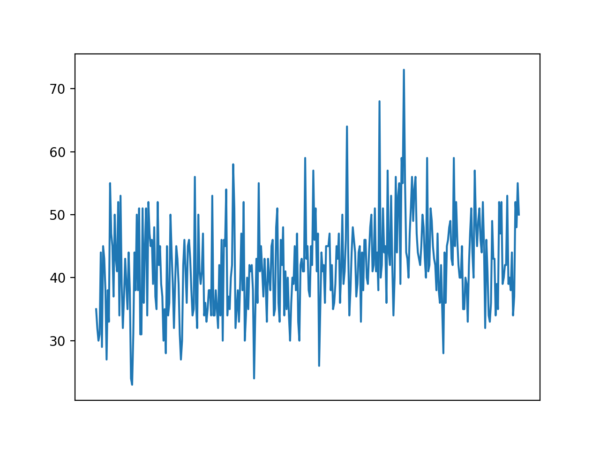
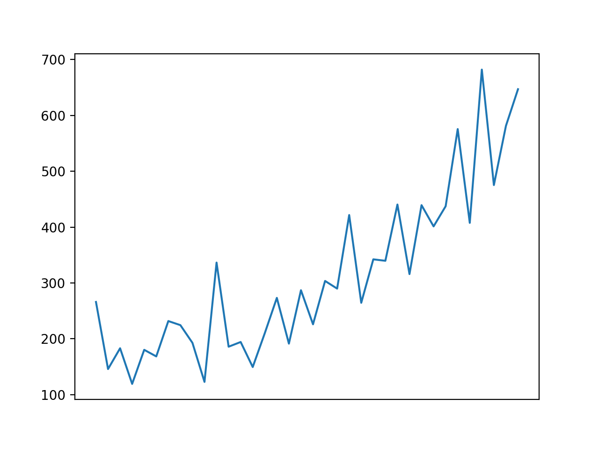
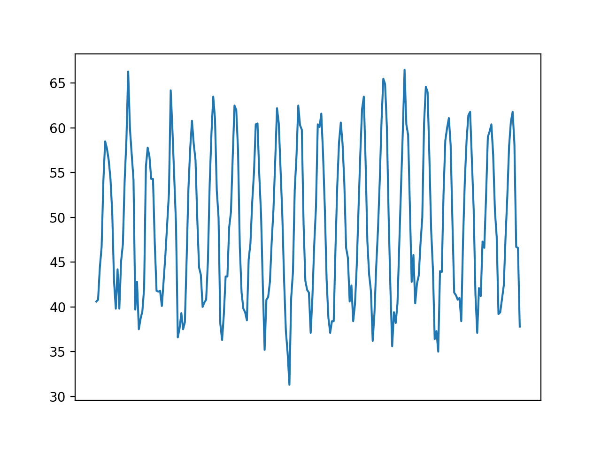
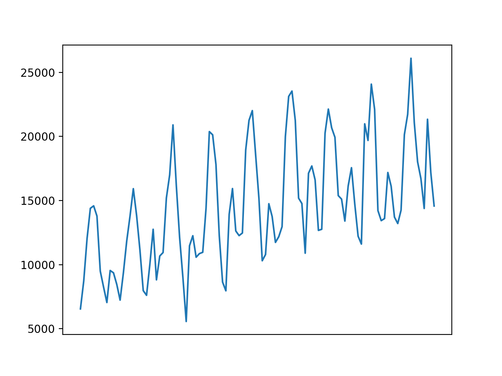

### How to Develop Simple Methods for Univariate Forecasting

Simple forecasting methods include naively using the last observation as the prediction or an
average of prior observations. It is important to evaluate the performance of simple forecasting
methods on univariate time series forecasting problems before using more sophisticated methods
as their performance provides a lower-bound and point of comparison that can be used to
determine of a model has skill or not for a given problem. Although simple, methods such as
the naive and average forecast strategies can be tuned to a specific problem in terms of the
choice of which prior observation to persist or how many prior observations to average. Often,
tuning the hyperparameters of these simple strategies can provide a more robust and defensible
lower bound on model performance, as well as surprising results that may inform the choice and
configuration of more sophisticated methods.
In this tutorial, you will discover how to develop a framework from scratch for grid searching
simple naive and averaging strategies for time series forecasting with univariate data. After
completing this tutorial, you will know:

- How to develop a framework for grid searching simple models from scratch using walk-
forward validation.

- How to grid search simple model hyperparameters for daily time series
data for births.

- How to grid search simple model hyperparameters for monthly time series data for shampoo
sales, car sales, and temperature.

Let’s get started.

### Tutorial Overview

This tutorial is divided into six parts; they are:

1.  Simple Forecasting Strategies
2.  Develop a Grid Search Framework
3.  Case Study 1: No Trend or Seasonality
4.  Case Study 2: Trend
5.  Case Study 3: Seasonality
6.  Case Study 4: Trend and Seasonality

### Simple Forecasting Strategies

It is important and useful to test simple forecast strategies prior to
testing more complex models.

Simple forecast strategies are those that assume little or nothing about
the nature of the forecast
problem and are fast to implement and calculate. The results can be used
as a baseline in
performance and used as a point of a comparison. If a model can perform
better than the
performance of a simple forecast strategy, then it can be said to be
skillful. There are two main
themes to simple forecast strategies; they are:

- Naive, or using observations values directly.
- Average, or using a statistic calculated on previous observations.

For more information on simple forecasting strategies, see Chapter 5.

### Develop a Grid Search Framework

In this section, we will develop a framework for grid searching the two
simple forecast strategies
described in the previous section, namely the naive and average
strategies. We can start off by
implementing a naive forecast strategy. For a given dataset of
historical observations, we can
persist any value in that history, that is from the previous observation
at index -1 to the first
observation in the history at-(len(data)). Thenaiveforecast() function
below implements
the naive forecast strategy for a given offset from 1 to the length of
the dataset.

```

def naive_forecast(history, n):
return history[-n]

```

We can test this function out on a small contrived dataset.

```

def naive_forecast(history, n):
return history[-n]
data = [10.0, 20.0, 30.0, 40.0, 50.0, 60.0, 70.0, 80.0, 90.0, 100.0]
print(data)

for i in range(1, len(data)+1):
print(naive_forecast(data, i))

```

Running the example first prints the contrived dataset, then the naive
forecast for each offset in the historical dataset.

```

[10.0, 20.0, 30.0, 40.0, 50.0, 60.0, 70.0, 80.0, 90.0, 100.0]
100.0
90.0
80.0
70.0
60.0
50.0
40.0
30.0
20.0
10.0

```

We can now look at developing a function for the average forecast strategy. Averaging the
lastnobservations is straight-forward; for example:

```
from numpy import mean
result = mean(history[-n:])

```

We may also want to test out the median in those cases where the
distribution of observations is non-Gaussian.

```

from numpy import median
result = median(history[-n:])

```

The averageforecast() function below implements this taking the historical
data and a
config array or tuple that specifies the number of prior values to
average as an integer, and a
string that describe the way to calculate the average (meanormedian).

```

def average_forecast(history, config):
n, avg_type = config

if avg_type is 'mean':
return mean(history[-n:])

return median(history[-n:])

```

The complete example on a small contrived dataset is listed below.

```

from numpy import mean
from numpy import median

def average_forecast(history, config):


n, avg_type = config
# mean of last n values
if avg_type is 'mean':
return mean(history[-n:])
# median of last n values
return median(history[-n:])
data = [10.0, 20.0, 30.0, 40.0, 50.0, 60.0, 70.0, 80.0, 90.0, 100.0]
print(data)

for i in range(1, len(data)+1):
print(average_forecast(data, (i, 'mean')))

```

Running the example forecasts the next value in the series as the mean
value from contiguous
subsets of prior observations from -1 to -10, inclusively.

```

[10.0, 20.0, 30.0, 40.0, 50.0, 60.0, 70.0, 80.0, 90.0, 100.0]
100.0
95.0
90.0
85.0
80.0
75.0
70.0
65.0
60.0
55.0

```

We can update the function to support averaging over seasonal data,
respecting the seasonal
offset. An offset argument can be added to the function that when not
set to 1 will determine
the number of prior observations backwards to count before collecting
values from which to
include in the average. For example, if n=1 and offset=3, then the
average is calculated from
the single value atn×offsetor 1×3 =−3. Ifn= 2 andoffset= 3, then the
average is
calculated from the values at 1×3 or -3 and 2×3 or -6. We can also add
some protection to
raise an exception when a seasonal configuration (n×offset) extends
beyond the end of the
historical observations. The updated function is listed below.

```

def average_forecast(history, config):
n, offset, avg_type = config
values = list()
if offset == 1:
values = history[-n:]
else:

if n*offset > len(history):
raise Exception('Config beyond end of data: %d %d' % (n,offset))

for i in range(1, n+1):
ix = i * offset
values.append(history[-ix])


# mean of last n values
if avg_type is 'mean':
return mean(values)
# median of last n values
return median(values)

```

We can test out this function on a small contrived dataset with a seasonal cycle. The complete example is listed below.

```

from numpy import mean
from numpy import median

def average_forecast(history, config):
n, offset, avg_type = config
values = list()
if offset == 1:
values = history[-n:]
else:

if n*offset > len(history):
raise Exception('Config beyond end of data: %d %d' % (n,offset))

for i in range(1, n+1):
ix = i * offset
values.append(history[-ix])

if avg_type is 'mean':
return mean(values)

return median(values)
data = [10.0, 20.0, 30.0, 10.0, 20.0, 30.0, 10.0, 20.0, 30.0]
print(data)

for i in [1, 2, 3]:
print(average_forecast(data, (i, 3,'mean')))

```

Running the example calculates the mean values of[10],[10, 10]and[10,
10, 10].

```

[10.0, 20.0, 30.0, 10.0, 20.0, 30.0, 10.0, 20.0, 30.0]
10.0
10.0
10.0

```

It is possible to combine both the naive and the average forecast strategies together into
the same function. There is a little overlap between the methods,
specifically the n-offset into
the history that is used to either persist values or determine the
number of values to average.

It is helpful to have both strategies supported by one function so that we can test a suite of
configurations for both strategies at once as part of a broader grid search of simple models. The
simpleforecast() function below combines both strategies into a single function.

```

# one-step simple forecast
def simple_forecast(history, config):
n, offset, avg_type = config
# persist value, ignore other config
if avg_type == 'persist':
return history[-n]
# collect values to average
values = list()
if offset == 1:
values = history[-n:]
else:
# skip bad configs
if n*offset > len(history):
raise Exception('Config beyond end of data: %d %d' % (n,offset))
# try and collect n values using offset
for i in range(1, n+1):
ix = i * offset
values.append(history[-ix])
# check if we can average
if len(values) < 2:
raise Exception('Cannot calculate average')
# mean of last n values
if avg_type == 'mean':
return mean(values)
# median of last n values
return median(values)

```

Next, we need to build up some functions for fitting and evaluating a
model repeatedly via

walk-forward validation, including splitting a dataset into train and
test sets and evaluating

one-step forecasts. We can split a list or NumPy array of data using a slice given a specified
size of the split, e.g. the number of time steps to use from the data in the test set. The
traintestsplit() function below implements this for a provided dataset and a specified
number of time steps to use in the test set.

# split a univariate dataset into train/test sets
def train_test_split(data, n_test):
return data[:-n_test], data[-n_test:]

```

After forecasts have been made for each step in the test dataset, they need to be compared
to the test set in order to calculate an error score. There are many popular error scores for
time series forecasting. In this case, we will use root mean squared error (RMSE), but you can
change this to your preferred measure, e.g. MAPE, MAE, etc. Themeasurermse() function
below will calculate the RMSE given a list of actual (the test set) and predicted values.

# root mean squared error or rmse
def measure_rmse(actual, predicted):
return sqrt(mean_squared_error(actual, predicted))


```
We can now implement the walk-forward validation scheme. This is a standard approach to
evaluating a time series forecasting model that respects the temporal ordering of observations.
First, a provided univariate time series dataset is split into train and test sets using the
traintestsplit() function. Then the number of observations in the test set are enumerated.
For each we fit a model on all of the history and make a one step forecast. The true observation for
the time step is then added to the history, and the process is repeated. Thesimpleforecast()
function is called in order to fit a model and make a prediction. Finally, an error score is calculated
by comparing all one-step forecasts to the actual test set by calling themeasurermse() function.

Thewalkforwardvalidation() function below implements this, taking a
univariate time

series, a number of time steps to use in the test set, and an array of model configuration.

```
# walk-forward validation for univariate data
def walk_forward_validation(data, n_test, cfg):
predictions = list()
# split dataset
train, test = train_test_split(data, n_test)
# seed history with training dataset
history = [x for x in train]
# step over each time step in the test set
for i in range(len(test)):
# fit model and make forecast for history
yhat = simple_forecast(history, cfg)
# store forecast in list of predictions
predictions.append(yhat)
# add actual observation to history for the next loop
history.append(test[i])
# estimate prediction error
error = measure_rmse(test, predictions)
return error

```

If you are interested in making multi-step predictions, you can change the call topredict()in
thesimpleforecast() function and also change the calculation of error in themeasurermse()
function. We can callwalkforwardvalidation()repeatedly with different lists of model
configurations. One possible issue is that some combinations of model configurations may not
be called for the model and will throw an exception.
We can trap exceptions and ignore warnings during the grid search by wrapping all calls to

walkforwardvalidation()with a try-except and a block to ignore warnings.
We can also

add debugging support to disable these protections in the case we want to see what is really
going on. Finally, if an error does occur, we can return aNoneresult; otherwise, we can print
some information about the skill of each model evaluated. This is helpful when a large number
of models are evaluated. Thescoremodel() function below implements this and returns a
tuple of (key and result), where the key is a string version of the tested model configuration.

```
# score a model, return None on failure
def score_model(data, n_test, cfg, debug=False):
result = None
# convert config to a key
key = str(cfg)


# show all warnings and fail on exception if debugging
if debug:
result = walk_forward_validation(data, n_test, cfg)
else:
# one failure during model validation suggests an unstable config
try:
# never show warnings when grid searching, too noisy
with catch_warnings():
filterwarnings("ignore")
result = walk_forward_validation(data, n_test, cfg)
except:
error = None
# check for an interesting result
if result is not None:
print('> Model[%s] %.3f' % (key, result))
return (key, result)

```

Next, we need a loop to test a list of different model configurations. This is the main
function that drives the grid search process and will call thescoremodel() function for each
model configuration. We can dramatically speed up the grid search process by evaluating model
configurations in parallel. One way to do that is to use the Joblib library^1. We can define a
Parallel object with the number of cores to use and set it to the number of scores detected in
your hardware.

```

# define executor
executor = Parallel(n_jobs=cpu_count(), backend='multiprocessing')

```
We can then create a list of tasks to execute in parallel, which will be one call to the
scoremodel() function for each model configuration we have.

```
# define list of tasks
tasks = (delayed(score_model)(data, n_test, cfg) for cfg in cfg_list)

```
Finally, we can use the Parallel object to execute the list of tasks in parallel.

```
# execute list of tasks
scores = executor(tasks)

```
On some systems, such as windows that do not support thefork() function, it is necessary
to add a check to ensure that the entry point of the script is only executed by the main process
and not child processes.


```
...
if __name__ =='__main__':
...

```

Note, you may have to install Joblib: `pip install joblib`


That’s it. We can also provide a non-parallel version of evaluating all model configurations
in case we want to debug something.

```
# execute list of tasks sequentially
scores = [score_model(data, n_test, cfg) for cfg in cfg_list]

```

The result of evaluating a list of configurations will be a list of tuples, each with a name
that summarizes a specific model configuration and the error of the model evaluated with that
configuration as either the RMSE orNoneif there was an error. We can filter out all scores set
toNone.

```
# order scores
scores = [r for r in scores if r[1] != None]

```

We can then sort all tuples in the list by the score in ascending order (best are first), then
return this list of scores for review. Thegridsearch() function below implements this behavior
given a univariate time series dataset, a list of model configurations (list of lists), and the
number of time steps to use in the test set. An optional parallel argument allows the evaluation
of models across all cores to be tuned on or off, and is on by default.

```
# grid search configs
def grid_search(data, cfg_list, n_test, parallel=True):
scores = None
if parallel:
# execute configs in parallel
executor = Parallel(n_jobs=cpu_count(), backend='multiprocessing')
tasks = (delayed(score_model)(data, n_test, cfg) for cfg in cfg_list)
scores = executor(tasks)
else:
scores = [score_model(data, n_test, cfg) for cfg in cfg_list]
# remove empty results
scores = [r for r in scores if r[1] != None]
# sort configs by error, asc
scores.sort(key=lambda tup: tup[1])
return scores

```
We’re nearly done. The only thing left to do is to define a list of model configurations to try
for a dataset. We can define this generically. The only parameter we may want to specify is
the periodicity of the seasonal component in the series (offset), if one exists. By default, we

will assume no seasonal component. Thesimpleconfigs() function below will
create a list

of model configurations to evaluate. The function only requires the maximum length of the
historical data as an argument and optionally the periodicity of any seasonal component, which
is defaulted to 1 (no seasonal component).

```
# create a set of simple configs to try
def simple_configs(max_length, offsets=[1]):
configs = list()
for i in range(1, max_length+1):
for o in offsets:
for t in ['persist', 'mean', 'median']:


cfg = [i, o, t]
configs.append(cfg)
return configs

```

We now have a framework for grid searching simple model hyperparameters via one-step
walk-forward validation. It is generic and will work for any in-memory
univariate time series
provided as a list or NumPy array. We can make sure all the pieces work together by testing it
on a contrived 10-step dataset. The complete example is listed below.

```
# grid search simple forecasts
from math import sqrt
from numpy import mean
from numpy import median
from multiprocessing import cpu_count
from joblib import Parallel
from joblib import delayed
from warnings import catch_warnings
from warnings import filterwarnings
from sklearn.metrics import mean_squared_error

# one-step simple forecast
def simple_forecast(history, config):
n, offset, avg_type = config
# persist value, ignore other config
if avg_type == 'persist':
return history[-n]
# collect values to average
values = list()
if offset == 1:
values = history[-n:]
else:
# skip bad configs
if n*offset > len(history):
raise Exception('Config beyond end of data: %d %d' % (n,offset))
# try and collect n values using offset
for i in range(1, n+1):
ix = i * offset
values.append(history[-ix])
# check if we can average
if len(values) < 2:
raise Exception('Cannot calculate average')
# mean of last n values
if avg_type == 'mean':
return mean(values)
# median of last n values
return median(values)

# root mean squared error or rmse
def measure_rmse(actual, predicted):
return sqrt(mean_squared_error(actual, predicted))

# split a univariate dataset into train/test sets
def train_test_split(data, n_test):
return data[:-n_test], data[-n_test:]


def walk_forward_validation(data, n_test, cfg):
predictions = list()
train, test = train_test_split(data, n_test)

history = [x for x in train]

for i in range(len(test)):

yhat = simple_forecast(history, cfg)

predictions.append(yhat)

history.append(test[i])

error = measure_rmse(test, predictions)
return error

def score_model(data, n_test, cfg, debug=False):
result = None

key = str(cfg)

if debug:
result = walk_forward_validation(data, n_test, cfg)
else:

try:

with catch_warnings():
filterwarnings("ignore")
result = walk_forward_validation(data, n_test, cfg)
except:
error = None

if result is not None:
print('> Model[%s] %.3f' % (key, result))
return (key, result)

def grid_search(data, cfg_list, n_test, parallel=True):
scores = None
if parallel:

executor = Parallel(n_jobs=cpu_count(), backend='multiprocessing')
tasks = (delayed(score_model)(data, n_test, cfg) for cfg in
cfg_list)
scores = executor(tasks)
else:
scores = [score_model(data, n_test, cfg) for cfg in cfg_list]

scores = [r for r in scores if r[1] != None]

scores.sort(key=lambda tup: tup[1])

return scores

# create a set of simple configs to try
def simple_configs(max_length, offsets=[1]):
configs = list()
for i in range(1, max_length+1):
for o in offsets:
for t in ['persist', 'mean', 'median']:
cfg = [i, o, t]
configs.append(cfg)
return configs

if __name__ =='__main__':
# define dataset
data = [10.0, 20.0, 30.0, 40.0, 50.0, 60.0, 70.0, 80.0, 90.0, 100.0]
# data split
n_test = 4
# model configs
max_length = len(data) - n_test
cfg_list = simple_configs(max_length)
# grid search
scores = grid_search(data, cfg_list, n_test)
print('done')
# list top 3 configs
for cfg, error in scores[:3]:
print(cfg, error)

```
Running the example first prints the contrived time series dataset. Next, the model
configurations and their errors are reported as they are evaluated. Finally, the configurations
and the error for the top three configurations are reported. We can see that the persistence
model with a configuration of 1 (e.g. persist the last observation) achieves the best performance
of the simple models tested, as would be expected.

```
[10.0, 20.0, 30.0, 40.0, 50.0, 60.0, 70.0, 80.0, 90.0, 100.0]

...
> Model[[4, 1,'mean']] 25.000
> Model[[3, 1,'median']] 20.000
> Model[[6, 1,'mean']] 35.000
> Model[[5, 1,'median']] 30.000
> Model[[6, 1,'median']] 35.000
done

[1, 1,'persist'] 10.0
[2, 1,'mean'] 15.0
[2, 1,'median'] 15.0

```

Now that we have a robust framework for grid searching ETS model hyperparameters, let’s
test it out on a suite of standard univariate time series datasets. The datasets were chosen for
demonstration purposes; I am not suggesting that an ETS model is the best approach for each
dataset, and perhaps an SARIMA or something else would be more appropriate in some cases.

### Case Study 1: No Trend or Seasonality

The daily female births dataset summarizes the daily total female births in California, USA in
1959. For more information on this dataset, see Chapter 11 where it was introduced. You can
download the dataset directly from here:

ˆ daily-total-female-births.csv 1

Save the file with the filename daily-total-female-births.csv in your current working
directory. The dataset has one year, or 365 observations. We will use the first 200 for training
and the remaining 165 as the test set. The complete example grid searching the daily female
univariate time series forecasting problem is listed below.

```
# load
series = read_csv('daily-total-female-births.csv', header=0, index_col=0)
# summarize shape
print(series.shape)

```
We can then create a line plot of the series and inspect it for systematic structures like
trends and seasonality.

```
# plot
pyplot.plot(series)
pyplot.xticks([])
pyplot.show()

```
The complete example is listed below.

```
# load and plot daily births dataset
from pandas import read_csv
from matplotlib import pyplot
# load
series = read_csv('daily-total-female-births.csv', header=0, index_col=0)
# summarize shape
print(series.shape)
# plot
pyplot.plot(series)
pyplot.xticks([])
pyplot.show()

```

Running the example first summarizes the shape of the loaded dataset. The dataset has one
year, or 365 observations. We will use the first 200 for training and the remaining 165 as the
test set.


```
(365, 1)

```

A line plot of the series is also created. We can see that there is no obvious trend or
seasonality.



We can now grid search naive models for the dataset. The complete
example grid searching
the daily female univariate time series forecasting problem is listed
below.

```
from math import sqrt
from numpy import mean
from numpy import median
from multiprocessing import cpu_count
from joblib import Parallel
from joblib import delayed
from warnings import catch_warnings
from warnings import filterwarnings
from sklearn.metrics import mean_squared_error
from pandas import read_csv


def simple_forecast(history, config):
n, offset, avg_type = config

if avg_type == 'persist':
return history[-n]

values = list()
if offset == 1:
values = history[-n:]
else:

if n*offset > len(history):
raise Exception('Config beyond end of data: %d %d' % (n,offset))

for i in range(1, n+1):
ix = i * offset
values.append(history[-ix])

if len(values) < 2:
raise Exception('Cannot calculate average')

if avg_type == 'mean':
return mean(values)

return median(values)

def measure_rmse(actual, predicted):
return sqrt(mean_squared_error(actual, predicted))

def train_test_split(data, n_test):
return data[:-n_test], data[-n_test:]

def walk_forward_validation(data, n_test, cfg):
predictions = list()
train, test = train_test_split(data, n_test)

history = [x for x in train]

for i in range(len(test)):

yhat = simple_forecast(history, cfg)

predictions.append(yhat)

history.append(test[i])

error = measure_rmse(test, predictions)
return error

def score_model(data, n_test, cfg, debug=False):


result = None
# convert config to a key
key = str(cfg)
# show all warnings and fail on exception if debugging
if debug:
result = walk_forward_validation(data, n_test, cfg)
else:
# one failure during model validation suggests an unstable config
try:
# never show warnings when grid searching, too noisy
with catch_warnings():
filterwarnings("ignore")
result = walk_forward_validation(data, n_test, cfg)
except:
error = None
# check for an interesting result
if result is not None:
print('> Model[%s] %.3f' % (key, result))
return (key, result)

def grid_search(data, cfg_list, n_test, parallel=True):
scores = None
if parallel:

executor = Parallel(n_jobs=cpu_count(), backend='multiprocessing')
tasks = (delayed(score_model)(data, n_test, cfg) for cfg in
cfg_list)
scores = executor(tasks)
else:
scores = [score_model(data, n_test, cfg) for cfg in cfg_list]

scores = [r for r in scores if r[1] != None]

scores.sort(key=lambda tup: tup[1])
return scores

def simple_configs(max_length, offsets=[1]):
configs = list()
for i in range(1, max_length+1):
for o in offsets:
for t in ['persist', 'mean', 'median']:
cfg = [i, o, t]
configs.append(cfg)
return configs

if **name** =='**main**':
series = read_csv('daily-total-female-births.csv', header=0,
index_col=0)
data = series.values
n_test = 165
max_length = len(data) - n_test
cfg_list = simple_configs(max_length)

scores = grid_search(data, cfg_list, n_test)
print('done')
# list top 3 configs
for cfg, error in scores[:3]:
print(cfg, error)

```

Running the example prints the model configurations and the RMSE are printed as the
models are evaluated. The top three model configurations and their error are reported at the
end of the run.

```
> Model[[186, 1,'mean']] 7.523
> Model[[200, 1,'median']] 7.681
> Model[[186, 1,'median']] 7.691
> Model[[187, 1,'persist']] 11.137
> Model[[187, 1,'mean']] 7.527
done

[22, 1,'mean'] 6.930411499775709
[23, 1,'mean'] 6.932293117115201
[21, 1,'mean'] 6.951918385845375

```

We can see that the best result was an RMSE of about 6.93 births with the following
configuration:

- Strategy: Average

- n: 22

- function: mean()

This is surprising given the lack of trend or seasonality, I would have expected either a
persistence of -1 or an average of the entire historical dataset to result in the best performance.

### Case Study 2: Trend

Themonthly shampoo salesdataset summarizes the monthly sales of shampoo
over a three-year
period. You can download the dataset directly from here:

- monthly-shampoo-sales.csv^4

Save the file with the filename monthly-shampoo-sales.csv in your current working directory. We can load this dataset as a Pandas Series using the function read csv() and
summarize the shape of the dataset.


```
series = read_csv('monthly-shampoo-sales.csv', header=0, index_col=0)

print(series.shape)

```

We can then create a line plot of the series and inspect it for systematic structures like
trends and seasonality.

```
pyplot.plot(series)
pyplot.xticks([])
pyplot.show()

```

The complete example is listed below.

```
from pandas import read_csv
from matplotlib import pyplot
series = read_csv('monthly-shampoo-sales.csv', header=0, index_col=0)

print(series.shape)
pyplot.plot(series)
pyplot.xticks([])
pyplot.show()

```

Running the example first summarizes the shape of the loaded dataset. The dataset has
three years, or 36 observations. We will use the first 24 for training
and the remaining 12 as the test set.

```
(36, 1)

```

A line plot of the series is also created. We can see that there is an obvious trend and no
obvious seasonality.




We can now grid search naive models for the dataset. The complete
example grid searching
the shampoo sales univariate time series forecasting problem is listed
below.

```
from math import sqrt
from numpy import mean
from numpy import median
from multiprocessing import cpu_count
from joblib import Parallel
from joblib import delayed
from warnings import catch_warnings
from warnings import filterwarnings
from sklearn.metrics import mean_squared_error
from pandas import read_csv

def simple_forecast(history, config):
n, offset, avg_type = config

if avg_type == 'persist':
return history[-n]

values = list()
if offset == 1:


values = history[-n:]
else:
# skip bad configs
if n*offset > len(history):
raise Exception('Config beyond end of data: %d %d' % (n,offset))
# try and collect n values using offset
for i in range(1, n+1):
ix = i * offset
values.append(history[-ix])
# check if we can average
if len(values) < 2:
raise Exception('Cannot calculate average')
# mean of last n values
if avg_type == 'mean':
return mean(values)
# median of last n values
return median(values)

def measure_rmse(actual, predicted):
return sqrt(mean_squared_error(actual, predicted))

def train_test_split(data, n_test):
return data[:-n_test], data[-n_test:]

def walk_forward_validation(data, n_test, cfg):
predictions = list()
train, test = train_test_split(data, n_test)

history = [x for x in train]

for i in range(len(test)):

yhat = simple_forecast(history, cfg)

predictions.append(yhat)

history.append(test[i])

error = measure_rmse(test, predictions)
return error

def score_model(data, n_test, cfg, debug=False):
result = None

key = str(cfg)

if debug:
result = walk_forward_validation(data, n_test, cfg)
else:

try:


# never show warnings when grid searching, too noisy
with catch_warnings():
filterwarnings("ignore")
result = walk_forward_validation(data, n_test, cfg)
except:
error = None
# check for an interesting result
if result is not None:
print('> Model[%s] %.3f' % (key, result))
return (key, result)

def grid_search(data, cfg_list, n_test, parallel=True):
scores = None
if parallel:

executor = Parallel(n_jobs=cpu_count(), backend='multiprocessing')
tasks = (delayed(score_model)(data, n_test, cfg) for cfg in
cfg_list)
scores = executor(tasks)
else:
scores = [score_model(data, n_test, cfg) for cfg in cfg_list]

scores = [r for r in scores if r[1] != None]

scores.sort(key=lambda tup: tup[1])
return scores

def simple_configs(max_length, offsets=[1]):
configs = list()
for i in range(1, max_length+1):
for o in offsets:
for t in ['persist', 'mean', 'median']:
cfg = [i, o, t]
configs.append(cfg)
return configs

if **name** =='**main**':
series = read_csv('monthly-shampoo-sales.csv', header=0, index_col=0)
data = series.values
n_test = 12
max_length = len(data) - n_test
cfg_list = simple_configs(max_length)
scores = grid_search(data, cfg_list, n_test)
print('done')

for cfg, error in scores[:3]:
print(cfg, error)

```

Running the example prints the configurations and the RMSE are printed
as the models are
evaluated. The top three model configurations and their error are reported at the end of the
run.


```
...
> Model[[23, 1,'mean']] 209.782
> Model[[23, 1,'median']] 221.863
> Model[[24, 1,'persist']] 305.635
> Model[[24, 1,'mean']] 213.466
> Model[[24, 1,'median']] 226.061
done

[2, 1,'persist'] 95.69454007413378
[2, 1,'mean'] 96.01140340258198
[2, 1,'median'] 96.01140340258198

```

We can see that the best result was an RMSE of about 95.69 sales with the following
configuration:

- Strategy: Persist

- n: 2

This is surprising as the trend structure of the data would suggest that
persisting the previous

value (-1) would be the best approach, not persisting the second last
value.

#### Case Study 3: Seasonality

The monthly mean temperatures dataset summarizes the monthly average air temperatures in
Nottingham Castle, England from 1920 to 1939 in degrees Fahrenheit. You can download the
dataset directly from here:

ˆ monthly-mean-temp.csv 5

Save the file with the filename monthly-mean-temp.csv in your current working directory.
We can load this dataset as a Pandas Series using the function read csv() and summarize
the shape of the dataset.

```
# load
series = read_csv('monthly-mean-temp.csv', header=0, index_col=0)
# summarize shape
print(series.shape)

```

We can then create a line plot of the series and inspect it for systematic structures like
trends and seasonality.

```
# plot
pyplot.plot(series)
pyplot.xticks([])
pyplot.show()

```
The complete example is listed below.

```
# load and plot monthly mean temp dataset
from pandas import read_csv
from matplotlib import pyplot
# load
series = read_csv('monthly-mean-temp.csv', header=0, index_col=0)
# summarize shape
print(series.shape)
# plot
pyplot.plot(series)
pyplot.xticks([])
pyplot.show()

```

Running the example first summarizes the shape of the loaded dataset.
The dataset has 20
years, or 240 observations.


```
(240, 1)

```

A line plot of the series is also created. We can see that there is no obvious trend and an
obvious seasonality structure.




We will trim the dataset to the last five years of data (60 observations) in order to speed up
the model evaluation process and use the last year or 12 observations for the test set.

```
data = data[-(5*12):]

```

The period of the seasonal component is about one year, or 12 observations. We will use
this as the seasonal period in the call to the simple configs() function when preparing the
model configurations.

```
cfg_list = simple_configs(seasonal=[0, 12])

```

We can now grid search naive models for the dataset. The complete example grid searching
the monthly mean temperature time series forecasting problem is listed below.

```
from math import sqrt
from numpy import mean
from numpy import median
from multiprocessing import cpu_count


from joblib import Parallel
from joblib import delayed
from warnings import catch_warnings
from warnings import filterwarnings
from sklearn.metrics import mean_squared_error
from pandas import read_csv

def simple_forecast(history, config):
n, offset, avg_type = config

if avg_type == 'persist':
return history[-n]

values = list()
if offset == 1:
values = history[-n:]
else:

if n*offset > len(history):
raise Exception('Config beyond end of data: %d %d' % (n,offset))

for i in range(1, n+1):
ix = i * offset
values.append(history[-ix])

if len(values) < 2:
raise Exception('Cannot calculate average')

if avg_type == 'mean':
return mean(values)

return median(values)

def measure_rmse(actual, predicted):
return sqrt(mean_squared_error(actual, predicted))

def train_test_split(data, n_test):
return data[:-n_test], data[-n_test:]

def walk_forward_validation(data, n_test, cfg):
predictions = list()
train, test = train_test_split(data, n_test)

history = [x for x in train]

for i in range(len(test)):

yhat = simple_forecast(history, cfg)

predictions.append(yhat)


history.append(test[i])
# estimate prediction error
error = measure_rmse(test, predictions)
return error

def score_model(data, n_test, cfg, debug=False):
result = None

key = str(cfg)

if debug:
result = walk_forward_validation(data, n_test, cfg)
else:

try:

with catch_warnings():
filterwarnings("ignore")
result = walk_forward_validation(data, n_test, cfg)
except:
error = None

if result is not None:
print('> Model[%s] %.3f' % (key, result))
return (key, result)

def grid_search(data, cfg_list, n_test, parallel=True):
scores = None
if parallel:

executor = Parallel(n_jobs=cpu_count(), backend='multiprocessing')
tasks = (delayed(score_model)(data, n_test, cfg) for cfg in
cfg_list)
scores = executor(tasks)
else:
scores = [score_model(data, n_test, cfg) for cfg in cfg_list]

scores = [r for r in scores if r[1] != None]

scores.sort(key=lambda tup: tup[1])
return scores

def simple_configs(max_length, offsets=[1]):
configs = list()
for i in range(1, max_length+1):
for o in offsets:
for t in ['persist', 'mean', 'median']:
cfg = [i, o, t]
configs.append(cfg)
return configs

if **name** =='**main**':
series = read_csv('monthly-mean-temp.csv', header=0, index_col=0)


data = series.values
# data split
n_test = 12
# model configs
max_length = len(data) - n_test
cfg_list = simple_configs(max_length, offsets=[1,12])
# grid search
scores = grid_search(data, cfg_list, n_test)
print('done')
# list top 3 configs
for cfg, error in scores[:3]:
print(cfg, error)

```

Running the example prints the model configurations and the RMSE are printed as the
models are evaluated. The top three model configurations and their error are reported at the
end of the run.

```
> Model[[227, 12,'persist']] 5.365
> Model[[228, 1,'persist']] 2.818
> Model[[228, 1,'mean']] 8.258
> Model[[228, 1,'median']] 8.361
> Model[[228, 12,'persist']] 2.818
done

[4, 12,'mean'] 1.5015616870445234
[8, 12,'mean'] 1.5794579766489512
[13, 12,'mean'] 1.586186052546763

```

We can see that the best result was an RMSE of about 1.50 degrees with the following
configuration:
ˆ Strategy: Average
ˆ n: 4
ˆ offset: 12
ˆ function: mean()

This finding is not too surprising. Given the seasonal structure of the data, we would expect
a function of the last few observations at prior points in the yearly cycle to be effective.

### Case Study 4: Trend and Seasonality

Themonthly car salesdataset summarizes the monthly car sales in Quebec,
Canada between

1960 and 1968. You can download the dataset directly from here:


- monthly-car-sales.csv^6

Save the file with the filename monthly-car-sales.csv in your current working directory.
We can load this dataset as a Pandas Series using the function read csv() and summarize
the shape of the dataset.

```
# load
series = read_csv('monthly-car-sales.csv', header=0, index_col=0)
# summarize shape
print(series.shape)

```
We can then create a line plot of the series and inspect it for systematic structures like
trends and seasonality.

```
# plot
pyplot.plot(series)
pyplot.xticks([])
pyplot.show()

```
The complete example is listed below.

```
# load and plot monthly car sales dataset
from pandas import read_csv
from matplotlib import pyplot
# load
series = read_csv('monthly-car-sales.csv', header=0, index_col=0)
# summarize shape
print(series.shape)
# plot
pyplot.plot(series)
pyplot.xticks([])
pyplot.show()

```

Running the example first summarizes the shape of the loaded dataset. The dataset has 9
years, or 108 observations. We will use the last year or 12 observations
as the test set.

```
(108, 1)

```

A line plot of the series is also created. We can see that there is an obvious trend and
seasonal components.




The period of the seasonal component could be six months or 12 months.
We will try both
as the seasonal period in the call to thesimpleconfigs() function when
preparing the model
configurations.

```
cfg_list = simple_configs(seasonal=[0,6,12])

```

We can now grid search naive models for the dataset. The complete
example grid searching
the monthly car sales time series forecasting problem is listed below.

```
from math import sqrt
from numpy import mean
from numpy import median
from multiprocessing import cpu_count
from joblib import Parallel
from joblib import delayed
from warnings import catch_warnings
from warnings import filterwarnings
from sklearn.metrics import mean_squared_error
from pandas import read_csv


def simple_forecast(history, config):
n, offset, avg_type = config

if avg_type == 'persist':
return history[-n]

values = list()
if offset == 1:
values = history[-n:]
else:

if n*offset > len(history):
raise Exception('Config beyond end of data: %d %d' % (n,offset))

for i in range(1, n+1):
ix = i * offset
values.append(history[-ix])

if len(values) < 2:
raise Exception('Cannot calculate average')

if avg_type == 'mean':
return mean(values)

return median(values)

def measure_rmse(actual, predicted):
return sqrt(mean_squared_error(actual, predicted))

def train_test_split(data, n_test):
return data[:-n_test], data[-n_test:]

def walk_forward_validation(data, n_test, cfg):
predictions = list()
train, test = train_test_split(data, n_test)

history = [x for x in train]

for i in range(len(test)):

yhat = simple_forecast(history, cfg)

predictions.append(yhat)

history.append(test[i])

error = measure_rmse(test, predictions)
return error

def score_model(data, n_test, cfg, debug=False):


result = None
# convert config to a key
key = str(cfg)
# show all warnings and fail on exception if debugging
if debug:
result = walk_forward_validation(data, n_test, cfg)
else:
# one failure during model validation suggests an unstable config
try:
# never show warnings when grid searching, too noisy
with catch_warnings():
filterwarnings("ignore")
result = walk_forward_validation(data, n_test, cfg)
except:
error = None
# check for an interesting result
if result is not None:
print('> Model[%s] %.3f' % (key, result))
return (key, result)

def grid_search(data, cfg_list, n_test, parallel=True):
scores = None
if parallel:

executor = Parallel(n_jobs=cpu_count(), backend='multiprocessing')
tasks = (delayed(score_model)(data, n_test, cfg) for cfg in
cfg_list)
scores = executor(tasks)
else:
scores = [score_model(data, n_test, cfg) for cfg in cfg_list]

scores = [r for r in scores if r[1] != None]

scores.sort(key=lambda tup: tup[1])
return scores

def simple_configs(max_length, offsets=[1]):
configs = list()
for i in range(1, max_length+1):
for o in offsets:
for t in ['persist', 'mean', 'median']:
cfg = [i, o, t]
configs.append(cfg)
return configs

if **name** =='**main**':
series = read_csv('monthly-car-sales.csv', header=0, index_col=0)
data = series.values
n_test = 12
max_length = len(data) - n_test
cfg_list = simple_configs(max_length, offsets=[1,12])

scores = grid_search(data, cfg_list, n_test)
print('done')
# list top 3 configs
for cfg, error in scores[:3]:
print(cfg, error)

```

Running the example prints the model configurations and the RMSE are printed as the
models are evaluated. The top three model configurations and their error are reported at the
end of the run.

```
> Model[[79, 1,'median']] 5124.113
> Model[[91, 12,'persist']] 9580.149
> Model[[79, 12,'persist']] 8641.529
> Model[[92, 1,'persist']] 9830.921
> Model[[92, 1,'mean']] 5148.126
done

[3, 12,'median'] 1841.1559321976688
[3, 12,'mean'] 2115.198495632485
[4, 12,'median'] 2184.37708988932

```

We can see that the best result was an RMSE of about 1841.15 sales with the following
configuration:

- Strategy: Average

- n: 3

- offset: 12

- function: median()

It is not surprising that the chosen model is a function of the last few observations at the
same point in prior cycles, although the use of the median instead of the mean may not have
been immediately obvious and the results were much better than the mean.

### Extensions

This section lists some ideas for extending the tutorial that you may
wish to explore.

- Plot Forecast. Update the framework to re-fit a model with the best configuration and
forecast the entire test dataset, then plot the forecast compared to the actual observations
in the test set.

- Drift Method. Implement the drift method for simple forecasts and compare the results
to the average and naive methods.


- Another Dataset. Apply the developed framework to an additional univariate time
series problem (e.g. from the Time Series Dataset Library).


### Further Reading

This section provides more resources on the topic if you are looking to
go deeper.

#### Datasets

- Time Series Dataset Library, DataMarket.
https://datamarket.com/data/list/?q=provider:tsdl

- Daily Female Births Dataset, DataMarket.
https://datamarket.com/data/set/235k/daily-total-female-births-in-california-1959

- Monthly Shampoo Sales Dataset, DataMarket.
https://datamarket.com/data/set/22r0/sales-of-shampoo-over-a-three-year-period

- Monthly Mean Temperature Dataset, DataMarket.
https://datamarket.com/data/set/22li/mean-monthly-air-temperature-deg-f-nottingham-castle-1920-1939

- Monthly Car Sales Dataset, DataMarket.
https://datamarket.com/data/set/22n4/monthly-car-sales-in-quebec-1960-1968

#### APIs

- numpy.meanAPI.
https://docs.scipy.org/doc/numpy/reference/generated/numpy.mean.html

- numpy.medianAPI.
https://docs.scipy.org/doc/numpy/reference/generated/numpy.median.html

- sklearn.metrics.meansquarederrorAPI.
http://scikit-learn.org/stable/modules/generated/sklearn.metrics.mean_squared_
error.html

- pandas.readcsvAPI.
https://pandas.pydata.org/pandas-docs/stable/generated/pandas.read_csv.html

- Joblib: running Python functions as pipeline jobs.
https://pythonhosted.org/joblib/

#### Articles

- Forecasting, Wikipedia.
https://en.wikipedia.org/wiki/Forecasting


#### Summary

In this tutorial, you discovered how to develop a framework from scratch for grid searching
simple naive and averaging strategies for time series forecasting with univariate data. Specifically,

you learned:

- How to develop a framework for grid searching simple models from scratch using walk-
forward validation.

- How to grid search simple model hyperparameters for daily time series
data for births.

- How to grid search simple model hyperparameters for monthly time series data for shampoo
sales, car sales, and temperature.

#### Next

In the next lab, you will discover how to develop exponential smoothing models for univariate
time series forecasting problems.
