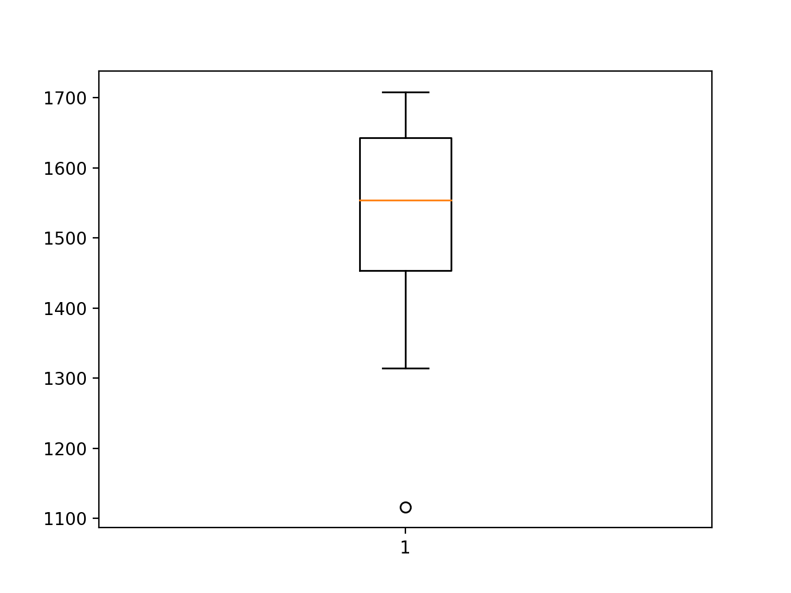
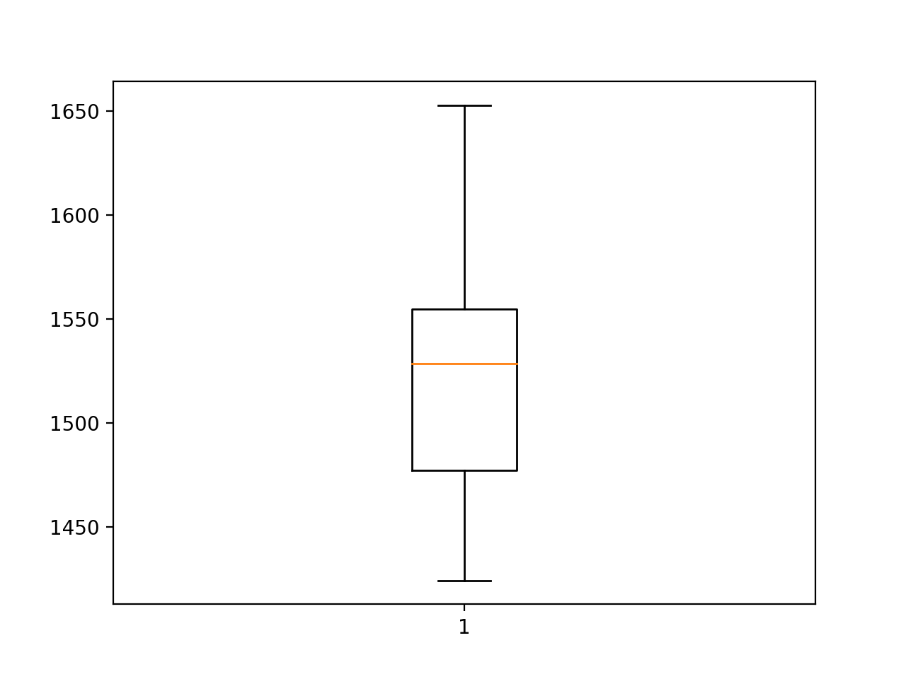
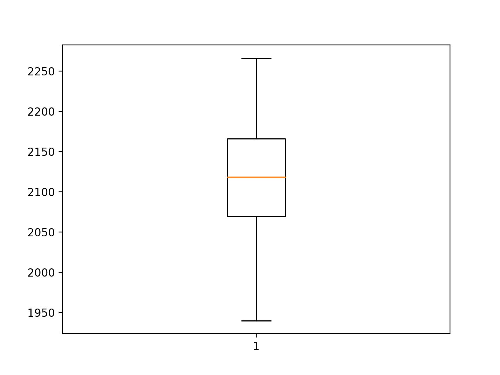
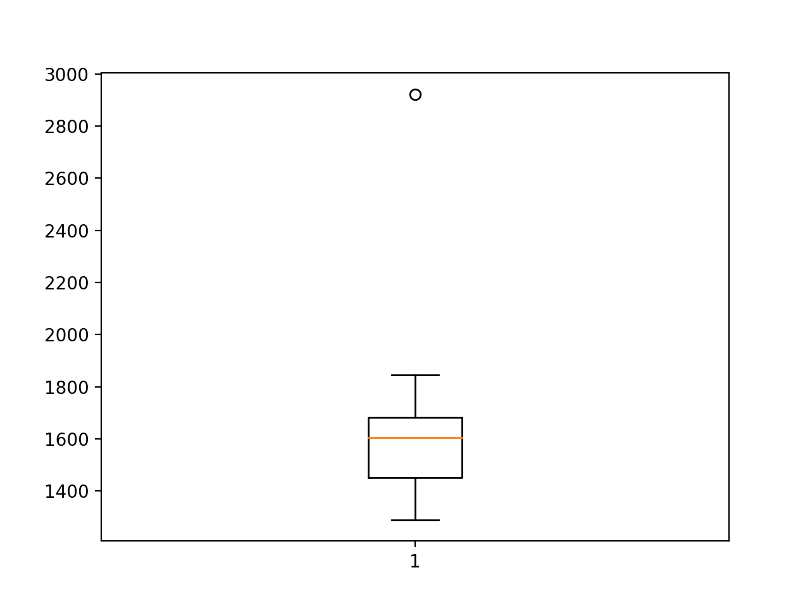
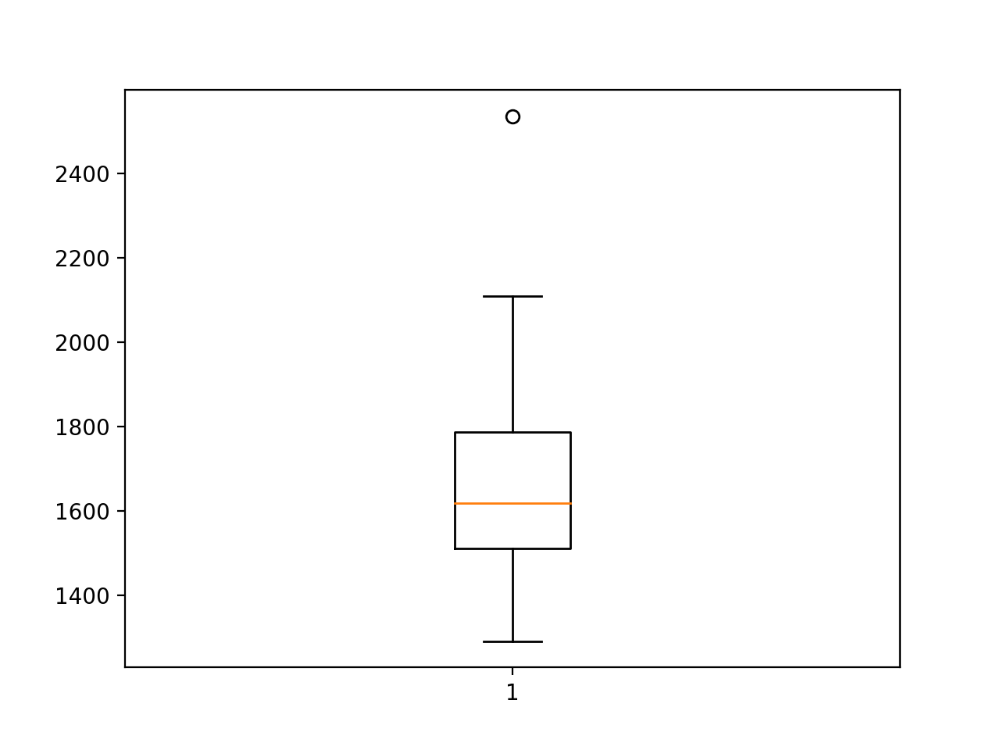

### How to Develop MLPs, CNNs and LSTMs for Univariate Forecasting

Deep learning neural networks are capable of automatically learning and extracting features
from raw data. This feature of neural networks can be used for time series forecasting problems,

where models can be developed directly on the raw observations without
the direct need to scale

the data using normalization and standardization or to make the data stationary by differencing.
Impressively, simple deep learning neural network models are capable of making skillful forecasts
as compared to naive models and tuned SARIMA models on univariate time series forecasting
problems that have both trend and seasonal components with no pre-processing.
In this tutorial, you will discover how to develop a suite of deep learning models for univariate
time series forecasting. After completing this tutorial, you will know:

- How to develop a robust test harness using walk-forward validation for evaluating the
performance of neural network models.

- How to develop and evaluate simple Multilayer Perceptron and convolutional neural
networks for time series forecasting.

- How to develop and evaluate LSTMs, CNN-LSTMs, and ConvLSTM neural network
models for time series forecasting.

Let’s get started.

### Tutorial Overview

This tutorial is divided into five parts; they are:

1.  Time Series Problem
2.  Model Evaluation Test Harness
3.  Multilayer Perceptron Model
4.  Convolutional Neural Network Model
5.  Recurrent Neural Network Models

### Time Series Problem

In this tutorial we will focus on one dataset and use it as the context to demonstrate the
development of a range of deep learning models for univariate time series forecasting. We will
use themonthly car salesdataset as this context as it includes the complexity of both trend and
seasonal elements. Themonthly car salesdataset summarizes the monthly car sales in Quebec,
Canada between 1960 and 1968. For more information on this dataset, see Chapter 11 where it

was introduced. You can download the dataset directly from here:

- monthly-car-sales.csv^1

Save the file with the filename `monthly-car-sales.csv` in your current
working directory.

The dataset is monthly and has nine years, or 108 observations. In our
testing, will use the

last year, or 12 observations, as the test set. A line plot is created. The dataset has an obvious
trend and seasonal component. The period of the seasonal component could be six months or 12
months. From prior experiments, we know that a naive model can achieve a root mean squared
error, or RMSE, of 1,841.155 by taking the median of the observations at the three prior years
for the month being predicted (see Chapter 11); for example:

yhat = median(-12, -24, -36)

```
Where the negative indexes refer to observations in the series relative to the end of the
historical data for the month being predicted. From prior experiments, we know that a SARIMA
model can achieve an RMSE of 1,551.84 with the configuration ofSARIMA(0, 0, 0),(1, 1,
0),12where no elements are specified for the trend and a seasonal difference with a period of

12 is calculated and an AR model of one season is used (see Chapter 13).

The performance of the naive model provides a lower bound on a model that is considered
skillful. Any model that achieves a predictive performance of lower than 1,841.15 on the last

12 months has skill. The performance of the SARIMA model provides a
measure of a good

model on the problem. Any model that achieves a predictive performance lower than 1,551.84
on the last 12 months should be adopted over a SARIMA model. Now that we have defined our
problem and expectations of model skill, we can look at defining the test harness.

### Model Evaluation Test Harness

In this section, we will develop a test harness for developing and evaluating different types of
neural network models for univariate time series forecasting. This test harness is a modified

version of the framework presented in Chapter 11 and may cover much of
the same of the same

ground. This section is divided into the following parts:

1.  Train-Test Split
2.  Series as Supervised Learning
3.  Walk-Forward Validation

(^1)
https://raw.githubusercontent.com/jbrownlee/Datasets/master/monthly-car-sales.csv


4.  Repeat Evaluation
5.  Summarize Performance
6.  Worked Example

#### Train-Test Split

The first step is to split the loaded series into train and test sets.
We will use the first eight

years (96 observations) for training and the last 12 for the test set.
The traintestsplit()

function below will split the series taking the raw observations and the number of observations
to use in the test set as arguments.

```
# split a univariate dataset into train/test sets
def train_test_split(data, n_test):
return data[:-n_test], data[-n_test:]

```

#### Series as Supervised Learning

Next, we need to be able to frame the univariate series of observations as a supervised learning
problem so that we can train neural network models (covered in Chapter 4). A supervised
learning framing of a series means that the data needs to be split into multiple examples that
the model learn from and generalize across. Each sample must have both an input component
and an output component. The input component will be some number of prior observations,
such as three years or 36 time steps. The output component will be the total sales in the next
month because we are interested in developing a model to make one-step forecasts.
We can implement this using theshift() function on the PandasDataFrame. It allows us
to shift a column down (forward in time) or back (backward in time). We can take the series as
a column of data, then create multiple copies of the column, shifted forward or backward in
time in order to create the samples with the input and output elements we require. When a
series is shifted down,NaNvalues are introduced because we don’t have values beyond the start
of the series. For example, the series defined as a column:
(t)
1
2
3
4

```
Can be shifted and inserted as a column beforehand:
(t-1), (t)
Nan, 1
1, 2
2, 3
3, 4
4, NaN

```


We can see that on the second row, the value 1 is provided as input as an observation at the
prior time step, and 2 is the next value in the series that can be predicted, or learned by the
model to be predicted when 1 is presented as input. Rows withNaNvalues can be removed. The
seriestosupervised() function below implements this behavior, allowing you to specify the
number of lag observations to use in the input and the number to use in the output for each
sample. It will also remove rows that haveNaNvalues as they cannot be used to train or test a
model.

# transform list into supervised learning format
def series_to_supervised(data, n_in, n_out=1):
df = DataFrame(data)
cols = list()
# input sequence (t-n, ... t-1)
for i in range(n_in, 0, -1):
cols.append(df.shift(i))
# forecast sequence (t, t+1, ... t+n)
for i in range(0, n_out):
cols.append(df.shift(-i))
# put it all together
agg = concat(cols, axis=1)
# drop rows with NaN values
agg.dropna(inplace=True)
return agg.values

```

Note, this is a more generic way of transforming a time series dataset into samples than the
specialized methods presented in Chapters 7, 8, and 9.

#### Walk-Forward Validation

Time series forecasting models can be evaluated on a test set using
walk-forward validation.

Walk-forward validation is an approach where the model makes a forecast
for each observation

in the test dataset one at a time. After each forecast is made for a time step in the test
dataset, the true observation for the forecast is added to the test dataset and made available to
the model. Simpler models can be refit with the observation prior to making the subsequent
prediction. More complex models, such as neural networks, are not refit given the much greater
computational cost. Nevertheless, the true observation for the time step can then be used as
part of the input for making the prediction on the next time step. First, the dataset is split into
train and test sets. We will call thetraintestsplit() function to perform this split and
pass in the pre-specified number of observations to use as the test data.
A model will be fit once on the training dataset for a given configuration. We will define a
genericmodelfit() function to perform this operation that can be filled in for the given type
of neural network that we may be interested in later. The function takes the training dataset
and the model configuration and returns the fit model ready for making predictions.

# fit a model
def model_fit(train, config):
return None

```


Each time step of the test dataset is enumerated. A prediction is made
using the fit model.

Again, we will define a generic function namedmodel_predict() that takes
the fit model, the

history, and the model configuration and makes a single one-step
prediction.

# forecast with a pre-fit model
def model_predict(model, history, config):
return 0.0

```

The prediction is added to a list of predictions and the true observation from the test set is
added to a list of observations that was seeded with all observations from the training dataset.

This list is built up during each step in the walk-forward validation,
allowing the model to make

a one-step prediction using the most recent history. All of the predictions can then be compared
to the true values in the test set and an error measure calculated. We will calculate the root
mean squared error, or RMSE, between predictions and the true values.
RMSE is calculated as the square root of the average of the squared differences between
the forecasts and the actual values. Themeasurermse()implements this below using the
meansquarederror()scikit-learn function to first calculate the mean squared error, or MSE,
before calculating the square root.

# root mean squared error or rmse
def measure_rmse(actual, predicted):
return sqrt(mean_squared_error(actual, predicted))

```
The complete walkforwardvalidation() function that ties all of this together is listed
below. It takes the dataset, the number of observations to use as the test set, and the
configuration for the model, and returns the RMSE for the model performance on the test set.

# walk-forward validation for univariate data
def walk_forward_validation(data, n_test, cfg):
predictions = list()
# split dataset
train, test = train_test_split(data, n_test)
# fit model
model = model_fit(train, cfg)
# seed history with training dataset
history = [x for x in train]
# step over each time step in the test set
for i in range(len(test)):
# fit model and make forecast for history
yhat = model_predict(model, history, cfg)
# store forecast in list of predictions
predictions.append(yhat)
# add actual observation to history for the next loop
history.append(test[i])
# estimate prediction error
error = measure_rmse(test, predictions)
print(' > %.3f' % error)
return error

```


#### Repeat Evaluation

Neural network models are stochastic. This means that, given the same model configuration
and the same training dataset, a different internal set of weights will result each time the model
is trained that will in turn have a different performance. This is a benefit, allowing the model to
be adaptive and find high performing configurations to complex problems. It is also a problem

when evaluating the performance of a model and in choosing a final model
to use to make

predictions.
To address model evaluation, we will evaluate a model configuration multiple times via

walk-forward validation and report the error as the average error across
each evaluation. This is

not always possible for large neural networks and may only make sense for small networks that
can be fit in minutes or hours. Therepeatevaluate() function below implements this and
allows the number of repeats to be specified as an optional parameter that defaults to 30 and
returns a list of model performance scores: in this case, RMSE values.

# repeat evaluation of a config
def repeat_evaluate(data, config, n_test, n_repeats=30):
# fit and evaluate the model n times
scores = [walk_forward_validation(data, n_test, config) for _ in range(n_repeats)]
return scores

```

#### Summarize Performance

Finally, we need to summarize the performance of a model from the multiple repeats. We

will summarize the performance first using summary statistics,
specifically the mean and the

standard deviation. We will also plot the distribution of model performance scores using a box
and whisker plot to help get an idea of the spread of performance. Thesummarizescores()
function below implements this, taking the name of the model that was evaluated and the list
of scores from each repeated evaluation, printing the summary and showing a plot.

# summarize model performance
def summarize_scores(name, scores):
# print a summary
scores_m, score_std = mean(scores), std(scores)
print('%s: %.3f RMSE (+/- %.3f)' % (name, scores_m, score_std))
# box and whisker plot
pyplot.boxplot(scores)
pyplot.show()

```

#### Worked Example

Now that we have defined the elements of the test harness, we can tie them all together and
define a simple persistence model. Specifically, we will calculate the median of a subset of
prior observations relative to the time to be forecasted. We do not need to fit a model so the
modelfit() function will be implemented to simply return None.


```
def model_fit(train, config):
return None

```

We will use the config to define a list of index offsets in the prior observations relative to
the time to be forecasted that will be used as the prediction. For
example, 12 will use the observation 12 months ago (-12) relative to the time to be forecasted.

```
config = [12, 24, 36]

```

The model_predict() function can be implemented to use this configuration
to collect the
observations, then return the median of those observations.

```
def model_predict(model, history, config):
values = list()
for offset in config:
values.append(history[-offset])
return median(values)

```
The complete example of using the framework with a simple persistence model is listed below.


```
from math import sqrt
from numpy import median
from numpy import mean
from numpy import std
from pandas import read_csv
from sklearn.metrics import mean_squared_error
from matplotlib import pyplot

def train_test_split(data, n_test):
return data[:-n_test], data[-n_test:]

def measure_rmse(actual, predicted):
return sqrt(mean_squared_error(actual, predicted))

def difference(data, interval):
return [data[i] - data[i - interval] for i in range(interval,
len(data))]
def model_fit(train, config):
return None

def model_predict(model, history, config):


values = list()
for offset in config:
values.append(history[-offset])
return median(values)

def walk_forward_validation(data, n_test, cfg):
predictions = list()
train, test = train_test_split(data, n_test)
model = model_fit(train, cfg)

history = [x for x in train]

for i in range(len(test)):

yhat = model_predict(model, history, cfg)

predictions.append(yhat)

history.append(test[i])

error = measure_rmse(test, predictions)
print(' > %.3f' % error)
return error

def repeat_evaluate(data, config, n_test, n_repeats=30):

scores = [walk_forward_validation(data, n_test, config) for _ in
range(n_repeats)]
return scores

def summarize_scores(name, scores):

scores_m, score_std = mean(scores), std(scores)
print('%s: %.3f RMSE (+/- %.3f)' % (name, scores_m, score_std))

pyplot.boxplot(scores)
pyplot.show()

series = read_csv('monthly-car-sales.csv', header=0, index_col=0)
data = series.values
n_test = 12
config = [12, 24, 36]
scores = repeat_evaluate(data, config, n_test)

summarize_scores('persistence', scores)

```

Running the example prints the RMSE of the model evaluated using
walk-forward validation
on the final 12 months of data. The model is evaluated 30 times, although, because the model
has no stochastic element, the score is the same each time.

```
> 1841.156

> 1841.156

> 1841.156

> 1841.156

> 1841.156

persistence: 1841.156 RMSE (+/- 0.000)

```

We can see that the RMSE of the model is 1841 sales, providing a lower-bound of performance
by which we can evaluate whether a model is skillful or not on the problem. A box and whisker
plot is also created, but is not reproduced here because there is no distribution to summarize,
e.g. the plot is not interesting in this case as all skill scores have the same value. Now that we
have a robust test harness, we can use it to evaluate a suite of neural network models.

### Multilayer Perceptron Model

The first network that we will evaluate is a Multilayer Perceptron, or
MLP for short. This is a

simple feedforward neural network model that should be evaluated before more elaborate models
are considered. MLPs can be used for time series forecasting by taking multiple observations at
prior time steps, called lag observations, and using them as input features and predicting one or
more time steps from those observations. This is exactly the framing of the problem provided by
theseriestosupervised() function in the previous section. The training dataset is therefore
a list of samples, where each sample has some number of observations from months prior to the
time being forecasted, and the forecast is the next month in the sequence. For example:

```
X, y
month1, month2, month3, month4
month2, month3, month4, month5
month3, month4, month5, month6
...

```

The model will attempt to generalize over these samples, such that when a new sample is
provided beyond what is known by the model, it can predict something useful; for example:

```
X, y
month4, month5, month6, ???

```

We will implement a simple MLP using the Keras deep learning library. For more details
on modeling a univariate time series with an MLP, see Chapter 7. The model will have an
input layer with some number of prior observations. This can be specified using theinputdim
argument when we define the first hidden layer. The model will have a single hidden layer with
some number of nodes, then a single output layer. We will use the rectified linear activation
function on the hidden layer as it performs well. We will use a linear activation function (the
default) on the output layer because we are predicting a continuous value. The loss function for
the network will be the mean squared error loss, or MSE, and we will use the efficient Adam
flavor of stochastic gradient descent to train the network.

```
# define model
model = Sequential()
model.add(Dense(n_nodes, activation='relu', input_dim=n_input))
model.add(Dense(1))
model.compile(loss='mse', optimizer='adam')

```

The model will be fit for some number of training epochs (exposures to the training data)
and batch size can be specified to define how often the weights are updated within each epoch.
The model_fit() function for fitting an MLP model on the training dataset
is listed below.
The function expects the config to be a list with the following
configuration hyperparameters:

- **ninput:** The number of lag observations to use as input to the model.

- **nnodes:** The number of nodes to use in the hidden layer.

- **nepochs:** The number of times to expose the model to the whole training
dataset.

- **nbatch:** The number of samples within an epoch after which the weights
are updated.

```
# fit a model
def model_fit(train, config):
# unpack config
n_input, n_nodes, n_epochs, n_batch = config
# prepare data
data = series_to_supervised(train, n_input)
train_x, train_y = data[:, :-1], data[:, -1]
# define model
model = Sequential()
model.add(Dense(n_nodes, activation='relu', input_dim=n_input))
model.add(Dense(1))
model.compile(loss='mse', optimizer='adam')
# fit
model.fit(train_x, train_y, epochs=n_epochs, batch_size=n_batch, verbose=0)
return model

```

Making a prediction with a fit MLP model is as straightforward as calling thepredict()
function and passing in one sample worth of input values required to make the prediction.

```
# make a prediction
yhat = model.predict(x_input, verbose=0)

```

In order to make a prediction beyond the limit of known data, this requires that the lastn
known observations are taken as an array and used as input. Thepredict() function expects
one or more samples of inputs when making a prediction, so providing a single sample requires
the array to have the shape[1, ninput], where ninput is the number of time steps that the
model expects as input. Similarly, thepredict() function returns an array of predictions, one
for each sample provided as input. In the case of one prediction, there will be an array with one
value. The model_predict() function below implements this behavior, taking
the model, the
prior observations, and model configuration as arguments, formulating an input sample and
making a one-step prediction that is then returned.

```
# forecast with a pre-fit model
def model_predict(model, history, config):
# unpack config
n_input, _, _, _ = config
# prepare data
x_input = array(history[-n_input:]).reshape(1, n_input)
# forecast
yhat = model.predict(x_input, verbose=0)
return yhat[0]

```

We now have everything we need to evaluate an MLP model on the monthly car sales dataset.
Model hyperparameters were chosen with a little trial and error and are listed below. The model
may not be optimal for the problem and improvements could be made via grid searching. For
details on how, see Chapter 15.

- **ninput:** 24 (e.g. 24 months)

- **nnodes:** 500

- **nepochs:** 100

- **nbatch:** 100

This configuration can be defined as a list:

```
# define config
config = [24, 500, 100, 100]

```

Note that when the training data is framed as a supervised learning
problem, there are only
or more means that the
model is being trained using batch gradient descent instead of mini-batch gradient descent. This
is often used for small datasets and means that weight updates and gradient calculations are
performed at the end of each epoch, instead of multiple times within each epoch. The complete
code example is listed below.

```
# evaluate mlp for monthly car sales dataset
from math import sqrt
from numpy import array
from numpy import mean
from numpy import std
from pandas import DataFrame
from pandas import concat
from pandas import read_csv
from sklearn.metrics import mean_squared_error
from keras.models import Sequential


from keras.layers import Dense
from matplotlib import pyplot

def train_test_split(data, n_test):
return data[:-n_test], data[-n_test:]

def series_to_supervised(data, n_in, n_out=1):
df = DataFrame(data)
cols = list()

for i in range(n_in, 0, -1):
cols.append(df.shift(i))

for i in range(0, n_out):
cols.append(df.shift(-i))

agg = concat(cols, axis=1)

agg.dropna(inplace=True)
return agg.values

def measure_rmse(actual, predicted):
return sqrt(mean_squared_error(actual, predicted))
def model_fit(train, config):
n_input, n_nodes, n_epochs, n_batch = config
data = series_to_supervised(train, n_input)
train_x, train_y = data[:, :-1], data[:, -1]
model = Sequential()
model.add(Dense(n_nodes, activation='relu', input_dim=n_input))
model.add(Dense(1))
model.compile(loss='mse', optimizer='adam')
model.fit(train_x, train_y, epochs=n_epochs, batch_size=n_batch,
verbose=0)
return model

def model_predict(model, history, config):
n_input, _, _, _ = config
x_input = array(history[-n_input:]).reshape(1, n_input)
yhat = model.predict(x_input, verbose=0)
return yhat[0]

def walk_forward_validation(data, n_test, cfg):
predictions = list()


# split dataset
train, test = train_test_split(data, n_test)
# fit model
model = model_fit(train, cfg)
# seed history with training dataset
history = [x for x in train]
# step over each time-step in the test set
for i in range(len(test)):
# fit model and make forecast for history
yhat = model_predict(model, history, cfg)
# store forecast in list of predictions
predictions.append(yhat)
# add actual observation to history for the next loop
history.append(test[i])
# estimate prediction error
error = measure_rmse(test, predictions)
print(' > %.3f' % error)
return error

# repeat evaluation of a config
def repeat_evaluate(data, config, n_test, n_repeats=30):
# fit and evaluate the model n times
scores = [walk_forward_validation(data, n_test, config) for _ in range(n_repeats)]
return scores

# summarize model performance
def summarize_scores(name, scores):
# print a summary
scores_m, score_std = mean(scores), std(scores)
print('%s: %.3f RMSE (+/- %.3f)' % (name, scores_m, score_std))
# box and whisker plot
pyplot.boxplot(scores)
pyplot.show()

series = read_csv('monthly-car-sales.csv', header=0, index_col=0)
data = series.values
# data split
n_test = 12
# define config
config = [24, 500, 100, 100]
# grid search
scores = repeat_evaluate(data, config, n_test)
# summarize scores
summarize_scores('mlp', scores)

```

Running the example prints the RMSE for each of the 30 repeated
evaluations of the model.

At the end of the run, the average and standard deviation RMSE are
reported of about 1,526
sales. We can see that, on average, the chosen configuration has better performance than both
the naive model (1,841.155) and the SARIMA model (1,551.842). This is impressive given that
the model operated on the raw data directly without scaling or the data being made stationary.

**Note:** Given the stochastic nature of the algorithm, your specific results may vary. Consider
running the example a few times.

```

...

> 1458.993

> 1643.383

> 1457.925

> 1558.934

> 1708.278

mlp: 1526.688 RMSE (+/- 134.789)

```

A box and whisker plot of the RMSE scores is created to summarize the spread of the
performance for the model. This helps to understand the spread of the
scores. We can see
that although on average the performance of the model is impressive, the
spread is large. The
standard deviation is a little more than 134 sales, meaning a worse case
model run that is 2
or 3 standard deviations in error from the mean error may be worse than
the naive model. A
challenge in using the MLP model is in harnessing the higher skill and
minimizing the variance
of the model across multiple runs.

This problem applies generally for neural networks. There are many strategies that you
could use, but perhaps the simplest is simply to train multiple final
models on all of the available
data and use them in an ensemble when making predictions, e.g. the
prediction is the average
of 10-to-30 models.




### Convolutional Neural Network Model

Convolutional Neural Networks, or CNNs, are a type of neural network developed for two-
dimensional image data, although they can be used for one-dimensional data such as sequences of
text and time series. When operating on one-dimensional data, the CNN reads across a sequence
of lag observations and learns to extract features that are relevant for making a prediction. For
more information on using CNNs for univariate time series forecasting, see Chapter 8. We will
define a CNN with two convolutional layers for extracting features from the input sequences.
Each will have a configurable number of filters and kernel size and will use the rectified linear
activation function. The number of filters determines the number of parallel fields on which the
weighted inputs are read and projected. The kernel size defines the
number of time steps read
within each snapshot as the network reads along the input sequence.

```
# define convolutional layers
model.add(Conv1D(filters=n_filters, kernel_size=n_kernel, activation='relu',
input_shape=(n_input, 1)))
model.add(Conv1D(filters=n_filters, kernel_size=n_kernel, activation='relu'))

```
A max pooling layer is used after convolutional layers to distill the
weighted input features


into those that are most salient, reducing the input size by 1/4. The pooled inputs are flattened
to one long vector before being interpreted and used to make a one-step prediction.

```
# define pooling and output layers
model.add(MaxPooling1D(pool_size=2))
model.add(Flatten())
model.add(Dense(1))

```
The CNN model expects input data to be in the form of multiple samples, where each sample
has multiple input time steps, the same as the MLP in the previous section. One difference is
that the CNN can support multiple features or types of observations at each time step, which are
interpreted as channels of an image. We only have a single feature at each time step, therefore
the required three-dimensional shape of the input data will be [nsamples, ninput, 1].

```
# reshape training data
train_x = train_x.reshape((train_x.shape[0], train_x.shape[1], 1))

```
The model_fit() function for fitting the CNN model on the training dataset
is listed below.

The model takes the following five configuration parameters as a list:

- **ninput:** The number of lag observations to use as input to the model.

- **nfilters:** The number of parallel filters.

- **nkernel:** The number of time steps considered in each read of the input
sequence.

- **nepochs:** The number of times to expose the model to the whole training
dataset.

- **nbatch:** The number of samples within an epoch after which the weights
are updated.

```
# fit a model
def model_fit(train, config):
# unpack config
n_input, n_filters, n_kernel, n_epochs, n_batch = config
# prepare data
data = series_to_supervised(train, n_input)
train_x, train_y = data[:, :-1], data[:, -1]
train_x = train_x.reshape((train_x.shape[0], train_x.shape[1], 1))
# define model
model = Sequential()
model.add(Conv1D(filters=n_filters, kernel_size=n_kernel, activation='relu',
input_shape=(n_input, 1)))
model.add(Conv1D(filters=n_filters, kernel_size=n_kernel, activation='relu'))
model.add(MaxPooling1D(pool_size=2))
model.add(Flatten())
model.add(Dense(1))
model.compile(loss='mse', optimizer='adam')
# fit
model.fit(train_x, train_y, epochs=n_epochs, batch_size=n_batch, verbose=0)
return model

```


Making a prediction with the fit CNN model is very much like making a prediction with
the fit MLP model in the previous section. The one difference is in the requirement that we
specify the number of features observed at each time step, which in this case is 1. Therefore,
when making a single one-step prediction, the shape of the input array
must be: [1, ninput, 1]. The model_predict() function below implements this behavior.

```
# forecast with a pre-fit model
def model_predict(model, history, config):
# unpack config
n_input, _, _, _, _ = config
# prepare data
x_input = array(history[-n_input:]).reshape((1, n_input, 1))
# forecast
yhat = model.predict(x_input, verbose=0)
return yhat[0]

```

Model hyperparameters were chosen with a little trial and error and are listed below. The
model may not be optimal for the problem and improvements could be made via grid searching.
For details on how, see Chapter 15.

- **ninput:** 36 (e.g. 3 years or 3×12)

- **nfilters:** 256

- **nkernel:** 3

- **nepochs:** 100

- **nbatch:** 100 (e.g. batch gradient descent)

This can be specified as a list as follows:

```

# define config
config = [36, 256, 3, 100, 100]

```
Tying all of this together, the complete example is listed below.

```

# evaluate cnn for monthly car sales dataset
from math import sqrt
from numpy import array
from numpy import mean
from numpy import std
from pandas import DataFrame
from pandas import concat
from pandas import read_csv
from sklearn.metrics import mean_squared_error
from keras.models import Sequential
from keras.layers import Dense
from keras.layers import Flatten
from keras.layers.convolutional import Conv1D
from keras.layers.convolutional import MaxPooling1D
from matplotlib import pyplot


def train_test_split(data, n_test):
return data[:-n_test], data[-n_test:]

def series_to_supervised(data, n_in, n_out=1):
df = DataFrame(data)
cols = list()

for i in range(n_in, 0, -1):
cols.append(df.shift(i))

for i in range(0, n_out):
cols.append(df.shift(-i))

agg = concat(cols, axis=1)

agg.dropna(inplace=True)
return agg.values

def measure_rmse(actual, predicted):
return sqrt(mean_squared_error(actual, predicted))
def model_fit(train, config):
n_input, n_filters, n_kernel, n_epochs, n_batch = config
data = series_to_supervised(train, n_input)
train_x, train_y = data[:, :-1], data[:, -1]
train_x = train_x.reshape((train_x.shape[0], train_x.shape[1], 1))
model = Sequential()
model.add(Conv1D(filters=n_filters, kernel_size=n_kernel,
activation='relu',
input_shape=(n_input, 1)))
model.add(Conv1D(filters=n_filters, kernel_size=n_kernel,
activation='relu'))
model.add(MaxPooling1D(pool_size=2))
model.add(Flatten())
model.add(Dense(1))
model.compile(loss='mse', optimizer='adam')
model.fit(train_x, train_y, epochs=n_epochs, batch_size=n_batch,
verbose=0)
return model

def model_predict(model, history, config):
n_input, _, _, _, _ = config
x_input = array(history[-n_input:]).reshape((1, n_input, 1))
yhat = model.predict(x_input, verbose=0)
return yhat[0]


def walk_forward_validation(data, n_test, cfg):
predictions = list()
train, test = train_test_split(data, n_test)
model = model_fit(train, cfg)

history = [x for x in train]

for i in range(len(test)):

yhat = model_predict(model, history, cfg)

predictions.append(yhat)

history.append(test[i])

error = measure_rmse(test, predictions)
print(' > %.3f' % error)
return error

def repeat_evaluate(data, config, n_test, n_repeats=30):

scores = [walk_forward_validation(data, n_test, config) for _ in
range(n_repeats)]
return scores

def summarize_scores(name, scores):

scores_m, score_std = mean(scores), std(scores)
print('%s: %.3f RMSE (+/- %.3f)' % (name, scores_m, score_std))

pyplot.boxplot(scores)
pyplot.show()

series = read_csv('monthly-car-sales.csv', header=0, index_col=0)
data = series.values
n_test = 12
config = [36, 256, 3, 100, 100]
scores = repeat_evaluate(data, config, n_test)

summarize_scores('cnn', scores)

```
Running the example first prints the RMSE for each repeated evaluation of the model. At

the end of the run, we can see that indeed the model is skillful,
achieving an average RMSE

of 1,524.06, which is better than the naive model, the SARIMA model, and
even the MLP

model in the previous section. This is impressive given that the model
operated on the raw data

directly without scaling or the data being made stationary.


The standard deviation of the score is large, at about 57 sales, but is^13 the size of the
standard deviation observed with the MLP model in the previous section. We have some
confidence that in a bad-case scenario (3 standard deviations), the model RMSE will remain
below (better than) the performance of the naive model.

**Note:** Given the stochastic nature of the algorithm, your specific results may vary. Consider
running the example a few times.

```

...

> 1489.795

> 1652.620

> 1537.349

> 1443.777

> 1567.179

cnn: 1524.067 RMSE (+/- 57.148)

```

A box and whisker plot of the scores is created to help understand the spread of error across
the runs. We can see that the spread does seem to be biased towards larger error values, as we

would expect, although the upper whisker of the plot (in this case, the
largest error that are not

outliers) is still limited at an RMSE of 1,650 sales.



### Recurrent Neural Network Models

Recurrent neural networks, or RNNs, are those types of neural networks that use an output of
the network from a prior step as an input in attempt to automatically learn across sequence data.

The Long Short-Term Memory, or LSTM, network is a type of RNN whose
implementation
addresses the general difficulties in training RNNs on sequence data that results in a stable
model. It achieves this by learning the weights for internal gates that control the recurrent
connections within each node. Although developed for sequence data, LSTMs have not proven
effective on time series forecasting problems where the output is a function of recent observations,
e.g. an autoregressive type forecasting problem, such as the car sales dataset. Nevertheless, we
can develop LSTM models for autoregressive problems and use them as a point of comparison
with other neural network models. For more information on LSTMs for
univariate time series
forecasting, see Chapter 9. In this section, we will explore three variations on the LSTM model
for univariate time series forecasting; they are:

- Vanilla LSTM: The LSTM network as-is.

- CNN-LSTM: A CNN network that learns input features and an LSTM that interprets
them.

- ConvLSTM: A combination of CNNs and LSTMs where the LSTM units read input
data using the convolutional process of a CNN.

#### LSTM

The LSTM neural network can be used for univariate time series
forecasting. As an RNN, it
will read each time step of an input sequence one step at a time. The
LSTM has an internal
memory allowing it to accumulate internal state as it reads across the steps of a given input
sequence. At the end of the sequence, each node in a layer of hidden LSTM units will output a
single value. This vector of values summarizes what the LSTM learned or extracted from the
input sequence. This can be interpreted by a fully connected layer before a final prediction is
made.

```
# define model
model = Sequential()
model.add(LSTM(n_nodes, activation='relu', input_shape=(n_input, 1)))
model.add(Dense(n_nodes, activation='relu'))
model.add(Dense(1))
model.compile(loss='mse', optimizer='adam')

```
Like the CNN, the LSTM can support multiple variables or features at each time step. As
the car sales dataset only has one value at each time step, we can fix this at 1, both when
defining the input to the network in the input shape argument[ninput, 1], and in defining
the shape of the input samples.

```
# reshape input samples
train_x = train_x.reshape((train_x.shape[0], train_x.shape[1], 1))

```
Unlike the MLP and CNN that do not read the sequence data one-step at a time, the
LSTM does perform better if the data is stationary. This means that difference operations are
performed to remove the trend and seasonal structure. In the case of the car sales dataset, we
can make the data stationery by performing a seasonal adjustment, that is subtracting the value
from one year ago from each observation.

```
# seasonal differencing
adjusted = value - value[-12]

```
This can be performed systematically for the entire training dataset. It also means that the
first year of observations must be discarded as we have no prior year of data to difference them
with. Thedifference() function below will difference a provided dataset
with a provided
offset, called the difference order, e.g. 12 for one year of months prior.

```
# difference dataset
def difference(data, interval):
return [data[i] - data[i - interval] for i in range(interval, len(data))]

```

We can make the difference order a hyperparameter to the model and only perform the
operation if a value other than zero is provided. The model_fit() function
for fitting an LSTM
model is provided below. The model expects a list of five model
hyperparameters; they are:

- **ninput:** The number of lag observations to use as input to the model.

- **nnodes:** The number of LSTM units to use in the hidden layer.

- **nepochs:** The number of times to expose the model to the whole training
dataset.

- **nbatch:** The number of samples within an epoch after which the weights
are updated.

- **ndiff:** The difference order or 0 if not used.


```
def model_fit(train, config):
n_input, n_nodes, n_epochs, n_batch, n_diff = config
if n_diff > 0:
train = difference(train, n_diff)
data = series_to_supervised(train, n_input)
train_x, train_y = data[:, :-1], data[:, -1]
train_x = train_x.reshape((train_x.shape[0], train_x.shape[1], 1))
model = Sequential()
model.add(LSTM(n_nodes, activation='relu', input_shape=(n_input,
1)))
model.add(Dense(n_nodes, activation='relu'))
model.add(Dense(1))
model.compile(loss='mse', optimizer='adam')
model.fit(train_x, train_y, epochs=n_epochs, batch_size=n_batch,
verbose=0)
return model

```

Making a prediction with the LSTM model is the same as making a
prediction with a CNN
model. A single input must have the three-dimensional structure of
samples, time steps, and
features, which in this case we only have 1 sample and 1 feature: [1,
ninput, 1]. If the
difference operation was performed, we must add back the value that was
subtracted after the
model has made a forecast. We must also difference the historical data
prior to formulating the
single input used to make a prediction. The model_predict() function below
implements this
behavior.

```
def model_predict(model, history, config):
n_input, _, _, _, n_diff = config
correction = 0.0
if n_diff > 0:
correction = history[-n_diff]
history = difference(history, n_diff)
x_input = array(history[-n_input:]).reshape((1, n_input, 1))


# forecast
yhat = model.predict(x_input, verbose=0)
return correction + yhat[0]

```

Model hyperparameters were chosen with a little trial and error and are listed below. The
model may not be optimal for the problem and improvements could be made
via grid searching.

For details on how, see Chapter 15.

- **ninput:** 36 (i.e. 3 years or 3×12)

- **nnodes:** 50

- **nepochs:** 100

- **nbatch:** 100 (i.e. batch gradient descent)

- **ndiff:** 12 (i.e. seasonal difference)

This can be specified as a list:

```
config = [36, 50, 100, 100, 12]

```
Tying all of this together, the complete example is listed below.

```

from math import sqrt
from numpy import array
from numpy import mean
from numpy import std
from pandas import DataFrame
from pandas import concat
from pandas import read_csv
from sklearn.metrics import mean_squared_error
from keras.models import Sequential
from keras.layers import Dense
from keras.layers import LSTM
from matplotlib import pyplot

def train_test_split(data, n_test):
return data[:-n_test], data[-n_test:]

def series_to_supervised(data, n_in, n_out=1):
df = DataFrame(data)
cols = list()

for i in range(n_in, 0, -1):
cols.append(df.shift(i))

for i in range(0, n_out):


cols.append(df.shift(-i))
# put it all together
agg = concat(cols, axis=1)
# drop rows with NaN values
agg.dropna(inplace=True)
return agg.values

def measure_rmse(actual, predicted):
return sqrt(mean_squared_error(actual, predicted))

def difference(data, interval):
return [data[i] - data[i - interval] for i in range(interval,
len(data))]
def model_fit(train, config):
n_input, n_nodes, n_epochs, n_batch, n_diff = config
if n_diff > 0:
train = difference(train, n_diff)
data = series_to_supervised(train, n_input)
train_x, train_y = data[:, :-1], data[:, -1]
train_x = train_x.reshape((train_x.shape[0], train_x.shape[1], 1))
model = Sequential()
model.add(LSTM(n_nodes, activation='relu', input_shape=(n_input,
1)))
model.add(Dense(n_nodes, activation='relu'))
model.add(Dense(1))
model.compile(loss='mse', optimizer='adam')
model.fit(train_x, train_y, epochs=n_epochs, batch_size=n_batch,
verbose=0)
return model

def model_predict(model, history, config):
n_input, _, _, _, n_diff = config
correction = 0.0
if n_diff > 0:
correction = history[-n_diff]
history = difference(history, n_diff)
x_input = array(history[-n_input:]).reshape((1, n_input, 1))
yhat = model.predict(x_input, verbose=0)
return correction + yhat[0]

def walk_forward_validation(data, n_test, cfg):
predictions = list()
train, test = train_test_split(data, n_test)
model = model_fit(train, cfg)


# seed history with training dataset
history = [x for x in train]
# step over each time-step in the test set
for i in range(len(test)):
# fit model and make forecast for history
yhat = model_predict(model, history, cfg)
# store forecast in list of predictions
predictions.append(yhat)
# add actual observation to history for the next loop
history.append(test[i])
# estimate prediction error
error = measure_rmse(test, predictions)
print(' > %.3f' % error)
return error

# repeat evaluation of a config
def repeat_evaluate(data, config, n_test, n_repeats=30):
# fit and evaluate the model n times
scores = [walk_forward_validation(data, n_test, config) for _ in range(n_repeats)]
return scores

# summarize model performance
def summarize_scores(name, scores):
# print a summary
scores_m, score_std = mean(scores), std(scores)
print('%s: %.3f RMSE (+/- %.3f)' % (name, scores_m, score_std))
# box and whisker plot
pyplot.boxplot(scores)
pyplot.show()

series = read_csv('monthly-car-sales.csv', header=0, index_col=0)
data = series.values
# data split
n_test = 12
# define config
config = [36, 50, 100, 100, 12]
# grid search
scores = repeat_evaluate(data, config, n_test)
# summarize scores
summarize_scores('lstm', scores)

```

Running the example, we can see the RMSE for each repeated evaluation of the model. At
the end of the run, we can see that the average RMSE is about 2,109, which is worse than the
naive model. This suggests that the chosen model is not skillful, and it was the best that could
be found given the same resources used to find model configurations in the previous sections.
This provides further evidence (although weak evidence) that LSTMs, at
least alone, are perhaps
a bad fit for autoregressive-type sequence prediction problems.

**Note:** Given the stochastic nature of the algorithm, your specific results may vary. Consider
running the example a few times.

```

...

> 2266.130

> 2105.043

> 2128.549

> 1952.002

> 2188.287

lstm: 2109.779 RMSE (+/- 81.373)

```

A box and whisker plot is also created summarizing the distribution of RMSE scores. Even
the base case for the model did not achieve the performance of a naive model.



We have seen that the CNN model is capable of automatically learning and
extracting features
from the raw sequence data without scaling or differencing. We can combine this capability
with the LSTM where a CNN model is applied to sub-sequences of input
data, the results of
which together form a time series of extracted features that can be
interpreted by an LSTM
model. This combination of a CNN model used to read multiple subsequences over time by an
LSTM is called a CNN-LSTM model. The model requires that each input sequence, e.g. 36
months, is divided into multiple subsequences, each read by the CNN
model, e.g. 3 subsequence
of 12 time steps. It may make sense to divide the sub-sequences by
years, but this is just a
hypothesis, and other splits could be used, such as six subsequences of
six time steps. Therefore,
this splitting is parameterized with thenseqandnstepsfor the number of
subsequences and
number of steps per subsequence parameters.

```
train_x = train_x.reshape((train_x.shape[0], train_x.shape[1], 1))

```

The number of lag observations per sample is simply (nseq × nsteps).
This is a 4-
dimensional input array now with the dimensions: [samples, subsequences,
timesteps,
features]. The same CNN model must be applied to each input subsequence.
We can achieve
this by wrapping the entire CNN model in aTimeDistributedlayer wrapper.

```
model = Sequential()
model.add(TimeDistributed(Conv1D(filters=n_filters,
kernel_size=n_kernel,
activation='relu', input_shape=(None,n_steps,1))))
model.add(TimeDistributed(Conv1D(filters=n_filters,
kernel_size=n_kernel,
activation='relu')))
model.add(TimeDistributed(MaxPooling1D(pool_size=2)))
model.add(TimeDistributed(Flatten()))

```

The output of one application of the CNN submodel will be a vector. The output of
the submodel to each input subsequence will be a time series of
interpretations that can be
interpreted by an LSTM model. This can be followed by a fully connected
layer to interpret the
outcomes of the LSTM and finally an output layer for making one-step
predictions.

```
model.add(LSTM(n_nodes, activation='relu'))
model.add(Dense(n_nodes, activation='relu'))
model.add(Dense(1))

```
The complete modelfit() function is listed below.

The model expects a list of seven hyperparameters; they are:

- **nseq:** The number of subsequences within a sample.

- **nsteps:** The number of time steps within each subsequence.

- **nfilters:** The number of parallel filters.

- **nkernel:** The number of time steps considered in each read of the input
sequence.

- **nnodes:** The number of LSTM units to use in the hidden layer.

- **nepochs:** The number of times to expose the model to the whole training
dataset.

- **nbatch:** The number of samples within an epoch after which the weights
are updated.

```
# fit a model
def model_fit(train, config):
# unpack config
n_seq, n_steps, n_filters, n_kernel, n_nodes, n_epochs, n_batch = config
n_input = n_seq * n_steps
# prepare data
data = series_to_supervised(train, n_input)
train_x, train_y = data[:, :-1], data[:, -1]
train_x = train_x.reshape((train_x.shape[0], n_seq, n_steps, 1))
# define model
model = Sequential()
model.add(TimeDistributed(Conv1D(filters=n_filters, kernel_size=n_kernel,
activation='relu', input_shape=(None,n_steps,1))))
model.add(TimeDistributed(Conv1D(filters=n_filters, kernel_size=n_kernel,
activation='relu')))
model.add(TimeDistributed(MaxPooling1D(pool_size=2)))
model.add(TimeDistributed(Flatten()))
model.add(LSTM(n_nodes, activation='relu'))
model.add(Dense(n_nodes, activation='relu'))
model.add(Dense(1))
model.compile(loss='mse', optimizer='adam')
# fit
model.fit(train_x, train_y, epochs=n_epochs, batch_size=n_batch, verbose=0)
return model

```

Making a prediction with the fit model is much the same as the LSTM or CNN, although
with the addition of splitting each sample into subsequences with a
given number of time steps.

```
# prepare data
x_input = array(history[-n_input:]).reshape((1, n_seq, n_steps, 1))

```

The updatedmodel_predict() function is listed below.

```

# forecast with a pre-fit model
def model_predict(model, history, config):
# unpack config
n_seq, n_steps, _, _, _, _, _ = config
n_input = n_seq * n_steps
# prepare data
x_input = array(history[-n_input:]).reshape((1, n_seq, n_steps, 1))
# forecast
yhat = model.predict(x_input, verbose=0)
return yhat[0]

```

Model hyperparameters were chosen with a little trial and error and are listed below. The
model may not be optimal for the problem and improvements could be made via grid searching.
For details on how, see Chapter 15.

- **nseq:** 3 (i.e. 3 years)

- **nsteps:** 12 (i.e. 1 year of months)

- **nfilters:** 64

- **nkernel:** 3

- **nnodes:** 100

- **nepochs:** 200

- **nbatch:** 100 (i.e. batch gradient descent)

We can define the configuration as a list; for example:

```
config = [3, 12, 64, 3, 100, 200, 100]

```

The complete example of evaluating the CNN-LSTM model for forecasting the univariate
monthly car sales is listed below.

```

from math import sqrt
from numpy import array
from numpy import mean
from numpy import std
from pandas import DataFrame
from pandas import concat
from pandas import read_csv
from sklearn.metrics import mean_squared_error
from keras.models import Sequential
from keras.layers import Dense
from keras.layers import LSTM
from keras.layers import TimeDistributed
from keras.layers import Flatten
from keras.layers.convolutional import Conv1D
from keras.layers.convolutional import MaxPooling1D
from matplotlib import pyplot

def train_test_split(data, n_test):
return data[:-n_test], data[-n_test:]

def series_to_supervised(data, n_in, n_out=1):
df = DataFrame(data)
cols = list()

for i in range(n_in, 0, -1):
cols.append(df.shift(i))

for i in range(0, n_out):
cols.append(df.shift(-i))

agg = concat(cols, axis=1)


agg.dropna(inplace=True)
return agg.values

def measure_rmse(actual, predicted):
return sqrt(mean_squared_error(actual, predicted))
def model_fit(train, config):
n_seq, n_steps, n_filters, n_kernel, n_nodes, n_epochs, n_batch =
config
n_input = n_seq * n_steps
data = series_to_supervised(train, n_input)
train_x, train_y = data[:, :-1], data[:, -1]
train_x = train_x.reshape((train_x.shape[0], n_seq, n_steps, 1))
model = Sequential()
model.add(TimeDistributed(Conv1D(filters=n_filters,
kernel_size=n_kernel,
activation='relu', input_shape=(None,n_steps,1))))
model.add(TimeDistributed(Conv1D(filters=n_filters,
kernel_size=n_kernel,
activation='relu')))
model.add(TimeDistributed(MaxPooling1D(pool_size=2)))
model.add(TimeDistributed(Flatten()))
model.add(LSTM(n_nodes, activation='relu'))
model.add(Dense(n_nodes, activation='relu'))
model.add(Dense(1))
model.compile(loss='mse', optimizer='adam')
model.fit(train_x, train_y, epochs=n_epochs, batch_size=n_batch,
verbose=0)
return model

def model_predict(model, history, config):
n_seq, n_steps, _, _, _, _, _ = config
n_input = n_seq * n_steps
x_input = array(history[-n_input:]).reshape((1, n_seq, n_steps, 1))
yhat = model.predict(x_input, verbose=0)
return yhat[0]

def walk_forward_validation(data, n_test, cfg):
predictions = list()
train, test = train_test_split(data, n_test)
model = model_fit(train, cfg)

history = [x for x in train]

for i in range(len(test)):

yhat = model_predict(model, history, cfg)


# store forecast in list of predictions
predictions.append(yhat)
# add actual observation to history for the next loop
history.append(test[i])
# estimate prediction error
error = measure_rmse(test, predictions)
print(' > %.3f' % error)
return error

def repeat_evaluate(data, config, n_test, n_repeats=30):

scores = [walk_forward_validation(data, n_test, config) for _ in
range(n_repeats)]
return scores

def summarize_scores(name, scores):

scores_m, score_std = mean(scores), std(scores)
print('%s: %.3f RMSE (+/- %.3f)' % (name, scores_m, score_std))

pyplot.boxplot(scores)
pyplot.show()

series = read_csv('monthly-car-sales.csv', header=0, index_col=0)
data = series.values
n_test = 12
config = [3, 12, 64, 3, 100, 200, 100]
scores = repeat_evaluate(data, config, n_test)

summarize_scores('cnn-lstm', scores)

```

Running the example prints the RMSE for each repeated evaluation of the
model. The final
averaged RMSE is reported at the end of about 1,626, which is lower than
the naive model,
but still higher than a SARIMA model. The standard deviation of this
score is also very large,
suggesting that the chosen configuration may not be as stable as the
standalone CNN model.

**Note:** Given the stochastic nature of the algorithm, your specific
results may vary. Consider running the example a few times.

```
...

> 1289.794

> 1685.976

> 1498.123

> 1618.627

> 1448.361

cnn-lstm: 1626.735 RMSE (+/- 279.850)

```

A box and whisker plot is also created summarizing the distribution of RMSE scores. The
plot shows one single outlier of very poor performance just below 3,000 sales.



#### ConvLSTM

It is possible to perform a convolutional operation as part of the read of the input sequence
within each LSTM unit. This means, rather than reading a sequence one
step at a time, the
LSTM would read a block or subsequence of observations at a time using a convolutional
process, like a CNN. This is different to first reading an extracting features with an LSTM and
interpreting the result with an LSTM; this is performing the CNN operation at each time step
as part of the LSTM.
This type of model is called a Convolutional LSTM, or ConvLSTM for short. It is provided
in Keras as a layer calledConvLSTM2Dfor 2D data. We can configure it for use with 1D sequence
data by assuming that we have one row with multiple columns. As with the CNN-LSTM, the
input data is split into subsequences where each subsequence has a fixed number of time steps,
although we must also specify the number of rows in each subsequence, which in this case is
fixed at 1.

```
# reshape input samples
train_x = train_x.reshape((train_x.shape[0], n_seq, 1, n_steps, 1))

```

The shape is five-dimensional, with the dimensions: [samples,
subsequences, rows,
columns, features].

Like the CNN, the ConvLSTM layer allows us to specify the number of
filter maps and the
size of the kernel used when reading the input sequences.

```
model.add(ConvLSTM2D(filters=n_filters, kernel_size=(1,n_kernel),
activation='relu',
input_shape=(n_seq, 1, n_steps, 1)))

```

The output of the layer is a sequence of filter maps that must first be flattened before
it can be interpreted and followed by an output layer. The model expects
a list of seven
hyperparameters, the same as the CNN-LSTM; they are:

- **nseq:** The number of subsequences within a sample.

- **nsteps:** The number of time steps within each subsequence.

- **nfilters:** The number of parallel filters.

- **nkernel:** The number of time steps considered in each read of the input
sequence.

- **nnodes:** The number of LSTM units to use in the hidden layer.

- **nepochs:** The number of times to expose the model to the whole training
dataset.

- **nbatch:** The number of samples within an epoch after which the weights
are updated.

The model_fit() function that implements all of this is listed below.

```
def model_fit(train, config):
n_seq, n_steps, n_filters, n_kernel, n_nodes, n_epochs, n_batch =
config
n_input = n_seq * n_steps
data = series_to_supervised(train, n_input)
train_x, train_y = data[:, :-1], data[:, -1]
train_x = train_x.reshape((train_x.shape[0], n_seq, 1, n_steps,
1))
model = Sequential()
model.add(ConvLSTM2D(filters=n_filters, kernel_size=(1,n_kernel),
activation='relu',
input_shape=(n_seq, 1, n_steps, 1)))
model.add(Flatten())
model.add(Dense(n_nodes, activation='relu'))
model.add(Dense(1))
model.compile(loss='mse', optimizer='adam')
model.fit(train_x, train_y, epochs=n_epochs, batch_size=n_batch,
verbose=0)
return model

```

A prediction is made with the fit model in the same way as the CNN-LSTM,
although with the additional rows dimension that we fix to 1.


```
x_input = array(history[-n_input:]).reshape((1, n_seq, 1, n_steps,
1))

```

The model_predict() function for making a single one-step prediction is
listed below.

```
def model_predict(model, history, config):
n_seq, n_steps, _, _, _, _, _ = config
n_input = n_seq * n_steps
x_input = array(history[-n_input:]).reshape((1, n_seq, 1, n_steps,
1))
yhat = model.predict(x_input, verbose=0)
return yhat[0]

```

Model hyperparameters were chosen with a little trial and error and are listed below. The
model may not be optimal for the problem and improvements could be made
via grid searching.

For details on how, see Chapter 15.

- **nseq:** 3 (i.e. 3 years)

- **nsteps:** 12 (i.e. 1 year of months)

- **nfilters:** 256

- **nkernel:** 3

- **nnodes:** 200

- **nepochs:** 200

- **nbatch:** 100 (i.e. batch gradient descent)

We can define the configuration as a list; for example:

```
config = [3, 12, 256, 3, 200, 200, 100]

```

We can tie all of this together. The complete code for one-step forecasting of the monthly car sales dataset is listed below.

```
from math import sqrt
from numpy import array
from numpy import mean
from numpy import std
from pandas import DataFrame


from pandas import concat
from pandas import read_csv
from sklearn.metrics import mean_squared_error
from keras.models import Sequential
from keras.layers import Dense
from keras.layers import Flatten
from keras.layers import ConvLSTM2D
from matplotlib import pyplot

def train_test_split(data, n_test):
return data[:-n_test], data[-n_test:]

def series_to_supervised(data, n_in, n_out=1):
df = DataFrame(data)
cols = list()

for i in range(n_in, 0, -1):
cols.append(df.shift(i))

for i in range(0, n_out):
cols.append(df.shift(-i))

agg = concat(cols, axis=1)

agg.dropna(inplace=True)
return agg.values

def measure_rmse(actual, predicted):
return sqrt(mean_squared_error(actual, predicted))

def difference(data, interval):
return [data[i] - data[i - interval] for i in range(interval,
len(data))]
def model_fit(train, config):
n_seq, n_steps, n_filters, n_kernel, n_nodes, n_epochs, n_batch =
config
n_input = n_seq * n_steps
data = series_to_supervised(train, n_input)
train_x, train_y = data[:, :-1], data[:, -1]
train_x = train_x.reshape((train_x.shape[0], n_seq, 1, n_steps,
1))
model = Sequential()
model.add(ConvLSTM2D(filters=n_filters, kernel_size=(1,n_kernel),
activation='relu',
input_shape=(n_seq, 1, n_steps, 1)))
model.add(Flatten())
model.add(Dense(n_nodes, activation='relu'))
model.add(Dense(1))
model.compile(loss='mse', optimizer='adam')
model.fit(train_x, train_y, epochs=n_epochs, batch_size=n_batch,
verbose=0)


return model

def model_predict(model, history, config):
n_seq, n_steps, _, _, _, _, _ = config
n_input = n_seq * n_steps
x_input = array(history[-n_input:]).reshape((1, n_seq, 1, n_steps,
1))
yhat = model.predict(x_input, verbose=0)
return yhat[0]

def walk_forward_validation(data, n_test, cfg):
predictions = list()
train, test = train_test_split(data, n_test)
model = model_fit(train, cfg)

history = [x for x in train]

for i in range(len(test)):

yhat = model_predict(model, history, cfg)

predictions.append(yhat)

history.append(test[i])

error = measure_rmse(test, predictions)
print(' > %.3f' % error)
return error

def repeat_evaluate(data, config, n_test, n_repeats=30):

scores = [walk_forward_validation(data, n_test, config) for _ in
range(n_repeats)]
return scores

def summarize_scores(name, scores):

scores_m, score_std = mean(scores), std(scores)
print('%s: %.3f RMSE (+/- %.3f)' % (name, scores_m, score_std))

pyplot.boxplot(scores)
pyplot.show()

series = read_csv('monthly-car-sales.csv', header=0, index_col=0)
data = series.values
n_test = 12
config = [3, 12, 256, 3, 200, 200, 100]

scores = repeat_evaluate(data, config, n_test)

summarize_scores('convlstm', scores)

```

Running the example prints the RMSE for each repeated evaluation of the
model. The final
averaged RMSE is reported at the end of about 1,660, which is lower than
the naive model, but
still higher than a SARIMA model. It is a result that is perhaps on par
with the CNN-LSTM
model. The standard deviation of this score is also very large,
suggesting that the chosen
configuration may not be as stable as the standalone CNN model.

**Note:** Given the stochastic nature of the algorithm, your specific
results may vary. Consider running the example a few times.

```
...

> 1653.084

> 1650.430

> 1291.353

> 1558.616

> 1653.231

convlstm: 1660.840 RMSE (+/- 248.826)

```

A box and whisker plot is also created, summarizing the distribution of
RMSE scores.



### Extensions

This section lists some ideas for extending the tutorial that you may
wish to explore.

- Data Preparation. Explore whether data preparation, such as normalization, standard-
ization, and/or differencing can list the performance of any of the models.

- Grid Search Hyperparameters. Implement a grid search of the hyperparameters for
one model to see if you can further lift performance.

- Learning Curve Diagnostics. Create a single fit of one model and review the learning
curves on train and validation splits of the dataset, then use the diagnostics of the learning
curves to further tune the model hyperparameters in order to improve model performance.

- History Size. Explore different amounts of historical data (lag inputs) for one model to
see if you can further improve model performance

- Reduce Variance of Final Model. Explore one or more strategies to reduce the
variance for one of the neural network models.

- Update During Walk-Forward. Explore whether re-fitting or updating a neural
network model as part of walk-forward validation can further improve model performance.

- More Parameterization. Explore adding further model parameterization for one model,
such as the use of additional layers.


### Further Reading

This section provides more resources on the topic if you are looking to
go deeper.

- pandas.DataFrame.shiftAPI.
http://pandas-docs.github.io/pandas-docs-travis/generated/pandas.DataFrame.
shift.html

- matplotlib.pyplot.boxplotAPI.
https://matplotlib.org/api/_as_gen/matplotlib.pyplot.boxplot.html

- Keras Sequential Model API.
https://keras.io/models/sequential/

- Keras Core Layers API.
https://keras.io/layers/core/

- Keras Convolutional Layers API.
https://keras.io/layers/convolutional/

- Keras Pooling Layers API.
https://keras.io/layers/pooling/

- Keras Recurrent Layers API.
https://keras.io/layers/recurrent/

### Summary

In this tutorial, you discovered how to develop a suite of deep learning models for univariate
time series forecasting. Specifically, you learned:

- How to develop a robust test harness using walk-forward validation for evaluating the
performance of neural network models.

- How to develop and evaluate simple Multilayer Perceptron and convolutional neural
networks for time series forecasting.

- How to develop and evaluate LSTMs, CNN-LSTMs, and ConvLSTM neural network
models for time series forecasting.


#### Next

In the next lab, you will discover how to develop a framework to grid
search deep learning
models for univariate time series forecasting problems.
