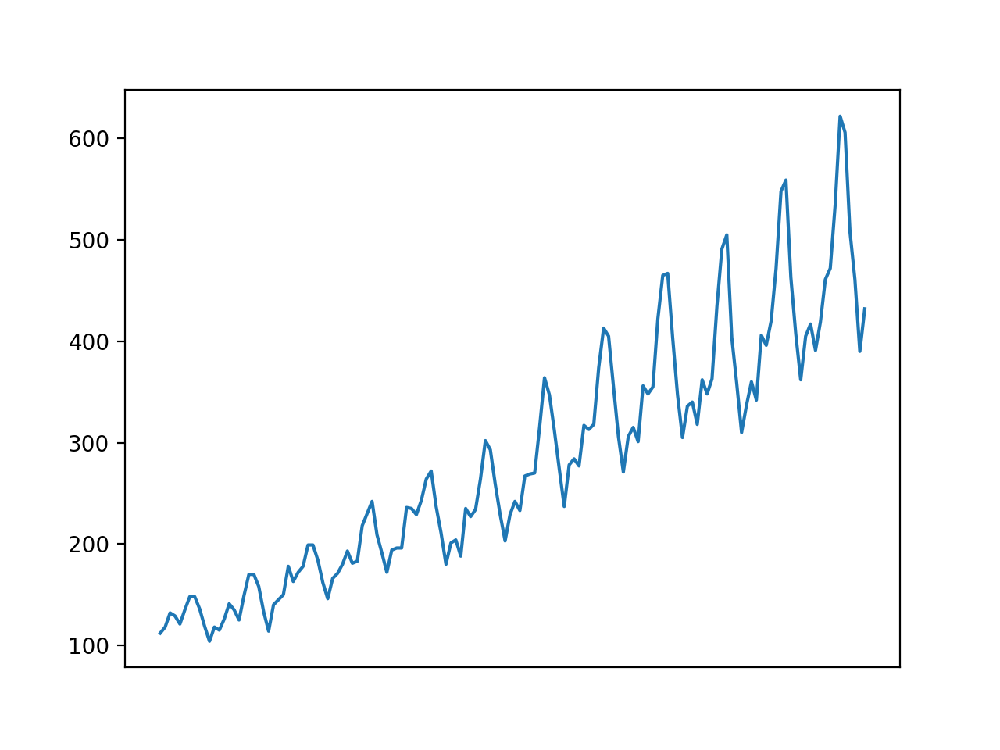

### How to Grid Search Deep Learning Models for Univariate Forecasting

Grid searching is generally not an operation that we can perform with deep learning methods.
This is because deep learning methods often require large amounts of
data and large models,
together resulting in models that take hours, days, or weeks to train. In those cases where the
datasets are smaller, such as univariate time series, it may be possible to use a grid search to
tune the hyperparameters of a deep learning model. In this tutorial, you will discover how to
develop a framework to grid search hyperparameters for deep learning models. After completing
this tutorial, you will know:

- How to develop a generic grid searching framework for tuning model
hyperparameters.

- How to grid search hyperparameters for a Multilayer Perceptron model on the airline
passengers univariate time series forecasting problem.

- How to adapt the framework to grid search hyperparameters for convolutional and long
short-term memory neural networks.

Let’s get started.

### Tutorial Overview

This tutorial is divided into five parts; they are:

1.  Time Series Problem
2.  Grid Search Framework
3.  Multilayer Perceptron Model
4.  Convolutional Neural Network Model
5.  Long Short-Term Memory Network Model

### Time Series Problem

In this tutorial we will focus on one dataset and use it as the context
to demonstrate the
development of a grid searching framework for range of deep learning
models for univariate
time series forecasting. We will use themonthly airline passengerdataset
as this context as it
includes the complexity of both trend and seasonal elements. Themonthly
airline passenger
dataset summarizes the monthly total number of international passengers
in thousands on for
an airline from 1949 to 1960. Download the dataset directly from here:

- monthly-airline-passengers.csv^1

Save the file with the filename `monthly-airline-passengers.csv` in your
current working directory. We can load this dataset as a PandasDataFrameusing the
function readcsv().


```
series = read_csv('monthly-airline-passengers.csv', header=0,
index_col=0)

```

Once loaded, we can summarize the shape of the dataset in order to
determine the number of observations.

```
print(series.shape)

```
We can then create a line plot of the series to get an idea of the
structure of the series.

```
pyplot.plot(series)
pyplot.show()

```

We can tie all of this together; the complete example is listed below.

```

from pandas import read_csv
from matplotlib import pyplot
series = read_csv('monthly-airline-passengers.csv', header=0,
index_col=0)

print(series.shape)
pyplot.plot(series)
pyplot.xticks([])
pyplot.show()

```

Running the example first prints the shape of the dataset.

```
(144, 1)

```

The dataset is monthly and has 12 years, or 144 observations. In our testing, we will use the
last year, or 12 observations, as the test set. A line plot is created. The dataset has an obvious
trend and seasonal component. The period of the seasonal component is 12 months.



In this tutorial, we will introduce the tools for grid searching, but we will not optimize the
model hyperparameters for this problem. Instead, we will demonstrate how to grid search the
deep learning model hyperparameters generally and find models with some skill compared to a
naive model. From prior experiments, a naive model can achieve a root mean squared error,
or RMSE, of 50.70 (remember the units are thousands of passengers) by persisting the value
from 12 months ago (relative index -12). The performance of this naive model provides a bound
on a model that is considered skillful for this problem. Any model that achieves a predictive
performance of lower than 50.70 on the last 12 months has skill.

It should be noted that a tuned ETS model can achieve an RMSE of 17.09 and a tuned
SARIMA can achieve an RMSE of 13.89. These provide a lower bound on the expectations of a
well-tuned deep learning model for this problem. Now that we have
defined our problem and
expectations of model skill, we can look at defining the grid search
test harness.


### Develop a Grid Search Framework

In this section, we will develop a grid search test harness that can be used to evaluate a range of
hyperparameters for different neural network models, such as MLPs, CNNs, and LSTMs. This
section is divided into the following parts:

1.  Train-Test Split
2.  Series as Supervised Learning
3.  Walk-Forward Validation
4.  Repeat Evaluation
5.  Summarize Performance
6.  Worked Example

<!-- -->

Note, much of this framework was presented already in Chapter 14. Some elements are
duplicated here given the changes needed to adapt it for grid searching model hyperparameters.

#### Train-Test Split

The first step is to split the loaded series into train and test sets.
We will use the first 11
years (132 observations) for training and the last 12 for the test set.
The traintestsplit() function below will split the series taking the raw observations and the number of observations
to use in the test set as arguments.


```
# split a univariate dataset into train/test sets
def train_test_split(data, n_test):
return data[:-n_test], data[-n_test:]

```

#### Series as Supervised Learning

Next, we need to be able to frame the univariate series of observations as a supervised learning
problem so that we can train neural network models. A supervised learning framing of a series
means that the data needs to be split into multiple examples that the model learns from and
generalizes across. Each sample must have both an input component and an output component.

The input component will be some number of prior observations, such as
three years, or 36 time steps.

The output component will be the total sales in the next month because we are interested
in developing a model to make one-step forecasts. We can implement this using theshift()
function on the PandasDataFrame. It allows us to shift a column down (forward in time) or
back (backward in time). We can take the series as a column of data, then create multiple copies
of the column, shifted forward or backward in time in order to create the samples with the
input and output elements we require. When a series is shifted down,NaNvalues are introduced
because we don’t have values beyond the start of the series.


```
(t)
1
2
3
4

```
This column can be shifted and inserted as a column beforehand:

```
(t-1), (t)
Nan, 1
1, 2
2, 3
3, 4
4, NaN

```
We can see that on the second row, the value 1 is provided as input as an observation at the
prior time step, and 2 is the next value in the series that can be predicted, or learned by the
model to be predicted when 1 is presented as input. Rows withNaNvalues can be removed. The
seriestosupervised() function below implements this behavior, allowing you to specify the
number of lag observations to use in the input and the number to use in the output for each
sample. It will also remove rows that haveNaNvalues as they cannot be used to train or test a
model.

```
# transform list into supervised learning format
def series_to_supervised(data, n_in, n_out=1):
df = DataFrame(data)
cols = list()
# input sequence (t-n, ... t-1)
for i in range(n_in, 0, -1):
cols.append(df.shift(i))
# forecast sequence (t, t+1, ... t+n)
for i in range(0, n_out):
cols.append(df.shift(-i))
# put it all together
agg = concat(cols, axis=1)
# drop rows with NaN values
agg.dropna(inplace=True)
return agg.values

```

Note, this is a more generic way of transforming a time series dataset into samples than the
specialized methods presented in Chapters 7, 8, and 9.

#### Walk-Forward Validation

Time series forecasting models can be evaluated on a test set using
walk-forward validation.

Walk-forward validation is an approach where the model makes a forecast
for each observation
in the test dataset one at a time. After each forecast is made for a time step in the test
dataset, the true observation for the forecast is added to the test dataset and made available to
the model. Simpler models can be refit with the observation prior to making the subsequent
prediction. More complex models, such as neural networks, are not refit given the much greater
computational cost. Nevertheless, the true observation for the time step can then be used as
part of the input for making the prediction on the next time step.
First, the dataset is split into train and test sets. We will call thetraintestsplit()
function to perform this split and pass in the pre-specified number of observations to use as the
test data. A model will be fit once on the training dataset for a given configuration. We will
define a genericmodelfit() function to perform this operation that can be filled in for the
given type of neural network that we may be interested in later. The function takes the training
dataset and the model configuration and returns the fit model ready for making predictions.

```
# fit a model
def model_fit(train, config):
return None

```

Each time step of the test dataset is enumerated. A prediction is made
using the fit model.

Again, we will define a generic function namedmodel_predict() that takes
the fit model, the
history, and the model configuration and makes a single one-step
prediction.


```
# forecast with a pre-fit model
def model_predict(model, history, config):
return 0.0

```

The prediction is added to a list of predictions and the true observation from the test set is
added to a list of observations that was seeded with all observations from the training dataset.

This list is built up during each step in the walk-forward validation,
allowing the model to make
a one-step prediction using the most recent history. All of the predictions can then be compared
to the true values in the test set and an error measure calculated. We will calculate the root
mean squared error, or RMSE, between predictions and the true values.
RMSE is calculated as the square root of the average of the squared differences between
the forecasts and the actual values. Themeasurermse()implements this below using the
meansquarederror()scikit-learn function to first calculate the mean squared error, or MSE,
before calculating the square root.

```
# root mean squared error or rmse
def measure_rmse(actual, predicted):
return sqrt(mean_squared_error(actual, predicted))

```

The complete walkforwardvalidation() function that ties all of this together is listed
below. It takes the dataset, the number of observations to use as the test set, and the
configuration for the model, and returns the RMSE for the model performance on the test set.

```
# walk-forward validation for univariate data
def walk_forward_validation(data, n_test, cfg):
predictions = list()
# split dataset
train, test = train_test_split(data, n_test)
# fit model


model = model_fit(train, cfg)
# seed history with training dataset
history = [x for x in train]
# step over each time step in the test set
for i in range(len(test)):
# fit model and make forecast for history
yhat = model_predict(model, history, cfg)
# store forecast in list of predictions
predictions.append(yhat)
# add actual observation to history for the next loop
history.append(test[i])
# estimate prediction error
error = measure_rmse(test, predictions)
print(' > %.3f' % error)
return error

```

#### Repeat Evaluation

Neural network models are stochastic. This means that, given the same model configuration and
the same training dataset, a different internal set of weights will result each time the model is
trained that will, in turn, have a different performance. This is a benefit, allowing the model to
be adaptive and find high performing configurations to complex problems. It is also a problem
when evaluating the performance of a model and in choosing a final model
to use to make
predictions.

To address model evaluation, we will evaluate a model configuration multiple times via
walk-forward validation and report the error as the average error across
each evaluation. This is
not always possible for large neural networks and may only make sense for small networks that
can be fit in minutes or hours. Therepeatevaluate() function below implements this and
allows the number of repeats to be specified as an optional parameter that defaults to 10 and
returns the mean RMSE score from all repeats.

```
# score a model, return None on failure
def repeat_evaluate(data, config, n_test, n_repeats=10):
# convert config to a key
key = str(config)
# fit and evaluate the model n times
scores = [walk_forward_validation(data, n_test, config) for _ in range(n_repeats)]
# summarize score
result = mean(scores)
print('> Model[%s] %.3f' % (key, result))
return (key, result)

```

#### Grid Search

We now have all the pieces of the framework. All that is left is a
function to drive the search. We
can define agridsearch() function that takes the dataset, a list of configurations to search,
and the number of observations to use as the test set and perform the search. Once mean scores
are calculated for each config, the list of configurations is sorted in ascending order so that the
best scores are listed first. The complete function is listed below.

```
# grid search configs
def grid_search(data, cfg_list, n_test):
# evaluate configs
scores = scores = [score_model(data, n_test, cfg) for cfg in cfg_list]
# sort configs by error, asc
scores.sort(key=lambda tup: tup[1])
return scores

```

#### Worked Example

Now that we have defined the elements of the test harness, we can tie them all together and
define a simple persistence model. We do not need to fit a model so the modelfit() function
will be implemented to simply return None.


```
# fit a model
def model_fit(train, config):
return None

```

We will use the config to define a list of index offsets in the prior observations relative to
the time to be forecasted that will be used as the prediction. For example, 12 will use the
observation 12 months ago (-12) relative to the time to be forecasted.

```
# define config
cfg_list = [1, 6, 12, 24, 36]

```

The model_predict() function can be implemented to use this configuration
to persist the value at the negative relative offset.

```
# forecast with a pre-fit model
def model_predict(model, history, offset):
history[-offset]

```
The complete example of using the framework with a simple persistence model is listed
below.

```
# grid search persistence models for monthly airline passengers dataset
from math import sqrt
from numpy import mean
from pandas import read_csv
from sklearn.metrics import mean_squared_error

# split a univariate dataset into train/test sets
def train_test_split(data, n_test):
return data[:-n_test], data[-n_test:]


def measure_rmse(actual, predicted):
return sqrt(mean_squared_error(actual, predicted))
def model_fit(train, config):
return None

def model_predict(model, history, offset):
return history[-offset]

def walk_forward_validation(data, n_test, cfg):
predictions = list()
train, test = train_test_split(data, n_test)
model = model_fit(train, cfg)

history = [x for x in train]

for i in range(len(test)):

yhat = model_predict(model, history, cfg)

predictions.append(yhat)

history.append(test[i])

error = measure_rmse(test, predictions)
print(' > %.3f' % error)
return error

def repeat_evaluate(data, config, n_test, n_repeats=10):

key = str(config)

scores = [walk_forward_validation(data, n_test, config) for _ in
range(n_repeats)]

result = mean(scores)
print('> Model[%s] %.3f' % (key, result))
return (key, result)

def grid_search(data, cfg_list, n_test):

scores = scores = [repeat_evaluate(data, cfg, n_test) for cfg in
cfg_list]

scores.sort(key=lambda tup: tup[1])
return scores
series = read_csv('monthly-airline-passengers.csv', header=0,
index_col=0)
data = series.values


# data split
n_test = 12
# model configs
cfg_list = [1, 6, 12, 24, 36]
# grid search
scores = grid_search(data, cfg_list, n_test)
print('done')
# list top 10 configs
for cfg, error in scores[:10]:
print(cfg, error)

```

Running the example prints the RMSE of the model evaluated using walk-forward validation
on the final 12 months of data. Each model configuration is evaluated 10 times, although,
because the model has no stochastic element, the score is the same each time. At the end of
the run, the configurations and RMSE for the top three performing model configurations are
reported. We can see, as we might have expected, that persisting the value from one year ago
(relative offset -12) resulted in the best performance for the
persistence model.

```
> 110.274

> 110.274

> 110.274

> Model[36] 110.274
done

12 50.708316214732804
1 53.1515129919491
24 97.10990337413241
36 110.27352356753639
6 126.73495965991387

```

Now that we have a robust test harness for grid searching model hyperparameters, we can
use it to evaluate a suite of neural network models.

### Multilayer Perceptron Model

In this section we will grid search hyperparameters for an MLPs for univariate time series
forecasting. For more details on modeling a univariate time series with an MLP, see Chapter 7.
There are many aspects of the MLP that we may wish to tune. We will define a very simple
model with one hidden layer and define five hyperparameters to tune. They are:

- **ninput:** The number of prior inputs to use as input for the model (e.g.
12 months).

- **nnodes:** The number of nodes to use in the hidden layer (e.g. 50).

- **nepochs:** The number of training epochs (e.g. 1000).

- **nbatch:** The number of samples to include in each mini-batch (e.g. 32).

- **ndiff:** The difference order (e.g. 0 or 12).

Modern neural networks can handle raw data with little pre-processing, such as scaling and
differencing. Nevertheless, when it comes to time series data, sometimes differencing the series
can make a problem easier to model. Recall that differencing is the transform of the data such
that a value of a prior observation is subtracted from the current observation, removing trend
or seasonality structure. We will add support for differencing to the grid search test harness,
just in case it adds value to your specific problem. It does add value for the internal airline
passengers dataset. Thedifference() function below will calculate the difference of a given
order for the dataset.

```

# difference dataset
def difference(data, order):
return [data[i] - data[i - order] for i in range(order, len(data))]

```
Differencing will be optional, where an order of 0 suggests no
differencing, whereas an order

1 or order 12 will require that the data be differenced prior to fitting
the model and that the

predictions of the model will need the differencing reversed prior to returning the forecast. We
can now define the elements required to fit the MLP model in the test harness. First, we must
unpack the list of hyperparameters.

```
# unpack config
n_input, n_nodes, n_epochs, n_batch, n_diff = config

```
Next, we must prepare the data, including the differencing, transforming the data to a
supervised format and separating out the input and output aspects of the data samples.

```
# prepare data
if n_diff > 0:
train = difference(train, n_diff)
# transform series into supervised format
data = series_to_supervised(train, n_input)
# separate inputs and outputs
train_x, train_y = data[:, :-1], data[:, -1]

```

We can now define and fit the model with the provided configuration.

```
# define model
model = Sequential()
model.add(Dense(n_nodes, activation='relu', input_dim=n_input))
model.add(Dense(1))
model.compile(loss='mse', optimizer='adam')
# fit model
model.fit(train_x, train_y, epochs=n_epochs, batch_size=n_batch, verbose=0)

```
The complete implementation of the modelfit() function is listed below.

```

def model_fit(train, config):
n_input, n_nodes, n_epochs, n_batch, n_diff = config
if n_diff > 0:
train = difference(train, n_diff)

data = series_to_supervised(train, n_input)

train_x, train_y = data[:, :-1], data[:, -1]
model = Sequential()
model.add(Dense(n_nodes, activation='relu', input_dim=n_input))
model.add(Dense(1))
model.compile(loss='mse', optimizer='adam')
model.fit(train_x, train_y, epochs=n_epochs, batch_size=n_batch,
verbose=0)
return model

```

The five chosen hyperparameters are by no means the only or best
hyperparameters of the
model to tune. You may modify the function to tune other parameters,
such as the addition
and size of more hidden layers and much more. Once the model is fit, we
can use it to make
forecasts. If the data was differenced, the difference must be inverted
for the prediction of the
model. This involves adding the value at the relative offset from the
history back to the value
predicted by the model.

```
correction = 0.0
if n_diff > 0:
correction = history[-n_diff]
...

return correction + yhat[0]

```

It also means that the history must be differenced so that the input
data used to make the prediction has the expected form.

```
history = difference(history, n_diff)

```

Once prepared, we can use the history data to create a single sample as
input to the model for
making a one-step prediction. The shape of one sample must be [1, ninput] where ninput
is the chosen number of lag observations to use.

```
x_input = array(history[-n_input:]).reshape((1, n_input))

```

Finally, a prediction can be made.


```
# make forecast
yhat = model.predict(x_input, verbose=0)

```

The complete implementation of the model_predict() function is listed below.
Next, we
must define the range of values to try for each hyperparameter. We can define amodelconfigs()
function that creates a list of the different combinations of parameters to try. We will define
a small subset of configurations to try as an example, including a differencing of 12 months,
which we expect will be required. You are encouraged to experiment with
standalone models,
review learning curve diagnostic plots, and use information about the domain to set ranges of
values of the hyperparameters to grid search.

You are also encouraged to repeat the grid search to narrow in on ranges of values that
appear to show better performance. An implementation of the modelconfigs() function is
listed below.

```
# create a list of configs to try
def model_configs():
# define scope of configs
n_input = [12]
n_nodes = [50, 100]
n_epochs = [100]
n_batch = [1, 150]
n_diff = [0, 12]
# create configs
configs = list()
for i in n_input:
for j in n_nodes:
for k in n_epochs:
for l in n_batch:
for m in n_diff:
cfg = [i, j, k, l, m]
configs.append(cfg)
print('Total configs: %d'% len(configs))
return configs

```

We now have all of the pieces needed to grid search MLP models for a univariate time series
forecasting problem. The complete example is listed below.

```

# grid search mlps for monthly airline passengers dataset
from math import sqrt
from numpy import array
from numpy import mean
from pandas import DataFrame
from pandas import concat
from pandas import read_csv
from sklearn.metrics import mean_squared_error
from keras.models import Sequential
from keras.layers import Dense

# split a univariate dataset into train/test sets
def train_test_split(data, n_test):
return data[:-n_test], data[-n_test:]


def series_to_supervised(data, n_in, n_out=1):
df = DataFrame(data)
cols = list()

for i in range(n_in, 0, -1):
cols.append(df.shift(i))

for i in range(0, n_out):
cols.append(df.shift(-i))

agg = concat(cols, axis=1)

agg.dropna(inplace=True)
return agg.values

def measure_rmse(actual, predicted):
return sqrt(mean_squared_error(actual, predicted))

def difference(data, order):
return [data[i] - data[i - order] for i in range(order, len(data))]
def model_fit(train, config):
n_input, n_nodes, n_epochs, n_batch, n_diff = config
if n_diff > 0:
train = difference(train, n_diff)

data = series_to_supervised(train, n_in=n_input)

train_x, train_y = data[:, :-1], data[:, -1]
model = Sequential()
model.add(Dense(n_nodes, activation='relu', input_dim=n_input))
model.add(Dense(1))
model.compile(loss='mse', optimizer='adam')
model.fit(train_x, train_y, epochs=n_epochs, batch_size=n_batch,
verbose=0)
return model

def model_predict(model, history, config):
n_input, _, _, _, n_diff = config
correction = 0.0
if n_diff > 0:
correction = history[-n_diff]
history = difference(history, n_diff)

x_input = array(history[-n_input:]).reshape((1, n_input))


# make forecast
yhat = model.predict(x_input, verbose=0)
# correct forecast if it was differenced
return correction + yhat[0]

def walk_forward_validation(data, n_test, cfg):
predictions = list()
train, test = train_test_split(data, n_test)
model = model_fit(train, cfg)

history = [x for x in train]

for i in range(len(test)):

yhat = model_predict(model, history, cfg)

predictions.append(yhat)

history.append(test[i])

error = measure_rmse(test, predictions)
print(' > %.3f' % error)
return error

def repeat_evaluate(data, config, n_test, n_repeats=10):

key = str(config)

scores = [walk_forward_validation(data, n_test, config) for _ in
range(n_repeats)]

result = mean(scores)
print('> Model[%s] %.3f' % (key, result))
return (key, result)

def grid_search(data, cfg_list, n_test):

scores = scores = [repeat_evaluate(data, cfg, n_test) for cfg in
cfg_list]

scores.sort(key=lambda tup: tup[1])
return scores

def model_configs():

n_input = [12]
n_nodes = [50, 100]
n_epochs = [100]
n_batch = [1, 150]
n_diff = [0, 12]
configs = list()


for i in n_input:
for j in n_nodes:
for k in n_epochs:
for l in n_batch:
for m in n_diff:
cfg = [i, j, k, l, m]
configs.append(cfg)
print('Total configs: %d'% len(configs))
return configs

# define dataset
series = read_csv('monthly-airline-passengers.csv', header=0, index_col=0)
data = series.values
# data split
n_test = 12
# model configs
cfg_list = model_configs()
# grid search
scores = grid_search(data, cfg_list, n_test)
print('done')
# list top 3 configs
for cfg, error in scores[:3]:
print(cfg, error)

```

Running the example, we can see that there are a total of eight configurations to be evaluated
by the framework. Each config will be evaluated 10 times; that means 10 models will be created
and evaluated using walk-forward validation to calculate an RMSE score before an average of
those 10 scores is reported and used to score the configuration. The scores are then sorted
and the top 3 configurations with the lowest RMSE are reported at the end. A skillful model
configuration was found as compared to a naive model that reported an RMSE of 50.70. We
can see that the best RMSE of 18.98 was achieved with a configuration of[12, 100, 100, 1, 12], which we know can be interpreted as:

- **ninput:** 12

- **nnodes:** 100

- **nepochs:** 100

- **nbatch:** 1

- **ndiff:** 12

A truncated example output of the grid search is listed below.

**Note:** Given the stochastic nature of the algorithm, your specific results may vary. Consider
running the example a few times.

```

Total configs: 8
> 20.707
> 29.111
> 17.499
> 18.918
> 28.817

> 21.015
> 20.208
> 18.503
> Model[[12, 100, 100, 150, 12]] 19.674
done

[12, 100, 100, 1, 12] 18.982720013625606
[12, 50, 100, 150, 12] 19.33004059448595
[12, 100, 100, 1, 0] 19.5389405532858

```

### Convolutional Neural Network Model

We can now adapt the framework to grid search CNN models. For more
details on modeling a
univariate time series with a CNN, see Chapter 8. Much the same set of hyperparameters can
be searched as with the MLP model, except the number of nodes in the hidden layer can be
replaced by the number of filter maps and kernel size in the convolutional layers. The chosen
set of hyperparameters to grid search in the CNN model are as follows:

- **ninput:** The number of prior inputs to use as input for the model (e.g.
12 months).

- **nfilters:** The number of filter maps in the convolutional layer (e.g.
32).

- **nkernel:** The kernel size in the convolutional layer (e.g. 3).

- **nepochs:** The number of training epochs (e.g. 1000).

- **nbatch:** The number of samples to include in each mini-batch (e.g. 32).

- **ndiff:** The difference order (e.g. 0 or 12).

Some additional hyperparameters that you may wish to investigate are the use of two
convolutional layers before a pooling layer, the repetition of the convolutional and pooling layer
pattern, the use of dropout, and more. We will define a very simple CNN model with one
convolutional layer and one max pooling layer.

```
# define model
model = Sequential()
model.add(Conv1D(filters=n_filters, kernel_size=n_kernel, activation='relu',
input_shape=(n_input, n_features)))
model.add(MaxPooling1D(pool_size=2))
model.add(Flatten())

model.add(Dense(1))
model.compile(loss='mse', optimizer='adam')

```

The data must be prepared in much the same way as for the MLP. Unlike the MLP that
expects the input data to have the shape[samples, features], the 1D CNN
model expects the
data to have the shape[samples, timesteps, features]where features maps
onto channels
and in this case 1 for the one variable we measure each month.

```
n_features = 1
train_x = train_x.reshape((train_x.shape[0], train_x.shape[1],
n_features))

```

The complete implementation of the modelfit() function is listed below.

```
def model_fit(train, config):
n_input, n_filters, n_kernel, n_epochs, n_batch, n_diff = config
if n_diff > 0:
train = difference(train, n_diff)

data = series_to_supervised(train, n_input)

train_x, train_y = data[:, :-1], data[:, -1]

n_features = 1
train_x = train_x.reshape((train_x.shape[0], train_x.shape[1],
n_features))
model = Sequential()
model.add(Conv1D(filters=n_filters, kernel_size=n_kernel,
activation='relu',
input_shape=(n_input, n_features)))
model.add(MaxPooling1D(pool_size=2))
model.add(Flatten())
model.add(Dense(1))
model.compile(loss='mse', optimizer='adam')
model.fit(train_x, train_y, epochs=n_epochs, batch_size=n_batch,
verbose=0)
return model

```

Making a prediction with a fit CNN model is very much like making a prediction with a
fit MLP. Again, the only difference is that the one sample worth of
input data must have a three-dimensional shape.


```
x_input = array(history[-n_input:]).reshape((1, n_input, 1))

```

The complete implementation of the model_predict() function is listed
below.


```
def model_predict(model, history, config):


# unpack config
n_input, _, _, _, _, n_diff = config
# prepare data
correction = 0.0
if n_diff > 0:
correction = history[-n_diff]
history = difference(history, n_diff)
x_input = array(history[-n_input:]).reshape((1, n_input, 1))
# forecast
yhat = model.predict(x_input, verbose=0)
return correction + yhat[0]

```

Finally, we can define a list of configurations for the model to evaluate. As before, we can
do this by defining lists of hyperparameter values to try that are
combined into a list. We will
try a small number of configurations to ensure the example executes in a
reasonable amount of time. The complete modelconfigs() function is listed below.

```

def model_configs():

n_input = [12]
n_filters = [64]
n_kernels = [3, 5]
n_epochs = [100]
n_batch = [1, 150]
n_diff = [0, 12]
configs = list()
for a in n_input:
for b in n_filters:
for c in n_kernels:
for d in n_epochs:
for e in n_batch:
for f in n_diff:
cfg = [a,b,c,d,e,f]
configs.append(cfg)
print('Total configs: %d'% len(configs))
return configs

```

We now have all of the elements needed to grid search the
hyperparameters of a convolutional
neural network for univariate time series forecasting. The complete
example is listed below.

```

from math import sqrt
from numpy import array
from numpy import mean
from pandas import DataFrame
from pandas import concat
from pandas import read_csv
from sklearn.metrics import mean_squared_error
from keras.models import Sequential
from keras.layers import Dense
from keras.layers import Flatten


from keras.layers.convolutional import Conv1D
from keras.layers.convolutional import MaxPooling1D

def train_test_split(data, n_test):
return data[:-n_test], data[-n_test:]

def series_to_supervised(data, n_in, n_out=1):
df = DataFrame(data)
cols = list()

for i in range(n_in, 0, -1):
cols.append(df.shift(i))

for i in range(0, n_out):
cols.append(df.shift(-i))

agg = concat(cols, axis=1)

agg.dropna(inplace=True)
return agg.values

def measure_rmse(actual, predicted):
return sqrt(mean_squared_error(actual, predicted))

def difference(data, order):
return [data[i] - data[i - order] for i in range(order, len(data))]
def model_fit(train, config):
n_input, n_filters, n_kernel, n_epochs, n_batch, n_diff = config
if n_diff > 0:
train = difference(train, n_diff)

data = series_to_supervised(train, n_in=n_input)

train_x, train_y = data[:, :-1], data[:, -1]

n_features = 1
train_x = train_x.reshape((train_x.shape[0], train_x.shape[1],
n_features))
model = Sequential()
model.add(Conv1D(filters=n_filters, kernel_size=n_kernel,
activation='relu',
input_shape=(n_input, n_features)))
model.add(MaxPooling1D(pool_size=2))
model.add(Flatten())
model.add(Dense(1))
model.compile(loss='mse', optimizer='adam')
model.fit(train_x, train_y, epochs=n_epochs, batch_size=n_batch,
verbose=0)
return model


def model_predict(model, history, config):
n_input, _, _, _, _, n_diff = config
correction = 0.0
if n_diff > 0:
correction = history[-n_diff]
history = difference(history, n_diff)
x_input = array(history[-n_input:]).reshape((1, n_input, 1))
yhat = model.predict(x_input, verbose=0)
return correction + yhat[0]

def walk_forward_validation(data, n_test, cfg):
predictions = list()
train, test = train_test_split(data, n_test)
model = model_fit(train, cfg)

history = [x for x in train]

for i in range(len(test)):

yhat = model_predict(model, history, cfg)

predictions.append(yhat)

history.append(test[i])

error = measure_rmse(test, predictions)
print(' > %.3f' % error)
return error

def repeat_evaluate(data, config, n_test, n_repeats=10):

key = str(config)

scores = [walk_forward_validation(data, n_test, config) for _ in
range(n_repeats)]

result = mean(scores)
print('> Model[%s] %.3f' % (key, result))
return (key, result)

def grid_search(data, cfg_list, n_test):

scores = scores = [repeat_evaluate(data, cfg, n_test) for cfg in
cfg_list]

scores.sort(key=lambda tup: tup[1])
return scores


def model_configs():

n_input = [12]
n_filters = [64]
n_kernels = [3, 5]
n_epochs = [100]
n_batch = [1, 150]
n_diff = [0, 12]
configs = list()
for a in n_input:
for b in n_filters:
for c in n_kernels:
for d in n_epochs:
for e in n_batch:
for f in n_diff:
cfg = [a,b,c,d,e,f]
configs.append(cfg)
print('Total configs: %d'% len(configs))
return configs
series = read_csv('monthly-airline-passengers.csv', header=0,
index_col=0)
data = series.values
n_test = 12
cfg_list = model_configs()
scores = grid_search(data, cfg_list, n_test)
print('done')

for cfg, error in scores[:3]:
print(cfg, error)

```

Running the example, we can see that only eight distinct configurations
are evaluated. We
can see that a configuration of[12, 64, 5, 100, 1, 12]achieved an RMSE
of 18.89, which
is skillful as compared to a naive forecast model that achieved 50.70.
We can unpack this configuration as:

- **ninput:** 12

- **nfilters:** 64

- **nkernel:** 5

- **nepochs:** 100

- **nbatch:** 1

- **ndiff:** 12


A truncated example output of the grid search is listed below.

**Note:** Given the stochastic nature of the algorithm, your specific results may vary. Consider
running the example a few times.

```
Total configs: 8
> 23.372
> 28.317
> 31.070

> 20.923
> 18.700
> 18.210
> Model[[12, 64, 5, 100, 150, 12]] 19.152
done

[12, 64, 5, 100, 1, 12] 18.89593462072732
[12, 64, 5, 100, 150, 12] 19.152486150334234
[12, 64, 3, 100, 150, 12] 19.44680151564605

```

### Long Short-Term Memory Network Model

We can now adopt the framework for grid searching the hyperparameters of
an LSTM model.

For more details on modeling a univariate time series with an LSTM network, see Chapter 9.
The hyperparameters for the LSTM model will be the same five as the MLP;
they are:

- **ninput:** The number of prior inputs to use as input for the model (e.g.
12 months).

- **nnodes:** The number of nodes to use in the hidden layer (e.g. 50).

- **nepochs:** The number of training epochs (e.g. 1000).

- **nbatch:** The number of samples to include in each mini-batch (e.g. 32).

- **ndiff:** The difference order (e.g. 0 or 12).

We will define a simple LSTM model with a single hidden LSTM layer and the number of
nodes specifying the number of units in this layer.

```
# define model
model = Sequential()
model.add(LSTM(n_nodes, activation='relu', input_shape=(n_input, n_features)))
model.add(Dense(n_nodes, activation='relu'))
model.add(Dense(1))
model.compile(loss='mse', optimizer='adam')
# fit model
model.fit(train_x, train_y, epochs=n_epochs, batch_size=n_batch, verbose=0)

```

It may be interesting to explore tuning additional configurations such as the use of a
bidirectional input layer, stacked LSTM layers, and even hybrid models
with CNN or ConvLSTM
input models. As with the CNN model, the LSTM model expects input data
to have a three-dimensional shape for the samples, time steps, and features.

```
n_features = 1
train_x = train_x.reshape((train_x.shape[0], train_x.shape[1],
n_features))

```

The complete implementation of the modelfit() function is listed below.

```
def model_fit(train, config):
n_input, n_nodes, n_epochs, n_batch, n_diff = config
if n_diff > 0:
train = difference(train, n_diff)

data = series_to_supervised(train, n_input)

train_x, train_y = data[:, :-1], data[:, -1]

n_features = 1
train_x = train_x.reshape((train_x.shape[0], train_x.shape[1],
n_features))
model = Sequential()
model.add(LSTM(n_nodes, activation='relu', input_shape=(n_input,
n_features)))
model.add(Dense(n_nodes, activation='relu'))
model.add(Dense(1))
model.compile(loss='mse', optimizer='adam')
model.fit(train_x, train_y, epochs=n_epochs, batch_size=n_batch,
verbose=0)
return model

```

Also like the CNN, the single input sample used to make a prediction
must also be reshaped into the expected three-dimensional structure.


```
x_input = array(history[-n_input:]).reshape((1, n_input, 1))

```

The complete model_predict() function is listed below.

```

def model_predict(model, history, config):
n_input, _, _, _, n_diff = config
correction = 0.0
if n_diff > 0:
correction = history[-n_diff]
history = difference(history, n_diff)


# reshape sample into [samples, timesteps, features]
x_input = array(history[-n_input:]).reshape((1, n_input, 1))
# forecast
yhat = model.predict(x_input, verbose=0)
return correction + yhat[0]

```

We can now define the function used to create the list of model configurations to evaluate.
The LSTM model is quite a bit slower to train than MLP and CNN models;
as such, you
may want to evaluate fewer configurations per run. We will define a very simple set of two
configurations to explore: stochastic and batch gradient descent.


```
# create a list of configs to try
def model_configs():
# define scope of configs
n_input = [12]
n_nodes = [100]
n_epochs = [50]
n_batch = [1, 150]
n_diff = [12]
# create configs
configs = list()
for i in n_input:
for j in n_nodes:
for k in n_epochs:
for l in n_batch:
for m in n_diff:
cfg = [i, j, k, l, m]
configs.append(cfg)
print('Total configs: %d'% len(configs))
return configs

```

We now have everything we need to grid search hyperparameters for the LSTM model for
univariate time series forecasting. The complete example is listed below.

```

# grid search lstm for monthly airline passengers dataset
from math import sqrt
from numpy import array
from numpy import mean
from pandas import DataFrame
from pandas import concat
from pandas import read_csv
from sklearn.metrics import mean_squared_error
from keras.models import Sequential
from keras.layers import Dense
from keras.layers import LSTM

# split a univariate dataset into train/test sets
def train_test_split(data, n_test):
return data[:-n_test], data[-n_test:]

# transform list into supervised learning format
def series_to_supervised(data, n_in, n_out=1):
df = DataFrame(data)


cols = list()
# input sequence (t-n, ... t-1)
for i in range(n_in, 0, -1):
cols.append(df.shift(i))
# forecast sequence (t, t+1, ... t+n)
for i in range(0, n_out):
cols.append(df.shift(-i))
# put it all together
agg = concat(cols, axis=1)
# drop rows with NaN values
agg.dropna(inplace=True)
return agg.values

def measure_rmse(actual, predicted):
return sqrt(mean_squared_error(actual, predicted))

def difference(data, order):
return [data[i] - data[i - order] for i in range(order, len(data))]
def model_fit(train, config):
n_input, n_nodes, n_epochs, n_batch, n_diff = config
if n_diff > 0:
train = difference(train, n_diff)

data = series_to_supervised(train, n_in=n_input)

train_x, train_y = data[:, :-1], data[:, -1]

n_features = 1
train_x = train_x.reshape((train_x.shape[0], train_x.shape[1],
n_features))
model = Sequential()
model.add(LSTM(n_nodes, activation='relu', input_shape=(n_input,
n_features)))
model.add(Dense(n_nodes, activation='relu'))
model.add(Dense(1))
model.compile(loss='mse', optimizer='adam')
model.fit(train_x, train_y, epochs=n_epochs, batch_size=n_batch,
verbose=0)
return model

def model_predict(model, history, config):
n_input, _, _, _, n_diff = config
correction = 0.0
if n_diff > 0:
correction = history[-n_diff]
history = difference(history, n_diff)

x_input = array(history[-n_input:]).reshape((1, n_input, 1))


# forecast
yhat = model.predict(x_input, verbose=0)
return correction + yhat[0]

def walk_forward_validation(data, n_test, cfg):
predictions = list()
train, test = train_test_split(data, n_test)
model = model_fit(train, cfg)

history = [x for x in train]

for i in range(len(test)):

yhat = model_predict(model, history, cfg)

predictions.append(yhat)

history.append(test[i])

error = measure_rmse(test, predictions)
print(' > %.3f' % error)
return error

def repeat_evaluate(data, config, n_test, n_repeats=10):

key = str(config)

scores = [walk_forward_validation(data, n_test, config) for _ in
range(n_repeats)]

result = mean(scores)
print('> Model[%s] %.3f' % (key, result))
return (key, result)

def grid_search(data, cfg_list, n_test):

scores = scores = [repeat_evaluate(data, cfg, n_test) for cfg in
cfg_list]

scores.sort(key=lambda tup: tup[1])
return scores

def model_configs():

n_input = [12]
n_nodes = [100]
n_epochs = [50]
n_batch = [1, 150]
n_diff = [12]
configs = list()
for i in n_input:

for j in n_nodes:
for k in n_epochs:
for l in n_batch:
for m in n_diff:
cfg = [i, j, k, l, m]
configs.append(cfg)
print('Total configs: %d'% len(configs))
return configs
series = read_csv('monthly-airline-passengers.csv', header=0,
index_col=0)
data = series.values
n_test = 12
cfg_list = model_configs()
scores = grid_search(data, cfg_list, n_test)
print('done')

for cfg, error in scores[:3]:
print(cfg, error)

```

Running the example, we can see that only two distinct configurations are evaluated. We
can see that a configuration of[12, 100, 50, 1, 12]achieved an RMSE of
21.24, which is
skillful as compared to a naive forecast model that achieved 50.70. The
model requires a lot
more tuning and may do much better with a hybrid configuration, such as
having a CNN model
as input. We can unpack this configuration as:

- **ninput:** 12

- **nnodes:** 100

- **nepochs:** 50

- **nbatch:** 1

- **ndiff:** 12

A truncated example output of the grid search is listed below.

**Note:** Given the stochastic nature of the algorithm, your specific
results may vary. Consider running the example a few times.

```
Total configs: 2

> 20.488
>  17.718
>  21.213
>  ...
>  22.300
>  20.311
> 21.322

> Model[[12, 100, 50, 150, 12]] 21.260
done

[12, 100, 50, 1, 12] 21.243775750634093
[12, 100, 50, 150, 12] 21.259553398553606

```

### Extensions

This section lists some ideas for extending the tutorial that you may
wish to explore.

- More Configurations. Explore a large suite of configurations for one of the models and
see if you can find a configuration that results in better performance.

- Data Scaling. Update the grid search framework to also support the scaling (normal-
ization and/or standardization) of data both before fitting the model and inverting the
transform for predictions.

- Network Architecture. Explore the grid searching larger architectural changes for a
given model, such as the addition of more hidden layers.

- New Dataset. Explore the grid search of a given model in a new univariate time series
dataset.

- Multivariate. Update the grid search framework to support small multivariate time
series datasets, e.g. datasets with multiple input variables.


#### Further Reading

This section provides more resources on the topic if you are looking to
go deeper.

- Keras Sequential Model API.
https://keras.io/models/sequential/

- Keras Core Layers API.
https://keras.io/layers/core/

- Keras Convolutional Layers API.
https://keras.io/layers/convolutional/

- Keras Pooling Layers API.
https://keras.io/layers/pooling/

- Keras Recurrent Layers API.
https://keras.io/layers/recurrent/

#### Summary

In this tutorial, you discovered how to develop a framework to grid search hyperparameters for
deep learning models. Specifically, you learned:

- How to develop a generic grid searching framework for tuning model
hyperparameters.

- How to grid search hyperparameters for a Multilayer Perceptron model on the airline
passengers univariate time series forecasting problem.

- How to adapt the framework to grid search hyperparameters for convolutional and long
short-term memory neural networks.

