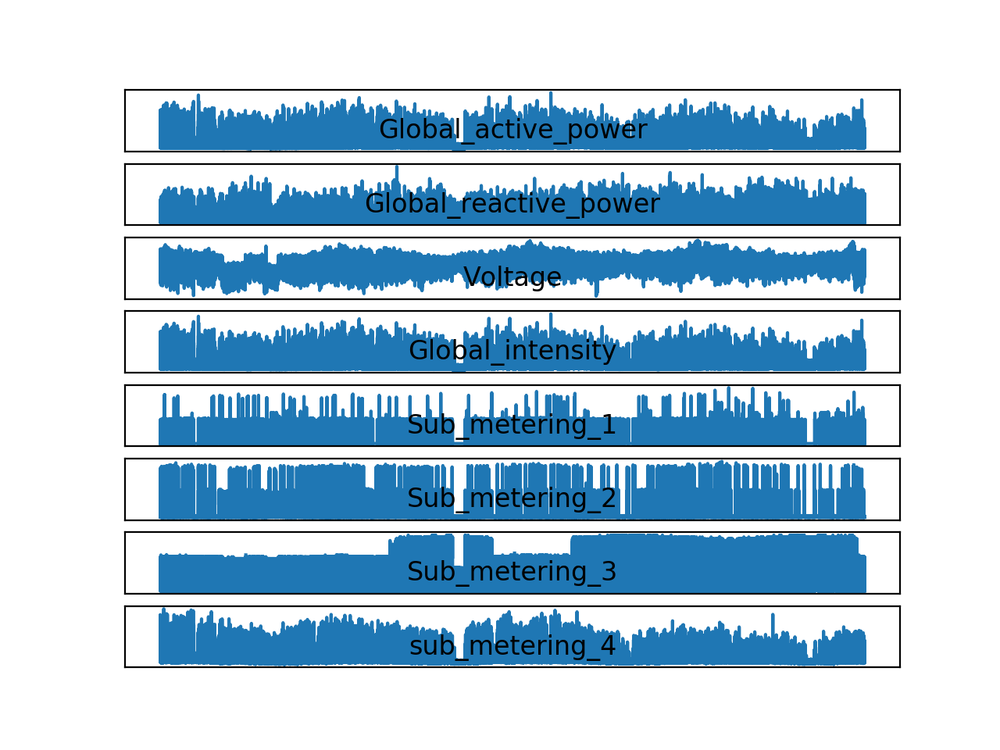
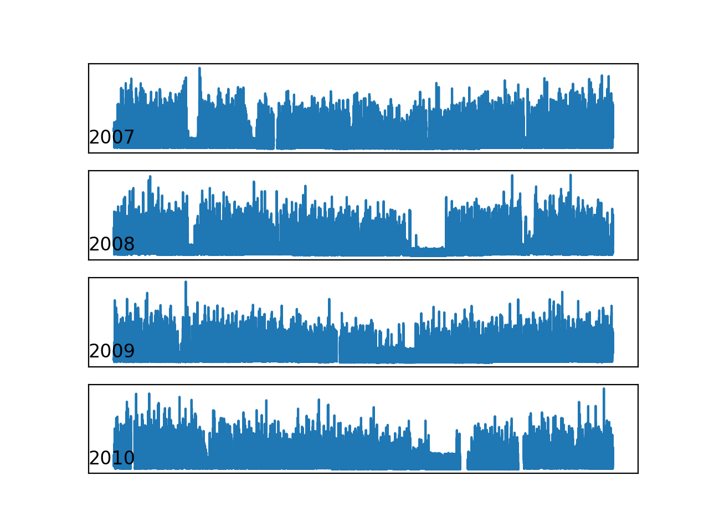
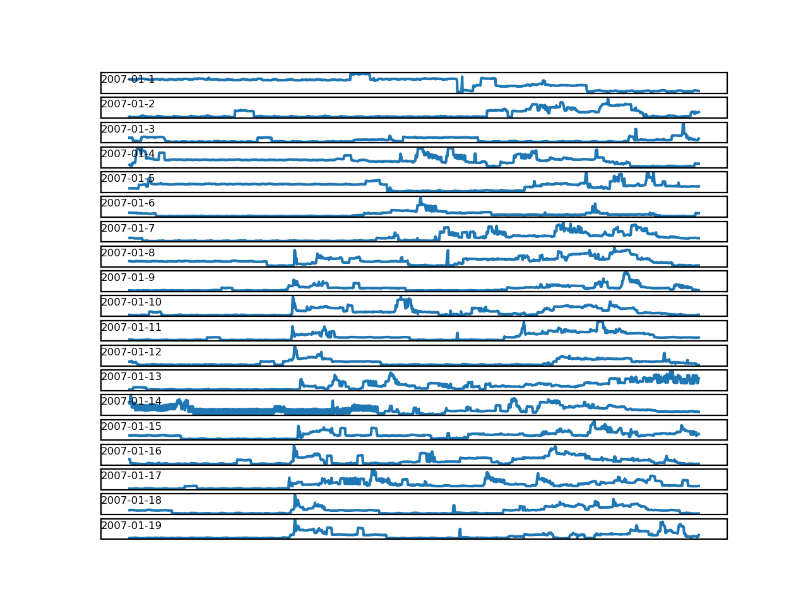
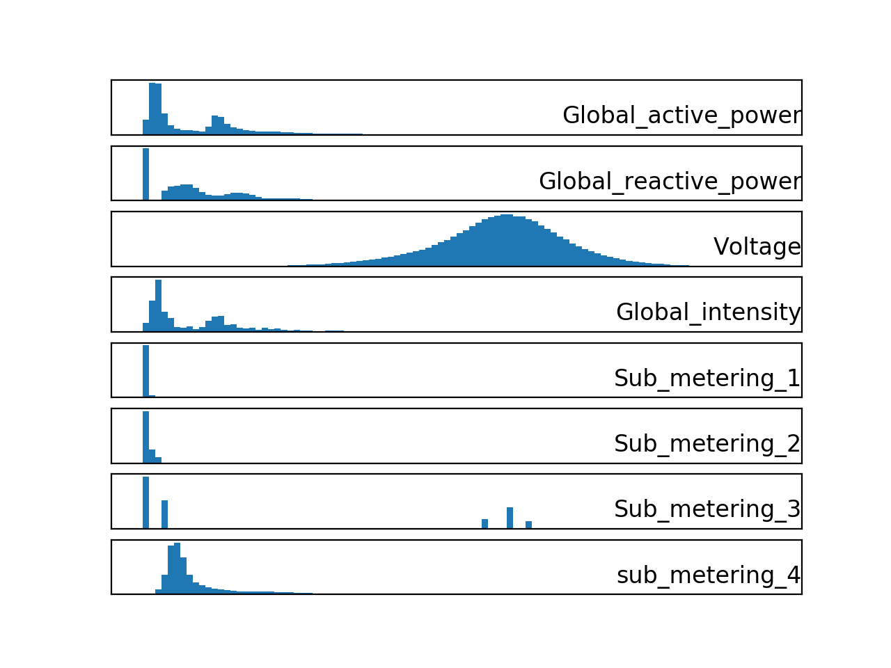
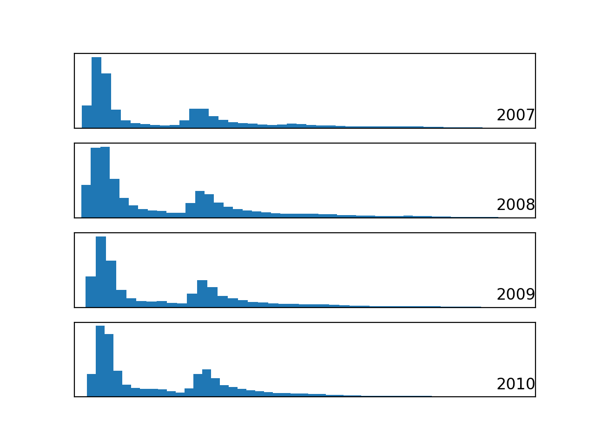
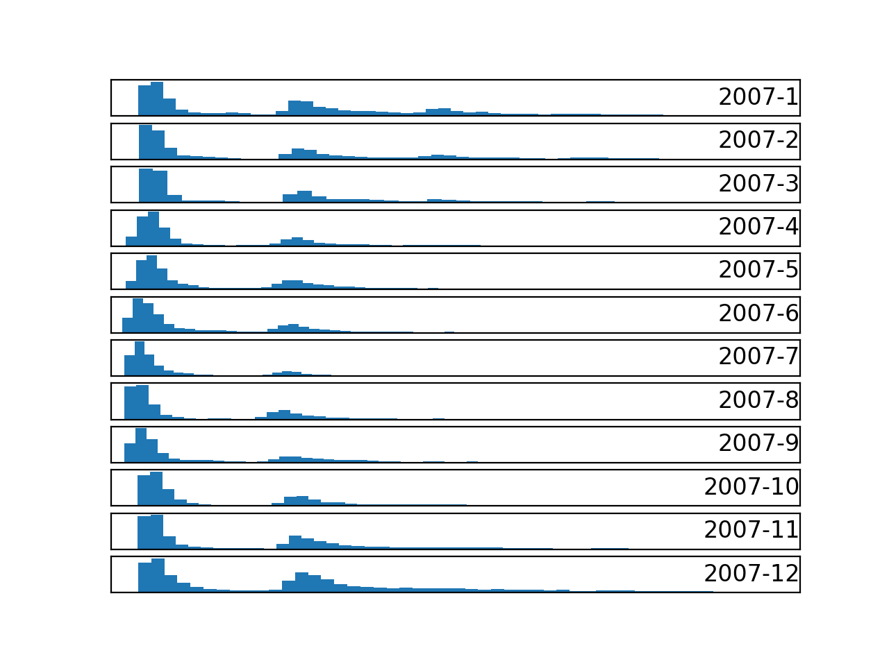

### How to Load and Explore Household Energy Usage Data

Given the rise of smart electricity meters and the wide adoption of electricity generation
technology like solar panels, there is a wealth of electricity usage data available. This data
represents a multivariate time series of power-related variables, that in turn could be used to
model and even forecast future electricity consumption. In this tutorial, you will discover a
household power consumption dataset for multi-step time series forecasting and how to better
understand the raw data using exploratory analysis. This dataset will provided the basis for the
remaining tutorials in this part of the book. After completing this tutorial, you will know:

- The household power consumption dataset that describes electricity usage for a single
house over four years.
- How to explore and understand the dataset using a suite of line plots for the series data
and histogram for the data distributions.
- How to use the new understanding of the problem to consider different framings of the
prediction problem, ways the data may be prepared, and modeling methods that may be
used.
Let’s get started.

#### Tutorial Overview
This tutorial is divided into five parts; they are:
1. Power Consumption Dataset
2. Load Dataset
3. Patterns in Observations Over Time
4. Time Series Data Distributions
5. Ideas on Modeling

**Note:** The data visualizations in this tutorial are intended to be quick-and-dirty to rapidly
learn about the dataset, rather than used as the basis for presentation. As such they are more
utilitarian and less aesthetic.

#### Household Power Consumption Dataset
The Household Power Consumption dataset is a multivariate time series dataset that describes
the electricity consumption for a single household over four years. The data was collected
between December 2006 and November 2010 and observations of power consumption within the
household were collected every minute. It is a multivariate series comprised of seven variables
(besides the date and time); they are:

- global active power: The total active power consumed by the household (kilowatts).
- global reactive power: The total reactive power consumed by the household (kilowatts).
- voltage: Average voltage (volts).
- global intensity: Average current intensity (amps).
- sub metering 1: Active energy for kitchen (watt-hours of active energy).
- sub metering 2: Active energy for laundry (watt-hours of active energy).
- sub metering 3: Active energy for climate control systems (watt-hours of active energy).

Active and reactive energy refer to the technical details of alternative current. In general
terms, the active energy is the real power consumed by the household, whereas the reactive
energy is the unused power in the lines. We can see that the dataset provides the active power
as well as some division of the active power by main circuit in the house, specifically the kitchen,
laundry, and climate control. These are not all the circuits in the household. The remaining
watt-hours can be calculated from the active energy by first converting the active energy to
watt-hours then subtracting the other sub-metered active energy in watt-hours, as follows:
remainder = (global act pwr × 1000 60) − (sub met 1 + sub met 2 + sub met 3) (16.1)

The dataset seems to have been provided without a seminal reference paper. Nevertheless,
this dataset has become a standard for evaluating time series forecasting and machine learning
methods for multi-step forecasting, specifically for forecasting active power. Further, it is not
clear whether the other features in the dataset may benefit a model in forecasting active power.

#### Load Dataset
The dataset is described and has been made freely available on the UCI Machine Learning
repository1. The dataset can be downloaded as a single 20 megabyte zip file. A direct download
link is provided blow: https://archive.ics.uci.edu/ml/datasets/individual+household+electric+power+consumption

- household power consumption.zip

Download the dataset and unzip it into your current working directory. You will now have
the file household power consumption.txt that is about 127 megabytes in size and contains
all of the observations Inspect the data file. Below are the first five rows of data (and the header)
from the raw data file.

```
Date;Time;Global_active_power;Global_reactive_power;Voltage;Global_intensity;...
16/12/2006;17:24:00;4.216;0.418;234.840;18.400;0.000;1.000;17.000
16/12/2006;17:25:00;5.360;0.436;233.630;23.000;0.000;1.000;16.000
16/12/2006;17:26:00;5.374;0.498;233.290;23.000;0.000;2.000;17.000
16/12/2006;17:27:00;5.388;0.502;233.740;23.000;0.000;1.000;17.000
16/12/2006;17:28:00;3.666;0.528;235.680;15.800;0.000;1.000;17.000
...
```

We can see that the data columns are separated by semicolons (‘;’). The data is reported
to have one row for each day in the time period. The data does have missing values; for example,
we can see 2-3 days worth of missing data around 28/4/2007.

```
...
28/4/2007;00:20:00;0.492;0.208;236.240;2.200;0.000;0.000;0.000
28/4/2007;00:21:00;?;?;?;?;?;?;
28/4/2007;00:22:00;?;?;?;?;?;?;
28/4/2007;00:23:00;?;?;?;?;?;?;
28/4/2007;00:24:00;?;?;?;?;?;?;
...
```

We can start-off by loading the data file as a Pandas DataFrame and summarize the loaded
data. We can use the read csv() function to load the data. It is easy to load the data with this
function, but a little tricky to load it correctly. Specifically, we need to do a few custom things:
- Specify the separate between columns as a semicolon (sep=‘;’)
- Specify that line 0 has the names for the columns (header=0)
- Specify that we have lots of RAM to avoid a warning that we are loading the data as an
array of objects instead of an array of numbers, because of the ‘?’ values for missing
data (low memory=False).
- Specify that it is okay for Pandas to try to infer the date-time format when parsing dates,
which is way faster (infer datetime format=True)
- Specify that we would like to parse the date and time columns together as a new column
called ’datetime’ (parse dates=‘datetime’:[0,1])
- Specify that we would like our new datetime column to be the index for the DataFrame
(index col=[’datetime’]).

Putting all of this together, we can now load the data and summarize the loaded shape and
first few rows.

```
# load all data
dataset = read_csv('household_power_consumption.txt', sep=';', header=0, low_memory=False,
infer_datetime_format=True, parse_dates={'datetime':[0,1]}, index_col=['datetime'])
# summarize
print(dataset.shape)
print(dataset.head())
```

Next, we can mark all missing values indicated with a ‘?’ character with a NaN value, which
is a float. This will allow us to work with the data as one array of floating point values rather
than mixed types, which is less efficient.

```
# mark all missing values
dataset.replace('?', nan, inplace=True)
```

Now we can create a new column that contains the remainder of the sub-metering, using the
calculation from the previous section.

```
# add a column for for the remainder of sub metering
values = dataset.values.astype('float32')
dataset['sub_metering_4'] = (values[:,0] * 1000 / 60) - (values[:,4] + values[:,5] +
values[:,6])
```

We can now save the cleaned-up version of the dataset to a new file; in this case we will just
change the file extension to .csv and save the dataset as household power consumption.csv.

```
# save updated dataset
dataset.to_csv('household_power_consumption.csv')
```

To confirm that we have not messed-up, we can re-load the dataset and summarize the first
five rows.

```
# load the new file
dataset = read_csv('household_power_consumption.csv', header=None)
print(dataset.head())
```

Tying all of this together, the complete example of loading, cleaning-up, and saving the
dataset is listed below.

```
# load and clean-up power usage data
from numpy import nan
from pandas import read_csv
# load all data
dataset = read_csv('household_power_consumption.txt', sep=';', header=0, low_memory=False,
infer_datetime_format=True, parse_dates={'datetime':[0,1]}, index_col=['datetime'])
# summarize
print(dataset.shape)16.3. Load Dataset 326
print(dataset.head())
# mark all missing values
dataset.replace('?', nan, inplace=True)
# add a column for for the remainder of sub metering
values = dataset.values.astype('float32')
dataset['sub_metering_4'] = (values[:,0] * 1000 / 60) - (values[:,4] + values[:,5] +
values[:,6])
# save updated dataset
dataset.to_csv('household_power_consumption.csv')
# load the new dataset and summarize
dataset = read_csv('household_power_consumption.csv', header=0, infer_datetime_format=True,
parse_dates=['datetime'], index_col=['datetime'])
print(dataset.head())
```

Running the example first loads the raw data and summarizes the shape and first five rows
of the loaded data.

```
(2075259, 7)
Global_active_power ... Sub_metering_3
datetime ...
2006-12-16 17:24:00 4.216 ... 17.0
2006-12-16 17:25:00 5.360 ... 16.0
2006-12-16 17:26:00 5.374 ... 17.0
2006-12-16 17:27:00 5.388 ... 17.0
2006-12-16 17:28:00 3.666 ... 17.0
```

The dataset is then cleaned up and saved to a new file. We load this new file and again print
the first five rows, showing the removal of the date and time columns and addition of the new
sub-metered column.

```
Global_active_power ... sub_metering_4
datetime ...
2006-12-16 17:24:00 4.216 ... 52.266670
2006-12-16 17:25:00 5.360 ... 72.333336
2006-12-16 17:26:00 5.374 ... 70.566666
2006-12-16 17:27:00 5.388 ... 71.800000
2006-12-16 17:28:00 3.666 ... 43.100000
```

We can peek inside the new household power consumption.csv file and check that the
missing observations are marked with an empty column, that Pandas will correctly read as NaN,
for example around row 190,499:

```
...
2007-04-28 00:20:00,0.492,0.208,236.240,2.200,0.000,0.000,0.0,8.2
2007-04-28 00:21:00,,,,,,,,
2007-04-28 00:22:00,,,,,,,,
2007-04-28 00:23:00,,,,,,,,
2007-04-28 00:24:00,,,,,,,,
2007-04-28 00:25:00,,,,,,,,
...
```

Now that we have a cleaned-up version of the dataset, we can investigate it further using
visualizations.

#### Patterns in Observations Over Time
The data is a multivariate time series and the best way to understand a time series is to create
line plots. We can start off by creating a separate line plot for each of the eight variables. The
complete example is listed below.

```
# line plots for power usage dataset
from pandas import read_csv
from matplotlib import pyplot
# load the new file
dataset = read_csv('household_power_consumption.csv', header=0, infer_datetime_format=True,
parse_dates=['datetime'], index_col=['datetime'])
# line plot for each variable
pyplot.figure()
for i in range(len(dataset.columns)):
# create subplot
pyplot.subplot(len(dataset.columns), 1, i+1)
# get variable name
name = dataset.columns[i]
# plot data
pyplot.plot(dataset[name])
# set title
pyplot.title(name, y=0)
# turn off ticks to remove clutter
pyplot.yticks([])
pyplot.xticks([])
pyplot.show()
```

Running the example creates a single image with eight subplots, one for each variable. This
gives us a really high level of the four years of one minute observations. We can see that
something interesting was going on in Sub metering 3 (environmental control) that may not
directly map to hot or cold years. Perhaps new systems were installed.
Interestingly, the contribution of sub metering 4 seems to decrease with time, or show a
downward trend, perhaps matching up with the solid increase in seen towards the end of the
series for Sub metering 3. These observations do reinforce the need to honor the temporal
ordering of subsequences of this data when fitting and evaluating any model. We might be able
to see the wave of a seasonal effect in the Global active power and some other variates. There
is some spiky usage that may match up with a specific period, such as weekends.



Let’s zoom in and focus on the Global active power, or active power for short. We can
create a new plot of the active power for each year to see if there are any common patterns
across the years. The first year, 2006, has less than one month of data, so will remove it from
the plot. The complete example is listed below.

```
# yearly line plots for power usage dataset
from pandas import read_csv
from matplotlib import pyplot
# load the new file
dataset = read_csv('household_power_consumption.csv', header=0, infer_datetime_format=True,
parse_dates=['datetime'], index_col=['datetime'])
# plot active power for each year
years = ['2007', '2008', '2009', '2010']
pyplot.figure()
for i in range(len(years)):
# prepare subplot
ax = pyplot.subplot(len(years), 1, i+1)
# determine the year to plot
year = years[i]
# get all observations for the year
result = dataset[str(year)]
# plot the active power for the year
pyplot.plot(result['Global_active_power'])16.4. Patterns in Observations Over Time 329
# add a title to the subplot
pyplot.title(str(year), y=0, loc='left')
# turn off ticks to remove clutter
pyplot.yticks([])
pyplot.xticks([])
pyplot.show()
```

Running the example creates one single image with four line plots, one for each full year
(or mostly full years) of data in the dataset. We can see some common gross patterns across
the years, such as around Feb-Mar and around Aug-Sept where we see a marked decrease in
consumption. We also seem to see a downward trend over the summer months (middle of the
year in the northern hemisphere) and perhaps more consumption in the winter months towards
the edges of the plots. These may show an annual seasonal pattern in consumption. We can
also see a few patches of missing data in at least the first, third, and fourth plots.




We can continue to zoom in on consumption and look at active power for each of the 12
months of 2007. This might help tease out gross structures across the months, such as daily
and weekly patterns. The complete example is listed below.

```
# monthly line plots for power usage dataset16.4. Patterns in Observations Over Time 330
from pandas import read_csv
from matplotlib import pyplot
# load the new file
dataset = read_csv('household_power_consumption.csv', header=0, infer_datetime_format=True,
parse_dates=['datetime'], index_col=['datetime'])
# plot active power for each year
months = [x for x in range(1, 13)]
pyplot.figure()
for i in range(len(months)):
# prepare subplot
ax = pyplot.subplot(len(months), 1, i+1)
# determine the month to plot
month = '2007-' + str(months[i])
# get all observations for the month
result = dataset[month]
# plot the active power for the month
pyplot.plot(result['Global_active_power'])
# add a title to the subplot
pyplot.title(month, y=0, loc='left')
# turn off ticks to remove clutter
pyplot.yticks([])
pyplot.xticks([])
pyplot.show()
```

Running the example creates a single image with 12 line plots, one for each month in 2007.
We can see the sign-wave of power consumption of the days within each month. This is good as
we would expect some kind of daily pattern in power consumption. We can see that there are
stretches of days with very minimal consumption, such as in August and in April. These may
represent vacation periods where the home was unoccupied and where power consumption was
minimal.


Finally, we can zoom in one more level and take a closer look at power consumption at the
daily level. We would expect there to be some pattern to consumption each day, and perhaps
differences in days over a week. The complete example is listed below.

```
# daily line plots for power usage dataset
from pandas import read_csv
from matplotlib import pyplot
# load the new file
dataset = read_csv('household_power_consumption.csv', header=0, infer_datetime_format=True,
parse_dates=['datetime'], index_col=['datetime'])
# plot active power for each year
days = [x for x in range(1, 20)]
pyplot.figure()
for i in range(len(days)):
# prepare subplot
ax = pyplot.subplot(len(days), 1, i+1)
# determine the day to plot
day = '2007-01-' + str(days[i])
# get all observations for the day
result = dataset[day]
# plot the active power for the day
pyplot.plot(result['Global_active_power'])
# add a title to the subplot
pyplot.title(day, y=0, loc='left', size=6)16.5. Time Series Data Distributions 332
# turn off ticks to remove clutter
pyplot.yticks([])
pyplot.xticks([])
pyplot.show()
```

Running the example creates a single image with 20 line plots, one for the first 20 days in
January 2007. There is commonality across the days; for example, many days consumption
starts early morning, around 6-7AM. Some days show a drop in consumption in the middle of
the day, which might make sense if most occupants are out of the house. We do see some strong
overnight consumption on some days, that in a northern hemisphere January may match up
with a heating system being used. Time of year, specifically the season and the weather that it
brings, will be an important factor in modeling this data, as would be expected.





#### Time Series Data Distributions
Another important area to consider is the distribution of the variables. For example, it may be
interesting to know if the distributions of observations are Gaussian or some other distribution.
We can investigate the distributions of the data by reviewing histograms. We can start-off by
creating a histogram for each variable in the time series. The complete example is listed below.

```
# histogram plots for power usage dataset
from pandas import read_csv
from matplotlib import pyplot
# load the new file
dataset = read_csv('household_power_consumption.csv', header=0, infer_datetime_format=True,
parse_dates=['datetime'], index_col=['datetime'])
# histogram plot for each variable
pyplot.figure()
for i in range(len(dataset.columns)):
# create subplot
pyplot.subplot(len(dataset.columns), 1, i+1)
# get variable name
name = dataset.columns[i]
# create histogram
dataset[name].hist(bins=100)
# set title
pyplot.title(name, y=0, loc='right')
# turn off ticks to remove clutter
pyplot.yticks([])
pyplot.xticks([])
pyplot.show()
```

Running the example creates a single figure with a separate histogram for each of the 8
variables. We can see that active and reactive power, intensity, as well as the sub-metered power
are all skewed distributions down towards small watt-hour or kilowatt values. We can also see
that distribution of voltage data is strongly Gaussian.



The distribution of active power appears to be bi-modal, meaning it looks like it has two
mean groups of observations. We can investigate this further by looking at the distribution of
active power consumption for the four full years of data. The complete example is listed below.

```
# yearly histogram plots for power usage dataset
from pandas import read_csv
from matplotlib import pyplot
# load the new file
dataset = read_csv('household_power_consumption.csv', header=0, infer_datetime_format=True,
parse_dates=['datetime'], index_col=['datetime'])
# plot active power for each year
years = ['2007', '2008', '2009', '2010']
pyplot.figure()
for i in range(len(years)):
# prepare subplot
ax = pyplot.subplot(len(years), 1, i+1)
# determine the year to plot
year = years[i]
# get all observations for the year
result = dataset[str(year)]
# plot the active power for the year
result['Global_active_power'].hist(bins=100)
# zoom in on the distribution
ax.set_xlim(0, 5)16.5. Time Series Data Distributions 335
# add a title to the subplot
pyplot.title(str(year), y=0, loc='right')
# turn off ticks to remove clutter
pyplot.yticks([])
pyplot.xticks([])
pyplot.show()
```

Running the example creates a single plot with four figures, one for each of the years between
2007 to 2010. We can see that the distribution of active power consumption across those years
looks very similar. The distribution is indeed bimodal with one peak around 0.3 KW and
perhaps another around 1.3 KW. There is a long tail on the distribution to higher kilowatt
values. It might open the door to notions of discretizing the data and separating it into peak
1, peak 2 or long tail. These groups or clusters for usage on a day or hour may be helpful in
developing a predictive model.



It is possible that the identified groups may vary over the seasons of the year. We can
investigate this by looking at the distribution for active power for each month in a year. The
complete example is listed below.

```
# monthly histogram plots for power usage dataset16.5. Time Series Data Distributions 336
from pandas import read_csv
from matplotlib import pyplot
# load the new file
dataset = read_csv('household_power_consumption.csv', header=0, infer_datetime_format=True,
parse_dates=['datetime'], index_col=['datetime'])
# plot active power for each year
months = [x for x in range(1, 13)]
pyplot.figure()
for i in range(len(months)):
# prepare subplot
ax = pyplot.subplot(len(months), 1, i+1)
# determine the month to plot
month = '2007-' + str(months[i])
# get all observations for the month
result = dataset[month]
# plot the active power for the month
result['Global_active_power'].hist(bins=100)
# zoom in on the distribution
ax.set_xlim(0, 5)
# add a title to the subplot
pyplot.title(month, y=0, loc='right')
# turn off ticks to remove clutter
pyplot.yticks([])
pyplot.xticks([])
pyplot.show()
```

Running the example creates an image with 12 plots, one for each month in 2007. We can
see generally the same data distribution each month. The axes for the plots appear to align
(given the similar scales), and we can see that the peaks are shifted down in the warmer northern
hemisphere months and shifted up for the colder months. We can also see a thicker or more
prominent tail toward larger kilowatt values for the cooler months of December through to



#### Ideas on Modeling
Now that we know how to load and explore the dataset, we can pose some ideas on how to
model the dataset. In this section, we will take a closer look at three main areas when working
with the data; they are:
1. Problem Framing
2. Data Preparation
3. Modeling Methods

#### Problem Framing
There does not appear to be a seminal publication for the dataset to demonstrate the intended
way to frame the data in a predictive modeling problem. We are therefore left to guess at
possibly useful ways that this data may be used. The data is only for a single household,
but perhaps effective modeling approaches could be generalized across to similar households.
Perhaps the most useful framing of the dataset is to forecast an interval of future active power
consumption.

Four examples include:
- Forecast hourly consumption for the next day.
- Forecast daily consumption for the next week.
- Forecast daily consumption for the next month.
- Forecast monthly consumption for the next year.

Generally, these types of forecasting problems are referred to as multi-step forecasting.
Models that make use of all of the variables might be referred to as a multivariate multi-step
forecasting models. Each of these models is not limited to forecasting the minutely data,
but instead could model the problem at or below the chosen forecast resolution. Forecasting
consumption in turn, at scale, could aid in a utility company forecasting demand, which is a
widely studied and important problem.

#### Data Preparation
There is a lot of flexibility in preparing this data for modeling. The specific data preparation
methods and their benefit really depend on the chosen framing of the problem and the modeling
methods. Nevertheless, below is a list of general data preparation methods that may be useful:
- Daily differencing may be useful to adjust for the daily cycle in the data.
- Annual differencing may be useful to adjust for any yearly cycle in the data.
- Normalization may aid in reducing the variables with differing units to the same scale.

There are many simple human factors that may be helpful in engineering features from the
data, that in turn may make specific days easier to forecast. Some examples include:
- Indicating the time of day, to account for the likelihood of people being home or not.
- Indicating whether a day is a weekday or weekend.
- Indicating whether a day is a North American public holiday or not.

These factors may be significantly less important for forecasting monthly data, and perhaps
to a degree for weekly data. More general features may include:
- Indicating the season, which may lead to the type or amount environmental control systems
being used.

#### Modeling Methods
There are perhaps four classes of methods that might be interesting to explore on this problem;
they are:
1. Naive Methods.
2. Classical Linear Methods.
3. Machine Learning Methods.
4. Deep Learning Methods.

#### Naive Methods
Naive methods would include methods that make very simple, but often very effective assumptions. Some examples include:
- Tomorrow will be the same as today.
- Tomorrow will be the same as this day last year.
- Tomorrow will be an average of the last few days.

**Classical Linear Methods**

Classical linear methods include techniques are very effective for univariate time series forecasting.
Two important examples include:
- SARIMA.
- ETS (triple exponential smoothing).
They would require that the additional variables be discarded and the parameters of the
model be configured or tuned to the specific framing of the dataset. Concerns related to adjusting
the data for daily and seasonal structures can also be supported directly.

**Machine Learning Methods**

Machine learning methods require that the problem be framed as a supervised learning problem.
This would require that lag observations for a series be framed as input features, discarding
the temporal relationship in the data. A suite of nonlinear and ensemble methods could be
explored, including:
- k-Nearest Neighbors.
- Support Vector Machines.
- Decision Trees.
- Random Forest.
- Gradient Boosting Machines.

Careful attention is required to ensure that the fitting and evaluation of these models
preserved the temporal structure in the data. This is important so that the method is not
able to cheat by harnessing observations from the future. These methods are often agnostic to
large numbers of variables and may aid in teasing out whether the additional variables can be
harnessed and add value to predictive models.

Generally, neural networks have not proven very effective at autoregression type problems.
Nevertheless, techniques such as convolutional neural networks are able to automatically learn
complex features from raw data, including one-dimensional signal data. And recurrent neural
networks, such as the long short-term memory network, are capable of directly learning across
multiple parallel sequences of input data. Further, combinations of these methods, such as
CNN-LSTM and ConvLSTM, have proven effective on time series classification tasks. It is
possible that these methods may be able to harness the large volume of minute-based data and
multiple input variables.

#### Extensions

This section lists some ideas for extending the tutorial that you may
wish to explore.

- List Intuitions. Outline the method that you believe may be most effective in making
forecasts with on this dataset.

- Apply Taxonomy. Use the taxonomy in Chapter 2 to describe the dataset presented in
this chapter.

- Additional Analysis. Use summary statistics and/or plots to explore one more aspect
of the dataset that may provide insight into modeling this problem.


#### Further Reading

This section provides more resources on the topic if you are looking to
go deeper.

#### APIs

- pandas.readcsvAPI.
https://pandas.pydata.org/pandas-docs/stable/generated/pandas.read_csv.html

- matplotlib.pyplotAPI.
https://matplotlib.org/api/pyplot_api.html

#### Articles

- Household Power Consumption Dataset, UCI Machine Learning Repository.
https://archive.ics.uci.edu/ml/datasets/individual+household+electric+power+
consumption

- AC power, Wikipedia.
https://en.wikipedia.org/wiki/AC_power#Active,_reactive,_and_apparent_power


#### Summary

In this tutorial, you discovered a household power consumption dataset for multi-step time series
forecasting and how to better understand the raw data using exploratory analysis. Specifically,

you learned:

- The household power consumption dataset that describes electricity usage for a single
house over four years.

- How to explore and understand the dataset using a suite of line plots for the series data
and histogram for the data distributions.

- How to use the new understanding of the problem to consider different framings of the
prediction problem, ways the data may be prepared, and modeling methods that may be
used.

#### Next

In the next lab, you will discover how to develop robust naive models for forecasting the
household power usage problem.
