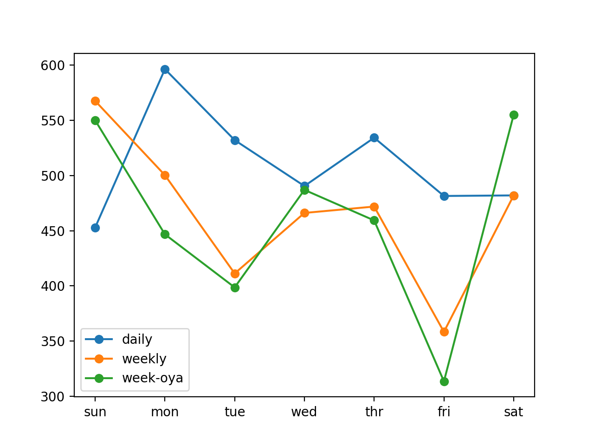

### How to Develop Naive Models for Multi-step Energy Usage Forecasting

Given the rise of smart electricity meters and the wide adoption of electricity generation
technology like solar panels, there is a wealth of electricity usage data available. This data
represents a multivariate time series of power-related variables that in turn could be used to
model and even forecast future electricity consumption. In this tutorial, you will discover how to
develop a test harness for theHousehold Power Consumptiondataset and evaluate three naive
forecast strategies that provide a baseline for more sophisticated algorithms. After completing
this tutorial, you will know:

- How to load, prepare, and downsample the household power consumption dataset ready
for developing models.

- How to develop metrics, dataset split, and walk-forward validation elements for a robust
test harness for evaluating forecasting models.

- How to develop and evaluate and compare the performance a suite of naive persistence
forecasting methods.

Let’s get started.

#### Tutorial Overview

This tutorial is divided into four parts; they are:

1.  Problem Description
2.  Load and Prepare Dataset
3.  Model Evaluation
4.  Develop Naive Forecast Models

#### Problem Description

TheHousehold Power Consumptiondataset is a multivariate time series dataset that describes
the electricity consumption for a single household over four years. The data was collected
between December 2006 and November 2010 and observations of power consumption within the
household were collected every minute. It is a multivariate series comprised of seven variables
(besides the date and time); they are:

- globalactivepower: The total active power consumed by the household
(kilowatts).

- globalreactivepower: The total reactive power consumed by the
household (kilowatts).

- voltage: Average voltage (volts).

- globalintensity: Average current intensity (amps).

- submetering 1 : Active energy for kitchen (watt-hours of active
energy).

- submetering 2 : Active energy for laundry (watt-hours of active
energy).

- submetering 3 : Active energy for climate control systems (watt-hours
of active energy).

Active and reactive energy refer to the technical details of alternative current. A fourth
sub-metering variable can be created by subtracting the sum of three defined sub-metering
variables from the total active energy. This dataset was introduced and analyzed in Chapter 16.
Refer to that chapter for more details if needed.

#### Load and Prepare Dataset

The dataset can be downloaded as a single 20 megabyte zip file. A direct download link is
provided blow:

- householdpowerconsumption.zip^1

Download the dataset and unzip it into your current working directory. You will now have
the filehouseholdpowerconsumption.txtthat is about 127 megabytes in size and contains
all of the observations. We can use thereadcsv() function to load the data and combine the
first two columns into a single date-time column that we can use as an index.

```
# load all data
dataset = read_csv('household_power_consumption.txt', sep=';', header=0, low_memory=False,
infer_datetime_format=True, parse_dates={'datetime':[0,1]}, index_col=['datetime'])

```

Next, we can mark all missing values indicated with a‘?’character with a NaN value, which
is a float. This will allow us to work with the data as one array of floating point values rather
than mixed types (less efficient.)

```
# mark all missing values
dataset.replace('?', nan, inplace=True)
# make dataset numeric
dataset = dataset.astype('float32')

```

We also need to fill in the missing values now that they have been marked. A very simple
approach would be to copy the observation from the same time the day before. We can implement
this in a function namedfillmissing() that will take the NumPy array of the data and copy
values from exactly 24 hours ago.

```
# fill missing values with a value at the same time one day ago
def fill_missing(values):
one_day = 60 * 24
for row in range(values.shape[0]):
for col in range(values.shape[1]):
if isnan(values[row, col]):
values[row, col] = values[row - one_day, col]

```
We can apply this function directly to the data within theDataFrame.

```
# fill missing
fill_missing(dataset.values)

```

Now we can create a new column that contains the remainder of the sub-metering, using the
calculation from the previous section.

```
# add a column for for the remainder of sub metering
values = dataset.values
dataset['sub_metering_4'] = (values[:,0] * 1000 / 60) - (values[:,4] + values[:,5] +
values[:,6])

```
We can now save the cleaned-up version of the dataset to a new file; in this case we will just
change the file extension to.csvand save the dataset ashouseholdpowerconsumption.csv.

```
# save updated dataset
dataset.to_csv('household_power_consumption.csv')

```

Tying all of this together, the complete example of loading, cleaning-up, and saving the
dataset is listed below.

```
# load and clean-up the power usage dataset
from numpy import nan
from numpy import isnan
from pandas import read_csv

# fill missing values with a value at the same time one day ago
def fill_missing(values):
one_day = 60 * 24


for row in range(values.shape[0]):
for col in range(values.shape[1]):
if isnan(values[row, col]):
values[row, col] = values[row - one_day, col]

# load all data
dataset = read_csv('household_power_consumption.txt', sep=';', header=0, low_memory=False,
infer_datetime_format=True, parse_dates={'datetime':[0,1]}, index_col=['datetime'])
# mark all missing values
dataset.replace('?', nan, inplace=True)
# make dataset numeric
dataset = dataset.astype('float32')
# fill missing
fill_missing(dataset.values)
# add a column for for the remainder of sub metering
values = dataset.values
dataset['sub_metering_4'] = (values[:,0] * 1000 / 60) - (values[:,4] + values[:,5] +
values[:,6])
# save updated dataset
dataset.to_csv('household_power_consumption.csv')

```

Running the example creates the new filehouseholdpowerconsumption.csvthat we can
use as the starting point for our modeling project.

#### Model Evaluation

In this section, we will consider how we can develop and evaluate predictive models for the
household power dataset. This section is divided into four parts; they are:

1.  Problem Framing
2.  Evaluation Metric
3.  Train and Test Sets
4.  Walk-Forward Validation

#### Problem Framing

There are many ways to harness and explore the household power
consumption dataset. In
this tutorial, we will use the data to explore a very specific question; that is: Given recent
power consumption, what is the expected power consumption for the week ahead? This requires
that a predictive model forecast the total active power for each day over the next seven days.

Technically, this framing of the problem is referred to as a multi-step
time series forecasting
problem, given the multiple forecast steps. A model that makes use of multiple input variables
may be referred to as a multivariate multi-step time series forecasting model.
A model of this type could be helpful within the household in planning expenditures. It
could also be helpful on the supply side for planning electricity demand for a specific household.

This framing of the dataset also suggests that it would be useful to
downsample the per-minute
observations of power consumption to daily totals. This is not required, but makes sense, given
that we are interested in total power per day. We can achieve this easily using theresample()
function on the PandasDataFrame. Calling this function with the argument‘D’allows the
loaded data indexed by date-time to be grouped by day (see all offset aliases). We can then
calculate the sum of all observations for each day and create a new dataset of daily power
consumption data for each of the eight variables. The complete example is listed below.

```

# resample minute data to total for each day for the power usage dataset
from pandas import read_csv
# load the new file
dataset = read_csv('household_power_consumption.csv', header=0, infer_datetime_format=True,
parse_dates=['datetime'], index_col=['datetime'])
# resample data to daily
daily_groups = dataset.resample('D')
daily_data = daily_groups.sum()
# summarize
print(daily_data.shape)
print(daily_data.head())
# save
daily_data.to_csv('household_power_consumption_days.csv')

```

Running the example creates a new daily total power consumption dataset and saves the
result into a separate file namedhouseholdpowerconsumptiondays.csv. We can use this as
the dataset for fitting and evaluating predictive models for the chosen framing of the problem.

#### Evaluation Metric

A forecast will be comprised of seven values, one for each day of the
week ahead. It is common
with multi-step forecasting problems to evaluate each forecasted time
step separately. This is
helpful for a few reasons:

- To comment on the skill at a specific lead time (e.g. +1 day vs +3
days).

- To contrast models based on their skills at different lead times (e.g. models good at +1
day vs models good at days +5).

The units of the total power are kilowatts and it would be useful to have an error metric
that was also in the same units. Both Root Mean Squared Error (RMSE) and Mean Absolute
Error (MAE) fit this bill, although RMSE is more commonly used and will be adopted in this
tutorial. Unlike MAE, RMSE is more punishing of forecast errors. The performance metric
for this problem will be the RMSE for each lead time from day 1 to day 7. As a short-cut, it
may be useful to summarize the performance of a model using a single score in order to aide in
model selection. One possible score that could be used would be the RMSE across all forecast
days. The functionevaluateforecasts()below will implement this behavior and return the
performance of a model based on multiple seven-day forecasts.

```

# evaluate one or more weekly forecasts against expected values
def evaluate_forecasts(actual, predicted):
scores = list()
# calculate an RMSE score for each day


for i in range(actual.shape[1]):
# calculate mse
mse = mean_squared_error(actual[:, i], predicted[:, i])
# calculate rmse
rmse = sqrt(mse)
# store
scores.append(rmse)
# calculate overall RMSE
s = 0
for row in range(actual.shape[0]):
for col in range(actual.shape[1]):
s += (actual[row, col] - predicted[row, col])**2
score = sqrt(s / (actual.shape[0] * actual.shape[1]))
return score, scores

```

Running the function will first return the overall RMSE regardless of day, then an array of
RMSE scores for each day.

#### Train and Test Sets

We will use the first three years of data for training predictive models
and the final year for
evaluating models. The data in a given dataset will be divided into
standard weeks. These are
weeks that begin on a Sunday and end on a Saturday. This is a realistic
and useful way for
using the chosen framing of the model, where the power consumption for the week ahead can
be predicted. It is also helpful with modeling, where models can be used to predict a specific
day (e.g. Wednesday) or the entire sequence.
We will split the data into standard weeks, working backwards from the test dataset. The
final year of the data is in 2010 and the first Sunday for 2010 was January 3rd. The data ends
in mid November 2010 and the closest final Saturday in the data is November 20th. This gives
46 weeks of test data. The first and last rows of daily data for the
test dataset are provided
below for confirmation.

```

2010-01-03,2083.4539999999984,191.61000000000055,350992.12000000034,8703.600000000033,...
...
2010-11-20,2197.006000000004,153.76800000000028,346475.9999999998,9320.20000000002,...

```

The daily data starts in late 2006. The first Sunday in the dataset is December 17th, which
is the second row of data. Organizing the data into standard weeks gives 159 full standard
weeks for training a predictive model.


```

2006-12-17,3390.46,226.0059999999994,345725.32000000024,14398.59999999998,2033.0,4187.0,...
...
2010-01-02,1309.2679999999998,199.54600000000016,352332.8399999997,5489.7999999999865,...

```

The function splitdataset()below splits the daily data into train and test sets and
organizes each into standard weeks. Specific row offsets are used to split the data using
knowledge of the dataset. The split datasets are then organized into weekly data using the
NumPysplit() function.


```

# split a univariate dataset into train/test sets
def split_dataset(data):
# split into standard weeks
train, test = data[1:-328], data[-328:-6]
# restructure into windows of weekly data
train = array(split(train, len(train)/7))
test = array(split(test, len(test)/7))
return train, test

```

We can test this function out by loading the daily dataset and printing the first and last
rows of data from both the train and test sets to confirm they match the expectations above.

The complete code example is listed below.

```

# split the power usage dataset into standard weeks
from numpy import split
from numpy import array
from pandas import read_csv

# split a univariate dataset into train/test sets
def split_dataset(data):
# split into standard weeks
train, test = data[1:-328], data[-328:-6]
# restructure into windows of weekly data
train = array(split(train, len(train)/7))
test = array(split(test, len(test)/7))
return train, test

# load the new file
dataset = read_csv('household_power_consumption_days.csv', header=0,
infer_datetime_format=True, parse_dates=['datetime'], index_col=['datetime'])
train, test = split_dataset(dataset.values)
# validate train data
print(train.shape)
print(train[0, 0, 0], train[-1, -1, 0])
# validate test
print(test.shape)
print(test[0, 0, 0], test[-1, -1, 0])

```
Running the example shows that indeed the train dataset has 159 weeks of data, whereas
the test dataset has 46 weeks. We can see that the total active power for the train and test
dataset for the first and last rows match the data for the specific dates that we defined as the
bounds on the standard weeks for each set.

```

(159, 7, 8)
3390.46 1309.2679999999998
(46, 7, 8)
2083.4539999999984 2197.006000000004

```


#### Walk-Forward Validation

Models will be evaluated using a scheme called walk-forward validation. This is where a model
is required to make a one week prediction, then the actual data for that week is made available
to the model so that it can be used as the basis for making a prediction on the subsequent week.

This is both realistic for how the model may be used in practice and
beneficial to the models
allowing them to make use of the best available data. We can demonstrate this below with
separation of input data and output/predicted data.

```

Input, Predict
[Week1] Week2
[Week1 + Week2] Week3
[Week1 + Week2 + Week3] Week4
...

```
The walk-forward validation approach to evaluating predictive models on this dataset is
implement below, namedevaluatemodel(). The name of a function is provided for the model
as the argumentmodelfunc. This function is responsible for defining the model, fitting the
model on the training data, and making a one-week forecast. The forecasts made by the model
are then evaluated against the test dataset using the previously definedevaluateforecasts()
function.
```

# evaluate a single model
def evaluate_model(model_func, train, test):
# history is a list of weekly data
history = [x for x in train]
# walk-forward validation over each week
predictions = list()
for i in range(len(test)):
# predict the week
yhat_sequence = model_func(history)
# store the predictions
predictions.append(yhat_sequence)
# get real observation and add to history for predicting the next week
history.append(test[i, :])
predictions = array(predictions)
# evaluate predictions days for each week
score, scores = evaluate_forecasts(test[:, :, 0], predictions)
return score, scores

```
Once we have the evaluation for a model, we can summarize the performance. The function
below namedsummarizescores()will display the performance of a model as a single line for
easy comparison with other models.

```

# summarize scores
def summarize_scores(name, score, scores):
s_scores = ','.join(['%.1f' % s for s in scores])
print('%s: [%.3f] %s'% (name, score, s_scores))

```
We now have all of the elements to begin evaluating predictive models on
the dataset.


#### Develop Naive Forecast Models

It is important to test naive forecast models on any new prediction problem. The results from
naive models provide a quantitative idea of how difficult the forecast problem is and provide a
baseline performance by which more sophisticated forecast methods can be evaluated. In this
section, we will develop and compare three naive forecast methods for the household power
prediction problem; they are:

1.  Daily Persistence Forecast.
2.  Weekly Persistent Forecast.
3.  Weekly One-Year-Ago Persistent Forecast.

For more information on simple forecast strategies generally, see
Chapter 5.

#### Daily Persistence Forecast

The first naive forecast that we will develop is a daily persistence
model. This model takes

the active power from the last day prior to the forecast period (e.g. Saturday) and uses it
as the value of the power for each day in the forecast period (Sunday to Saturday). The
dailypersistence() function below implements the daily persistence forecast strategy.

```

# daily persistence model
def daily_persistence(history):
# get the data for the prior week
last_week = history[-1]
# get the total active power for the last day
value = last_week[-1, 0]
# prepare 7 day forecast
forecast = [value for _ in range(7)]
return forecast

```
#### Weekly Persistent Forecast

Another good naive forecast when forecasting a standard week is to use
the entire prior week
as the forecast for the week ahead. It is based on the idea that next week will be very similar
to this week. Theweeklypersistence() function below implements the weekly persistence
forecast strategy.

```

# weekly persistence model
def weekly_persistence(history):
# get the data for the prior week
last_week = history[-1]
return last_week[:, 0]

```

#### Weekly One-Year-Ago Persistent Forecast

Similar to the idea of using last week to forecast next week is the idea of using the same week
last year to predict next week. That is, use the week of observations from 52 weeks ago as the
forecast, based on the idea that next week will be similar to the same week one year ago. The
weekoneyearagopersistence() function below implements the week one year
ago forecast strategy.

```

# week one year ago persistence model
def week_one_year_ago_persistence(history):
# get the data for the prior week
last_week = history[-52]
return last_week[:, 0]

```

#### Naive Model Comparison

We can compare each of the forecast strategies using the test harness
developed in the previous
section. First, the dataset can be loaded and split into train and test sets.

```

# load the new file
dataset = read_csv('household_power_consumption_days.csv', header=0,
infer_datetime_format=True, parse_dates=['datetime'], index_col=['datetime'])
# split into train and test
train, test = split_dataset(dataset.values)

```
Each of the strategies can be stored in a dictionary against a unique name. This name can
be used in printing and in creating a plot of the scores.

```
# define the names and functions for the models we wish to evaluate
models = dict()
models['daily'] = daily_persistence
models['weekly'] = weekly_persistence
models['week-oya'] = week_one_year_ago_persistence

```

We can then enumerate each of the strategies, evaluating it using walk-forward validation,
printing the scores, and adding the scores to a line plot for visual comparison.

```
# evaluate each model
days = ['sun','mon', 'tue','wed','thr', 'fri','sat']
for name, func in models.items():
# evaluate and get scores
score, scores = evaluate_model(func, train, test)
# summarize scores
summarize_scores('daily persistence', score, scores)
# plot scores
pyplot.plot(days, scores, marker='o', label=name)

```

Tying all of this together, the complete example evaluating the three naive forecast strategies
is listed below.

```

from math import sqrt
from numpy import split
from numpy import array
from pandas import read_csv
from sklearn.metrics import mean_squared_error
from matplotlib import pyplot

def split_dataset(data):

train, test = data[1:-328], data[-328:-6]

train = array(split(train, len(train)/7))
test = array(split(test, len(test)/7))
return train, test

def evaluate_forecasts(actual, predicted):
scores = list()

for i in range(actual.shape[1]):
mse = mean_squared_error(actual[:, i], predicted[:, i])
rmse = sqrt(mse)
scores.append(rmse)

s = 0
for row in range(actual.shape[0]):
for col in range(actual.shape[1]):
s += (actual[row, col] - predicted[row, col])**2
score = sqrt(s / (actual.shape[0] * actual.shape[1]))
return score, scores

def summarize_scores(name, score, scores):
s_scores = ','.join(['%.1f' % s for s in scores])
print('%s: [%.3f] %s'% (name, score, s_scores))

def evaluate_model(model_func, train, test):

history = [x for x in train]

predictions = list()
for i in range(len(test)):

yhat_sequence = model_func(history)

predictions.append(yhat_sequence)

history.append(test[i, :])
predictions = array(predictions)


# evaluate predictions days for each week
score, scores = evaluate_forecasts(test[:, :, 0], predictions)
return score, scores

# daily persistence model
def daily_persistence(history):
# get the data for the prior week
last_week = history[-1]
# get the total active power for the last day
value = last_week[-1, 0]
# prepare 7 day forecast
forecast = [value for _ in range(7)]
return forecast

# weekly persistence model
def weekly_persistence(history):
# get the data for the prior week
last_week = history[-1]
return last_week[:, 0]

# week one year ago persistence model
def week_one_year_ago_persistence(history):
# get the data for the prior week
last_week = history[-52]
return last_week[:, 0]

# load the new file
dataset = read_csv('household_power_consumption_days.csv', header=0,
infer_datetime_format=True, parse_dates=['datetime'], index_col=['datetime'])
# split into train and test
train, test = split_dataset(dataset.values)
# define the names and functions for the models we wish to evaluate
models = dict()
models['daily'] = daily_persistence
models['weekly'] = weekly_persistence
models['week-oya'] = week_one_year_ago_persistence
# evaluate each model
days = ['sun','mon', 'tue','wed','thr', 'fri','sat']
for name, func in models.items():
# evaluate and get scores
score, scores = evaluate_model(func, train, test)
# summarize scores
summarize_scores(name, score, scores)
# plot scores
pyplot.plot(days, scores, marker='o', label=name)
# show plot
pyplot.legend()
pyplot.show()

```

Running the example first prints the total and daily scores for each model. We can see that
the weekly strategy performs better than the daily strategy and that the week one year ago
(week-oya) performs slightly better again. We can see this in both the
overall RMSE scores for
each model and in the daily scores for each forecast day. One exception
is the forecast error for
the first day (Sunday) where it appears that the daily persistence model performs better than
the two weekly strategies. We can use the week-oya strategy with an overall RMSE of 465.294
kilowatts as the baseline in performance for more sophisticated models to be considered skillful
on this specific framing of the problem.

```

daily: [511.886] 452.9, 596.4, 532.1, 490.5, 534.3, 481.5, 482.0
weekly: [469.389] 567.6, 500.3, 411.2, 466.1, 471.9, 358.3, 482.0
week-oya: [465.294] 550.0, 446.7, 398.6, 487.0, 459.3, 313.5, 555.1

```

A line plot of the daily forecast error is also created. We can see the same observed pattern
of the weekly strategies performing better than the daily strategy in general, except in the
case of the first day. It is surprising (to me) that the week one-year-ago performs better than
using the prior week. I would have expected that the power consumption from last week to be
more relevant. Reviewing all strategies on the same plot suggests possible combinations of the
strategies that may result in even better performance.



#### Extensions

This section lists some ideas for extending the tutorial that you may
wish to explore.

- Additional Naive Strategy. Propose, develop, and evaluate one more naive strategy
for forecasting the next week of power consumption.

- Naive Ensemble Strategy. Develop an ensemble strategy that combines the predictions
from the three proposed naive forecast methods.

- Optimized Direct Persistence Models. Test and find the optimal relative prior day
(e.g. -1 or -7) to use for each forecast day in a direct persistence model.


#### Further Reading

This section provides more resources on the topic if you are looking to
go deeper.

- pandas.readcsvAPI.
https://pandas.pydata.org/pandas-docs/stable/generated/pandas.read_csv.html

- numpy.splitAPI.
https://docs.scipy.org/doc/numpy/reference/generated/numpy.split.html

- pandas.DataFrame.resampleAPI.
https://pandas.pydata.org/pandas-docs/stable/generated/pandas.DataFrame.resample.
html

- Resample Offset Aliases.
http://pandas.pydata.org/pandas-docs/stable/timeseries.html#offset-aliases

- sklearn.metrics.meansquarederrorAPI.
http://scikit-learn.org/stable/modules/generated/sklearn.metrics.mean_squared_
error.html

#### Summary

In this tutorial, you discovered how to develop a test harness for the household power consumption
dataset and evaluate three naive forecast strategies that provide a baseline for more sophisticated
algorithms. Specifically, you learned:

- How to load, prepare, and downsample the household power consumption dataset ready
for modeling.

- How to develop metrics, dataset split, and walk-forward validation elements for a robust
test harness for evaluating forecasting models.

- How to develop and evaluate and compare the performance a suite of naive persistence
forecasting methods.

#### Next

In the next lab, you will discover how to develop autoregressive models for forecasting the
household power usage problem.
