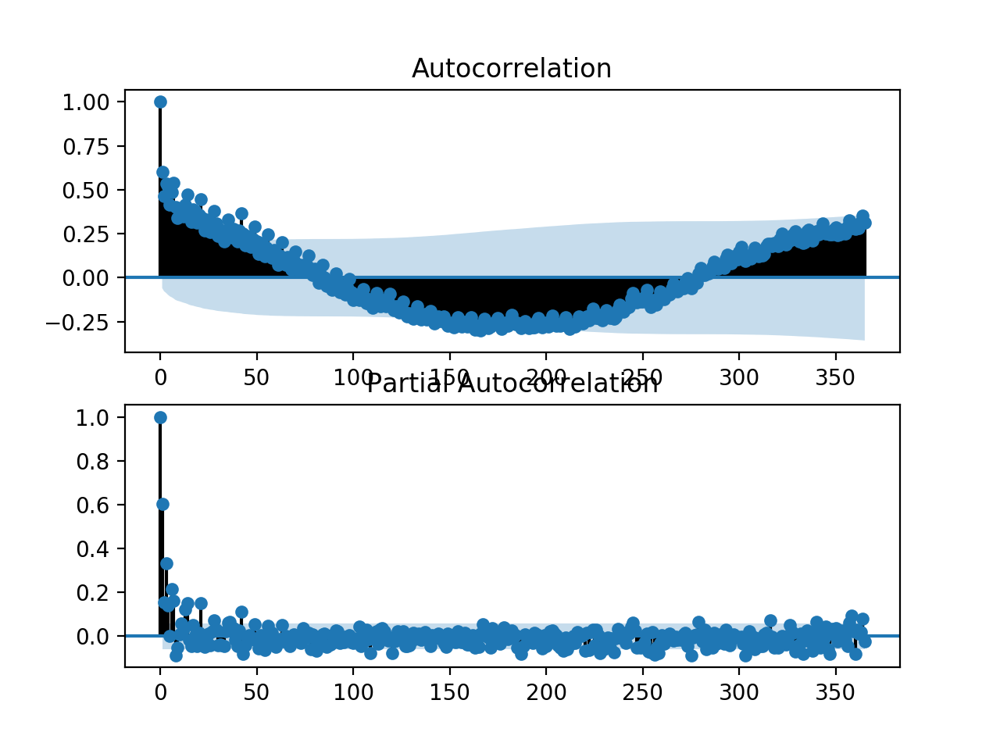
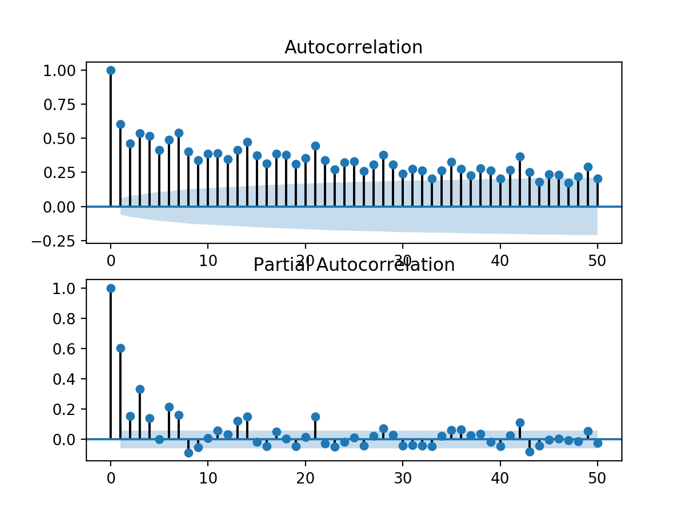
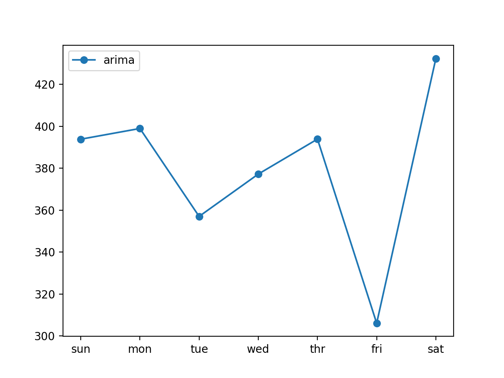

### How to Develop ARIMA Models for Multi-step Energy Usage Forecasting

Given the rise of smart electricity meters and the wide adoption of electricity generation
technology like solar panels, there is a wealth of electricity usage data available. This data
represents a multivariate time series of power-related variables that in turn could be used to
model and even forecast future electricity consumption. Autocorrelation models are very simple
and can provide a fast and effective way to make skillful one-step and multi-step forecasts for
electricity consumption. In this tutorial, you will discover how to develop and evaluate an
autoregression model for multi-step forecasting household power consumption. After completing
this tutorial, you will know:

- How to create and analyze autocorrelation and partial autocorrelation plots for univariate
time series data.

- How to use the findings from autocorrelation plots to configure an
autoregression model.

- How to develop and evaluate an autocorrelation model used to make
one-week forecasts.

Let’s get started.

#### Tutorial Overview

This tutorial is divided into five parts; they are:

1.  Problem Description
2.  Load and Prepare Dataset
3.  Model Evaluation
4.  Autocorrelation Analysis
5.  Develop an Autoregressive Model

#### Problem Description

TheHousehold Power Consumptiondataset is a multivariate time series dataset that describes
the electricity consumption for a single household over four years. The data was collected
between December 2006 and November 2010 and observations of power consumption within the
household were collected every minute. It is a multivariate series comprised of seven variables

(besides the date and time); they are:

- globalactivepower: The total active power consumed by the household
(kilowatts).

- globalreactivepower: The total reactive power consumed by the
household (kilowatts).

- voltage: Average voltage (volts).

- globalintensity: Average current intensity (amps).

- submetering 1 : Active energy for kitchen (watt-hours of active
energy).

- submetering 2 : Active energy for laundry (watt-hours of active
energy).

- submetering 3 : Active energy for climate control systems (watt-hours
of active energy).

Active and reactive energy refer to the technical details of alternative current. A fourth
sub-metering variable can be created by subtracting the sum of three defined sub-metering
variables from the total active energy. This dataset was introduced and analyzed in Chapter 16.
Refer to that chapter for more details if needed.

#### Load and Prepare Dataset

We will use the same framework to load and prepare the data as was used for the naive models.
In the interest of brevity, refer to Chapter 17 for the details on how to load and prepare the
dataset for modeling.

#### Model Evaluation

We will use the same framework to evaluate models as was used for the naive models. In
the interest of brevity, refer to Chapter 17 for the details on how to develop a framework for
evaluating forecasts for this dataset.

#### Autocorrelation Analysis

Statistical correlation summarizes the strength of the relationship between two variables. We
can assume the distribution of each variable fits a Gaussian (bell curve) distribution. If this is
the case, we can use the Pearson’s correlation coefficient to summarize the correlation between
the variables. The Pearson’s correlation coefficient is a number between -1 and 1 that describes
a negative or positive correlation respectively. A value of zero indicates no correlation.


We can calculate the correlation for time series observations with observations with previous
time steps, called lags. Because the correlation of the time series observations is calculated with
values of the same series at previous times, this is called a serial
correlation, or an autocorrelation.

A plot of the autocorrelation of a time series by lag is called the
AutoCorrelation Function, or the
acronym ACF. This plot is sometimes called a correlogram, or an autocorrelation plot. A partial
autocorrelation function or PACF is a summary of the relationship between an observation
in a time series with observations at prior time steps with the relationships of intervening
observations removed.
The autocorrelation for an observation and an observation at a prior time step is comprised
of both the direct correlation and indirect correlations. These indirect correlations are a linear
function of the correlation of the observation, with observations at intervening time steps. It is
these indirect correlations that the partial autocorrelation function seeks to remove. Without
going into the math, this is the intuition for the partial autocorrelation. We can calculate auto-
correlation and partial autocorrelation plots using theplotacf()andplotpacf()Statsmodels
functions respectively.
In order to calculate and plot the autocorrelation, we must convert the data into a univariate
time series. Specifically, the observed daily total power consumed. Thetoseries() function
below will take the multivariate data divided into weekly windows and will return a single
univariate time series.

```

# convert windows of weekly multivariate data into a series of total power
def to_series(data):
# extract just the total power from each week
series = [week[:, 0] for week in data]
# flatten into a single series
series = array(series).flatten()
return series

```
We can call this function for the prepared training dataset. First, the daily power consumption
dataset must be loaded.

```

# load the new file
dataset = read_csv('household_power_consumption_days.csv', header=0,
infer_datetime_format=True, parse_dates=['datetime'], index_col=['datetime'])

```
The dataset must then be split into train and test sets with the standard week window
structure.

```

# split into train and test
train, test = split_dataset(dataset.values)

```

A univariate time series of daily power consumption can then be extracted from the training
dataset.

```
# convert training data into a series
series = to_series(train)

```

We can then create a single figure that contains both an ACF and a PACF plot. The number
of lag time steps can be specified. We will fix this to be one year of daily observations, or 365
days.

```

# plots
pyplot.figure()
lags = 365
# acf
axis = pyplot.subplot(2, 1, 1)
plot_acf(series, ax=axis, lags=lags)
# pacf
axis = pyplot.subplot(2, 1, 2)
plot_pacf(series, ax=axis, lags=lags)
# show plot
pyplot.show()

```
The complete example is listed below.

``` We would expect that the power consumed tomorrow
and in the coming week will be dependent upon the power consumed in the prior days. As such,

we would expect to see a strong autocorrelation signal in the ACF and
PACF plots.

# acf and pacf plots of total power usage
from numpy import split
from numpy import array
from pandas import read_csv
from matplotlib import pyplot
from statsmodels.graphics.tsaplots import plot_acf
from statsmodels.graphics.tsaplots import plot_pacf

# split a univariate dataset into train/test sets
def split_dataset(data):
# split into standard weeks
train, test = data[1:-328], data[-328:-6]
# restructure into windows of weekly data
train = array(split(train, len(train)/7))
test = array(split(test, len(test)/7))
return train, test

# convert windows of weekly multivariate data into a series of total power
def to_series(data):
# extract just the total power from each week
series = [week[:, 0] for week in data]
# flatten into a single series
series = array(series).flatten()
return series

# load the new file
dataset = read_csv('household_power_consumption_days.csv', header=0,
infer_datetime_format=True, parse_dates=['datetime'], index_col=['datetime'])
# split into train and test
train, test = split_dataset(dataset.values)
# convert training data into a series
series = to_series(train)
# plots
pyplot.figure()


lags = 365
# acf
axis = pyplot.subplot(2, 1, 1)
plot_acf(series, ax=axis, lags=lags)
# pacf
axis = pyplot.subplot(2, 1, 2)
plot_pacf(series, ax=axis, lags=lags)
# show plot
pyplot.show()

```

Running the example creates a single figure with both ACF and PACF
plots. The plots are
very dense, and hard to read. Nevertheless, we might be able to see a
familiar autoregression
pattern. We might also see some significant lag observations at one year out. Further investigation
may suggest a seasonal autocorrelation component, which would not be a surprising finding.



We can zoom in the plot and change the number of lag observations from 365 to 50.
```

lags = 50

```


Re-running the code example with this change results is a zoomed-in version of the plots
with much less clutter. We can clearly see a familiar autoregression
pattern across the two plots.

This pattern is comprised of two elements:

- ACF: A large number of significant lag observations that slowly degrade as the lag
increases.

- PACF: A few significant lag observations that abruptly drop as the lag
increases.

The ACF plot indicates that there is a strong autocorrelation component, whereas the PACF
plot indicates that this component is distinct for the first approximately seven lag observations.
This suggests that a good starting model would be anAR(7); that is an
autoregression model
with seven lag observations used as input.



#### Develop an Autoregressive Model

We can develop an autoregression model for univariate series of daily
power consumption. For
more information on autoregressive models see Chapter 5. The Statsmodels library provides
multiple ways of developing an AR model, such as using the AR, ARMA, ARIMA, and SARIMAX
classes. For more information on developing SARIMAX models with the Statsmodels library,
see Chapter 13. We will use the ARIMA implementation as it allows for easy expandability into
differencing and moving average. First, the history data comprised of weeks of prior observations
must be converted into a univariate time series of daily power consumption. We can use the
toseries() function developed in the previous section.

```

# convert history into a univariate series
series = to_series(history)

```

Next, an ARIMA model can be defined by passing arguments to the constructor of the
ARIMA class. We will specify anAR(7)model, which in ARIMA notation
is ARIMA(7,0,0).

```

# define the model
model = ARIMA(series, order=(7,0,0))

```
Next, the model can be fit on the training data. We will use the defaults and disable all
debugging information during the fit by setting disp=False.
```

# fit the model
model_fit = model.fit(disp=False)

```
Now that the model has been fit, we can make a prediction. A prediction can be made by
calling thepredict() function and passing it either an interval of dates or indices relative to
the training data. We will use indices starting with the first time step beyond the training data
and extending it six more days, giving a total of a seven day forecast period beyond the training
dataset.

```

# make forecast
yhat = model_fit.predict(len(series), len(series)+6)

```

We can wrap all of this up into a function below namedarimaforecast() that takes the
history and returns a one week forecast.

```

# arima forecast
def arima_forecast(history):
# convert history into a univariate series
series = to_series(history)
# define the model
model = ARIMA(series, order=(7,0,0))
# fit the model
model_fit = model.fit(disp=False)
# make forecast
yhat = model_fit.predict(len(series), len(series)+6)
return yhat

```

This function can be used directly in the test harness described previously. The complete
example is listed below.

```


from math import sqrt
from numpy import split
from numpy import array
from pandas import read_csv
from sklearn.metrics import mean_squared_error
from matplotlib import pyplot
from statsmodels.tsa.arima_model import ARIMA

def split_dataset(data):

train, test = data[1:-328], data[-328:-6]

train = array(split(train, len(train)/7))
test = array(split(test, len(test)/7))
return train, test

def evaluate_forecasts(actual, predicted):
scores = list()

for i in range(actual.shape[1]):
mse = mean_squared_error(actual[:, i], predicted[:, i])
rmse = sqrt(mse)
scores.append(rmse)

s = 0
for row in range(actual.shape[0]):
for col in range(actual.shape[1]):
s += (actual[row, col] - predicted[row, col])**2
score = sqrt(s / (actual.shape[0] * actual.shape[1]))
return score, scores

def summarize_scores(name, score, scores):
s_scores = ','.join(['%.1f' % s for s in scores])
print('%s: [%.3f] %s'% (name, score, s_scores))

def evaluate_model(model_func, train, test):

history = [x for x in train]

predictions = list()
for i in range(len(test)):

yhat_sequence = model_func(history)

predictions.append(yhat_sequence)

history.append(test[i, :])


predictions = array(predictions)
# evaluate predictions days for each week
score, scores = evaluate_forecasts(test[:, :, 0], predictions)
return score, scores

# convert windows of weekly multivariate data into a series of total power
def to_series(data):
# extract just the total power from each week
series = [week[:, 0] for week in data]
# flatten into a single series
series = array(series).flatten()
return series

# arima forecast
def arima_forecast(history):
# convert history into a univariate series
series = to_series(history)
# define the model
model = ARIMA(series, order=(7,0,0))
# fit the model
model_fit = model.fit(disp=False)
# make forecast
yhat = model_fit.predict(len(series), len(series)+6)
return yhat

# load the new file
dataset = read_csv('household_power_consumption_days.csv', header=0,
infer_datetime_format=True, parse_dates=['datetime'], index_col=['datetime'])
# split into train and test
train, test = split_dataset(dataset.values)
# define the names and functions for the models we wish to evaluate
models = dict()
models['arima'] = arima_forecast
# evaluate each model
days = ['sun','mon', 'tue','wed','thr', 'fri','sat']
for name, func in models.items():
# evaluate and get scores
score, scores = evaluate_model(func, train, test)
# summarize scores
summarize_scores(name, score, scores)
# plot scores
pyplot.plot(days, scores, marker='o', label=name)
# show plot
pyplot.legend()
pyplot.show()

```

Running the example first prints the performance of theAR(7)model on the
test dataset.

We can see that the model achieves the overall RMSE of about 381
kilowatts. This model has
skill when compared to naive forecast models, such as a model that forecasts the week ahead
using observations from the same time one year ago that achieved an overall RMSE of about
465 kilowatts.

```

arima: [381.636] 393.8, 398.9, 357.0, 377.2, 393.9, 306.1, 432.2


```

A line plot of the forecast is also created, showing the RMSE in kilowatts for each of the
seven lead times of the forecast. We can see an interesting pattern. We might expect that
earlier lead times are easier to forecast than later lead times, as the error at each successive
lead time compounds. Instead, we see that Friday (lead time +6) is the easiest to forecast and
Saturday (lead time +7) is the most challenging to forecast. We can also see that the remaining
lead times all have a similar error in the mid- to high-300 kilowatt range.



#### Extensions

This section lists some ideas for extending the tutorial that you may
wish to explore.

- Tune ARIMA. The parameters of the ARIMA model were not tuned. Explore or search
a suite of ARIMA parameters (q, d, p) to see if performance can be further improved.

- Explore Seasonal AR. Explore whether the performance of the AR model can be
improved by including seasonal autoregression elements. This may require the use of a
SARIMA model.

- Explore ETS. Explore whether better results may be achieved by using an ETS model
instead of an ARIMA model.

- Explore Data Preparation. The model was fit on the raw data directly. Explore
whether standardization or normalization or even power transforms can further improve
the skill of the AR model.


#### Further Reading

This section provides more resources on the topic if you are looking to
go deeper.

- statsmodels.graphics.tsaplots.plotacfAPI.
http://www.statsmodels.org/dev/generated/statsmodels.graphics.tsaplots.plot_
acf.html

- statsmodels.graphics.tsaplots.plotpacfAPI.
http://www.statsmodels.org/dev/generated/statsmodels.graphics.tsaplots.plot_
pacf.html

- statsmodels.tsa.arimamodel.ARIMAAPI.
http://www.statsmodels.org/dev/generated/statsmodels.tsa.arima_model.ARIMA.
html

- statsmodels.tsa.arimamodel.ARIMAResultsAPI.
http://www.statsmodels.org/dev/generated/statsmodels.tsa.arima_model.ARIMAResults.
html

#### Summary

In this tutorial, you discovered how to develop and evaluate an autoregression model for
multi-step forecasting household power consumption. Specifically, you learned:

- How to create and analyze autocorrelation and partial autocorrelation plots for univariate
time series data.

- How to use the findings from autocorrelation plots to configure an
autoregression model.

- How to develop and evaluate an autocorrelation model used to make
one-week forecasts.

#### Next

In the next lab, you will discover how to develop Convolutional Neural Network models for
forecasting the household power usage problem.
