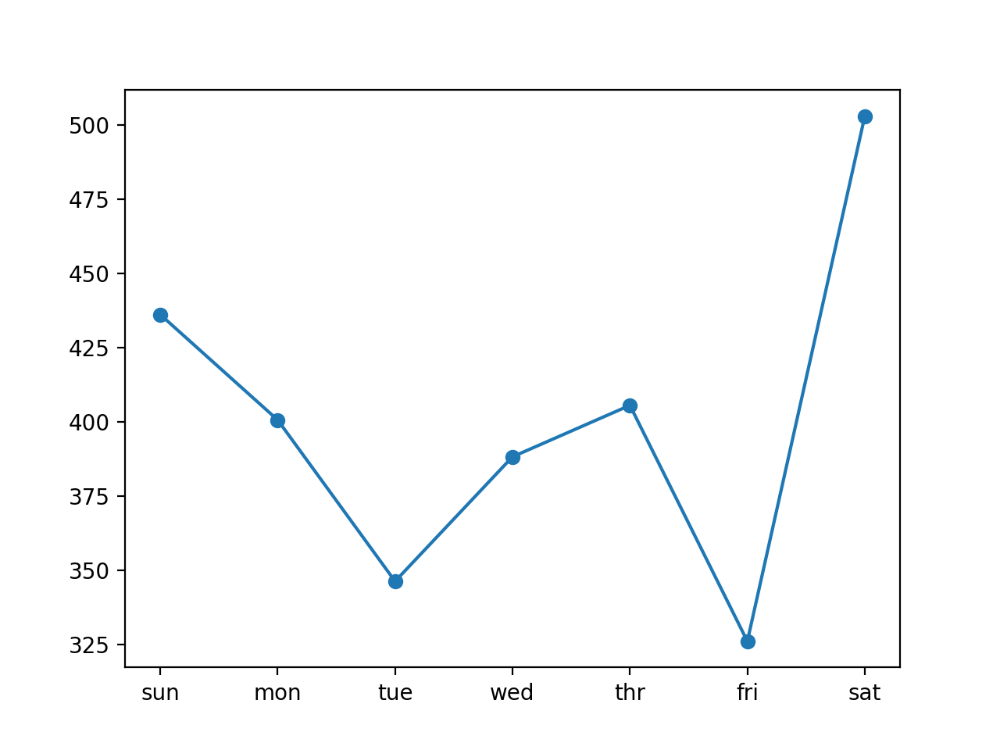
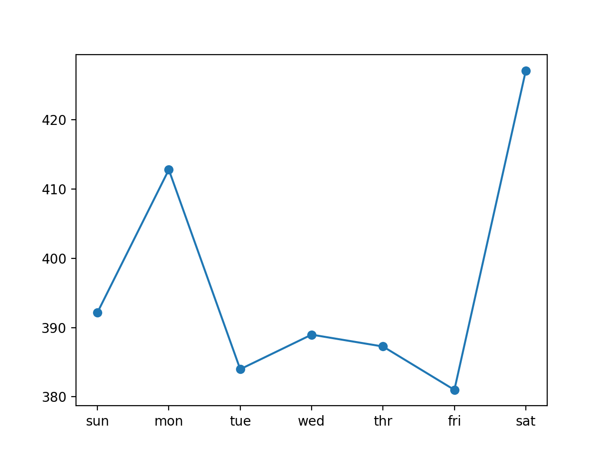
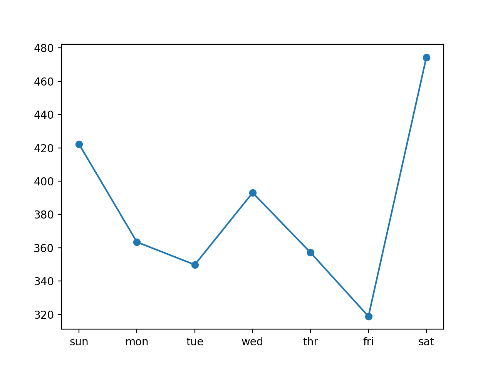
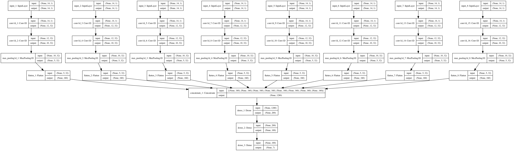
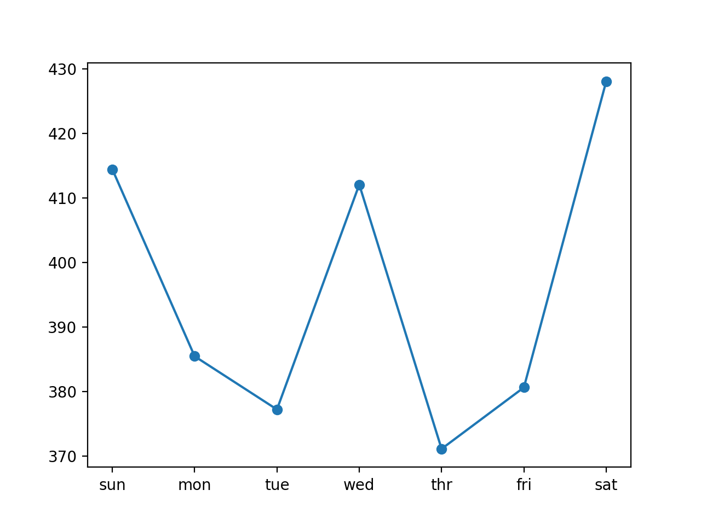

### How to Develop CNNs for Multi-step Energy Usage Forecasting

Given the rise of smart electricity meters and the wide adoption of electricity generation
technology like solar panels, there is a wealth of electricity usage data available. This data
represents a multivariate time series of power-related variables that in turn could be used
to model and even forecast future electricity consumption. Unlike other machine learning
algorithms, convolutional neural networks are capable of automatically learning features from
sequence data, support multiple-variate data, and can directly output a vector for multi-step
forecasting. As such, one-dimensional CNNs have been demonstrated to perform well and even
achieve state-of-the-art results on challenging sequence prediction problems. In this tutorial,
you will discover how to develop 1D convolutional neural networks for
multi-step time series
forecasting. After completing this tutorial, you will know:

- How to develop a CNN for multi-step time series forecasting model for
univariate data.

- How to develop a multi-channel multi-step time series forecasting model for multivariate
data.

- How to develop a multi-headed multi-step time series forecasting model for multivariate
data.

Let’s get started.

#### Tutorial Overview

This tutorial is divided into seven parts; they are:

1.  Problem Description
2.  Load and Prepare Dataset
3.  Model Evaluation
4.  CNNs for Multi-step Forecasting
5.  Univariate CNN Model
6.  Multi-channel CNN Model
7.  Multi-headed CNN Model

#### Problem Description

TheHousehold Power Consumptiondataset is a multivariate time series dataset that describes
the electricity consumption for a single household over four years. The data was collected
between December 2006 and November 2010 and observations of power consumption within the
household were collected every minute. It is a multivariate series comprised of seven variables

(besides the date and time); they are:

- globalactivepower: The total active power consumed by the household
(kilowatts).

- globalreactivepower: The total reactive power consumed by the
household (kilowatts).

- voltage: Average voltage (volts).

- globalintensity: Average current intensity (amps).

- submetering 1 : Active energy for kitchen (watt-hours of active
energy).

- submetering 2 : Active energy for laundry (watt-hours of active
energy).

- submetering 3 : Active energy for climate control systems (watt-hours
of active energy).

Active and reactive energy refer to the technical details of alternative current. A fourth
sub-metering variable can be created by subtracting the sum of three defined sub-metering
variables from the total active energy. This dataset was introduced and analyzed in Chapter 16.
Refer to that chapter for more details if needed.

#### Load and Prepare Dataset

We will use the same framework to load and prepare the data as was used for the naive models.
In the interest of brevity, refer to Chapter 17 for the details on how to load and prepare the
dataset for modeling.

#### Model Evaluation

We will use the same framework to evaluate models as was used for the naive models. In
the interest of brevity, refer to Chapter 17 for the details on how to develop a framework for
evaluating forecasts for this dataset. We must update the framework for model evaluation,
specifically the walk-forward validation method used to fit a CNN model and make a forecast.
The development of the new walk-forward validation framework follows in the next subsection.

Models will be evaluated using a scheme called walk-forward validation. This is where a model
is required to make a one week prediction, then the actual data for that week is made available
to the model so that it can be used as the basis for making a prediction on the subsequent week.
This is both realistic for how the model may be used in practice and beneficial to the models,
allowing them to make use of the best available data. We can demonstrate this below with
separation of input data and output/predicted data.

```

Input, Predict
[Week1] Week2
[Week1 + Week2] Week3
[Week1 + Week2 + Week3] Week4
...

```

The walk-forward validation approach to evaluating predictive models on this dataset is
provided below, namedevaluatemodel(). The train and test datasets in standard-week format
are provided to the function as arguments. An additional argument,ninput, is provided that
is used to define the number of prior observations that the model will use as input in order to
make a prediction. Two new functions are called: one to build a model from the training data
calledbuild_model()and another that uses the model to make forecasts for each new standard
week, calledforecast(). These will be covered in subsequent sections.
We are working with neural networks and as such they are generally slow to train but fast to
evaluate. This means that the preferred usage of the models is to build them once on historical
data and to use them to forecast each step of the walk-forward validation. The models are static
(i.e. not updated) during their evaluation. This is different to other
models that are faster to
train, where a model may be re-fit or updated each step of the walk-forward validation as new
data is made available. With sufficient resources, it is possible to use neural networks this way,
but we will not in this tutorial. The completeevaluatemodel() function is listed below.

```

# evaluate a single model
def evaluate_model(train, test, n_input):
# fit model
model = build_model(train, n_input)
# history is a list of weekly data
history = [x for x in train]
# walk-forward validation over each week
predictions = list()
for i in range(len(test)):
# predict the week
yhat_sequence = forecast(model, history, n_input)
# store the predictions
predictions.append(yhat_sequence)
# get real observation and add to history for predicting the next week
history.append(test[i, :])
# evaluate predictions days for each week
predictions = array(predictions)
score, scores = evaluate_forecasts(test[:, :, 0], predictions)
return score, scores

```

Once we have the evaluation for a model, we can summarize the performance. The function
below, namedsummarizescores(), will display the performance of a model as a single line for
easy comparison with other models.

```
# summarize scores
def summarize_scores(name, score, scores):
s_scores = ','.join(['%.1f' % s for s in scores])
print('%s: [%.3f] %s'% (name, score, s_scores))

```
We now have all of the elements to begin evaluating predictive models on
the dataset.

#### CNNs for Multi-step Forecasting

Convolutional Neural Network models, or CNNs for short, can be used for multi-step time series
forecasting. For more details on the use of CNNs for multi-step forecasting, see Chapter 8.
CNNs can be used in either a recursive or direct forecast strategy, where the model makes
one-step predictions and outputs are fed as inputs for subsequent predictions, and where one
model is developed for each time step to be predicted. Alternately, CNNs can be used to predict
the entire output sequence as a one-step prediction of the entire vector. This is a general benefit
of feedforward neural networks. An important secondary benefit of using CNNs is that they
can support multiple 1D inputs in order to make a prediction. This is useful if the multi-step
output sequence is a function of more than one input sequence. This can be achieved using two
different model configurations.

- Multiple Input Channels. This is where each input sequence is read as a separate
channel, like the different channels of an image (e.g. red, green and blue).

- Multiple Input Heads. This is where each input sequence is read by a different CNN
submodel and the internal representations are combined before being interpreted and used
to make a prediction.

In this tutorial, we will explore how to develop three different types of CNN models for
multi-step time series forecasting; they are:

- A CNN for multi-step time series forecasting with univariate input
data.

- A CNN for multi-step time series forecasting with multivariate input
data via channels.

- A CNN for multi-step time series forecasting with multivariate input
data via submodels.

The models will be developed and demonstrated on the household power
prediction problem.

A model is considered skillful if it achieves performance better than a
naive model, which is an
overall RMSE of about 465 kilowatts across a seven day forecast (for more details of the naive
model, see Chapter 17). We will not focus on the tuning of these models to achieve optimal
performance; instead we will sill stop short at skillful models as compared to a naive forecast.

The chosen structures and hyperparameters are chosen with a little trial
and error. Given the
stochastic nature of the models, it is good practice to evaluate a given model multiple times
and report the mean performance on a test dataset. In the interest of brevity and keeping the
code simple, we will instead present single-runs of models in this tutorial.


#### Univariate CNN Model

In this section, we will develop a convolutional neural network for multi-step time series
forecasting using only the univariate sequence of daily power consumption. Specifically, the
framing of the problem is:Given some number of prior days of total daily power consumption,
predict the next standard week of daily power consumption.The number of prior days used as
input defines the one-dimensional (1D) subsequence of data that the CNN will read and learn
to extract features. Some ideas on the size and nature of this input include:

- All prior days, up to years worth of data.

- The prior seven days.

- The prior two weeks.

- The prior one month.

- The prior one year.

- The prior week and the week to be predicted from one year ago.

There is no right answer; instead, each approach and more can be tested and the performance
of the model can be used to choose the nature of the input that results in the best model
performance. These choices define a few things about the implementation, such as:

- How the training data must be prepared in order to fit the model.

- How the test data must be prepared in order to evaluate the model.

- How to use the model to make predictions with a final model in the
future.

A good starting point would be to use the prior seven days. A 1D CNN model expects data
to have the shape of: [samples, timesteps, features]. One sample will be comprised of
seven time steps with one feature for the seven days of total daily power consumed. The training
dataset has 159 weeks of data, so the shape of the training dataset would be:[159, 7, 1].
This is a good start. The data in this format would use the prior standard week to predict
the next standard week. A problem is that 159 instances is not a lot for a neural network. A
way to create a lot more training data is to change the problem during
training to predict the
next seven days given the prior seven days, regardless of the standard week. This only impacts
the training data, the test problem remains the same: predict the daily power consumption for
the next standard week given the prior standard week. This will require a little preparation
of the training data. The training data is provided in standard weeks with eight variables,
specifically in the shape[159, 7, 8]. The first step is to flatten the data so that we have eight
time series sequences.

```
# flatten data
data = data.reshape((data.shape[0]*data.shape[1], data.shape[2]))

```

We then need to iterate over the time steps and divide the data into overlapping windows;
each iteration moves along one time step and predicts the subsequent seven days. For example:

```

Input, Output
[d01, d02, d03, d04, d05, d06, d07], [d08, d09, d10, d11, d12, d13, d14]
[d02, d03, d04, d05, d06, d07, d08], [d09, d10, d11, d12, d13, d14, d15]
...

```

We can do this by keeping track of start and end indexes for the inputs and outputs as we
iterate across the length of the flattened data in terms of time steps. We can also do this in a
way where the number of inputs and outputs are parameterized (e.g.
ninput,nout) so that
you can experiment with different values or adapt it for your own
problem. Below is a function
namedtosupervised() that takes a list of weeks (history) and the number of time steps to
use as inputs and outputs and returns the data in the overlapping moving window format.

```

# convert history into inputs and outputs
def to_supervised(train, n_input, n_out=7):
# flatten data
data = train.reshape((train.shape[0]*train.shape[1], train.shape[2]))
X, y = list(), list()
in_start = 0
# step over the entire history one time step at a time
for _ in range(len(data)):
# define the end of the input sequence
in_end = in_start + n_input
out_end = in_end + n_out
# ensure we have enough data for this instance
if out_end < len(data):
x_input = data[in_start:in_end, 0]
x_input = x_input.reshape((len(x_input), 1))
X.append(x_input)
y.append(data[in_end:out_end, 0])
# move along one time step
in_start += 1
return array(X), array(y)

```

When we run this function on the entire training dataset, we transform 159 samples into
1,099; specifically, the transformed dataset has the shapes X=[1099, 7,
1] and y=[1099, 7].

Next, we can define and fit the CNN model on the training data. This multi-step time series
forecasting problem is an autoregression. That means it is likely best modeled where that the
next seven days is some function of observations at prior time steps. This and the relatively
small amount of data means that a small model is required. We will use a model with one
convolution layer with 16 filters and a kernel size of 3. This means that the input sequence
of seven days will be read with a convolutional operation three time steps at a time and this
operation will be performed 16 times. A pooling layer will reduce these feature maps by^14 their
size before the internal representation is flattened to one long vector. 

This is then interpreted
by a fully connected layer before the output layer predicts the next seven days in the sequence.
We will use the mean squared error loss function as it is a good match for our chosen error
metric of RMSE. We will use the efficient Adam implementation of stochastic gradient descent
and fit the model for 20 epochs with a batch size of 4. The small batch size and the stochastic
nature of the algorithm means that the same model will learn a slightly different mapping of
inputs to outputs each time it is trained. This means results may vary when the model is
evaluated. You can try running the model multiple times and calculating an average of model
performance. The build_model()below prepares the training data, defines the model, and fits
the model on the training data, returning the fit model ready for making predictions.

```

# train the model
def build_model(train, n_input):
# prepare data
train_x, train_y = to_supervised(train, n_input)
# define parameters
verbose, epochs, batch_size = 0, 20, 4
n_timesteps, n_features, n_outputs = train_x.shape[1], train_x.shape[2], train_y.shape[1]
# define model
model = Sequential()
model.add(Conv1D(filters=16, kernel_size=3, activation='relu',
input_shape=(n_timesteps,n_features)))
model.add(MaxPooling1D(pool_size=2))
model.add(Flatten())
model.add(Dense(10, activation='relu'))
model.add(Dense(n_outputs))
model.compile(loss='mse', optimizer='adam')
# fit network
model.fit(train_x, train_y, epochs=epochs, batch_size=batch_size, verbose=verbose)
return model

```
Now that we know how to fit the model, we can look at how the model can be used to make
a prediction. Generally, the model expects data to have the same three dimensional shape when
making a prediction. In this case, the expected shape of an input pattern is one sample, seven
days of one feature for the daily power consumed:[1, 7, 1]. Data must have this shape when
making predictions for the test set and when a final model is being used to make predictions in
the future. If you change the number of input days to 14, then the shape of the training data
and the shape of new samples when making predictions must be changed accordingly to have 14
time steps. It is a modeling choice that you must carry forward when using the model.
We are using walk-forward validation to evaluate the model as described in the previous
section. This means that we have the observations available for the prior week in order to
predict the coming week. These are collected into an array of standard weeks, called history. In
order to predict the next standard week, we need to retrieve the last days of observations. As
with the training data, we must first flatten the history data to remove
the weekly structure so that we end up with eight parallel time series.

```

# flatten data
data = data.reshape((data.shape[0]*data.shape[1], data.shape[2]))

```

Next, we need to retrieve the last seven days of daily total power consumed (feature number
0). We will parameterize as we did for the training data so that the number of prior days used
as input by the model can be modified in the future.

```

# retrieve last observations for input data
input_x = data[-n_input:, 0]

```

Next, we reshape the input into the expected three-dimensional
structure.

```

input_x = input_x.reshape((1, len(input_x), 1))

```

We then make a prediction using the fit model and the input data and
retrieve the vector of seven days of output.

```
yhat = model.predict(input_x, verbose=0)

yhat = yhat[0]

```

The forecast() function below implements this and takes as arguments the
model fit on
the training dataset, the history of data observed so far, and the
number of inputs time steps
expected by the model.

```
def forecast(model, history, n_input):
data = array(history)
data = data.reshape((data.shape[0]*data.shape[1], data.shape[2]))

input_x = data[-n_input:, 0]

input_x = input_x.reshape((1, len(input_x), 1))

yhat = model.predict(input_x, verbose=0)

yhat = yhat[0]
return yhat

```

That’s it; we now have everything we need to make multi-step time series forecasts with
a CNN model on the daily total power consumed univariate dataset. We can
tie all of this together. The complete example is listed below.

```

from math import sqrt
from numpy import split
from numpy import array
from pandas import read_csv
from sklearn.metrics import mean_squared_error
from matplotlib import pyplot
from keras.models import Sequential
from keras.layers import Dense
from keras.layers import Flatten
from keras.layers.convolutional import Conv1D
from keras.layers.convolutional import MaxPooling1D

def split_dataset(data):


train, test = data[1:-328], data[-328:-6]
# restructure into windows of weekly data
train = array(split(train, len(train)/7))
test = array(split(test, len(test)/7))
return train, test

def evaluate_forecasts(actual, predicted):
scores = list()

for i in range(actual.shape[1]):
mse = mean_squared_error(actual[:, i], predicted[:, i])
rmse = sqrt(mse)
scores.append(rmse)

s = 0
for row in range(actual.shape[0]):
for col in range(actual.shape[1]):
s += (actual[row, col] - predicted[row, col])**2
score = sqrt(s / (actual.shape[0] * actual.shape[1]))
return score, scores

def summarize_scores(name, score, scores):
s_scores = ','.join(['%.1f' % s for s in scores])
print('%s: [%.3f] %s'% (name, score, s_scores))

def to_supervised(train, n_input, n_out=7):
data = train.reshape((train.shape[0]*train.shape[1], train.shape[2]))
X, y = list(), list()
in_start = 0

for _ in range(len(data)):

in_end = in_start + n_input
out_end = in_end + n_out

if out_end < len(data):
x_input = data[in_start:in_end, 0]
x_input = x_input.reshape((len(x_input), 1))
X.append(x_input)
y.append(data[in_end:out_end, 0])

in_start += 1
return array(X), array(y)

def build_model(train, n_input):
train_x, train_y = to_supervised(train, n_input)

verbose, epochs, batch_size = 0, 20, 4
n_timesteps, n_features, n_outputs = train_x.shape[1], train_x.shape[2], train_y.shape[1]
# define model
model = Sequential()
model.add(Conv1D(filters=16, kernel_size=3, activation='relu',
input_shape=(n_timesteps,n_features)))
model.add(MaxPooling1D(pool_size=2))
model.add(Flatten())
model.add(Dense(10, activation='relu'))
model.add(Dense(n_outputs))
model.compile(loss='mse', optimizer='adam')
# fit network
model.fit(train_x, train_y, epochs=epochs, batch_size=batch_size, verbose=verbose)
return model

def forecast(model, history, n_input):
data = array(history)
data = data.reshape((data.shape[0]*data.shape[1], data.shape[2]))

input_x = data[-n_input:, 0]

input_x = input_x.reshape((1, len(input_x), 1))

yhat = model.predict(input_x, verbose=0)

yhat = yhat[0]
return yhat

def evaluate_model(train, test, n_input):
model = build_model(train, n_input)

history = [x for x in train]

predictions = list()
for i in range(len(test)):

yhat_sequence = forecast(model, history, n_input)

predictions.append(yhat_sequence)

history.append(test[i, :])

predictions = array(predictions)
score, scores = evaluate_forecasts(test[:, :, 0], predictions)
return score, scores

dataset = read_csv('household_power_consumption_days.csv',
header=0,
infer_datetime_format=True, parse_dates=['datetime'],
index_col=['datetime'])

train, test = split_dataset(dataset.values)


n_input = 7
score, scores = evaluate_model(train, test, n_input)
# summarize scores
summarize_scores('cnn', score, scores)
# plot scores
days = ['sun','mon', 'tue','wed','thr', 'fri','sat']
pyplot.plot(days, scores, marker='o', label='cnn')
pyplot.show()

```

Running the example fits and evaluates the model, printing the overall RMSE across all
seven days, and the per-day RMSE for each lead time. We can see that in this case, the model

was skillful as compared to a naive forecast, achieving an overall RMSE
of about 404 kilowatts,

less than 465 kilowatts achieved by a naive model.

**Note:** Given the stochastic nature of the algorithm, your specific results may vary. Consider
running the example a few times.

```

cnn: [404.411] 436.1, 400.6, 346.2, 388.2, 405.5, 326.0, 502.9

```

A plot of the daily RMSE is also created. The plot shows that perhaps Tuesdays and Fridays
are easier days to forecast than the other days and that perhaps Saturday at the end of the
standard week is the hardest day to forecast.



We can increase the number of prior days to use as input from seven to
14 by changing the

ninputvariable.

n_input = 14

```

Re-running the example with this change first prints a summary of the performance of the
model. In this case, we can see a further drop in the overall RMSE, suggesting that further tuning
of the input size and perhaps the kernel size of the model may result in better performance.

**Note:** Given the stochastic nature of the algorithm, your specific
results may vary. Consider running the example a few times.

```

cnn: [396.497] 392.2, 412.8, 384.0, 389.0, 387.3, 381.0, 427.1

```

Comparing the per-day RMSE scores, we see some are better and some are worse than using
seventh inputs. This may suggest a benefit in using the two different sized inputs in some way,
such as an ensemble of the two approaches or perhaps a single model (e.g. a multi-headed
model) that reads the training data in different ways.



#### Multi-channel CNN Model

In this section, we will update the CNN developed in the previous section to use each of the
eight time series variables to predict the next standard week of daily total power consumption.
We will do this by providing each one-dimensional time series to the model as a separate channel
of input. The CNN will then use a separate kernel and read each input sequence onto a separate
set of filter maps, essentially learning features from each input time series variable. This is
helpful for those problems where the output sequence is some function of the observations
at prior time steps from multiple different features, not just (or including) the feature being
forecasted. It is unclear whether this is the case in the power consumption problem, but we can
explore it nonetheless. First, we must update the preparation of the training data to include all
of the eight features, not just the one total daily power consumed. It requires a single line:

# use all variables in input samples
X.append(data[in_start:in_end, :])

```
The completetosupervised() function with this change is listed below.

```
# convert history into inputs and outputs
def to_supervised(train, n_input, n_out=7):

# flatten data
data = train.reshape((train.shape[0]*train.shape[1], train.shape[2]))
X, y = list(), list()
in_start = 0
# step over the entire history one time step at a time
for _ in range(len(data)):
# define the end of the input sequence
in_end = in_start + n_input
out_end = in_end + n_out
# ensure we have enough data for this instance
if out_end < len(data):
X.append(data[in_start:in_end, :])
y.append(data[in_end:out_end, 0])
# move along one time step
in_start += 1
return array(X), array(y)

```

We also must update the function used to make forecasts with the fit model to use all eight
features from the prior time steps. Again, another small change:

```
input_x = data[-n_input:, :]

input_x = input_x.reshape((1, input_x.shape[0], input_x.shape[1]))

```

The completeforecast() with this change is listed below.

```

def forecast(model, history, n_input):
data = array(history)
data = data.reshape((data.shape[0]*data.shape[1], data.shape[2]))

input_x = data[-n_input:, :]

input_x = input_x.reshape((1, input_x.shape[0], input_x.shape[1]))

yhat = model.predict(input_x, verbose=0)

yhat = yhat[0]
return yhat

```

We will use 14 days of prior observations across eight of the input
variables as we did in the
final section of the prior section that resulted in slightly better
performance.

```
n_input = 14

```

Finally, the model used in the previous section does not perform well on this new framing
of the problem. The increase in the amount of data requires a larger and more sophisticated
model that is trained for longer. With a little trial and error, one model that performs well uses
two convolutional layers with 32 filter maps followed by pooling, then another convolutional
layer with 16 feature maps and pooling. The fully connected layer that interprets the features
is increased to 100 nodes and the model is fit for 70 epochs with a batch size of 16 samples.

The updated build_model() function that defines and fits the model on the
training dataset is listed below.

```
# train the model
def build_model(train, n_input):
# prepare data
train_x, train_y = to_supervised(train, n_input)
# define parameters
verbose, epochs, batch_size = 0, 70, 16
n_timesteps, n_features, n_outputs = train_x.shape[1], train_x.shape[2], train_y.shape[1]
# define model
model = Sequential()
model.add(Conv1D(filters=32, kernel_size=3, activation='relu',
input_shape=(n_timesteps,n_features)))
model.add(Conv1D(filters=32, kernel_size=3, activation='relu'))
model.add(MaxPooling1D(pool_size=2))
model.add(Conv1D(filters=16, kernel_size=3, activation='relu'))
model.add(MaxPooling1D(pool_size=2))
model.add(Flatten())
model.add(Dense(100, activation='relu'))
model.add(Dense(n_outputs))
model.compile(loss='mse', optimizer='adam')
# fit network
model.fit(train_x, train_y, epochs=epochs, batch_size=batch_size, verbose=verbose)
return model

```

We now have all of the elements required to develop a multi-channel CNN for multivariate
input data to make multi-step time series forecasts. The complete example is listed below.

```
# multichannel multi-step cnn for the power usage dataset
from math import sqrt
from numpy import split
from numpy import array
from pandas import read_csv
from sklearn.metrics import mean_squared_error
from matplotlib import pyplot
from keras.models import Sequential
from keras.layers import Dense
from keras.layers import Flatten
from keras.layers.convolutional import Conv1D
from keras.layers.convolutional import MaxPooling1D

# split a univariate dataset into train/test sets
def split_dataset(data):
# split into standard weeks
train, test = data[1:-328], data[-328:-6]
# restructure into windows of weekly data
train = array(split(train, len(train)/7))


test = array(split(test, len(test)/7))
return train, test

def evaluate_forecasts(actual, predicted):
scores = list()

for i in range(actual.shape[1]):
mse = mean_squared_error(actual[:, i], predicted[:, i])
rmse = sqrt(mse)
scores.append(rmse)

s = 0
for row in range(actual.shape[0]):
for col in range(actual.shape[1]):
s += (actual[row, col] - predicted[row, col])**2
score = sqrt(s / (actual.shape[0] * actual.shape[1]))
return score, scores

def summarize_scores(name, score, scores):
s_scores = ','.join(['%.1f' % s for s in scores])
print('%s: [%.3f] %s'% (name, score, s_scores))

def to_supervised(train, n_input, n_out=7):
data = train.reshape((train.shape[0]*train.shape[1], train.shape[2]))
X, y = list(), list()
in_start = 0

for _ in range(len(data)):

in_end = in_start + n_input
out_end = in_end + n_out

if out_end < len(data):
X.append(data[in_start:in_end, :])
y.append(data[in_end:out_end, 0])

in_start += 1
return array(X), array(y)

def build_model(train, n_input):
train_x, train_y = to_supervised(train, n_input)

verbose, epochs, batch_size = 0, 70, 16
n_timesteps, n_features, n_outputs = train_x.shape[1],
train_x.shape[2], train_y.shape[1]
model = Sequential()
model.add(Conv1D(filters=32, kernel_size=3, activation='relu',


input_shape=(n_timesteps,n_features)))
model.add(Conv1D(filters=32, kernel_size=3, activation='relu'))
model.add(MaxPooling1D(pool_size=2))
model.add(Conv1D(filters=16, kernel_size=3, activation='relu'))
model.add(MaxPooling1D(pool_size=2))
model.add(Flatten())
model.add(Dense(100, activation='relu'))
model.add(Dense(n_outputs))
model.compile(loss='mse', optimizer='adam')
# fit network
model.fit(train_x, train_y, epochs=epochs, batch_size=batch_size, verbose=verbose)
return model

def forecast(model, history, n_input):
data = array(history)
data = data.reshape((data.shape[0]*data.shape[1], data.shape[2]))

input_x = data[-n_input:, :]

input_x = input_x.reshape((1, input_x.shape[0], input_x.shape[1]))

yhat = model.predict(input_x, verbose=0)

yhat = yhat[0]
return yhat

def evaluate_model(train, test, n_input):
model = build_model(train, n_input)

history = [x for x in train]

predictions = list()
for i in range(len(test)):

yhat_sequence = forecast(model, history, n_input)

predictions.append(yhat_sequence)

history.append(test[i, :])

predictions = array(predictions)
score, scores = evaluate_forecasts(test[:, :, 0], predictions)
return score, scores

dataset = read_csv('household_power_consumption_days.csv',
header=0,
infer_datetime_format=True, parse_dates=['datetime'],
index_col=['datetime'])

train, test = split_dataset(dataset.values)

n_input = 14
score, scores = evaluate_model(train, test, n_input)


summarize_scores('cnn', score, scores)
days = ['sun','mon', 'tue','wed','thr', 'fri','sat']
pyplot.plot(days, scores, marker='o', label='cnn')
pyplot.show()

```

Running the example fits and evaluates the model, printing the overall RMSE across all
seven days, and the per-day RMSE for each lead time. We can see that in
this case, the use of
all eight input variables does result in another small drop in the
overall RMSE score.

**Note:** Given the stochastic nature of the algorithm, your specific
results may vary. Consider running the example a few times.

```

cnn: [385.711] 422.2, 363.5, 349.8, 393.1, 357.1, 318.8, 474.3

```

For the daily RMSE scores, we do see that some are better and some are worse than the

univariate CNN from the previous section. The final day, Saturday,
remains a challenging day

to forecast, and Friday an easy day to forecast. There may be some
benefit in designing models

to focus specifically on reducing the error of the harder to forecast
days. It may be interesting

to see if the variance across daily scores could be further reduced with
a tuned model or perhaps

an ensemble of multiple different models. It may also be interesting to
compare the performance

for a model that uses seven or even 21 days of input data to see if
further gains can be made.



#### Multi-headed CNN Model
We can further extend the CNN model to have a separate sub-CNN model or head for each input
variable, which we can refer to as a multi-headed CNN model. This requires a modification to
the preparation of the model, and in turn, modification to the preparation of the training and
test datasets. Starting with the model, we must define a separate CNN model for each of the
eight input variables. The configuration of the model, including the number of layers and their
hyperparameters, were also modified to better suit the new approach. The new configuration is
not optimal and was found with a little trial and error. The multi-headed model is specified
using the more flexible functional API for defining Keras models.

We can loop over each variable and create a submodel that takes a one-dimensional sequence
of 14 days of data and outputs a flat vector containing a summary of the learned features from
the sequence. Each of these vectors can be merged via concatenation to make one very long
vector that is then interpreted by some fully connected layers before a prediction is made. As
we build up the submodels, we keep track of the input layers and flatten layers in lists. This is
so that we can specify the inputs in the definition of the model object and use the list of flatten
layers in the merge layer.


```
# create a channel for each variable
in_layers, out_layers = list(), list()


for i in range(n_features):
inputs = Input(shape=(n_timesteps,1))
conv1 = Conv1D(filters=32, kernel_size=3, activation='relu')(inputs)
conv2 = Conv1D(filters=32, kernel_size=3, activation='relu')(conv1)
pool1 = MaxPooling1D(pool_size=2)(conv2)
flat = Flatten()(pool1)
# store layers
in_layers.append(inputs)
out_layers.append(flat)
# merge heads
merged = concatenate(out_layers)
# interpretation
dense1 = Dense(200, activation='relu')(merged)
dense2 = Dense(100, activation='relu')(dense1)
outputs = Dense(n_outputs)(dense2)
model = Model(inputs=in_layers, outputs=outputs)
# compile model
model.compile(loss='mse', optimizer='adam')

```

When the model is used, it will require eight arrays as input: one for each of the submodels.
This is required when training the model, when evaluating the model, and when making
predictions with a final model. We can achieve this by creating a list of 3D arrays, where each
3D array contains [samples, timesteps, 1], with one feature. We can prepare the training
dataset in this format as follows:

```
# define list of input data
input_data = [train_x[:,:,i].reshape((train_x.shape[0],n_timesteps,1)) for i in
range(n_features)]

```

The updated build_model() function with these changes is listed below.

```
# train the model
def build_model(train, n_input):
# prepare data
train_x, train_y = to_supervised(train, n_input)
# define parameters
verbose, epochs, batch_size = 0, 25, 16
n_timesteps, n_features, n_outputs = train_x.shape[1], train_x.shape[2], train_y.shape[1]
# create a channel for each variable
in_layers, out_layers = list(), list()
for i in range(n_features):
inputs = Input(shape=(n_timesteps,1))
conv1 = Conv1D(filters=32, kernel_size=3, activation='relu')(inputs)
conv2 = Conv1D(filters=32, kernel_size=3, activation='relu')(conv1)
pool1 = MaxPooling1D(pool_size=2)(conv2)
flat = Flatten()(pool1)
# store layers
in_layers.append(inputs)
out_layers.append(flat)
# merge heads
merged = concatenate(out_layers)
# interpretation
dense1 = Dense(200, activation='relu')(merged)


dense2 = Dense(100, activation='relu')(dense1)
outputs = Dense(n_outputs)(dense2)
model = Model(inputs=in_layers, outputs=outputs)
# compile model
model.compile(loss='mse', optimizer='adam')
# plot the model
plot_model(model, show_shapes=True, to_file='multiheaded_cnn.png')
# fit network
input_data = [train_x[:,:,i].reshape((train_x.shape[0],n_timesteps,1)) for i in
range(n_features)]
model.fit(input_data, train_y, epochs=epochs, batch_size=batch_size, verbose=verbose)
return model

```

When the model is built, a diagram of the structure of the model is created and saved to

file. The structure of the network looks as follows.

**Note:** the call toplotmodel()requires that pygraphviz and pydot are
installed. If this is a

problem, you can comment out this line.



Next, we can update the preparation of input samples when making a prediction for the
test dataset. We must perform the same change, where an input array
of[1, 14, 8] must be transformed into a list of eight 3D arrays each with[1, 14, 1].

```

input_x = [input_x[:,i].reshape((1,input_x.shape[0],1)) for i in
range(input_x.shape[1])]

```

The forecast() function with this change is listed below.

```

def forecast(model, history, n_input):
data = array(history)
data = data.reshape((data.shape[0]*data.shape[1], data.shape[2]))


input_x = data[-n_input:, :]
# reshape into n input arrays
input_x = [input_x[:,i].reshape((1,input_x.shape[0],1)) for i in range(input_x.shape[1])]
# forecast the next week
yhat = model.predict(input_x, verbose=0)
# we only want the vector forecast
yhat = yhat[0]
return yhat

```

That’s it. We can tie all of this together; the complete example is
listed below.

```

from math import sqrt
from numpy import split
from numpy import array
from pandas import read_csv
from sklearn.metrics import mean_squared_error
from matplotlib import pyplot
from keras.utils.vis_utils import plot_model
from keras.layers import Dense
from keras.layers import Flatten
from keras.layers.convolutional import Conv1D
from keras.layers.convolutional import MaxPooling1D
from keras.models import Model
from keras.layers import Input
from keras.layers.merge import concatenate

def split_dataset(data):

train, test = data[1:-328], data[-328:-6]

train = array(split(train, len(train)/7))
test = array(split(test, len(test)/7))
return train, test

def evaluate_forecasts(actual, predicted):
scores = list()

for i in range(actual.shape[1]):
mse = mean_squared_error(actual[:, i], predicted[:, i])
rmse = sqrt(mse)
scores.append(rmse)

s = 0
for row in range(actual.shape[0]):
for col in range(actual.shape[1]):
s += (actual[row, col] - predicted[row, col])**2
score = sqrt(s / (actual.shape[0] * actual.shape[1]))
return score, scores


def summarize_scores(name, score, scores):
s_scores = ','.join(['%.1f' % s for s in scores])
print('%s: [%.3f] %s'% (name, score, s_scores))

def to_supervised(train, n_input, n_out=7):
data = train.reshape((train.shape[0]*train.shape[1], train.shape[2]))
X, y = list(), list()
in_start = 0

for _ in range(len(data)):

in_end = in_start + n_input
out_end = in_end + n_out

if out_end < len(data):
X.append(data[in_start:in_end, :])
y.append(data[in_end:out_end, 0])

in_start += 1
return array(X), array(y)

def plot_history(history):
pyplot.subplot(2, 1, 1)
pyplot.plot(history.history['loss'], label='train')
pyplot.plot(history.history['val_loss'], label='test')
pyplot.title('loss', y=0, loc='center')
pyplot.legend()
pyplot.subplot(2, 1, 2)
pyplot.plot(history.history['rmse'], label='train')
pyplot.plot(history.history['val_rmse'], label='test')
pyplot.title('rmse', y=0, loc='center')
pyplot.legend()
pyplot.show()

def build_model(train, n_input):
train_x, train_y = to_supervised(train, n_input)

verbose, epochs, batch_size = 0, 25, 16
n_timesteps, n_features, n_outputs = train_x.shape[1],
train_x.shape[2], train_y.shape[1]

in_layers, out_layers = list(), list()
for _ in range(n_features):
inputs = Input(shape=(n_timesteps,1))
conv1 = Conv1D(filters=32, kernel_size=3, activation='relu')(inputs)
conv2 = Conv1D(filters=32, kernel_size=3, activation='relu')(conv1)
pool1 = MaxPooling1D(pool_size=2)(conv2)
flat = Flatten()(pool1)

in_layers.append(inputs)
out_layers.append(flat)
# merge heads
merged = concatenate(out_layers)
# interpretation
dense1 = Dense(200, activation='relu')(merged)
dense2 = Dense(100, activation='relu')(dense1)
outputs = Dense(n_outputs)(dense2)
model = Model(inputs=in_layers, outputs=outputs)
# compile model
model.compile(loss='mse', optimizer='adam')
# plot the model
plot_model(model, show_shapes=True, to_file='multiheaded_cnn.png')
# fit network
input_data = [train_x[:,:,i].reshape((train_x.shape[0],n_timesteps,1)) for i in
range(n_features)]
model.fit(input_data, train_y, epochs=epochs, batch_size=batch_size, verbose=verbose)
return model

def forecast(model, history, n_input):
data = array(history)
data = data.reshape((data.shape[0]*data.shape[1], data.shape[2]))

input_x = data[-n_input:, :]

input_x = [input_x[:,i].reshape((1,input_x.shape[0],1)) for i in
range(input_x.shape[1])]

yhat = model.predict(input_x, verbose=0)

yhat = yhat[0]
return yhat

def evaluate_model(train, test, n_input):
model = build_model(train, n_input)

history = [x for x in train]

predictions = list()
for i in range(len(test)):

yhat_sequence = forecast(model, history, n_input)

predictions.append(yhat_sequence)

history.append(test[i, :])

predictions = array(predictions)
score, scores = evaluate_forecasts(test[:, :, 0], predictions)
return score, scores

dataset = read_csv('household_power_consumption_days.csv', header=0,


infer_datetime_format=True, parse_dates=['datetime'],
index_col=['datetime'])

train, test = split_dataset(dataset.values)

n_input = 14
score, scores = evaluate_model(train, test, n_input)

summarize_scores('cnn', score, scores)
days = ['sun','mon', 'tue','wed','thr', 'fri','sat']
pyplot.plot(days, scores, marker='o', label='cnn')
pyplot.show()

```

Running the example fits and evaluates the model, printing the overall RMSE across all
seven days, and the per-day RMSE for each lead time. We can see that in this case, the overall
RMSE is skillful compared to a naive forecast, but with the chosen configuration may not
perform better than the multi-channel model in the previous section.

**Note:** Given the stochastic nature of the algorithm, your specific
results may vary. Consider running the example a few times.

```

cnn: [396.116] 414.5, 385.5, 377.2, 412.1, 371.1, 380.6, 428.1

```

We can also see a different, more pronounced profile for the daily RMSE scores where perhaps
Mon-Tue and Thu-Fri are easier for the model to predict than the other forecast days. These
results may be useful when combined with another forecast model. It may be interesting to
explore alternate methods in the architecture for merging the output of each submodel.



#### Extensions

This section lists some ideas for extending the tutorial that you may wish to explore.

- Size of Input. Explore more or fewer numbers of days used as input for the model, such
as three days, 21 days, 30 days and more.
- Model Tuning. Tune the structure and hyperparameters for a model and further lift
model performance on average.
- Data Scaling. Explore whether data scaling, such as standardization and normalization,
can be used to improve the performance of any of the CNN models.
- Learning Diagnostics. Use diagnostics such as learning curves for the train and validation loss and mean squared error to help tune the structure and hyperparameters of a
CNN model.
- Vary Kernel Size. Combine the multi-channel CNN with the multi-headed CNN and
use a different kernel size for each head to see if this configuration can further improve
performance.


#### Further Reading

This section provides more resources on the topic if you are looking to
go deeper.

- Getting started with the Keras Sequential model.
https://keras.io/getting-started/sequential-model-guide/

- Getting started with the Keras functional API.
https://keras.io/getting-started/functional-api-guide/

- Keras Sequential Model API.
https://keras.io/models/sequential/

- Keras Core Layers API.
https://keras.io/layers/core/

- Keras Convolutional Layers API.
https://keras.io/layers/convolutional/

- Keras Pooling Layers API.
https://keras.io/layers/pooling/

#### Summary

In this tutorial, you discovered how to develop 1D convolutional neural networks for multi-step
time series forecasting. Specifically, you learned:

- How to develop a CNN for multi-step time series forecasting model for
univariate data.

- How to develop a multi-channel multi-step time series forecasting model for multivariate
data.

- How to develop a multi-headed multi-step time series forecasting model for multivariate
data.
