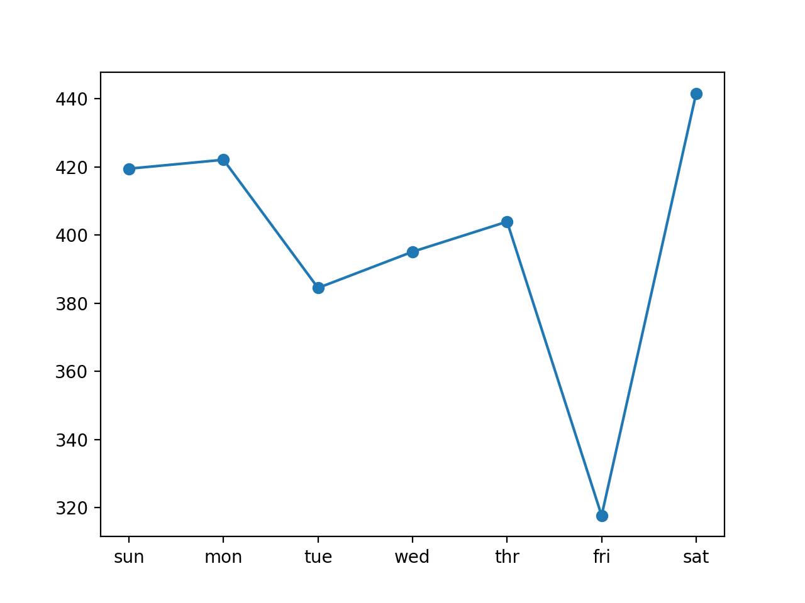
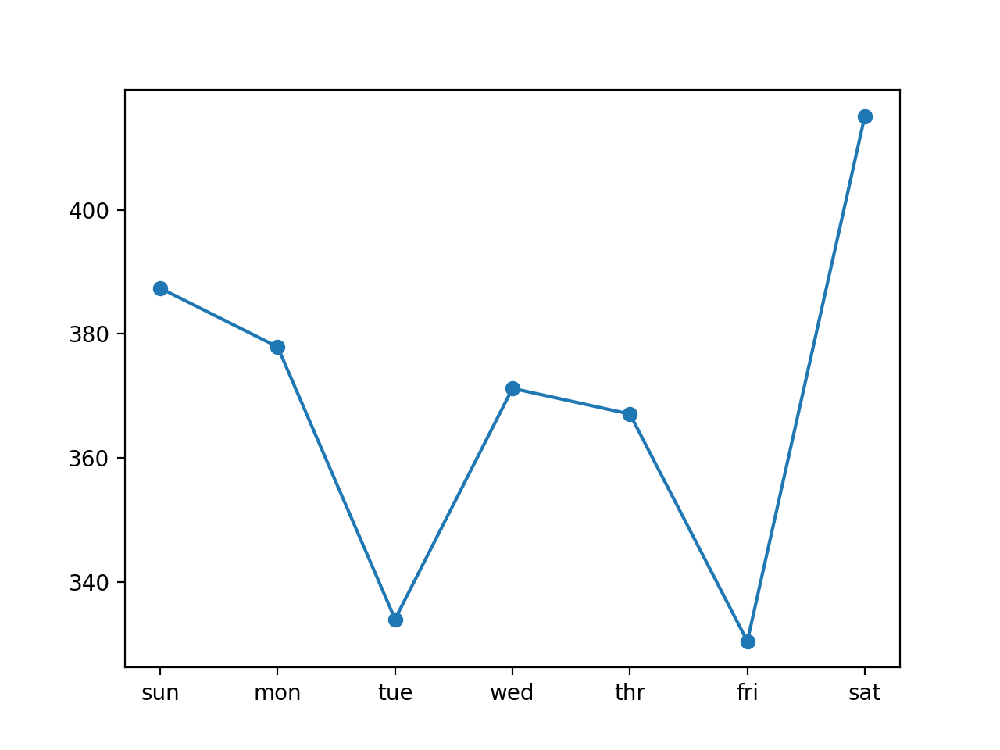
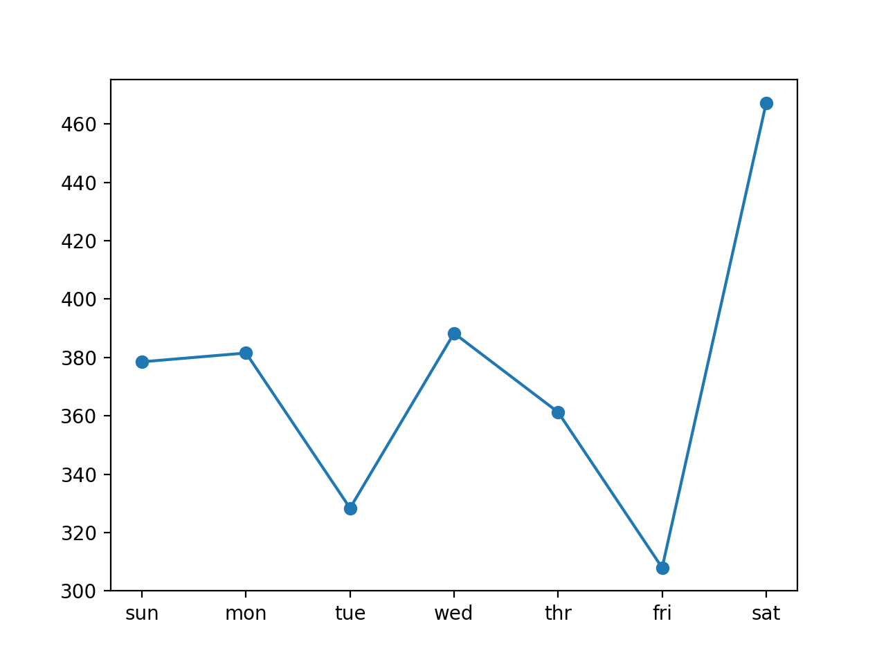
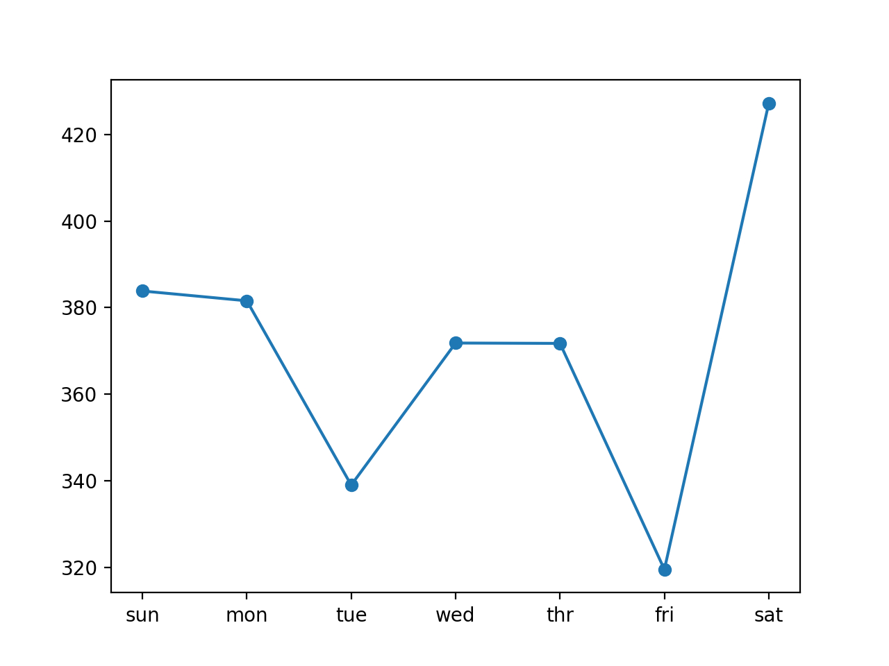
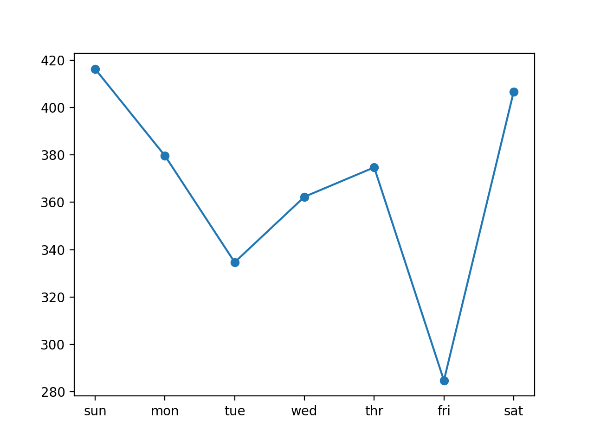

### How to Develop LSTMs for Multi-step Energy Usage Forecasting

Given the rise of smart electricity meters and the wide adoption of electricity generation
technology like solar panels, there is a wealth of electricity usage data available. This data
represents a multivariate time series of power-related variables that in turn could be used
to model and even forecast future electricity consumption. Unlike other machine learning
algorithms, long short-term memory recurrent neural networks are capable of automatically
learning features from sequence data, support multiple-variate data, and can output a variable
length sequences that can be used for multi-step forecasting. In this tutorial, you will discover
how to develop long short-term memory recurrent neural networks for multi-step time series
forecasting of household power consumption. After completing this tutorial, you will know:

- How to develop and evaluate Univariate and multivariate Encoder-Decoder LSTMs for
multi-step time series forecasting.

- How to develop and evaluate an CNN-LSTM Encoder-Decoder model for multi-step time
series forecasting.

- How to develop and evaluate a ConvLSTM Encoder-Decoder model for multi-step time
series forecasting.

Let’s get started.

#### Tutorial Overview

This tutorial is divided into nine parts; they are:

1.  Problem Description
2.  Load and Prepare Dataset
3.  Model Evaluation
4.  LSTMs for Multi-step Forecasting
5.  Univariate Input and Vector Output
6.  Encoder-Decoder LSTM With Univariate Input
7.  Encoder-Decoder LSTM With Multivariate Input
8.  CNN-LSTM Encoder-Decoder With Univariate Input
9.  ConvLSTM Encoder-Decoder With Univariate Input

#### Problem Description

TheHousehold Power Consumptiondataset is a multivariate time series dataset that describes
the electricity consumption for a single household over four years. The data was collected
between December 2006 and November 2010 and observations of power consumption within the
household were collected every minute. It is a multivariate series comprised of seven variables

(besides the date and time); they are:

- globalactivepower: The total active power consumed by the household
(kilowatts).

- globalreactivepower: The total reactive power consumed by the
household (kilowatts).

- voltage: Average voltage (volts).

- globalintensity: Average current intensity (amps).

- submetering 1 : Active energy for kitchen (watt-hours of active
energy).

- submetering 2 : Active energy for laundry (watt-hours of active
energy).

- submetering 3 : Active energy for climate control systems (watt-hours
of active energy).

Active and reactive energy refer to the technical details of alternative current. A fourth
sub-metering variable can be created by subtracting the sum of three defined sub-metering
variables from the total active energy. This dataset was introduced and analyzed in Chapter 16.
Refer to that chapter for more details if needed.

#### Load and Prepare Dataset

We will use the same framework to load and prepare the data as was used for the naive models.
In the interest of brevity, refer to Chapter 17 for the details on how to load and prepare the
dataset for modeling.

#### Model Evaluation

We will use the same framework to evaluate models as was used for the naive models. In
the interest of brevity, refer to Chapter 17 for the details on how to develop a framework for
evaluating forecasts for this dataset. We must update the framework for model evaluation,
specifically the walk-forward validation method used to fit a LSTM model and make a forecast.
Refer to Chapter 19 for the details of the development of the new walk-forward validation
framework for evaluating deep learning models on this problem.


#### LSTMs for Multi-step Forecasting

Recurrent neural networks, or RNNs, are specifically designed to work, learn, and predict
sequence data and can be used for multi-step time series forecasting. For more details on the
use of LSTMs for multi-step forecasting, see Chapter 9. In this tutorial, we will explore a suite
of LSTM architectures for multi-step time series forecasting. Specifically, we will look at how to
develop the following models:

- Vanilla LSTMmodel with vector output for multi-step forecasting with univariate input
data.

- Encoder-Decoder LSTMmodel for multi-step forecasting with univariate
input data.

- Encoder-Decoder LSTMmodel for multi-step forecasting with multivariate
input data.

- CNN-LSTM Encoder-Decodermodel for multi-step forecasting with univariate input
data.

- ConvLSTM Encoder-Decodermodel for multi-step forecasting with univariate input
data.

The models will be developed and demonstrated on the household power prediction problem.
A model is considered skillful if it achieves performance better than a naive model, which is an
overall RMSE of about 465 kilowatts across a seven day forecast (for more details of the naive
model, see Chapter 17). We will not focus on the tuning of these models to achieve optimal
performance; instead, we will stop short at skillful models as compared to a naive forecast.
The chosen structures and hyperparameters are chosen with a little trial and error. The scores
should be taken as just an example rather than a study of the optimal model or configuration
for the problem.
Given the stochastic nature of the models, it is good practice to evaluate a given model
multiple times and report the mean performance on a test dataset. In the interest of brevity and
keeping the code simple, we will instead present single-runs of models in this tutorial. We cannot
know which approach will be the most effective for a given multi-step forecasting problem. It is
a good idea to explore a suite of methods in order to discover what works best on your specific
dataset.

#### Univariate Input and Vector Output

We will start off by developing a simple or vanilla LSTM model that reads in a sequence of days
of total daily power consumption and predicts a vector output of the next standard week of daily
power consumption. This will provide the foundation for the more elaborate models developed
in subsequent sections. The number of prior days used as input defines the one-dimensional

(1D) subsequence of data that the LSTM will read and learn to extract
features. Some ideas on
the size and nature of this input include:

- All prior days, up to years worth of data.

- The prior seven days.

- The prior two weeks.

- The prior one month.

- The prior one year.

- The prior week and the week to be predicted from one year ago.

There is no right answer; instead, each approach and more can be tested and the performance
of the model can be used to choose the nature of the input that results in the best model
performance. These choices define a few things:

- How the training data must be prepared in order to fit the model.

- How the test data must be prepared in order to evaluate the model.

- How to use the model to make predictions with a final model in the
future.

A good starting point would be to use the prior seven days. An LSTM model expects data
to have the shape:[samples, timesteps, features]. One sample will be comprised of seven
time steps with one feature for the seven days of total daily power consumed. The training
dataset has 159 weeks of data, so the shape of the training dataset would be:[159, 7, 1].
This is a good start. The data in this format would use the prior standard week to predict
the next standard week. A problem is that 159 instances is not a lot to train a neural network.

A way to create a lot more training data is to change the problem during
training to predict
the next seven days given the prior seven days, regardless of the standard week. This only
impacts the training data, and the test problem remains the same: predict the daily power
consumption for the next standard week given the prior standard week. This will require a little
preparation of the training data. The training data is provided in standard weeks with eight
variables, specifically in the shape[159, 7, 8]. The first step is to
flatten the data so that we
have eight time series sequences.

```
# flatten data
data = data.reshape((data.shape[0]*data.shape[1], data.shape[2]))

```

We then need to iterate over the time steps and divide the data into overlapping windows;
each iteration moves along one time step and predicts the subsequent seven days. For example:


```
Input, Output
[d01, d02, d03, d04, d05, d06, d07], [d08, d09, d10, d11, d12, d13, d14]
[d02, d03, d04, d05, d06, d07, d08], [d09, d10, d11, d12, d13, d14, d15]
...

```

We can do this by keeping track of start and end indexes for the inputs and outputs as we
iterate across the length of the flattened data in terms of time steps. We can also do this in a
way where the number of inputs and outputs are parameterized (e.g.
ninput,nout) so that
you can experiment with different values or adapt it for your own
problem. Below is a function
namedtosupervised() that takes a list of weeks (history) and the number of time steps to
use as inputs and outputs and returns the data in the overlapping moving window format.


```
# convert history into inputs and outputs
def to_supervised(train, n_input, n_out=7):
# flatten data
data = train.reshape((train.shape[0]*train.shape[1], train.shape[2]))
X, y = list(), list()
in_start = 0
# step over the entire history one time step at a time
for _ in range(len(data)):
# define the end of the input sequence
in_end = in_start + n_input
out_end = in_end + n_out
# ensure we have enough data for this instance
if out_end < len(data):
x_input = data[in_start:in_end, 0]
x_input = x_input.reshape((len(x_input), 1))
X.append(x_input)
y.append(data[in_end:out_end, 0])
# move along one time step
in_start += 1
return array(X), array(y)

```

When we run this function on the entire training dataset, we transform 159 samples into
1,099; specifically, the transformed dataset has the shapes X=[1099, 7,
1] and y=[1099, 7].

Next, we can define and fit the LSTM model on the training data. This multi-step time series
forecasting problem is an autoregression. That means it is likely best modeled where that the
next seven days is some function of observations at prior time steps. This and the relatively
small amount of data means that a small model is required.
We will develop a model with a single hidden LSTM layer with 200 units. The number of
units in the hidden layer is unrelated to the number of time steps in the input sequences. The
LSTM layer is followed by a fully connected layer with 200 nodes that will interpret the features
learned by the LSTM layer. Finally, an output layer will directly predict a vector with seven
elements, one for each day in the output sequence. We will use the mean squared error loss
function as it is a good match for our chosen error metric of RMSE. We will use the efficient

Adam implementation of stochastic gradient descent and fit the model for
70 epochs with a
batch size of 16.
The small batch size and the stochastic nature of the algorithm means that the same model
will learn a slightly different mapping of inputs to outputs each time
it is trained. This means
results may vary when the model is evaluated. You can try running the model multiple times
and calculate an average of model performance. The build_model()below prepares the training
data, defines the model, and fits the model on the training data, returning the fit model ready
for making predictions.

```
# train the model
def build_model(train, n_input):
# prepare data
train_x, train_y = to_supervised(train, n_input)
# define parameters
verbose, epochs, batch_size = 0, 70, 16
n_timesteps, n_features, n_outputs = train_x.shape[1], train_x.shape[2], train_y.shape[1]
# define model


model = Sequential()
model.add(LSTM(200, activation='relu', input_shape=(n_timesteps, n_features)))
model.add(Dense(100, activation='relu'))
model.add(Dense(n_outputs))
model.compile(loss='mse', optimizer='adam')
# fit network
model.fit(train_x, train_y, epochs=epochs, batch_size=batch_size, verbose=verbose)
return model

```

Now that we know how to fit the model, we can look at how the model can be used to make
a prediction. Generally, the model expects data to have the same three dimensional shape when
making a prediction. In this case, the expected shape of an input pattern is one sample, seven
days of one feature for the daily power consumed:[1, 7, 1]. Data must have this shape when
making predictions for the test set and when a final model is being used to make predictions in
the future. If you change the number if input days to 14, then the shape of the training data
and the shape of new samples when making predictions must be changed accordingly to have 14
time steps. It is a modeling choice that you must carry forward when using the model.

We are using walk-forward validation to evaluate the model as described in the previous
section. This means that we have the observations available for the prior week in order to
predict the coming week. These are collected into an array of standard weeks called history. In
order to predict the next standard week, we need to retrieve the last days of observations. As
with the training data, we must first flatten the history data to remove
the weekly structure so
that we end up with eight parallel time series.

```

# flatten data
data = data.reshape((data.shape[0]*data.shape[1], data.shape[2]))

```
Next, we need to retrieve the last seven days of daily total power consumed (feature index
0). We will parameterize this as we did for the training data so that the number of prior days
used as input by the model can be modified in the future.

```
# retrieve last observations for input data
input_x = data[-n_input:, 0]

```
Next, we reshape the input into the expected three-dimensional structure.

```
# reshape into [1, n_input, 1]
input_x = input_x.reshape((1, len(input_x), 1))

```
We then make a prediction using the fit model and the input data and retrieve the vector of
seven days of output.

```
# forecast the next week
yhat = model.predict(input_x, verbose=0)
# we only want the vector forecast
yhat = yhat[0]

```

The forecast() function below implements this and takes as arguments the
model fit on
the training dataset, the history of data observed so far, and the
number of input time steps
expected by the model.


```

def forecast(model, history, n_input):
data = array(history)
data = data.reshape((data.shape[0]*data.shape[1], data.shape[2]))

input_x = data[-n_input:, 0]

input_x = input_x.reshape((1, len(input_x), 1))

yhat = model.predict(input_x, verbose=0)

yhat = yhat[0]
return yhat

```

That’s it; we now have everything we need to make multi-step time series forecasts with
an LSTM model on the daily total power consumed univariate dataset. We
can tie all of this
together. The complete example is listed below.

```

from math import sqrt
from numpy import split
from numpy import array
from pandas import read_csv
from sklearn.metrics import mean_squared_error
from matplotlib import pyplot
from keras.models import Sequential
from keras.layers import Dense
from keras.layers import LSTM

def split_dataset(data):

train, test = data[1:-328], data[-328:-6]

train = array(split(train, len(train)/7))
test = array(split(test, len(test)/7))
return train, test

def evaluate_forecasts(actual, predicted):
scores = list()

for i in range(actual.shape[1]):
mse = mean_squared_error(actual[:, i], predicted[:, i])
rmse = sqrt(mse)
scores.append(rmse)

# calculate overall RMSE
s = 0
for row in range(actual.shape[0]):
for col in range(actual.shape[1]):
s += (actual[row, col] - predicted[row, col])**2
score = sqrt(s / (actual.shape[0] * actual.shape[1]))
return score, scores

def summarize_scores(name, score, scores):
s_scores = ','.join(['%.1f' % s for s in scores])
print('%s: [%.3f] %s'% (name, score, s_scores))

def to_supervised(train, n_input, n_out=7):
data = train.reshape((train.shape[0]*train.shape[1], train.shape[2]))
X, y = list(), list()
in_start = 0

for _ in range(len(data)):

in_end = in_start + n_input
out_end = in_end + n_out

if out_end < len(data):
x_input = data[in_start:in_end, 0]
x_input = x_input.reshape((len(x_input), 1))
X.append(x_input)
y.append(data[in_end:out_end, 0])

in_start += 1
return array(X), array(y)

def build_model(train, n_input):
train_x, train_y = to_supervised(train, n_input)

verbose, epochs, batch_size = 0, 70, 16
n_timesteps, n_features, n_outputs = train_x.shape[1],
train_x.shape[2], train_y.shape[1]
model = Sequential()
model.add(LSTM(200, activation='relu', input_shape=(n_timesteps,
n_features)))
model.add(Dense(100, activation='relu'))
model.add(Dense(n_outputs))
model.compile(loss='mse', optimizer='adam')
model.fit(train_x, train_y, epochs=epochs, batch_size=batch_size,
verbose=verbose)
return model

def forecast(model, history, n_input):
data = array(history)
data = data.reshape((data.shape[0]*data.shape[1], data.shape[2]))


# retrieve last observations for input data
input_x = data[-n_input:, 0]
# reshape into [1, n_input, 1]
input_x = input_x.reshape((1, len(input_x), 1))
# forecast the next week
yhat = model.predict(input_x, verbose=0)
# we only want the vector forecast
yhat = yhat[0]
return yhat

# evaluate a single model
def evaluate_model(train, test, n_input):
# fit model
model = build_model(train, n_input)
# history is a list of weekly data
history = [x for x in train]
# walk-forward validation over each week
predictions = list()
for i in range(len(test)):
# predict the week
yhat_sequence = forecast(model, history, n_input)
# store the predictions
predictions.append(yhat_sequence)
# get real observation and add to history for predicting the next week
history.append(test[i, :])
# evaluate predictions days for each week
predictions = array(predictions)
score, scores = evaluate_forecasts(test[:, :, 0], predictions)
return score, scores

# load the new file
dataset = read_csv('household_power_consumption_days.csv', header=0,
infer_datetime_format=True, parse_dates=['datetime'], index_col=['datetime'])
# split into train and test
train, test = split_dataset(dataset.values)
# evaluate model and get scores
n_input = 7
score, scores = evaluate_model(train, test, n_input)
# summarize scores
summarize_scores('lstm', score, scores)
# plot scores
days = ['sun','mon', 'tue','wed','thr', 'fri','sat']
pyplot.plot(days, scores, marker='o', label='lstm')
pyplot.show()

```

Running the example fits and evaluates the model, printing the overall RMSE across all
seven days, and the per-day RMSE for each lead time. We can see that in this case, the model

was skillful as compared to a naive forecast, achieving an overall RMSE
of about 399 kilowatts,

less than 465 kilowatts achieved by a naive model.

**Note:** Given the stochastic nature of the algorithm, your specific results may vary. Consider
running the example a few times.

```

lstm: [399.456] 419.4, 422.1, 384.5, 395.1, 403.9, 317.7, 441.5

```

A plot of the daily RMSE is also created. The plot shows that perhaps
Tuesdays and Fridays
are easier days to forecast than the other days and that perhaps
Saturday at the end of the
standard week is the hardest day to forecast.



We can increase the number of prior days to use as input from seven to
14 by changing the ninputvariable.

```

n_input = 14

```

Re-running the example with this change first prints a summary of
performance of the model.

In this case, we can see a further drop in the overall RMSE to about 370
kilowatts, suggesting
that further tuning of the input size and perhaps the number of nodes in
the model may result in better performance.


**Note:** Given the stochastic nature of the algorithm, your specific
results may vary. Consider running the example a few times.

```

lstm: [370.028] 387.4, 377.9, 334.0, 371.2, 367.1, 330.4, 415.1

```

Comparing the per-day RMSE scores we see some are better and some are
worse than using
seven-day inputs. This may suggest benefit in using the two different
sized inputs in some way,
such as an ensemble of the two approaches or perhaps a single model
(e.g. a multi-headed

model) that reads the training data in different ways.



#### Encoder-Decoder LSTM With Univariate Input

In this section, we can update the vanilla LSTM to use an
encoder-decoder model. This means
that the model will not output a vector sequence directly. Instead, the
model will be comprised
of two sub models, the encoder to read and encode the input sequence,
and the decoder that
will read the encoded input sequence and make a one-step prediction for
each element in the
output sequence.

The difference is subtle, as in practice both approaches do in fact predict a sequence output.
The important difference is that an LSTM model is used in the decoder,
allowing it to both
know what was predicted for the prior day in the sequence and accumulate internal state while
outputting the sequence. Let’s take a closer look at how this model is defined.
As before, we define an LSTM hidden layer with 200 units. This is the decoder model that
will read the input sequence and will output a 200 element vector (one
output per unit) that
captures features from the input sequence. We will use 14 days of total power consumption as
input.

```
# define encoder
model.add(LSTM(200, activation='relu', input_shape=(n_timesteps, n_features)))

```
We will use a simple encoder-decoder architecture that is easy to implement in Keras,
that has a lot of similarity to the architecture of an LSTM autoencoder. First, the internal
representation of the input sequence is repeated multiple times, once for each time step in the
output sequence. This sequence of vectors will be presented to the LSTM decoder.

```
# repeat encodering
model.add(RepeatVector(7))

```
We then define the decoder as an LSTM hidden layer with 200 units. Importantly, the
decoder will output the entire sequence, not just the output at the end of the sequence as we
did with the encoder. This means that each of the 200 units will output a value for each of the
seven days, representing the basis for what to predict for each day in the output sequence.

```
# define decoder model
model.add(LSTM(200, activation='relu', return_sequences=True))

```

We will then use a fully connected layer to interpret each time step in the output sequence
before the final output layer. Importantly, the output layer predicts a single step in the output
sequence, not all seven days at a time. This means that we will use the same layers applied
to each step in the output sequence. It means that the same fully connected layer and output
layer will be used to process each time step provided by the decoder. To achieve this, we will

wrap the interpretation layer and the output layer in
aTimeDistributedwrapper that allows
the wrapped layers to be used for each time step from the decoder.

```
# define output model
model.add(TimeDistributed(Dense(100, activation='relu')))
model.add(TimeDistributed(Dense(1)))

```
This allows the LSTM decoder to figure out the context required for each step in the output
sequence and the wrapped dense layers to interpret each time step separately, yet reusing
the same weights to perform the interpretation. An alternative would be to flatten all of the
structure created by the LSTM decoder and to output the vector directly. You can try this as
an extension to see how it compares. The network therefore outputs a
three-dimensional vector
with the same structure as the input, with the dimensions [samples,timesteps, features].

There is a single feature, the daily total power consumed, and there are
always seven features.
A single one-week prediction will therefore have the size:[1, 7, 1].
Therefore, when training
the model, we must restructure the output data (y) to have the three-dimensional structure
instead of the two-dimensional structure of[samples, features]used in the previous section.

```
# reshape output into [samples, timesteps, features]
train_y = train_y.reshape((train_y.shape[0], train_y.shape[1], 1))

```

We can tie all of this together into the updated build_model() function
listed below.

```
# train the model
def build_model(train, n_input):
# prepare data
train_x, train_y = to_supervised(train, n_input)
# define parameters
verbose, epochs, batch_size = 0, 20, 16
n_timesteps, n_features, n_outputs = train_x.shape[1], train_x.shape[2], train_y.shape[1]
# reshape output into [samples, timesteps, features]
train_y = train_y.reshape((train_y.shape[0], train_y.shape[1], 1))
# define model
model = Sequential()
model.add(LSTM(200, activation='relu', input_shape=(n_timesteps, n_features)))
model.add(RepeatVector(n_outputs))
model.add(LSTM(200, activation='relu', return_sequences=True))
model.add(TimeDistributed(Dense(100, activation='relu')))
model.add(TimeDistributed(Dense(1)))
model.compile(loss='mse', optimizer='adam')
# fit network
model.fit(train_x, train_y, epochs=epochs, batch_size=batch_size, verbose=verbose)
return model

```

The complete example with the encoder-decoder model is listed below.

```
# univariate multi-step encoder-decoder lstm for the power usage dataset
from math import sqrt
from numpy import split
from numpy import array
from pandas import read_csv
from sklearn.metrics import mean_squared_error
from matplotlib import pyplot
from keras.models import Sequential
from keras.layers import Dense
from keras.layers import LSTM
from keras.layers import RepeatVector
from keras.layers import TimeDistributed

# split a univariate dataset into train/test sets
def split_dataset(data):
# split into standard weeks
train, test = data[1:-328], data[-328:-6]
# restructure into windows of weekly data


train = array(split(train, len(train)/7))
test = array(split(test, len(test)/7))
return train, test

def evaluate_forecasts(actual, predicted):
scores = list()

for i in range(actual.shape[1]):
mse = mean_squared_error(actual[:, i], predicted[:, i])
rmse = sqrt(mse)
scores.append(rmse)

s = 0
for row in range(actual.shape[0]):
for col in range(actual.shape[1]):
s += (actual[row, col] - predicted[row, col])**2
score = sqrt(s / (actual.shape[0] * actual.shape[1]))
return score, scores

def summarize_scores(name, score, scores):
s_scores = ','.join(['%.1f' % s for s in scores])
print('%s: [%.3f] %s'% (name, score, s_scores))

def to_supervised(train, n_input, n_out=7):
data = train.reshape((train.shape[0]*train.shape[1], train.shape[2]))
X, y = list(), list()
in_start = 0

for _ in range(len(data)):

in_end = in_start + n_input
out_end = in_end + n_out

if out_end < len(data):
x_input = data[in_start:in_end, 0]
x_input = x_input.reshape((len(x_input), 1))
X.append(x_input)
y.append(data[in_end:out_end, 0])

in_start += 1
return array(X), array(y)

def build_model(train, n_input):
train_x, train_y = to_supervised(train, n_input)

verbose, epochs, batch_size = 0, 20, 16
n_timesteps, n_features, n_outputs = train_x.shape[1],
train_x.shape[2], train_y.shape[1]


# reshape output into [samples, timesteps, features]
train_y = train_y.reshape((train_y.shape[0], train_y.shape[1], 1))
# define model
model = Sequential()
model.add(LSTM(200, activation='relu', input_shape=(n_timesteps, n_features)))
model.add(RepeatVector(n_outputs))
model.add(LSTM(200, activation='relu', return_sequences=True))
model.add(TimeDistributed(Dense(100, activation='relu')))
model.add(TimeDistributed(Dense(1)))
model.compile(loss='mse', optimizer='adam')
# fit network
model.fit(train_x, train_y, epochs=epochs, batch_size=batch_size, verbose=verbose)
return model

def forecast(model, history, n_input):
data = array(history)
data = data.reshape((data.shape[0]*data.shape[1], data.shape[2]))

input_x = data[-n_input:, 0]

input_x = input_x.reshape((1, len(input_x), 1))

yhat = model.predict(input_x, verbose=0)

yhat = yhat[0]
return yhat

def evaluate_model(train, test, n_input):
model = build_model(train, n_input)

history = [x for x in train]

predictions = list()
for i in range(len(test)):

yhat_sequence = forecast(model, history, n_input)

predictions.append(yhat_sequence)

history.append(test[i, :])

predictions = array(predictions)
score, scores = evaluate_forecasts(test[:, :, 0], predictions)
return score, scores

dataset = read_csv('household_power_consumption_days.csv',
header=0,
infer_datetime_format=True, parse_dates=['datetime'],
index_col=['datetime'])

train, test = split_dataset(dataset.values)

n_input = 14


score, scores = evaluate_model(train, test, n_input)
# summarize scores
summarize_scores('lstm', score, scores)
# plot scores
days = ['sun','mon', 'tue','wed','thr', 'fri','sat']
pyplot.plot(days, scores, marker='o', label='lstm')
pyplot.show()

```

Running the example fits the model and summarizes the performance on the test dataset.
We can see that in this case, the model is skillful, achieving an
overall RMSE score of about 372
kilowatts.

**Note:** Given the stochastic nature of the algorithm, your specific results may vary. Consider
running the example a few times.

```

lstm: [372.595] 379.5, 399.8, 339.6, 372.2, 370.9, 309.9, 424.8

```

A line plot of the per-day RMSE is also created showing a similar pattern in error as was
seen in the previous section.


#### Encoder-Decoder LSTM With Multivariate Input

In this section, we will update the Encoder-Decoder LSTM developed in
the previous section to
use each of the eight time series variables to predict the next standard
week of daily total power
consumption. We will do this by providing each one-dimensional time
series to the model as a
separate sequence of input. The LSTM will in turn create an internal
representation of each
input sequence that will together be interpreted by the decoder.

Using multivariate inputs is helpful for those problems where the output sequence is some
function of the observations at prior time steps from multiple different
features, not just (or
including) the feature being forecasted. It is unclear whether this is
the case in the power
consumption problem, but we can explore it nonetheless. First, we must
update the preparation
of the training data to include all of the eight features, not just the
one total daily power
consumed. It requires a single line change:

```
X.append(data[in_start:in_end, :])

```
The completetosupervised() function with this change is listed below.

```


def to_supervised(train, n_input, n_out=7):
data = train.reshape((train.shape[0]*train.shape[1], train.shape[2]))
X, y = list(), list()
in_start = 0

for _ in range(len(data)):

in_end = in_start + n_input
out_end = in_end + n_out

if out_end < len(data):
X.append(data[in_start:in_end, :])
y.append(data[in_end:out_end, 0])

in_start += 1
return array(X), array(y)

```

We also must update the function used to make forecasts with the fit
model to use all eight
features from the prior time steps. Again, another small change:

```
input_x = data[-n_input:, :]

input_x = input_x.reshape((1, input_x.shape[0], input_x.shape[1]))


def forecast(model, history, n_input):
data = array(history)
data = data.reshape((data.shape[0]*data.shape[1], data.shape[2]))

input_x = data[-n_input:, :]

input_x = input_x.reshape((1, input_x.shape[0], input_x.shape[1]))

yhat = model.predict(input_x, verbose=0)

yhat = yhat[0]
return yhat

```

The same model architecture and configuration is used directly, although we will increase
the number of training epochs from 20 to 50 given the 8-fold increase in
the amount of input data. The complete example is listed below.

```

from math import sqrt
from numpy import split


from numpy import array
from pandas import read_csv
from sklearn.metrics import mean_squared_error
from matplotlib import pyplot
from keras.models import Sequential
from keras.layers import Dense
from keras.layers import LSTM
from keras.layers import RepeatVector
from keras.layers import TimeDistributed

def split_dataset(data):

train, test = data[1:-328], data[-328:-6]

train = array(split(train, len(train)/7))
test = array(split(test, len(test)/7))
return train, test

def evaluate_forecasts(actual, predicted):
scores = list()

for i in range(actual.shape[1]):
mse = mean_squared_error(actual[:, i], predicted[:, i])
rmse = sqrt(mse)
scores.append(rmse)

s = 0
for row in range(actual.shape[0]):
for col in range(actual.shape[1]):
s += (actual[row, col] - predicted[row, col])**2
score = sqrt(s / (actual.shape[0] * actual.shape[1]))
return score, scores

def summarize_scores(name, score, scores):
s_scores = ','.join(['%.1f' % s for s in scores])
print('%s: [%.3f] %s'% (name, score, s_scores))

def to_supervised(train, n_input, n_out=7):
data = train.reshape((train.shape[0]*train.shape[1], train.shape[2]))
X, y = list(), list()
in_start = 0

for _ in range(len(data)):

in_end = in_start + n_input
out_end = in_end + n_out

if out_end < len(data):


X.append(data[in_start:in_end, :])
y.append(data[in_end:out_end, 0])
# move along one time step
in_start += 1
return array(X), array(y)

def build_model(train, n_input):
train_x, train_y = to_supervised(train, n_input)

verbose, epochs, batch_size = 0, 50, 16
n_timesteps, n_features, n_outputs = train_x.shape[1],
train_x.shape[2], train_y.shape[1]

train_y = train_y.reshape((train_y.shape[0], train_y.shape[1], 1))
model = Sequential()
model.add(LSTM(200, activation='relu', input_shape=(n_timesteps,
n_features)))
model.add(RepeatVector(n_outputs))
model.add(LSTM(200, activation='relu', return_sequences=True))
model.add(TimeDistributed(Dense(100, activation='relu')))
model.add(TimeDistributed(Dense(1)))
model.compile(loss='mse', optimizer='adam')
model.fit(train_x, train_y, epochs=epochs, batch_size=batch_size,
verbose=verbose)
return model

def forecast(model, history, n_input):
data = array(history)
data = data.reshape((data.shape[0]*data.shape[1], data.shape[2]))

input_x = data[-n_input:, :]

input_x = input_x.reshape((1, input_x.shape[0], input_x.shape[1]))

yhat = model.predict(input_x, verbose=0)

yhat = yhat[0]
return yhat

def evaluate_model(train, test, n_input):
model = build_model(train, n_input)

history = [x for x in train]

predictions = list()
for i in range(len(test)):

yhat_sequence = forecast(model, history, n_input)

predictions.append(yhat_sequence)

history.append(test[i, :])
# evaluate predictions days for each week
predictions = array(predictions)
score, scores = evaluate_forecasts(test[:, :, 0], predictions)
return score, scores

dataset = read_csv('household_power_consumption_days.csv',
header=0,
infer_datetime_format=True, parse_dates=['datetime'],
index_col=['datetime'])

train, test = split_dataset(dataset.values)

n_input = 14
score, scores = evaluate_model(train, test, n_input)

summarize_scores('lstm', score, scores)
days = ['sun','mon', 'tue','wed','thr', 'fri','sat']
pyplot.plot(days, scores, marker='o', label='lstm')
pyplot.show()

```

Running the example fits the model and summarizes the performance on the test dataset.

Experimentation found that this model appears less stable than the
univariate case and may
be related to the differing scales of the input eight variables. We can
see that in this case, the
model is skillful, achieving an overall RMSE score of about 376
kilowatts.

**Note:** Given the stochastic nature of the algorithm, your specific
results may vary. Consider running the example a few times.

```

lstm: [376.273] 378.5, 381.5, 328.4, 388.3, 361.2, 308.0, 467.2

```

multi-step forecasting.

A line plot of the per-day RMSE is also created.



#### CNN-LSTM Encoder-Decoder With Univariate In-put

A convolutional neural network, or CNN, can be used as the encoder in an
encoder-decoder
architecture. The CNN does not directly support sequence input; instead, a 1D CNN is capable
of reading across sequence input and automatically learning the salient features. These can
then be interpreted by an LSTM decoder as per normal. We refer to hybrid models that use
a CNN and LSTM as CNN-LSTM models, and in this case we are using them together in an
encoder-decoder architecture. The CNN expects the input data to have the same 3D structure
as the LSTM model, although multiple features are read as different channels that ultimately
have the same effect.

We will simplify the example and focus on the CNN-LSTM with univariate input, but it can
just as easily be updated to use multivariate input, which is left as an exercise. As before, we
will use input sequences comprised of 14 days of daily total power
consumption. We will define
a simple but effective CNN architecture for the encoder that is comprised of two convolutional
layers followed by a max pooling layer, the results of which are then flattened.

The first convolutional layer reads across the input sequence and projects the results onto
feature maps. The second performs the same operation on the feature maps
created by the first
layer, attempting to amplify any salient features. We will use 64
feature maps per convolutional
layer and read the input sequences with a kernel size of three time
steps. The max pooling
layer simplifies the feature maps by keeping^14 of the values with the
largest (max) signal. The
distilled feature maps after the pooling layer are then flattened into
one long vector that can
then be used as input to the decoding process.


```
model.add(Conv1D(filters=64, kernel_size=3, activation='relu',
input_shape=(n_timesteps,n_features)))
model.add(Conv1D(filters=64, kernel_size=3, activation='relu'))
model.add(MaxPooling1D(pool_size=2))
model.add(Flatten())

```

The decoder is the same as was defined in previous sections. The only
other change is to set
the number of training epochs to 20. The build_model() function with these
changes is listed below.

```
def build_model(train, n_input):
train_x, train_y = to_supervised(train, n_input)

verbose, epochs, batch_size = 0, 20, 16
n_timesteps, n_features, n_outputs = train_x.shape[1],
train_x.shape[2], train_y.shape[1]

train_y = train_y.reshape((train_y.shape[0], train_y.shape[1], 1))
model = Sequential()
model.add(Conv1D(filters=64, kernel_size=3, activation='relu',
input_shape=(n_timesteps,n_features)))
model.add(Conv1D(filters=64, kernel_size=3, activation='relu'))
model.add(MaxPooling1D(pool_size=2))
model.add(Flatten())
model.add(RepeatVector(n_outputs))
model.add(LSTM(200, activation='relu', return_sequences=True))
model.add(TimeDistributed(Dense(100, activation='relu')))
model.add(TimeDistributed(Dense(1)))
model.compile(loss='mse', optimizer='adam')
model.fit(train_x, train_y, epochs=epochs, batch_size=batch_size,
verbose=verbose)
return model

```


We are now ready to try the encoder-decoder architecture with a CNN
encoder. The complete code is listed below.

```
from math import sqrt
from numpy import split
from numpy import array
from pandas import read_csv


from sklearn.metrics import mean_squared_error
from matplotlib import pyplot
from keras.models import Sequential
from keras.layers import Dense
from keras.layers import Flatten
from keras.layers import LSTM
from keras.layers import RepeatVector
from keras.layers import TimeDistributed
from keras.layers.convolutional import Conv1D
from keras.layers.convolutional import MaxPooling1D

def split_dataset(data):

train, test = data[1:-328], data[-328:-6]

train = array(split(train, len(train)/7))
test = array(split(test, len(test)/7))
return train, test

def evaluate_forecasts(actual, predicted):
scores = list()

for i in range(actual.shape[1]):
mse = mean_squared_error(actual[:, i], predicted[:, i])
rmse = sqrt(mse)
scores.append(rmse)

s = 0
for row in range(actual.shape[0]):
for col in range(actual.shape[1]):
s += (actual[row, col] - predicted[row, col])**2
score = sqrt(s / (actual.shape[0] * actual.shape[1]))
return score, scores

def summarize_scores(name, score, scores):
s_scores = ','.join(['%.1f' % s for s in scores])
print('%s: [%.3f] %s'% (name, score, s_scores))

def to_supervised(train, n_input, n_out=7):
data = train.reshape((train.shape[0]*train.shape[1], train.shape[2]))
X, y = list(), list()
in_start = 0

for _ in range(len(data)):

in_end = in_start + n_input
out_end = in_end + n_out


if out_end < len(data):
x_input = data[in_start:in_end, 0]
x_input = x_input.reshape((len(x_input), 1))
X.append(x_input)
y.append(data[in_end:out_end, 0])
# move along one time step
in_start += 1
return array(X), array(y)

def build_model(train, n_input):
train_x, train_y = to_supervised(train, n_input)

verbose, epochs, batch_size = 0, 20, 16
n_timesteps, n_features, n_outputs = train_x.shape[1],
train_x.shape[2], train_y.shape[1]

train_y = train_y.reshape((train_y.shape[0], train_y.shape[1], 1))
model = Sequential()
model.add(Conv1D(filters=64, kernel_size=3, activation='relu',
input_shape=(n_timesteps,n_features)))
model.add(Conv1D(filters=64, kernel_size=3, activation='relu'))
model.add(MaxPooling1D(pool_size=2))
model.add(Flatten())
model.add(RepeatVector(n_outputs))
model.add(LSTM(200, activation='relu', return_sequences=True))
model.add(TimeDistributed(Dense(100, activation='relu')))
model.add(TimeDistributed(Dense(1)))
model.compile(loss='mse', optimizer='adam')
model.fit(train_x, train_y, epochs=epochs, batch_size=batch_size,
verbose=verbose)
return model

def forecast(model, history, n_input):
data = array(history)
data = data.reshape((data.shape[0]*data.shape[1], data.shape[2]))

input_x = data[-n_input:, 0]

input_x = input_x.reshape((1, len(input_x), 1))

yhat = model.predict(input_x, verbose=0)

yhat = yhat[0]
return yhat

def evaluate_model(train, test, n_input):
model = build_model(train, n_input)

history = [x for x in train]


predictions = list()
for i in range(len(test)):
# predict the week
yhat_sequence = forecast(model, history, n_input)
# store the predictions
predictions.append(yhat_sequence)
# get real observation and add to history for predicting the next week
history.append(test[i, :])
# evaluate predictions days for each week
predictions = array(predictions)
score, scores = evaluate_forecasts(test[:, :, 0], predictions)
return score, scores

dataset = read_csv('household_power_consumption_days.csv',
header=0,
infer_datetime_format=True, parse_dates=['datetime'],
index_col=['datetime'])

train, test = split_dataset(dataset.values)

n_input = 14
score, scores = evaluate_model(train, test, n_input)

summarize_scores('lstm', score, scores)
days = ['sun','mon', 'tue','wed','thr', 'fri','sat']
pyplot.plot(days, scores, marker='o', label='lstm')
pyplot.show()

```

multi-step forecasting.

Running the example fits the model and summarizes the performance on the
test dataset. A

little experimentation showed that using two convolutional layers made
the model more stable

than using just a single layer. We can see that in this case the model
is skillful, achieving an

overall RMSE score of about 372 kilowatts.

**Note:** Given the stochastic nature of the algorithm, your specific
results may vary. Consider running the example a few times.

```

lstm: [372.055] 383.8, 381.6, 339.1, 371.8, 371.8, 319.6, 427.2

```

for multi-step forecasting.

A line plot of the per-day RMSE is also created.



####  ConvLSTM Encoder-Decoder With Univariate In-put

A further extension of the CNN-LSTM approach is to perform the
convolutions of the CNN (e.g.
how the CNN reads the input sequence data) as part of the LSTM for each time step. This
combination is called a Convolutional LSTM, or ConvLSTM for short, and like the CNN-LSTM
is also used for spatiotemporal data. Unlike an LSTM that reads the data in directly in order
to calculate internal state and state transitions, and unlike the CNN-LSTM that is interpreting
the output from CNN models, the ConvLSTM is using convolutions directly as part of reading
input into the LSTM units themselves. The Keras library provides theConvLSTM2Dclass that
supports the ConvLSTM model for 2D data. It can be configured for 1D multivariate time
series forecasting. TheConvLSTM2Dclass, by default, expects input data to have the shape:
[samples, timesteps, rows, cols, channels].
Where each time step of data is defined as an image of (rows×columns) data points. We are
working with a one-dimensional sequence of total power consumption,
which we can interpret
as one row with 14 columns, if we assume that we are using two weeks of data as input. For
the ConvLSTM, this would be a single read: that is, the LSTM would read one time step of 14
days and perform a convolution across those time steps.
This is not ideal. Instead, we can split the 14 days into two subsequences with a length of
seven days. The ConvLSTM can then read across the two time steps and
perform the CNN
process on the seven days of data within each. For this chosen framing
of the problem, the
input for theConvLSTM2D would therefore be:[n, 2, 1, 7, 1]. Or:

- Samples:n, for the number of examples in the training dataset.

- Time: 2, for the two subsequences that we split a window of 14 days
into.

- Rows: 1, for the one-dimensional shape of each subsequence.

- Columns: 7, for the seven days in each subsequence.

- Channels: 1, for the single feature that we are working with as input.

You can explore other configurations, such as providing 21 days of input split into three
subsequences of seven days, and/or providing all eight features or
channels as input. We can
now prepare the data for theConvLSTM2Dmodel. First, we must reshape the
training dataset
into the expected structure of[samples, timesteps, rows, cols,
channels].

```

train_x = train_x.reshape((train_x.shape[0], n_steps, 1, n_length,
n_features))

```
We can then define the encoder as a ConvLSTM hidden layer followed by a flatten layer ready for decoding.

```

model.add(ConvLSTM2D(filters=64, kernel_size=(1,3), activation='relu',
input_shape=(n_steps, 1, n_length, n_features)))
model.add(Flatten())

```

We will also parameterize the number of subsequences (nsteps) and the
length of each
subsequence (nlength) and pass them as arguments. The rest of the model
and training is the
same. The build_model() function with these changes is listed below.

```

def build_model(train, n_steps, n_length, n_input):
train_x, train_y = to_supervised(train, n_input)

verbose, epochs, batch_size = 0, 20, 16
n_timesteps, n_features, n_outputs = train_x.shape[1],
train_x.shape[2], train_y.shape[1]

train_x = train_x.reshape((train_x.shape[0], n_steps, 1, n_length,
n_features))

train_y = train_y.reshape((train_y.shape[0], train_y.shape[1], 1))
model = Sequential()
model.add(ConvLSTM2D(filters=64, kernel_size=(1,3),
activation='relu',
input_shape=(n_steps, 1, n_length, n_features)))


model.add(Flatten())
model.add(RepeatVector(n_outputs))
model.add(LSTM(200, activation='relu', return_sequences=True))
model.add(TimeDistributed(Dense(100, activation='relu')))
model.add(TimeDistributed(Dense(1)))
model.compile(loss='mse', optimizer='adam')
# fit network
model.fit(train_x, train_y, epochs=epochs, batch_size=batch_size, verbose=verbose)
return model

```

This model expects five-dimensional data as input. Therefore, we must also update the
preparation of a single sample in theforecast() function when making a
prediction.

```
input_x = input_x.reshape((1, n_steps, 1, n_length, 1))

```

The forecast() function with this change and with the parameterized
subsequences is
provided below.

```
def forecast(model, history, n_steps, n_length, n_input):
data = array(history)
data = data.reshape((data.shape[0]*data.shape[1], data.shape[2]))

input_x = data[-n_input:, 0]

input_x = input_x.reshape((1, n_steps, 1, n_length, 1))

yhat = model.predict(input_x, verbose=0)

yhat = yhat[0]
return yhat

```

We now have all of the elements for evaluating an encoder-decoder
architecture for multi-step
time series forecasting where a ConvLSTM is used as the encoder. The
complete code example
is listed below.

```

from math import sqrt
from numpy import split
from numpy import array
from pandas import read_csv
from sklearn.metrics import mean_squared_error
from matplotlib import pyplot
from keras.models import Sequential
from keras.layers import Dense
from keras.layers import Flatten


from keras.layers import LSTM
from keras.layers import RepeatVector
from keras.layers import TimeDistributed
from keras.layers import ConvLSTM2D

def split_dataset(data):

train, test = data[1:-328], data[-328:-6]

train = array(split(train, len(train)/7))
test = array(split(test, len(test)/7))
return train, test

def evaluate_forecasts(actual, predicted):
scores = list()

for i in range(actual.shape[1]):
mse = mean_squared_error(actual[:, i], predicted[:, i])
rmse = sqrt(mse)
scores.append(rmse)

s = 0
for row in range(actual.shape[0]):
for col in range(actual.shape[1]):
s += (actual[row, col] - predicted[row, col])**2
score = sqrt(s / (actual.shape[0] * actual.shape[1]))
return score, scores

def summarize_scores(name, score, scores):
s_scores = ','.join(['%.1f' % s for s in scores])
print('%s: [%.3f] %s'% (name, score, s_scores))

def to_supervised(train, n_input, n_out=7):
data = train.reshape((train.shape[0]*train.shape[1], train.shape[2]))
X, y = list(), list()
in_start = 0

for _ in range(len(data)):

in_end = in_start + n_input
out_end = in_end + n_out

if out_end < len(data):
x_input = data[in_start:in_end, 0]
x_input = x_input.reshape((len(x_input), 1))
X.append(x_input)
y.append(data[in_end:out_end, 0])


in_start += 1
return array(X), array(y)

def build_model(train, n_steps, n_length, n_input):
train_x, train_y = to_supervised(train, n_input)

verbose, epochs, batch_size = 0, 20, 16
n_features, n_outputs = train_x.shape[2], train_y.shape[1]

train_x = train_x.reshape((train_x.shape[0], n_steps, 1, n_length,
n_features))

train_y = train_y.reshape((train_y.shape[0], train_y.shape[1], 1))
model = Sequential()
model.add(ConvLSTM2D(filters=64, kernel_size=(1,3),
activation='relu',
input_shape=(n_steps, 1, n_length, n_features)))
model.add(Flatten())
model.add(RepeatVector(n_outputs))
model.add(LSTM(200, activation='relu', return_sequences=True))
model.add(TimeDistributed(Dense(100, activation='relu')))
model.add(TimeDistributed(Dense(1)))
model.compile(loss='mse', optimizer='adam')
model.fit(train_x, train_y, epochs=epochs, batch_size=batch_size,
verbose=verbose)
return model

def forecast(model, history, n_steps, n_length, n_input):
data = array(history)
data = data.reshape((data.shape[0]*data.shape[1], data.shape[2]))

input_x = data[-n_input:, 0]

input_x = input_x.reshape((1, n_steps, 1, n_length, 1))

yhat = model.predict(input_x, verbose=0)

yhat = yhat[0]
return yhat

def evaluate_model(train, test, n_steps, n_length, n_input):
model = build_model(train, n_steps, n_length, n_input)

history = [x for x in train]

predictions = list()
for i in range(len(test)):

yhat_sequence = forecast(model, history, n_steps, n_length, n_input)

predictions.append(yhat_sequence)


# get real observation and add to history for predicting the next week
history.append(test[i, :])
# evaluate predictions days for each week
predictions = array(predictions)
score, scores = evaluate_forecasts(test[:, :, 0], predictions)
return score, scores

dataset = read_csv('household_power_consumption_days.csv',
header=0,
infer_datetime_format=True, parse_dates=['datetime'],
index_col=['datetime'])

train, test = split_dataset(dataset.values)

n_steps, n_length = 2, 7

n_input = n_length * n_steps
score, scores = evaluate_model(train, test, n_steps, n_length,
n_input)

summarize_scores('lstm', score, scores)
days = ['sun','mon', 'tue','wed','thr', 'fri','sat']
pyplot.plot(days, scores, marker='o', label='lstm')
pyplot.show()

```

for multi-step forecasting.

Running the example fits the model and summarizes the performance on the
test dataset. A

little experimentation showed that using two convolutional layers made
the model more stable

than using just a single layer. We can see that in this case the model
is skillful, achieving an

overall RMSE score of about 367 kilowatts.

**Note:** Given the stochastic nature of the algorithm, your specific
results may vary. Consider running the example a few times.

```

lstm: [367.929] 416.3, 379.7, 334.7, 362.3, 374.7, 284.8, 406.7

```

A line plot of the per-day RMSE is also created.



#### Extensions

This section lists some ideas for extending the tutorial that you may
wish to explore.

- Size of Input. Explore more or fewer number of days used as input for the model, such
as three days, 21 days, 30 days, and more.

- Model Tuning. Tune the structure and hyperparameters for a model and further lift
model performance on average.

- Data Scaling. Explore whether data scaling, such as standardization and normalization,
can be used to improve the performance of any of the LSTM models.

- Learning Diagnostics. Use diagnostics such as learning curves for the train and valida-
tion loss and mean squared error to help tune the structure and hyperparameters of a
LSTM model.


#### Further Reading

This section provides more resources on the topic if you are looking to
go deeper.

- Getting started with the Keras Sequential model.
https://keras.io/getting-started/sequential-model-guide/

- Getting started with the Keras functional API.
https://keras.io/getting-started/functional-api-guide/

- Keras Sequential Model API.
https://keras.io/models/sequential/

- Keras Core Layers API.
https://keras.io/layers/core/

- Keras Convolutional Layers API.
https://keras.io/layers/convolutional/

- Keras Pooling Layers API.
https://keras.io/layers/pooling/

- Keras Recurrent Layers API.
https://keras.io/layers/recurrent/

#### Summary

In this tutorial, you discovered how to develop long short-term memory recurrent neural networks
for multi-step time series forecasting of household power consumption. Specifically, you learned:

- How to develop and evaluate Univariate and multivariate Encoder-Decoder LSTMs for
multi-step time series forecasting.

- How to develop and evaluate an CNN-LSTM Encoder-Decoder model for multi-step time
series forecasting.

- How to develop and evaluate a ConvLSTM Encoder-Decoder model for multi-step time
series forecasting.

20.13.1 Next

This is the final lesson of this part, the next part will focus on how
to systematically work

through a real-world multivariate time series classification problem to predict human activities
from accelerometer data.

### Part VI

### Time Series Classification


### Overview

This part focuses on the real-world time series classification problem
of activity recognition

from multivariate accelerometer data recorded from a smartphone, and how to develop machine
learning and deep learning classification models to address the problem. The tutorials in this
part do not seek to demonstrate the best way to solve the problem, instead the dataset provides
a context on which each of the specific methods can be demonstrated. As such, the performance
of each method on the dataset are not compared directly. After reading the chapters in this
part, you will know:

- A review of recent research highlighting deep learning models and their general configura-
tion that are state-of-the-art for human activity recognition (Chapter 21).

- How to load, summarize and plot a standard human activity recognition dataset comprised
of accelerometer data recorded from a smartphone (Chapter 22).

- How to develop nonlinear and ensemble machine learning models from accelerometer data
with domain-specific engineered features (Chapter 23).

- How to develop and evaluate a suite of Convolutional Neural Network models for human
activity recognition from accelerometer data (Chapter 24).

- How to develop and evaluate a suite of Long Short-Term Memory Neural Network models
for human activity recognition from accelerometer data (Chapter 25).

