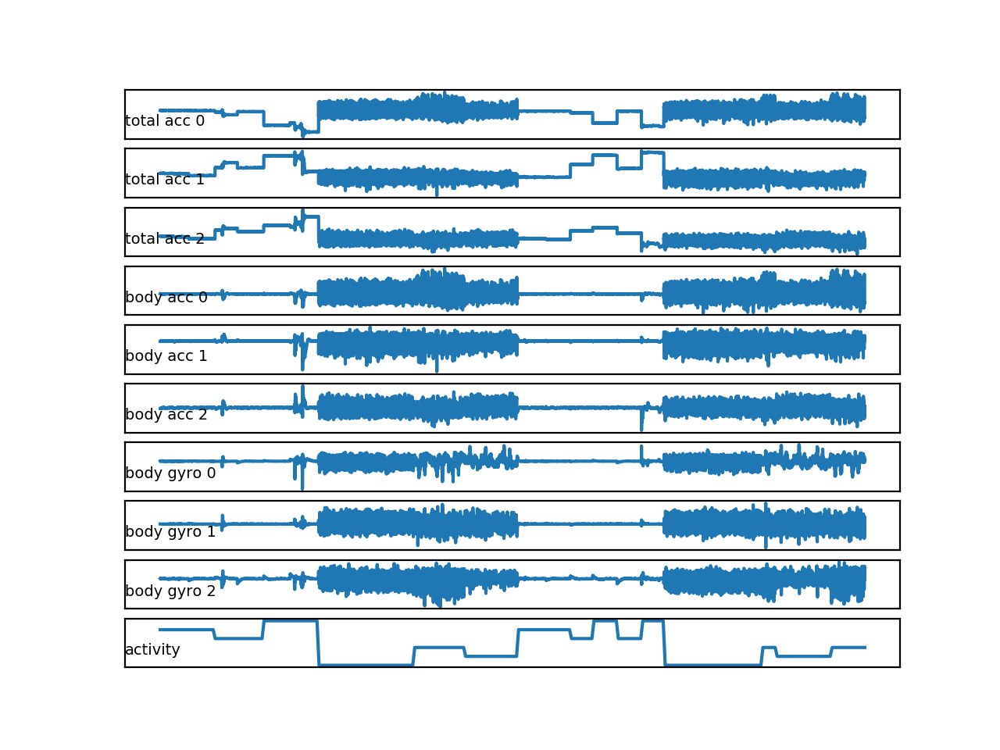
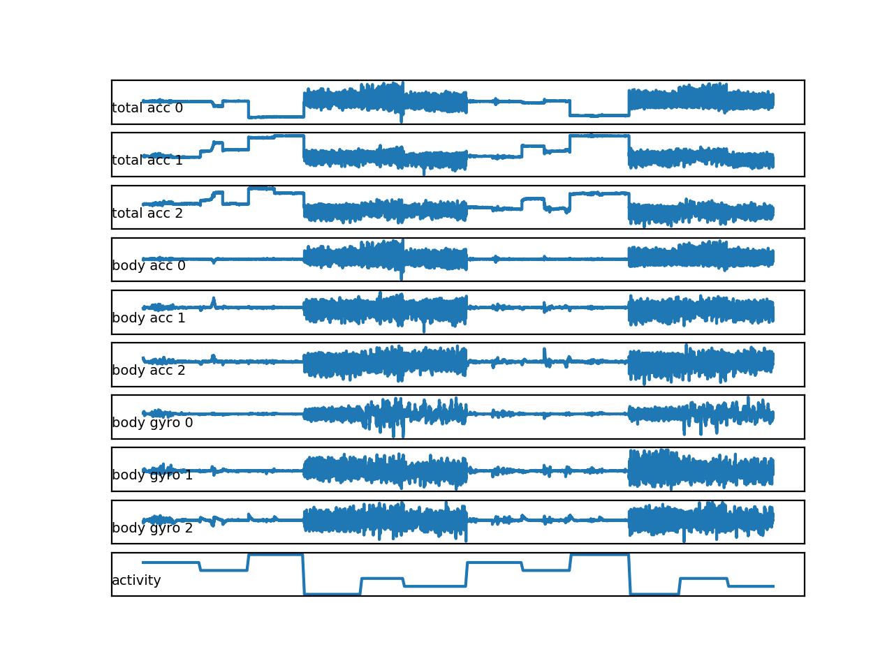
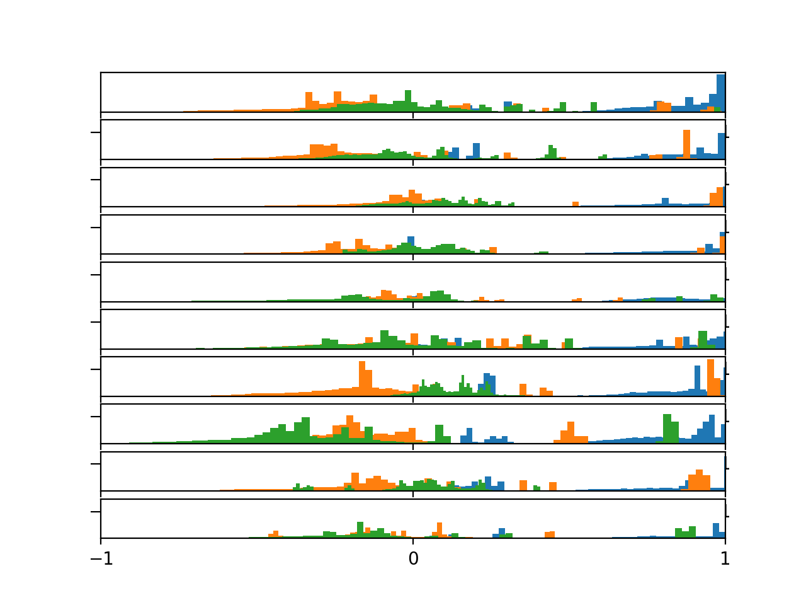
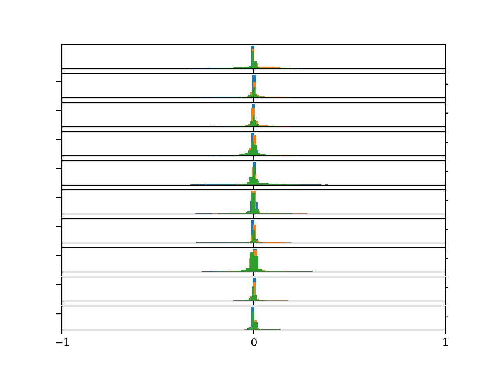
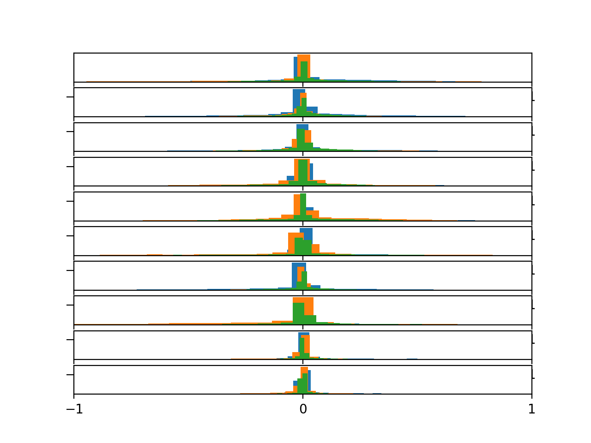
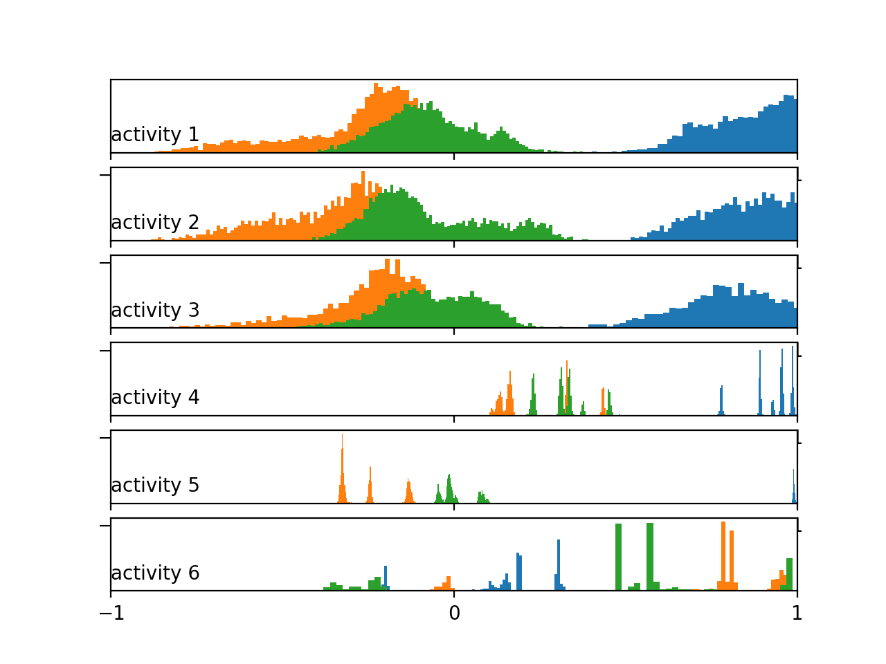
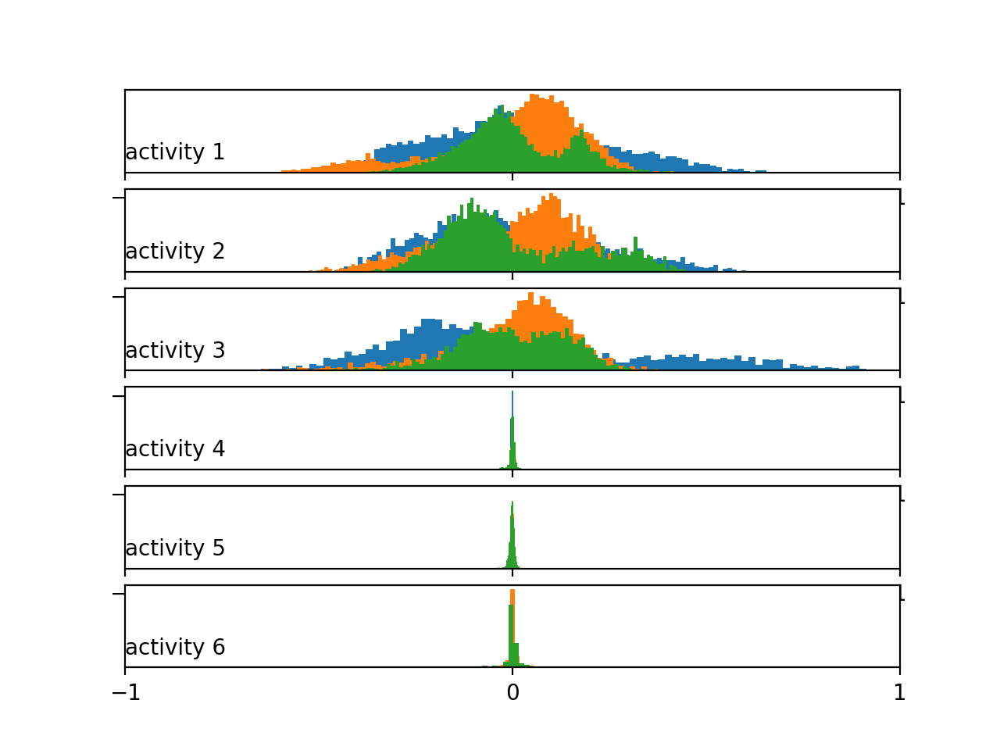
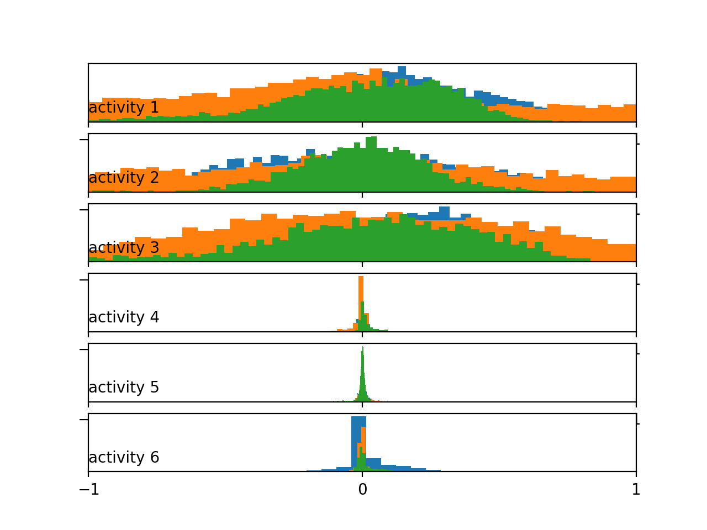
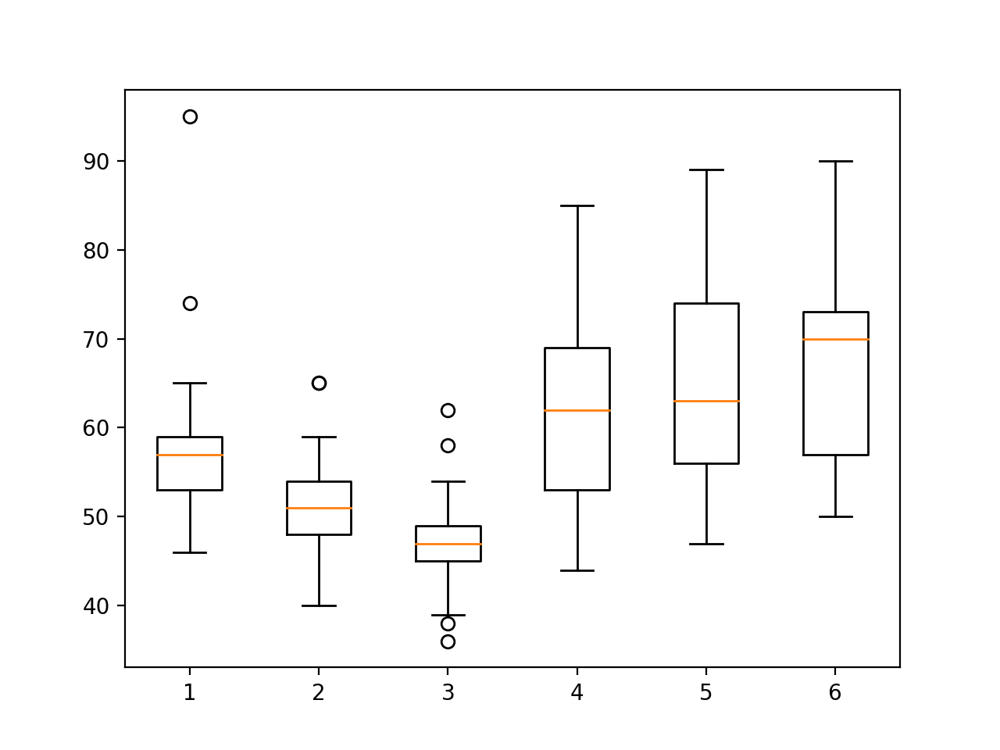
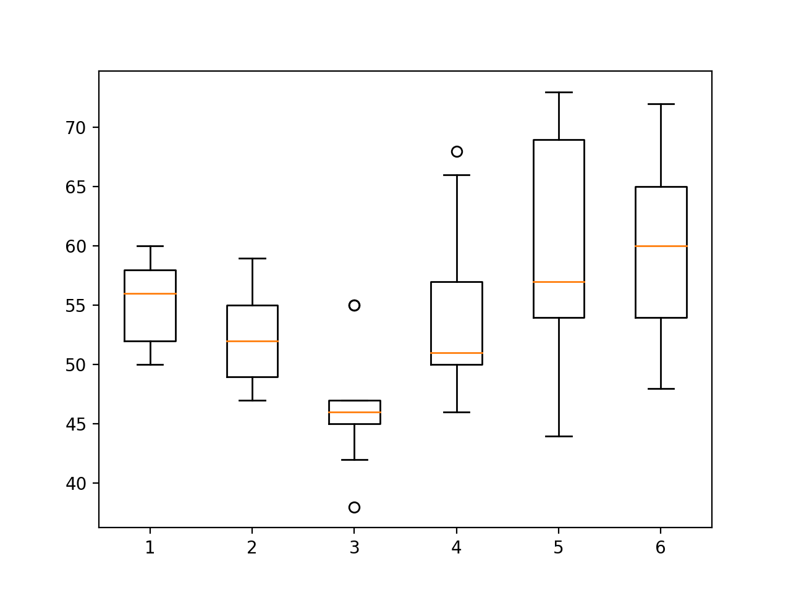

### How to Load and Explore Human Activity Data

Human activity recognition is the problem of classifying sequences of accelerometer data recorded
by specialized harnesses or smartphones into known well-defined movements. It is a challenging
problem given the large number of observations produced each second, the temporal nature of
the observations, and the lack of a clear way to relate accelerometer data to known movements.
Classical approaches to the problem involve hand crafting features from the time series data
based on fixed-sized windows and training machine learning models, such as ensembles of
decision trees. The difficulty is that this feature engineering requires deep expertise in the
field. Recently, deep learning methods such as recurrent neural networks and one-dimensional
convolutional neural networks, or CNNs, have been shown to provide state-of-the-art results on
challenging activity recognition tasks with little or no data feature engineering.
In this tutorial, you will discover theActivity Recognition Using Smartphonesdataset for
time series classification and how to load and explore the dataset in order to make it ready for
predictive modeling. This dataset will provided the basis for the remaining tutorials in this part
of the book. After completing this tutorial, you will know:

- How to download and load the dataset into memory.
- How to use line plots, histograms, and box plots to better understand the structure of the
motion data.
- How to model the problem, including framing, data preparation,
modeling, and evaluation.

Let’s get started.

#### Tutorial Overview

This tutorial is divided into 10 parts; they are:

1.  Activity Recognition Using Smartphones Dataset
2.  Download the Dataset
3.  Load the Dataset

4.  Balance of Activity Classes
5.  Plot Time Series Per Subject
6.  Plot Distribution Per Subject
7.  Plot Distribution Per Activity
8.  Plot Distribution of Activity Duration
9.  Approach to Modeling

#### Activity Recognition Using Smartphones Dataset

A standard human activity recognition dataset is the Activity Recognition Using Smartphones
dataset made available in 2012. It was prepared and made available by Davide Anguita, et
al. from the University of Genova, Italy and is described in full in their 2013 paper A Public
Domain Dataset for Human Activity Recognition Using Smartphones. The dataset was modeled
with machine learning algorithms in their 2012 paper titled Human Activity Recognition on
Smartphones using a Multiclass Hardware-Friendly Support Vector Machine. The dataset was
made available and can be downloaded for free from the UCI Machine Learning Repository.

The data was collected from 30 subjects aged between 19 and 48 years old performing one
of 6 standard activities while wearing a waist-mounted smartphone that recorded the movement
data. Video was recorded of each subject performing the activities and the movement data was
labeled manually from these videos. Below is an example video of a subject performing the
activities while their movement data is being recorded2. The six activities performed were as
follows:

1. Walking
2. Walking Upstairs
3. Walking Downstairs
4. Sitting
5. Standing
6. Laying

The movement data recorded was the x, y, and z accelerometer data (linear acceleration)
and gyroscopic data (angular velocity) from the smartphone, specifically a Samsung Galaxy S II.
Observations were recorded at 50 Hz (i.e. 50 data points per second). Each subject performed
the sequence of activities twice, once with the device on their left-hand-side and once with the
device on their right-hand side.

The raw data is not available. Instead, a pre-processed version of the dataset was made
available. The pre-processing steps included:
- Pre-processing accelerometer and gyroscope using noise filters.
- Splitting data into fixed windows of 2.56 seconds (128 data points) with 50% overlap.
- Splitting of accelerometer data into gravitational (total) and body motion components.

#### Download the Dataset

The data is provided as a single zip file that is about 58 megabytes in size. A direct for
downloading the dataset is provided below:
- HAR Smartphones.zip 3

Download the dataset and unzip all files into a new directory in your current working
directory named HARDataset. Inspecting the decompressed contents, you will notice a few
things:

- There are train and test folders containing the split portions of the data for modeling
(e.g. 70%/30%).
- There is a README.txt file that contains a detailed technical description of the dataset
and the contents of the unzipped files.
- There is a features.txt file that contains a technical description of the engineered
features.

The contents of the train and test folders are similar (e.g. folders and file names), although
with differences in the specific data they contain. Inspecting the train folder shows a few
important elements:

- An Inertial Signals folder that contains the preprocessed data.
- The X train.txt file that contains the engineered features intended for fitting a model.
- The y train.txt that contains the class labels for each observation (1-6).
- The subject train.txt file that contains a mapping of each line in the data files with
their subject identifier (1-30).

The number of lines in each file match, indicating that one row is one record in each data
file. The Inertial Signals directory contains 9 files.
- Gravitational acceleration data files for x, y and z axes: total acc x train.txt,
total acc y train.txt, total acc z train.txt.
- Body acceleration data files for x, y and z axes: body acc x train.txt,
body acc y train.txt, body acc z train.txt.
- Body gyroscope data files for x, y and z axes: body gyro x train.txt,
body gyro y train.txt, body gyro z train.txt.

The structure is mirrored in the test directory. We will focus our attention on the data in
the Inertial Signals as this is most interesting in developing machine learning models that
can learn a suitable representation, instead of using the domain-specific feature engineering.
Inspecting a datafile shows that columns are separated by whitespace and values appear to
be scaled to the range -1, 1. This scaling can be confirmed by a note in the README.txt file
provided with the dataset. Now that we know what data we have, we can figure out how to
load it into memory.

#### Load the Dataset

In this section, we will develop some code to load the dataset into memory. First, we need to
load a single file. We can use the read csv() Pandas function to load a single data file and
specify that the file has no header and to separate columns using white space.

```
dataframe = read_csv(filepath, header=None, delim_whitespace=True)

```

We can wrap this in a function namedloadfile(). The complete example of
this function is listed below.

```

from pandas import read_csv

def load_file(filepath):
dataframe = read_csv(filepath, header=None, delim_whitespace=True)
return dataframe.values

data = load_file('HARDataset/train/Inertial
Signals/total_acc_y_train.txt')

print(data.shape)

```

Running the example loads the filetotalaccytrain.txt, returns a NumPy array, and
prints the shape of the array. We can see that the training data is comprised of 7,352 rows or
windows of data, where each window has 128 observations.

```

(7352, 128)

```

Next, it would be useful to load a group of files, such as all of the body acceleration data
files as a single group. Ideally, when working with multivariate time series data, it is useful to
have the data structured in the format: [samples, timesteps, features]. This is helpful for
analysis and is the expectation of deep learning models such as convolutional neural networks
and recurrent neural networks. We can achieve this by calling the above load file() function
multiple times, once for each file in a group.

Once we have loaded each file as a NumPy array, we can combine or stack all three arrays
together. We can use the dstack() NumPy function to ensure that each array is stacked in
such a way that the features are separated in the third dimension, as we would prefer. The
function load group() implements this behavior for a list of file names and is listed below.

```
# load a list of files, such as x, y, z data for a given variable
def load_group(filenames, prefix=''):
loaded = list()
for name in filenames:
data = load_file(prefix + name)
loaded.append(data)
# stack group so that features are the 3rd dimension
loaded = dstack(loaded)
return loaded

```
We can demonstrate this function by loading all of the total acceleration files. The complete
example is listed below.

```

# load group of files from the har dataset
from numpy import dstack
from pandas import read_csv

# load a single file as a numpy array
def load_file(filepath):
dataframe = read_csv(filepath, header=None, delim_whitespace=True)
return dataframe.values

# load a list of files, such as x, y, z data for a given variable
def load_group(filenames, prefix=''):
loaded = list()
for name in filenames:
data = load_file(prefix + name)
loaded.append(data)
# stack group so that features are the 3rd dimension
loaded = dstack(loaded)
return loaded


filenames =
['total_acc_x_train.txt','total_acc_y_train.txt','total_acc_z_train.txt']
total_acc = load_group(filenames, prefix='HARDataset/train/Inertial
Signals/')
print(total_acc.shape)

```

Running the example prints the shape of the returned NumPy array,
showing the expected
number of samples and time steps with the three features, `x` , `y` , and `z` for
the dataset.

```
(7352, 128, 3)

```

Finally, we can use the two functions developed so far to load all data for the train and the
test dataset. Given the parallel structure in the train and test folders, we can develop a new
function that loads all input and output data for a given folder. The function can build a list of
all 9 data files to load, load them as one NumPy array with 9 features, then load the data file
containing the output class. The load dataset() function below implements this behavior. It
can be called for either the train group or the test group, passed as a string argument.

```
def load_dataset(group, prefix=''):
filepath = prefix + group + '/Inertial Signals/'

filenames = list()

filenames +=
['total_acc_x_'+group+'.txt','total_acc_y_'+group+'.txt',
'total_acc_z_'+group+'.txt']

filenames += ['body_acc_x_'+group+'.txt',
'body_acc_y_'+group+'.txt',
'body_acc_z_'+group+'.txt']
filenames +=
['body_gyro_x_'+group+'.txt','body_gyro_y_'+group+'.txt',
'body_gyro_z_'+group+'.txt']

X = load_group(filenames, filepath)

y = load_file(prefix + group +'/y_'+group+'.txt')
return X, y

```

The complete example is listed below.

```

from numpy import dstack
from pandas import read_csv

def load_file(filepath):
dataframe = read_csv(filepath, header=None, delim_whitespace=True)
return dataframe.values

def load_group(filenames, prefix=''):


loaded = list()
for name in filenames:
data = load_file(prefix + name)
loaded.append(data)
# stack group so that features are the 3rd dimension
loaded = dstack(loaded)
return loaded

# load a dataset group, such as train or test
def load_dataset(group, prefix=''):
filepath = prefix + group + '/Inertial Signals/'
# load all 9 files as a single array
filenames = list()
# total acceleration
filenames += ['total_acc_x_'+group+'.txt','total_acc_y_'+group+'.txt',
'total_acc_z_'+group+'.txt']
# body acceleration
filenames += ['body_acc_x_'+group+'.txt', 'body_acc_y_'+group+'.txt',
'body_acc_z_'+group+'.txt']
# body gyroscope
filenames += ['body_gyro_x_'+group+'.txt','body_gyro_y_'+group+'.txt',
'body_gyro_z_'+group+'.txt']
# load input data
X = load_group(filenames, filepath)
# load class output
y = load_file(prefix + group +'/y_'+group+'.txt')
return X, y

# load all train
trainX, trainy = load_dataset('train', 'HARDataset/')
print(trainX.shape, trainy.shape)
# load all test
testX, testy = load_dataset('test','HARDataset/')
print(testX.shape, testy.shape)

```

Running the example loads the train and test datasets. We can see that the test dataset
has 2,947 rows of window data. As expected, we can see that the size of windows in the train
and test sets matches and the size of the output (y) in each the train and test case matches the
number of samples.

```
(7352, 128, 9) (7352, 1)
(2947, 128, 9) (2947, 1)

```

#### Balance of Activity Classes

A good first check of the data is to investigate the balance of each activity. We believe that
each of the 30 subjects performed each of the six activities. Confirming this expectation will
both check that the data is indeed balanced, making it easier to model, and confirm that we are
correctly loading and interpreting the dataset. We can develop a function that summarizes the
breakdown of the output variables, e.g. the y variable. The function class breakdown() below
implements this behavior, first wrapping the provided NumPy array in a DataFrame, grouping
the rows by the class value, and calculating the size of each group (number of rows). The results
are then summarized, including the count and the percentage.

```
def class_breakdown(data):

df = DataFrame(data)

counts = df.groupby(0).size()

counts = counts.values
for i in range(len(counts)):
percent = counts[i] / len(df) * 100
print('Class=%d, total=%d, percentage=%.3f' % (i+1, counts[i],
percent))

```

It may be useful to summarize the breakdown of the classes in the train and test datasets
to ensure they have a similar breakdown, then compare the result to the breakdown on the
combined dataset. The complete example is listed below.

```

from numpy import vstack
from pandas import read_csv
from pandas import DataFrame

def load_file(filepath):
dataframe = read_csv(filepath, header=None, delim_whitespace=True)
return dataframe.values

def class_breakdown(data):

df = DataFrame(data)

counts = df.groupby(0).size()

counts = counts.values
for i in range(len(counts)):
percent = counts[i] / len(df) * 100
print('Class=%d, total=%d, percentage=%.3f' % (i+1, counts[i],
percent))

trainy = load_file('HARDataset/train/y_train.txt')

print('Train Dataset')
class_breakdown(trainy)
testy = load_file('HARDataset/test/y_test.txt')


print('Test Dataset')
class_breakdown(testy)

# summarize combined class breakdown
print('Both')
combined = vstack((trainy, testy))
class_breakdown(combined)

```

Running the example first summarizes the breakdown for the training set. We can see a
pretty similar distribution of each class hovering between 13% and 19% of the dataset. The
result on the test set and on both datasets together look very similar. It is likely safe to work
with the dataset assuming the distribution of classes is balanced per
train and test set and
perhaps per subject.

```
Train Dataset
Class=1, total=1226, percentage=16.676
Class=2, total=1073, percentage=14.595
Class=3, total=986, percentage=13.411
Class=4, total=1286, percentage=17.492
Class=5, total=1374, percentage=18.689
Class=6, total=1407, percentage=19.138

Test Dataset
Class=1, total=496, percentage=16.831
Class=2, total=471, percentage=15.982
Class=3, total=420, percentage=14.252
Class=4, total=491, percentage=16.661
Class=5, total=532, percentage=18.052
Class=6, total=537, percentage=18.222

Both
Class=1, total=1722, percentage=16.720
Class=2, total=1544, percentage=14.992
Class=3, total=1406, percentage=13.652
Class=4, total=1777, percentage=17.254
Class=5, total=1906, percentage=18.507
Class=6, total=1944, percentage=18.876

```

#### Plot Time Series Per Subject

We are working with time series data, therefore an import check is to
create a line plot of the
raw data. The raw data is comprised of windows of time series data per variable, and the
windows do have a 50% overlap. This suggests we may see some repetition
in the observations
as a line plot unless the overlap is removed. We can start off by loading the training dataset
using the functions developed above.

```
# load data
trainX, trainy = load_dataset('train', 'HARDataset/')

```

Next, we can load the subject train.txt in the train directory that provides a mapping
of rows to the subject to which it belongs. We can load this file using the load file() function.
Once loaded, we can also use the unique() NumPy function to retrieve a list of the unique
subjects in the training dataset.

```
# load subject mapping
sub_map = load_file('HARDataset/train/subject_train.txt')
train_subjects = unique(sub_map)
print(train_subjects)

```

Next, we need a way to retrieve all of the rows for a single subject, e.g. subject number 1.
We can do this by finding all of the row numbers that belong to a given subject and use those
row numbers to select the samples from the loaded X and y data from the training dataset. The
data for subject() function below implements this behavior. It will take the loaded training
data, the loaded mapping of row number to subjects, and the subject identification number for
the subject that we are interested in, and will return the X and y data for only that subject.

```
# get all data for one subject
def data_for_subject(X, y, sub_map, sub_id):
# get row indexes for the subject id
ix = [i for i in range(len(sub_map)) if sub_map[i]==sub_id]
# return the selected samples
return X[ix, :, :], y[ix]

```

Now that we have data for one subject, we can plot it. The data is comprised of windows
with overlap. We can write a function to remove this overlap and squash the windows down
for a given variable into one long sequence that can be plotted directly as a line plot. The
to series() function below implements this behavior for a given variable, e.g. array of windows.

```
# convert a series of windows to a 1D list
def to_series(windows):
series = list()
for window in windows:
# remove the overlap from the window
half = int(len(window) / 2) - 1
for value in window[-half:]:
series.append(value)
return series

```

Finally, we have enough to plot the data. We can plot each of the nine variables for the
subject in turn and a final plot for the activity level. Each series will have the same number of
time steps (length of x-axis), therefore, it may be useful to create a subplot for each variable and
align all plots vertically so we can compare the movement on each variable. Theplotsubject()
function below implements this behavior for the `X` and `y` data for a single subject. The function
assumes the same order of the variables (3rd axis) as was loaded in theloaddataset() function.
A crude title is also added to each plot so we don’t get easily confused
about what we are looking at.

```
# plot the data for one subject


def plot_subject(X, y):
pyplot.figure()

n, off = X.shape[2] + 1, 0
for i in range(3):
pyplot.subplot(n, 1, off+1)
pyplot.plot(to_series(X[:, :, off]))
pyplot.title('total acc'+str(i), y=0, loc='left', size=7)

pyplot.yticks([])
pyplot.xticks([])
off += 1
for i in range(3):
pyplot.subplot(n, 1, off+1)
pyplot.plot(to_series(X[:, :, off]))
pyplot.title('body acc'+str(i), y=0, loc='left', size=7)

pyplot.yticks([])
pyplot.xticks([])
off += 1
for i in range(3):
pyplot.subplot(n, 1, off+1)
pyplot.plot(to_series(X[:, :, off]))
pyplot.title('body gyro'+str(i), y=0, loc='left', size=7)

pyplot.yticks([])
pyplot.xticks([])
off += 1

pyplot.subplot(n, 1, n)
pyplot.plot(y)
pyplot.title('activity', y=0, loc='left', size=7)

pyplot.yticks([])
pyplot.xticks([])
pyplot.show()

```
The complete example is listed below.

```

from numpy import dstack
from numpy import unique
from pandas import read_csv
from matplotlib import pyplot

def load_file(filepath):
dataframe = read_csv(filepath, header=None, delim_whitespace=True)
return dataframe.values

def load_group(filenames, prefix=''):


loaded = list()
for name in filenames:
data = load_file(prefix + name)
loaded.append(data)
# stack group so that features are the 3rd dimension
loaded = dstack(loaded)
return loaded

def load_dataset(group, prefix=''):
filepath = prefix + group + '/Inertial Signals/'

filenames = list()

filenames +=
['total_acc_x_'+group+'.txt','total_acc_y_'+group+'.txt',
'total_acc_z_'+group+'.txt']

filenames += ['body_acc_x_'+group+'.txt',
'body_acc_y_'+group+'.txt',
'body_acc_z_'+group+'.txt']
filenames +=
['body_gyro_x_'+group+'.txt','body_gyro_y_'+group+'.txt',
'body_gyro_z_'+group+'.txt']

X = load_group(filenames, filepath)

y = load_file(prefix + group +'/y_'+group+'.txt')
return X, y

def data_for_subject(X, y, sub_map, sub_id):

ix = [i for i in range(len(sub_map)) if sub_map[i]==sub_id]

return X[ix, :, :], y[ix]

def to_series(windows):
series = list()
for window in windows:

half = int(len(window) / 2) - 1
for value in window[-half:]:
series.append(value)
return series

def plot_subject(X, y):
pyplot.figure()

n, off = X.shape[2] + 1, 0
for i in range(3):
pyplot.subplot(n, 1, off+1)
pyplot.plot(to_series(X[:, :, off]))
pyplot.title('total acc'+str(i), y=0, loc='left', size=7)


pyplot.yticks([])
pyplot.xticks([])
off += 1
# plot body acc
for i in range(3):
pyplot.subplot(n, 1, off+1)
pyplot.plot(to_series(X[:, :, off]))
pyplot.title('body acc'+str(i), y=0, loc='left', size=7)
# turn off ticks to remove clutter
pyplot.yticks([])
pyplot.xticks([])
off += 1
# plot body gyro
for i in range(3):
pyplot.subplot(n, 1, off+1)
pyplot.plot(to_series(X[:, :, off]))
pyplot.title('body gyro'+str(i), y=0, loc='left', size=7)
# turn off ticks to remove clutter
pyplot.yticks([])
pyplot.xticks([])
off += 1
# plot activities
pyplot.subplot(n, 1, n)
pyplot.plot(y)
pyplot.title('activity', y=0, loc='left', size=7)
# turn off ticks to remove clutter
pyplot.yticks([])
pyplot.xticks([])
pyplot.show()

# load data
trainX, trainy = load_dataset('train', 'HARDataset/')
# load mapping of rows to subjects
sub_map = load_file('HARDataset/train/subject_train.txt')
train_subjects = unique(sub_map)
print(train_subjects)
# get the data for one subject
sub_id = train_subjects[0]
subX, suby = data_for_subject(trainX, trainy, sub_map, sub_id)
print(subX.shape, suby.shape)
# plot data for subject
plot_subject(subX, suby)

```

Running the example prints the unique subjects in the training dataset, the sample of the
data for the first subject, and creates one figure with 10 plots, one for each of the nine input
variables and the output class.

```
[ 1 3 5 6 7 8 11 14 15 16 17 19 21 22 23 25 26 27 28 29 30]
(341, 128, 9) (341, 1)

```

In the plot, we can see periods of large movement corresponding with activities 1, 2, and
3: the walking activities. We can also see much less activity (i.e. a
relatively straight line) for
higher numbered activities, 4, 5, and 6 (sitting, standing, and laying). This is good confirmation
that we have correctly loaded interpreted the raw dataset. We can see that this subject has
performed the same general sequence of activities twice, and some activities are performed more
than two times. This suggests that for a given subject, we should not make assumptions about
what activities may have been performed or their order.

We can also see some relatively large movement for some stationary activities, such as laying.
It is possible that these are outliers or related to activity transitions. It may be possible to
smooth or remove these observations as outliers. Finally, we see a lot of commonality across
the nine variables. It is very likely that only a subset of these traces are required to develop a
predictive model.



We can re-run the example for another subject by making one small change, e.g. choose the
identifier of the second subject in the training dataset.

```
# get the data for one subject
sub_id = train_subjects[1]

```
The plot for the second subject shows similar behavior with no surprises. The double
sequence of activities does appear more regular than the first subject.



#### Plot Distribution Per Subject

As the problem is framed, we are interested in using the movement data from some subjects
to predict activities from the movement of other subjects. This suggests that there must be
regularity in the movement data across subjects. We know that the data has been scaled between
-1 and 1, presumably per subject, suggesting that the amplitude of the
detected movements
will be similar. We would also expect that the distribution of movement data would be similar
across subjects, given that they performed the same actions.
We can check for this by plotting and comparing the histograms of the movement data across
subjects. A useful approach would be to create one plot per subject and plot all three axis of a
given data (e.g. total acceleration), then repeat this for multiple subjects. The plots can be
modified to use the same axis and aligned horizontally so that the distributions for each variable
across subjects can be compared. Theplotsubjecthistograms() function below implements
this behavior. The function takes the loaded dataset and mapping of rows to subjects as well as
a maximum number of subjects to plot, fixed at 10 by default.

```
# plot histograms for multiple subjects
def plot_subject_histograms(X, y, sub_map, offset, n=10):
pyplot.figure()
# get unique subjects


subject_ids = unique(sub_map[:,0])
# enumerate subjects
for k in range(n):
sub_id = subject_ids[k]
# get data for one subject
subX, _ = data_for_subject(X, y, sub_map, sub_id)
# total acc
for i in range(3):
ax = pyplot.subplot(n, 1, k+1)
ax.set_xlim(-1,1)
ax.hist(to_series(subX[:,:,offset+i]), bins=100)
pyplot.yticks([])
pyplot.xticks([-1,0,1])
pyplot.show()

```
The addition of anoffsetargument allows the same function to be called for each of the 3
groups of variables to plot at a time: total acceleration, body acceleration and gyroscopic with
offsets 0, 3 and 6 respectively.

```
# plot total acceleration histograms for subjects
plot_subject_histograms(X, y, sub_map, 0)
# plot body acceleration histograms for subjects
plot_subject_histograms(X, y, sub_map, 3)
# plot gyroscopic histograms for subjects
plot_subject_histograms(X, y, sub_map, 6)

```

For a given call, a plot is created for each subject and the three variables for one data type
are plotted as histograms with 100 bins, to help to make the distribution obvious. Each plot
shares the same axis, which is fixed at the bounds of -1 and 1. The complete example is listed
below.

```
# plot histograms for multiple subjects from the har dataset
from numpy import unique
from numpy import dstack
from pandas import read_csv
from matplotlib import pyplot

# load a single file as a numpy array
def load_file(filepath):
dataframe = read_csv(filepath, header=None, delim_whitespace=True)
return dataframe.values

# load a list of files, such as x, y, z data for a given variable
def load_group(filenames, prefix=''):
loaded = list()
for name in filenames:
data = load_file(prefix + name)
loaded.append(data)
# stack group so that features are the 3rd dimension
loaded = dstack(loaded)
return loaded


def load_dataset(group, prefix=''):
filepath = prefix + group + '/Inertial Signals/'

filenames = list()

filenames +=
['total_acc_x_'+group+'.txt','total_acc_y_'+group+'.txt',
'total_acc_z_'+group+'.txt']

filenames += ['body_acc_x_'+group+'.txt',
'body_acc_y_'+group+'.txt',
'body_acc_z_'+group+'.txt']
filenames +=
['body_gyro_x_'+group+'.txt','body_gyro_y_'+group+'.txt',
'body_gyro_z_'+group+'.txt']

X = load_group(filenames, filepath)

y = load_file(prefix + group +'/y_'+group+'.txt')
return X, y

def data_for_subject(X, y, sub_map, sub_id):

ix = [i for i in range(len(sub_map)) if sub_map[i]==sub_id]

return X[ix, :, :], y[ix]

def to_series(windows):
series = list()
for window in windows:

half = int(len(window) / 2) - 1
for value in window[-half:]:
series.append(value)
return series

def plot_subject_histograms(X, y, sub_map, offset, n=10):
pyplot.figure()

subject_ids = unique(sub_map[:,0])

for k in range(n):
sub_id = subject_ids[k]

subX, _ = data_for_subject(X, y, sub_map, sub_id)
for i in range(3):
ax = pyplot.subplot(n, 1, k+1)
ax.set_xlim(-1,1)
ax.hist(to_series(subX[:,:,offset+i]), bins=100)
pyplot.yticks([])
pyplot.xticks([-1,0,1])
pyplot.show()


X, y = load_dataset('train','HARDataset/')

sub_map = load_file('HARDataset/train/subject_train.txt')

plot_subject_histograms(X, y, sub_map, 0)

plot_subject_histograms(X, y, sub_map, 3)

plot_subject_histograms(X, y, sub_map, 6)

```

Running the example creates three figures, each with 10 plots with
histograms for the three
axis. Each of the three axes on a given plot have a different color,
specifically `x` , `y` , and `z` are
blue, orange, and green respectively. The first figure summarizes the
total acceleration. We can
see that the distribution for a given axis does appear Gaussian with
large separate groups of
data. We can see some of the distributions align (e.g. main groups in
the middle around 0.0),
suggesting there may be some continuity of the movement data across
subjects, at least for this
data.



The second figure shows histograms for the body acceleration with very different results.
We can see all data clustered around 0.0 across axis within a subject
and across subjects.
This suggests that perhaps the data was centered (zero mean). This
strong consistency across
subjects may aid in modeling, and may suggest that the differences across subjects in the total
acceleration data may not be as helpful.



Finally, a figure is generated summarizing the distribution the
gyroscopic data for the first

10 subjects. We see a high likelihood of a Gaussian distribution for
each axis across each

subject centered on 0.0. The distributions are a little wider and show fatter tails, but this is an
encouraging finding for modeling movement data across subjects.



#### Plot Distribution Per Activity

We are interested in discriminating between activities based on activity
data. The simplest

case for this would be to discriminate between activities for a single subject. One way to
investigate this would be to review the distribution of movement data for a subject by activity.

We would expect to see some difference in the distribution between the
movement data for

different activities by a single subject.
We can review this by creating a histogram plot per activity, with the three axis of a
given data type on each plot. Again, the plots can be arranged horizontally to compare the
distribution of each data axis by activity. We would expect to see differences in the distributions
across activities down the plots. First, we must group the traces for a subject by activity. The
databyactivity() function below implements this behavior.

```
# group data by activity
def data_by_activity(X, y, activities):
# group windows by activity
return {a:X[y[:,0]==a, :, :] for a in activities}

```

We can now create plots per activity for a given subject. Theplotactivityhistograms()
function below implements this function for the traces data for a given subject. First, the data
is grouped by activity, then one subplot is created for each activity and each axis of the data
type is added as a histogram.

```
# plot histograms for each activity for a subject
def plot_activity_histograms(X, y, offset):
# get a list of unique activities for the subject
activity_ids = unique(y[:,0])
# group windows by activity
grouped = data_by_activity(X, y, activity_ids)
# plot per activity, histograms for each axis
pyplot.figure()
for k in range(len(activity_ids)):
act_id = activity_ids[k]
# total acceleration
for i in range(3):
ax = pyplot.subplot(len(activity_ids), 1, k+1)
ax.set_xlim(-1,1)
# create histogra,
pyplot.hist(to_series(grouped[act_id][:,:,offset+i]), bins=100)
# create title
pyplot.title('activity'+str(act_id), y=0, loc='left', size=10)
# simplify axis
pyplot.yticks([])
pyplot.xticks([-1,0,1])
pyplot.show()

```

As in the previous section, the addition of anoffsetargument allows the same function
to be called for each of the 3 groups of variables to plot at a time: total acceleration, body
acceleration and gyroscopic with offsets 0, 3 and 6 respectively.

```
# plot total acceleration histograms per activity for a subject
plot_activity_histograms(subX, suby, 0)
# plot body acceleration histograms per activity for a subject
plot_activity_histograms(subX, suby, 3)
# plot gyroscopic histograms per activity for a subject
plot_activity_histograms(subX, suby, 6)

```

The complete example is listed below.

```
# plot histograms per activity for a subject from the har dataset
from numpy import dstack
from numpy import unique
from pandas import read_csv
from matplotlib import pyplot

# load a single file as a numpy array
def load_file(filepath):
dataframe = read_csv(filepath, header=None, delim_whitespace=True)
return dataframe.values


def load_group(filenames, prefix=''):
loaded = list()
for name in filenames:
data = load_file(prefix + name)
loaded.append(data)

loaded = dstack(loaded)
return loaded

def load_dataset(group, prefix=''):
filepath = prefix + group + '/Inertial Signals/'

filenames = list()

filenames +=
['total_acc_x_'+group+'.txt','total_acc_y_'+group+'.txt',
'total_acc_z_'+group+'.txt']

filenames += ['body_acc_x_'+group+'.txt',
'body_acc_y_'+group+'.txt',
'body_acc_z_'+group+'.txt']
filenames +=
['body_gyro_x_'+group+'.txt','body_gyro_y_'+group+'.txt',
'body_gyro_z_'+group+'.txt']

X = load_group(filenames, filepath)

y = load_file(prefix + group +'/y_'+group+'.txt')
return X, y

def data_for_subject(X, y, sub_map, sub_id):

ix = [i for i in range(len(sub_map)) if sub_map[i]==sub_id]

return X[ix, :, :], y[ix]

def to_series(windows):
series = list()
for window in windows:

half = int(len(window) / 2) - 1
for value in window[-half:]:
series.append(value)
return series

def data_by_activity(X, y, activities):

return {a:X[y[:,0]==a, :, :] for a in activities}

def plot_activity_histograms(X, y, offset):

activity_ids = unique(y[:,0])


# group windows by activity
grouped = data_by_activity(X, y, activity_ids)
# plot per activity, histograms for each axis
pyplot.figure()
for k in range(len(activity_ids)):
act_id = activity_ids[k]
# total acceleration
for i in range(3):
ax = pyplot.subplot(len(activity_ids), 1, k+1)
ax.set_xlim(-1,1)
# create histogra,
pyplot.hist(to_series(grouped[act_id][:,:,offset+i]), bins=100)
# create title
pyplot.title('activity'+str(act_id), y=0, loc='left', size=10)
# simplify axis
pyplot.yticks([])
pyplot.xticks([-1,0,1])
pyplot.show()
trainX, trainy = load_dataset('train', 'HARDataset/')

sub_map = load_file('HARDataset/train/subject_train.txt')
train_subjects = unique(sub_map)

sub_id = train_subjects[0]
subX, suby = data_for_subject(trainX, trainy, sub_map, sub_id)

plot_activity_histograms(subX, suby, 0)

plot_activity_histograms(subX, suby, 3)

plot_activity_histograms(subX, suby, 6)

```

Running the example creates three figures, where each figure has with six subplots, one
for each activity for the first subject in the train dataset. Each of the x, y, and z axes for
the total acceleration data have a blue, orange, and green histogram respectively. In the first
figure, can see that each activity has a different data distribution, with a marked difference
between the large movement (first three activities) with the stationary activities (last three
activities). Data distributions for the first three activities look Gaussian with perhaps differing
means and standard deviations. Distributions for the latter activities look multi-modal (i.e.
multiple peaks).



The second figure summarizes the body acceleration distributions per activity. We can
see more similar distributions across the activities amongst the in-motion vs. stationary
activities. The data looks bimodal in the case of the in-motion activities and perhaps Gaussian
or exponential in the case of the stationary activities. The pattern we see with the total vs.
body acceleration distributions by activity mirrors what we see with the same data types across
subjects in the previous section. Perhaps the total acceleration data is the key to discriminating
the activities.



The final figure summarizes the gyroscopic data per activity for the first subject. We can see
plots with the similar pattern as the body acceleration data, although showing perhaps fat-tailed
Gaussian-like distributions instead of bimodal distributions for the in-motion activities.



All of these plots were created for the first subject, and we would expect to see similar
distributions and relationships for the movement data across activities for other subjects.

#### Plot Distribution of Activity Duration

A final area to consider is how long a subject spends on each activity. This is closely related to
the balance of classes. If the activities (classes) are generally balanced within a dataset, then
we expect the balance of activities for a given subject over the course of their trace would also
be reasonably well balanced. We can confirm this by calculating how long (in samples or rows)
each subject spends on each activity and look at the distribution of durations for each activity.
A handy way to review this data is to summarize the distributions as box plots showing the
median (line), the middle 50% (box), the general extent of the data as the interquartile range
(the whiskers), and outliers (as dots). The function plot activity durations by subject()
below implements this behavior by first splitting the dataset by subject, then the subjects data
by activity and counting the rows spent on each activity, before finally creating a box plot per
activity of the duration measurements.

```
# plot activity durations by subject
def plot_activity_durations_by_subject(X, y, sub_map):
# get unique subjects and activities

subject_ids = unique(sub_map[:,0])
activity_ids = unique(y[:,0])
# enumerate subjects
activity_windows = {a:list() for a in activity_ids}
for sub_id in subject_ids:
# get data for one subject
_, subj_y = data_for_subject(X, y, sub_map, sub_id)
# count windows by activity
for a in activity_ids:
activity_windows[a].append(len(subj_y[subj_y[:,0]==a]))
# organize durations into a list of lists
durations = [activity_windows[a] for a in activity_ids]
pyplot.boxplot(durations, labels=activity_ids)
pyplot.show()

```
The complete example is listed below.

```

from numpy import dstack
from numpy import unique
from pandas import read_csv
from matplotlib import pyplot

def load_file(filepath):
dataframe = read_csv(filepath, header=None, delim_whitespace=True)
return dataframe.values

def load_group(filenames, prefix=''):
loaded = list()
for name in filenames:
data = load_file(prefix + name)
loaded.append(data)

loaded = dstack(loaded)
return loaded

def load_dataset(group, prefix=''):
filepath = prefix + group + '/Inertial Signals/'

filenames = list()

filenames +=
['total_acc_x_'+group+'.txt','total_acc_y_'+group+'.txt',
'total_acc_z_'+group+'.txt']

filenames += ['body_acc_x_'+group+'.txt',
'body_acc_y_'+group+'.txt',
'body_acc_z_'+group+'.txt']
filenames +=
['body_gyro_x_'+group+'.txt','body_gyro_y_'+group+'.txt',
'body_gyro_z_'+group+'.txt']

X = load_group(filenames, filepath)


y = load_file(prefix + group +'/y_'+group+'.txt')
return X, y

def data_for_subject(X, y, sub_map, sub_id):

ix = [i for i in range(len(sub_map)) if sub_map[i]==sub_id]

return X[ix, :, :], y[ix]

def to_series(windows):
series = list()
for window in windows:

half = int(len(window) / 2) - 1
for value in window[-half:]:
series.append(value)
return series

def data_by_activity(X, y, activities):

return {a:X[y[:,0]==a, :, :] for a in activities}

def plot_activity_durations_by_subject(X, y, sub_map):

subject_ids = unique(sub_map[:,0])
activity_ids = unique(y[:,0])

activity_windows = {a:list() for a in activity_ids}
for sub_id in subject_ids:

_, subj_y = data_for_subject(X, y, sub_map, sub_id)

for a in activity_ids:
activity_windows[a].append(len(subj_y[subj_y[:,0]==a]))

durations = [activity_windows[a] for a in activity_ids]
pyplot.boxplot(durations, labels=activity_ids)
pyplot.show()

X, y = load_dataset('train','HARDataset/')

sub_map = load_file('HARDataset/train/subject_train.txt')
plot_activity_durations_by_subject(X, y, sub_map)

```

Running the example creates six box plots, one for each activity. Each box plot summarizes
how long (in rows or the number of windows) subjects in the training dataset spent on each
activity. We can see that the subjects spent more time on stationary activities (4, 5 and 6) and
less time on the in motion activities (1, 2 and 3), with the distribution for 3 being the smallest,
or where time was spent least. The spread across the activities is not large, suggesting little
need to trim the longer duration activities or oversampling of the in-motion activities. Although,
these approaches remain available if skill of a predictive model on the in-motion activities is
generally worse.



We can create a similar box plot for the training data with the
following additional lines.

```
X, y = load_dataset('test','HARDataset/')

sub_map = load_file('HARDataset/test/subject_test.txt')
plot_activity_durations_by_subject(X, y, sub_map)

```

Running the updated example shows a similar relationship between activities. This is
encouraging, suggesting that indeed the test and training dataset are reasonably representative
of the whole dataset



Now that we have explored the dataset, we can suggest some ideas for how it may be
modeled.

#### Approach to Modeling

In this section, we summarize some approaches to modeling the activity recognition dataset.

These ideas are divided into the main themes of a project.

###### Problem Framing

The first important consideration is the framing of the prediction problem. The framing of the
problem as described in the original work is the prediction of activity for a new subject given
their movement data, based on the movement data and activities of known subjects. We can
summarize this as:
- Predict activity given a window of movement data.

This is a reasonable and useful framing of the problem. Some other possible ways to frame
the provided data as a prediction problem include the following:

- Predict activity given a time step of movement data.

- Predict activity given multiple windows of movement data.

- Predict the activity sequence given multiple windows of movement data.

- Predict activity given a sequence of movement data for a pre-segmented
activity.

- Predict activity cessation or transition given a time step of movement
data.

- Predict a stationary or non-stationary activity given a window of
movement data.

Some of these framings may be too challenging or too easy. Nevertheless, these framings
provide additional ways to explore and understand the dataset.

#### Data Preparation

Some data preparation may be required prior to using the raw data to train a model. The data
already appears to have been scaled to the range[-1,1]. Some additional data transforms that
could be performed prior to modeling include:

- Normalization across subjects.

- Standardization per subject.

- Standardization across subjects.

- Axis feature selection.

- Data type feature selection.

- Signal outlier detection and removal.

- Removing windows of over-represented activities.

- Oversampling windows of under-represented activities.

- Downsampling signal data to^14 ,^12 , 1, 2 or other fractions of a
section.

#### Predictive Modeling

Generally, the problem is a time series multiclass classification problem. As we have seen, it
may also be framed as a binary classification problem and a multi-step time series classification
problem. The original paper explored the use of a classical machine learning algorithm on a
version of the dataset where features were engineered from each window of data. Specifically, a
modified support vector machine.

The results of an SVM on the feature-engineered version of the dataset may provide a
baseline in performance on the problem. Expanding from this point, the evaluation of multiple
linear, nonlinear, and ensemble machine learning algorithms on this version of the dataset may
provide an improved benchmark. The focus of the problem may be on the un-engineered or raw
version of the dataset. Here, a progression in model complexity may be explored in order to
determine the most suitable model for the problem; some candidate models to explore include:

- Common linear, nonlinear, and ensemble machine learning algorithms.

- Multilayer Perceptron.

- Convolutional neural networks, specifically 1D CNNs.

- Recurrent neural networks, specifically LSTMs.

- Hybrids of CNNs and LSTMs such as the CNN-LSTM and the ConvLSTM.

#### Model Evaluation

The evaluation of the model in the original paper involved using a train/test split of the data by
subject with a 70% and 30% ratio. Exploration of this pre-defined split of the data suggests that
both sets are reasonably representative of the whole dataset. Another alternative methodology
may be to use leave-one-out cross-validation, or LOOCV, per subject. In addition to giving
the data for each subject the opportunity for being used as the withheld test set, the approach
would provide a population of 30 scores that can be averaged and summarized, which may offer
a more robust result.

Model performance was presented using classification accuracy and a confusion matrix, both
of which are suitable for the multiclass nature of the prediction problem. Specifically, the
confusion matrix will aid in determining whether some classes are easier or more challenging to
predict than others, such as those for stationary activities versus those activities that involve
motion.

#### Extensions

This section lists some ideas for extending the tutorial that you may
wish to explore.

- List Intuitions. Outline the method that you believe may be most effective in making
forecasts with on this dataset.

- Apply Taxonomy. Use the taxonomy in Chapter 2 to describe the dataset presented in
this chapter.

- Additional Analysis. Use summary statistics and/or plots to explore one more aspect
of the dataset that may provide insight into modeling this problem.


#### Further Reading

This section provides more resources on the topic if you are looking to
go deeper.

Papers

- Deep Learning for Sensor-based Activity Recognition: A Survey, 2017.
https://arxiv.org/abs/1707.03502

- A Public Domain Dataset for Human Activity Recognition Using Smartphones, 2013.
https://upcommons.upc.edu/handle/2117/20897

- Human Activity Recognition on Smartphones using a Multiclass Hardware-Friendly Support
Vector Machine, 2012.
https://link.springer.com/chapter/10.1007/978-3-642-35395-6_30

API

- pandas.readcsvAPI.
http://pandas.pydata.org/pandas-docs/stable/generated/pandas.read_csv.html

- numpy.dstackAPI.
https://www.numpy.org/devdocs/reference/generated/numpy.dstack.html

Articles

- Human Activity Recognition Dataset, UCI Machine Learning Repository.

- Activity recognition, Wikipedia.
https://en.wikipedia.org/wiki/Activity_recognition

- Activity Recognition Experiment Using Smartphone Sensors, YouTube.
https://www.youtube.com/watch?v=XOEN9W05_4A

####  Summary

In this tutorial, you discovered the Activity Recognition Using Smartphones Dataset for time
series classification and how to load and explore the dataset in order to make it ready for
predictive modeling. Specifically, you learned:

- How to download and load the dataset into memory.

- How to use line plots, histograms, and box plots to better understand the structure of the
motion data.

- How to model the problem including framing, data preparation,
modeling, and evaluation.
