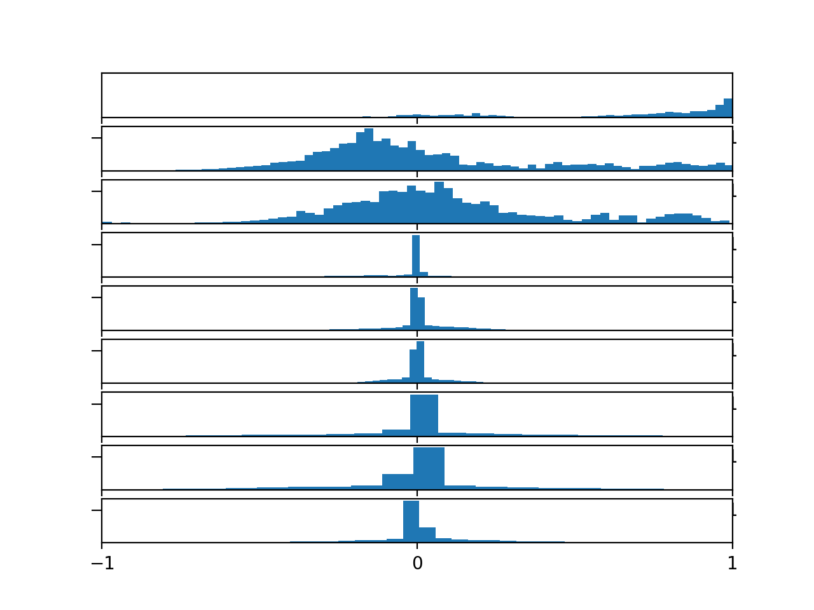
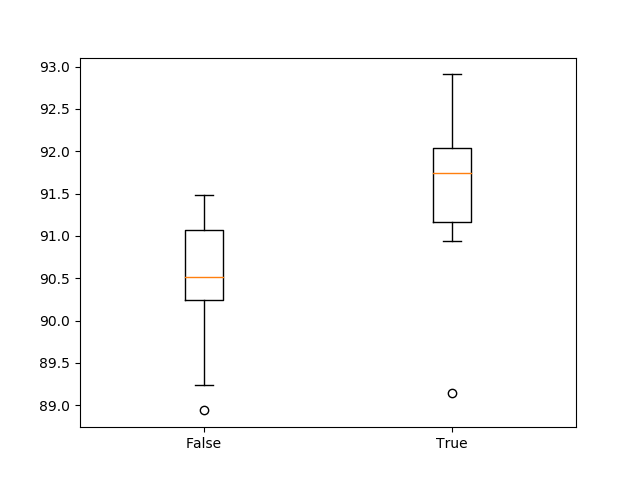
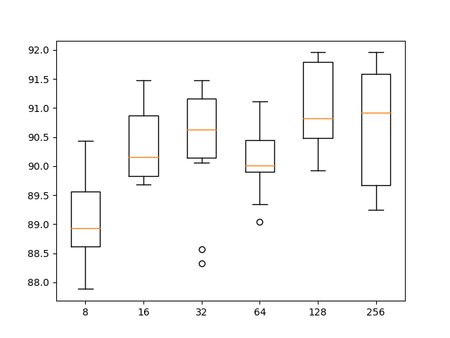
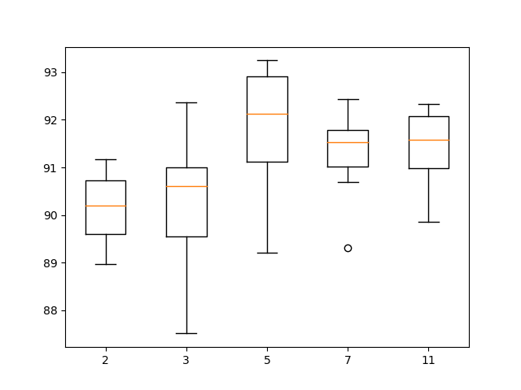
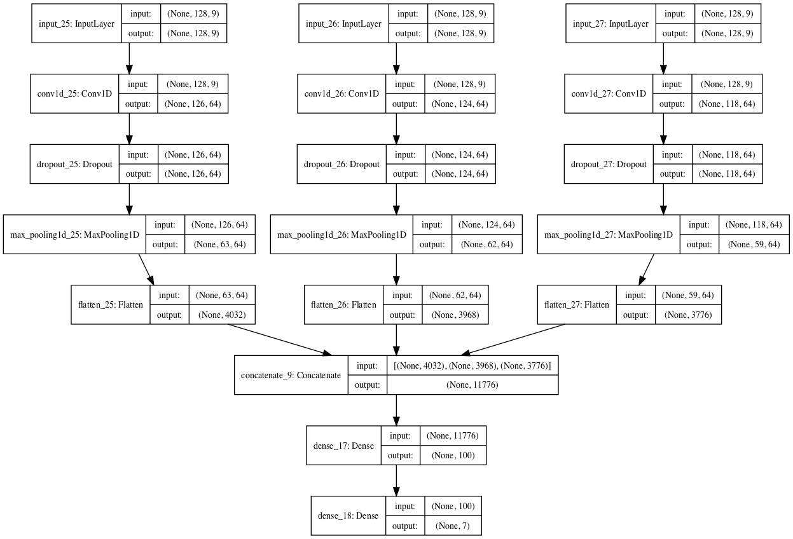

### How to Develop CNNs for Human Activity Recognition

Human activity recognition is the problem of classifying sequences of accelerometer data
recorded by specialized harnesses or smartphones into known well-defined movements. Classical
approaches to the problem involve hand crafting features from the time series data based on
fixed-sized windows and training machine learning models, such as ensembles of decision trees.

The difficulty is that this feature engineering requires deep expertise
in the field. Recently, deep
learning methods such as recurrent neural networks and one-dimensional convolutional neural
networks, or CNNs, have been shown to provide state-of-the-art results on challenging activity
recognition tasks with little or no data feature engineering, instead using feature learning on raw
data. In this tutorial, you will discover how to develop one-dimensional convolutional neural
networks for time series classification on the problem of human activity recognition. After
completing this tutorial, you will know:

- How to load and prepare the data for a standard human activity recognition dataset and
develop a single 1D CNN model that achieves excellent performance on the raw data.

- How to further tune the performance of the model, including data transformation, filter
maps, and kernel sizes.

- How to develop a sophisticated multi-headed one-dimensional convolutional neural network
model that provides an ensemble-like result.

Let’s get started.

#### Tutorial Overview

This tutorial is divided into four parts; they are:

1.  Activity Recognition Using Smartphones Dataset
2.  CNN for Activity Recognition
3.  Tuned CNN Model
4.  Multi-headed CNN Model

#### Activity Recognition Using Smartphones Dataset

Human Activity Recognition, or HAR for short, is the problem of predicting what a person is
doing based on a trace of their movement using sensors. A standard human activity recognition
dataset is theActivity Recognition Using Smartphones made available in 2012. For more
information on this dataset, see Chapter 22. The data is provided as a single zip file that is
about 58 megabytes in size. A direct for downloading the dataset is provided below:

- HARSmartphones.zip^1

Download the dataset and unzip all files into a new directory in your current working
directory namedHARDataset.

#### CNN for Activity Recognition

In this section, we will develop a one-dimensional convolutional neural network model (1D
CNN) for the human activity recognition dataset. Convolutional neural network models were
developed for image classification problems, where the model learns an internal representation
of a two-dimensional input, in a process referred to as feature learning. Although we refer
to the model as 1D, it supports multiple dimensions of input as separate channels, like the
color channels of an image (red, green and blue). This same process can be harnessed on
one-dimensional sequences of data, such as in the case of acceleration and gyroscopic data for
human activity recognition. The model learns to extract features from sequences of observations
and how to map the internal features to different activity types. For more information on CNNs
for time series forecasting, see Chapter 8.

The benefit of using CNNs for sequence classification is that they can learn from the raw
time series data directly, and in turn do not require domain expertise to manually engineer
input features. The model can learn an internal representation of the time series data and
ideally achieve comparable performance to models fit on a version of the dataset with engineered
features. This section is divided into 4 parts; they are:

1.  Load Data
2.  Fit and Evaluate Model
3.  Summarize Results
4.  Complete Example

<!-- -->

Some of the details on loading and preparing the dataset were covered in Chapters 22 and
23. There is some repetition here in order to customize the data
preparation and prediction
evaluation for deep learning models.

#### Load Data

The first step is to load the raw dataset into memory. There are three main signal types in the
raw data: total acceleration, body acceleration, and body gyroscope. Each has three axes of
data. This means that there are a total of nine variables for each time step. Further, each series
of data has been partitioned into overlapping windows of 2.65 seconds of data, or 128 time steps.
These windows of data correspond to the windows of engineered features (rows) in the previous
section.

This means that one row of data has (128 × 9), or 1,152, elements. This is a little less than
double the size of the 561 element vectors in the previous section and it is likely that there
is some redundant data. The signals are stored in the /Inertial Signals/ directory under
the train and test subdirectories. Each axis of each signal is stored in a separate file, meaning
that each of the train and test datasets have nine input files to load and one output file to load.
We can batch the loading of these files into groups given the consistent directory structures
and file naming conventions. The input data is in CSV format where columns are separated by
whitespace. Each of these files can be loaded as a NumPy array. The load file() function
below loads a dataset given the file path to the file and returns the loaded data as a NumPy
array.

```
# load a single file as a numpy array
def load_file(filepath):
dataframe = read_csv(filepath, header=None, delim_whitespace=True)
return dataframe.values

```

We can then load all data for a given group (train or test) into a single three-dimensional
NumPy array, where the dimensions of the array are [samples, timesteps, features]. To
make this clearer, there are 128 time steps and nine features, where the number of samples is the
number of rows in any given raw signal data file. The load group() function below implements
this behavior. The dstack() NumPy function allows us to stack each of the loaded 3D arrays
into a single 3D array where the variables are separated on the third dimension (features).

```
# load a list of files into a 3D array of [samples, timesteps, features]
def load_group(filenames, prefix=''):
loaded = list()
for name in filenames:
data = load_file(prefix + name)
loaded.append(data)
# stack group so that features are the 3rd dimension
loaded = dstack(loaded)
return loaded

```

We can use this function to load all input signal data for a given group, such as train or test.
The load dataset group() function below loads all input signal data and the output data for
a single group using the consistent naming conventions between the train and test directories.

```
# load a dataset group, such as train or test
def load_dataset_group(group, prefix=''):
filepath = prefix + group + '/Inertial Signals/'
# load all 9 files as a single array
filenames = list()


# total acceleration
filenames += ['total_acc_x_'+group+'.txt','total_acc_y_'+group+'.txt',
'total_acc_z_'+group+'.txt']
# body acceleration
filenames += ['body_acc_x_'+group+'.txt', 'body_acc_y_'+group+'.txt',
'body_acc_z_'+group+'.txt']
# body gyroscope
filenames += ['body_gyro_x_'+group+'.txt','body_gyro_y_'+group+'.txt',
'body_gyro_z_'+group+'.txt']
# load input data
X = load_group(filenames, filepath)
# load class output
y = load_file(prefix + group +'/y_'+group+'.txt')
return X, y

```

Finally, we can load each of the train and test datasets. The output data is defined as an
integer for the class number. We must one hot encode these class integers so that the data is
suitable for fitting a neural network multiclass classification model. We can do this by calling
the to categorical() Keras function. The load dataset() function below implements this
behavior and returns the train and test X and y elements ready for fitting and evaluating the
defined models.


```
def load_dataset(prefix=''):
trainX, trainy = load_dataset_group('train', prefix + 'HARDataset/')
print(trainX.shape, trainy.shape)
testX, testy = load_dataset_group('test', prefix + 'HARDataset/')
print(testX.shape, testy.shape)

trainy = trainy - 1
testy = testy - 1

trainy = to_categorical(trainy)
testy = to_categorical(testy)
print(trainX.shape, trainy.shape, testX.shape, testy.shape)
return trainX, trainy, testX, testy

```

#### Fit and Evaluate Model

Now that we have the data loaded into memory ready for modeling, we can define, fit, and
evaluate a 1D CNN model. We can define a function named evaluate model() that takes the
train and test dataset, fits a model on the training dataset, evaluates it on the test dataset, and
returns an estimate of the model’s performance. First, we must define the CNN model using
the Keras deep learning library. The model requires a three-dimensional input with [samples,
timesteps, features].

This is exactly how we have loaded the data, where one sample is one window of the time
series data, each window has 128 time steps, and a time step has nine variables or features. The24.3. CNN for Activity Recognition 495
output for the model will be a six-element vector containing the probability of a given window
belonging to each of the six activity types. These input and output dimensions are required
when fitting the model, and we can extract them from the provided training dataset.

```

# define data shape
n_timesteps, n_features, n_outputs = trainX.shape[1], trainX.shape[2], trainy.shape[1]

```

The model is defined as a Sequential Keras model, for simplicity. We will define the model
as having two 1D CNN layers, followed by a dropout layer for regularization, then a pooling
layer. It is common to define CNN layers in groups of two in order to give the model a good
chance of learning features from the input data. CNNs learn very quickly, so the dropout layer
is intended to help slow down the learning process and hopefully result in a better final model.
The pooling layer reduces the learned features to 1 4 their size, consolidating them to only the
most essential elements. After the CNN and pooling, the learned features are flattened to one
long vector and pass through a fully connected layer before the output layer used to make a
prediction. The fully connected layer ideally provides a buffer between the learned features and
the output with the intent of interpreting the learned features before making a prediction.

For this model, we will use a standard configuration of 64 parallel feature maps and a kernel
size of 3. The feature maps are the number of times the input is processed or interpreted,
whereas the kernel size is the number of input time steps considered as the input sequence is
read or processed onto the feature maps. The efficient Adam version of stochastic gradient
descent will be used to optimize the network, and the categorical cross entropy loss function
will be used given that we are learning a multiclass classification problem. The definition of the
model is listed below.


```
# define the CNN model
model = Sequential()
model.add(Conv1D(filters=64, kernel_size=3, activation='relu',
input_shape=(n_timesteps,n_features)))
model.add(Conv1D(filters=64, kernel_size=3, activation='relu'))
model.add(Dropout(0.5))
model.add(MaxPooling1D(pool_size=2))
model.add(Flatten())
model.add(Dense(100, activation='relu'))
model.add(Dense(n_outputs, activation='softmax'))
model.compile(loss='categorical_crossentropy', optimizer='adam', metrics=['accuracy'])

```

The model is fit for a fixed number of epochs, in this case 10, and a batch size of 32 samples
will be used, where 32 windows of data will be exposed to the model before the weights of the
model are updated. Once the model is fit, it is evaluated on the test dataset and the accuracy
of the fit model on the test dataset is returned. The complete evaluate model() function is
listed below.

```
# fit and evaluate a model
def evaluate_model(trainX, trainy, testX, testy):
verbose, epochs, batch_size = 0, 10, 32
n_timesteps, n_features, n_outputs = trainX.shape[1], trainX.shape[2], trainy.shape[1]
model = Sequential()
model.add(Conv1D(filters=64, kernel_size=3, activation='relu',
input_shape=(n_timesteps,n_features)))


model.add(Conv1D(filters=64, kernel_size=3, activation='relu'))
model.add(Dropout(0.5))
model.add(MaxPooling1D(pool_size=2))
model.add(Flatten())
model.add(Dense(100, activation='relu'))
model.add(Dense(n_outputs, activation='softmax'))
model.compile(loss='categorical_crossentropy', optimizer='adam', metrics=['accuracy'])
# fit network
model.fit(trainX, trainy, epochs=epochs, batch_size=batch_size, verbose=verbose)
# evaluate model
_, accuracy = model.evaluate(testX, testy, batch_size=batch_size, verbose=0)
return accuracy

```

There is nothing special about the network structure or chosen hyperparameters; they are
just a starting point for this problem.

#### Summarize Results

We cannot judge the skill of the model from a single evaluation. The reason for this is that
neural networks are stochastic, meaning that a different specific model will result when training
the same model configuration on the same data. This is a feature of the network in that it gives
the model its adaptive ability, but requires a slightly more complicated evaluation of the model.
We will repeat the evaluation of the model multiple times, then summarize the performance of
the model across each of those runs. For example, we can call evaluate model() a total of 10
times. This will result in a population of model evaluation scores that must be summarized.

```
# repeat experiment
scores = list()
for r in range(repeats):
score = evaluate_model(trainX, trainy, testX, testy)
score = score * 100.0
print('>#%d: %.3f'% (r+1, score))
scores.append(score)

```

We can summarize the sample of scores by calculating and reporting the mean and standard
deviation of the performance. The mean gives the average accuracy of the model on the dataset,
whereas the standard deviation gives the average variance of the accuracy from the mean. The
function summarize results() below summarizes the results of a run.

```
# summarize scores
def summarize_results(scores):
print(scores)
m, s = mean(scores), std(scores)
print('Accuracy: %.3f%% (+/-%.3f)' % (m, s))
```

We can bundle up the repeated evaluation, gathering of results, and summarization of results
into a main function for the experiment, called run experiment(), listed below. By default,
the model is evaluated 10 times before the performance of the model is reported.

```
def run_experiment(repeats=10):
trainX, trainy, testX, testy = load_dataset()

scores = list()
for r in range(repeats):
score = evaluate_model(trainX, trainy, testX, testy)
score = score * 100.0
print('>#%d: %.3f' % (r+1, score))
scores.append(score)

summarize_results(scores)

```

#### Complete Example

Now that we have all of the pieces, we can tie them together into a
worked example. The complete code

```
from numpy import mean
from numpy import std
from numpy import dstack
from pandas import read_csv
from keras.models import Sequential
from keras.layers import Dense
from keras.layers import Flatten
from keras.layers import Dropout
from keras.layers.convolutional import Conv1D
from keras.layers.convolutional import MaxPooling1D
from keras.utils import to_categorical

def load_file(filepath):
dataframe = read_csv(filepath, header=None, delim_whitespace=True)
return dataframe.values

def load_group(filenames, prefix=''):
loaded = list()
for name in filenames:
data = load_file(prefix + name)
loaded.append(data)

loaded = dstack(loaded)
return loaded

def load_dataset_group(group, prefix=''):
filepath = prefix + group + '/Inertial Signals/'

filenames = list()

# total acceleration
filenames += ['total_acc_x_'+group+'.txt','total_acc_y_'+group+'.txt',
'total_acc_z_'+group+'.txt']
# body acceleration
filenames += ['body_acc_x_'+group+'.txt', 'body_acc_y_'+group+'.txt',
'body_acc_z_'+group+'.txt']
# body gyroscope
filenames += ['body_gyro_x_'+group+'.txt','body_gyro_y_'+group+'.txt',
'body_gyro_z_'+group+'.txt']
# load input data
X = load_group(filenames, filepath)
# load class output
y = load_file(prefix + group +'/y_'+group+'.txt')
return X, y

def load_dataset(prefix=''):
trainX, trainy = load_dataset_group('train', prefix + 'HARDataset/')
testX, testy = load_dataset_group('test', prefix + 'HARDataset/')

trainy = trainy - 1
testy = testy - 1

trainy = to_categorical(trainy)
testy = to_categorical(testy)
return trainX, trainy, testX, testy

def evaluate_model(trainX, trainy, testX, testy):
verbose, epochs, batch_size = 0, 10, 32
n_timesteps, n_features, n_outputs = trainX.shape[1],
trainX.shape[2], trainy.shape[1]
model = Sequential()
model.add(Conv1D(filters=64, kernel_size=3, activation='relu',
input_shape=(n_timesteps,n_features)))
model.add(Conv1D(filters=64, kernel_size=3, activation='relu'))
model.add(Dropout(0.5))
model.add(MaxPooling1D(pool_size=2))
model.add(Flatten())
model.add(Dense(100, activation='relu'))
model.add(Dense(n_outputs, activation='softmax'))
model.compile(loss='categorical_crossentropy', optimizer='adam',
metrics=['accuracy'])
model.fit(trainX, trainy, epochs=epochs, batch_size=batch_size,
verbose=verbose)
_, accuracy = model.evaluate(testX, testy, batch_size=batch_size,
verbose=0)
return accuracy

def summarize_results(scores):
print(scores)
m, s = mean(scores), std(scores)
print('Accuracy: %.3f%% (+/-%.3f)'% (m, s))


def run_experiment(repeats=10):
# load data
trainX, trainy, testX, testy = load_dataset()
# repeat experiment
scores = list()
for r in range(repeats):
score = evaluate_model(trainX, trainy, testX, testy)
score = score * 100.0
print('>#%d: %.3f' % (r+1, score))
scores.append(score)
# summarize results
summarize_results(scores)

# run the experiment
run_experiment()

```

Running the example first loads the dataset. The models are created and evaluated and a
debug message is printed for each. Finally, the sample of scores is printed followed by the mean
and standard deviation. We can see that the model performed well achieving a classification
accuracy of about 90.9% trained on the raw dataset, with a standard deviation of about 1.3.
This is a good result, considering that the original paper published a result of 89%, trained on
the dataset with heavy domain-specific feature engineering, not the raw dataset.

**Note:** Given the stochastic nature of the algorithm, your specific results may vary. Consider
running the example a few times.

```

>#1: 91.347

>#2: 91.551

>#3: 90.804

>#4: 90.058

>#5: 89.752

>#6: 90.940

>#7: 91.347

>#8: 87.547

>#9: 92.637

>#10: 91.890

[91.34713267729894, 91.55072955548015, 90.80420766881574, 90.05768578215134,

89.75229046487954, 90.93993892093654, 91.34713267729894, 87.54665761791652,

92.63657957244655, 91.89005768578215]

Accuracy: 90.787% (+/-1.341)

```

Now that we have seen how to load the data and fit a 1D CNN model, we can investigate
whether we can further lift the skill of the model with some
hyperparameter tuning.

#### Tuned CNN Model

In this section, we will tune the model in an effort to further improve performance on the
problem. We will look at three main areas:


1.  Data Preparation
2.  Number of Filters
3.  Size of Kernel

#### Data Preparation

In the previous section, we did not perform any data preparation. We used the data as-is. Each
of the main sets of data (body acceleration, body gyroscopic, and total acceleration) have been
scaled to the range -1, 1. It is not clear if the data was scaled per-subject or across all subjects.
One possible transform that may result in an improvement is to standardize the observations
prior to fitting a model.

Standardization refers to shifting the distribution of each variable such that it has a mean of
zero and a standard deviation of 1. It really only makes sense if the distribution of each variable
is Gaussian. We can quickly check the distribution of each variable by plotting a histogram of
each variable in the training dataset. A minor difficulty in this is that the data has been split
into windows of 128 time steps, with a 50% overlap. Therefore, in order to get a fair idea of the
data distribution, we must first remove the duplicated observations (the overlap), then remove
the windowing of the data.

We can do this using NumPy, first slicing the array and only keeping the second half of each
window, then flattening the windows into a long vector for each variable. This is quick and dirty
and does mean that we lose the data in the first half of the first window.

```
# remove overlap
cut = int(trainX.shape[1] / 2)
longX = trainX[:, -cut:, :]
# flatten windows
longX = longX.reshape((longX.shape[0] * longX.shape[1], longX.shape[2]))

```

The complete example of loading the data, flattening it, and plotting a histogram for each
of the nine variables is listed below.


```

# plot distributions for the har dataset
from numpy import dstack
from pandas import read_csv
from keras.utils import to_categorical
from matplotlib import pyplot

# load a single file as a numpy array
def load_file(filepath):
dataframe = read_csv(filepath, header=None, delim_whitespace=True)
return dataframe.values

# load a list of files and return as a 3d numpy array
def load_group(filenames, prefix=''):
loaded = list()
for name in filenames:
data = load_file(prefix + name)
loaded.append(data)
# stack group so that features are the 3rd dimension


loaded = dstack(loaded)
return loaded

def load_dataset_group(group, prefix=''):
filepath = prefix + group + '/Inertial Signals/'

filenames = list()

filenames +=
['total_acc_x_'+group+'.txt','total_acc_y_'+group+'.txt',
'total_acc_z_'+group+'.txt']

filenames += ['body_acc_x_'+group+'.txt',
'body_acc_y_'+group+'.txt',
'body_acc_z_'+group+'.txt']
filenames +=
['body_gyro_x_'+group+'.txt','body_gyro_y_'+group+'.txt',
'body_gyro_z_'+group+'.txt']

X = load_group(filenames, filepath)

y = load_file(prefix + group +'/y_'+group+'.txt')
return X, y

def load_dataset(prefix=''):
trainX, trainy = load_dataset_group('train', prefix + 'HARDataset/')
testX, testy = load_dataset_group('test', prefix + 'HARDataset/')

trainy = trainy - 1
testy = testy - 1

trainy = to_categorical(trainy)
testy = to_categorical(testy)
return trainX, trainy, testX, testy

def plot_variable_distributions(trainX):
cut = int(trainX.shape[1] / 2)
longX = trainX[:, -cut:, :]

longX = longX.reshape((longX.shape[0] * longX.shape[1],
longX.shape[2]))
pyplot.figure()
for i in range(longX.shape[1]):
ax = pyplot.subplot(longX.shape[1], 1, i+1)
ax.set_xlim(-1, 1)

pyplot.hist(longX[:, i], bins=100)

pyplot.yticks([])
pyplot.xticks([-1,0,1])
pyplot.show()


# load data
trainX, trainy, testX, testy = load_dataset()
# plot histograms
plot_variable_distributions(trainX)

```

Running the example creates a figure with nine histogram plots, one for each variable in
the training dataset. The order of the plots matches the order in which the data was loaded,
specifically:

1. Total Acceleration x
2. Total Acceleration y
3. Total Acceleration z
4. Body Acceleration x
5. Body Acceleration y
6. Body Acceleration z
7. Body Gyroscope x
8. Body Gyroscope y
9. Body Gyroscope z

We can see that each variable has a Gaussian-like distribution, except perhaps the first
variable (Total Acceleration x). The distributions of total acceleration data is flatter than the
body data, which is more pointed. We could explore using a power transform on the data to
make the distributions more Gaussian, although this is left as an exercise.



The data is sufficiently Gaussian-like to explore whether a standardization transform will
help the model extract salient signal from the raw observations. The function below named
scale data() can be used to standardize the data prior to fitting and evaluating the model.
The StandardScaler scikit-learn class will be used to perform the transform. It is first fit on the
training data (e.g. to find the mean and standard deviation for each variable), then applied to
the train and test sets. The standardization is optional, so we can apply the process and compare
the results to the same code path without the standardization in a controlled experiment.

```
# standardize data
def scale_data(trainX, testX, standardize):
# remove overlap
cut = int(trainX.shape[1] / 2)
longX = trainX[:, -cut:, :]
# flatten windows
longX = longX.reshape((longX.shape[0] * longX.shape[1], longX.shape[2]))
# flatten train and test
flatTrainX = trainX.reshape((trainX.shape[0] * trainX.shape[1], trainX.shape[2]))
flatTestX = testX.reshape((testX.shape[0] * testX.shape[1], testX.shape[2]))
# standardize
if standardize:
s = StandardScaler()
# fit on training data
s.fit(longX)


# apply to training and test data
longX = s.transform(longX)
flatTrainX = s.transform(flatTrainX)
flatTestX = s.transform(flatTestX)
# reshape
flatTrainX = flatTrainX.reshape((trainX.shape))
flatTestX = flatTestX.reshape((testX.shape))
return flatTrainX, flatTestX

```

We can update the evaluate model() function to take a parameter, then use this parameter
to decide whether or not to perform the standardization.

```
def evaluate_model(trainX, trainy, testX, testy, param):
verbose, epochs, batch_size = 0, 10, 32
n_timesteps, n_features, n_outputs = trainX.shape[1],
trainX.shape[2], trainy.shape[1]
trainX, testX = scale_data(trainX, testX, param)
model = Sequential()
model.add(Conv1D(filters=64, kernel_size=3, activation='relu',
input_shape=(n_timesteps,n_features)))
model.add(Conv1D(filters=64, kernel_size=3, activation='relu'))
model.add(Dropout(0.5))
model.add(MaxPooling1D(pool_size=2))
model.add(Flatten())
model.add(Dense(100, activation='relu'))
model.add(Dense(n_outputs, activation='softmax'))
model.compile(loss='categorical_crossentropy', optimizer='adam',
metrics=['accuracy'])
model.fit(trainX, trainy, epochs=epochs, batch_size=batch_size,
verbose=verbose)
_, accuracy = model.evaluate(testX, testy, batch_size=batch_size,
verbose=0)
return accuracy

```

We can also update the run experiment() to repeat the experiment 10 times for each parameter; in this case,only two parameters will be evaluated [False, True] for no standardization
and standardization respectively.

```

def run_experiment(params, repeats=10):
trainX, trainy, testX, testy = load_dataset()

all_scores = list()
for p in params:

scores = list()
for r in range(repeats):
score = evaluate_model(trainX, trainy, testX, testy, p)
score = score * 100.0
print('>p=%d #%d: %.3f'% (p, r+1, score))
scores.append(score)


all_scores.append(scores)
# summarize results
summarize_results(all_scores, params)

```

This will result in two samples of results that can be compared. We will update the
summarizeresults() function to summarize the sample of results for each configuration
parameter and to create a box plot to compare each sample of results.

```
# summarize scores
def summarize_results(scores, params):
print(scores, params)
# summarize mean and standard deviation
for i in range(len(scores)):
m, s = mean(scores[i]), std(scores[i])
print('Param=%d: %.3f%% (+/-%.3f)' % (params[i], m, s))
# box plot of scores
pyplot.boxplot(scores, labels=params)
pyplot.savefig('exp_cnn_standardize.png')

```

These updates will allow us to directly compare the results of a model fit as before and a
model fit on the dataset after it has been standardized. It is also a generic change that will
allow us to evaluate and compare the results of other sets of parameters in the following sections.


```
# cnn model with standardization for the har dataset
from numpy import mean
from numpy import std
from numpy import dstack
from pandas import read_csv
from matplotlib import pyplot
from sklearn.preprocessing import StandardScaler
from keras.models import Sequential
from keras.layers import Dense
from keras.layers import Flatten
from keras.layers import Dropout
from keras.layers.convolutional import Conv1D
from keras.layers.convolutional import MaxPooling1D
from keras.utils import to_categorical

# load a single file as a numpy array
def load_file(filepath):
dataframe = read_csv(filepath, header=None, delim_whitespace=True)
return dataframe.values

# load a list of files and return as a 3d numpy array
def load_group(filenames, prefix=''):
loaded = list()
for name in filenames:
data = load_file(prefix + name)
loaded.append(data)
# stack group so that features are the 3rd dimension
loaded = dstack(loaded)
return loaded


def load_dataset_group(group, prefix=''):
filepath = prefix + group + '/Inertial Signals/'

filenames = list()

filenames +=
['total_acc_x_'+group+'.txt','total_acc_y_'+group+'.txt',
'total_acc_z_'+group+'.txt']

filenames += ['body_acc_x_'+group+'.txt',
'body_acc_y_'+group+'.txt',
'body_acc_z_'+group+'.txt']
filenames +=
['body_gyro_x_'+group+'.txt','body_gyro_y_'+group+'.txt',
'body_gyro_z_'+group+'.txt']

X = load_group(filenames, filepath)

y = load_file(prefix + group +'/y_'+group+'.txt')
return X, y

def load_dataset(prefix=''):
trainX, trainy = load_dataset_group('train', prefix + 'HARDataset/')
testX, testy = load_dataset_group('test', prefix + 'HARDataset/')

trainy = trainy - 1
testy = testy - 1

trainy = to_categorical(trainy)
testy = to_categorical(testy)
return trainX, trainy, testX, testy

def scale_data(trainX, testX, standardize):
cut = int(trainX.shape[1] / 2)
longX = trainX[:, -cut:, :]

longX = longX.reshape((longX.shape[0] * longX.shape[1],
longX.shape[2]))

flatTrainX = trainX.reshape((trainX.shape[0] * trainX.shape[1],
trainX.shape[2]))
flatTestX = testX.reshape((testX.shape[0] * testX.shape[1],
testX.shape[2]))
if standardize:
s = StandardScaler()

s.fit(longX)

longX = s.transform(longX)
flatTrainX = s.transform(flatTrainX)
flatTestX = s.transform(flatTestX)
flatTrainX = flatTrainX.reshape((trainX.shape))


flatTestX = flatTestX.reshape((testX.shape))
return flatTrainX, flatTestX

def evaluate_model(trainX, trainy, testX, testy, param):
verbose, epochs, batch_size = 0, 10, 32
n_timesteps, n_features, n_outputs = trainX.shape[1],
trainX.shape[2], trainy.shape[1]
trainX, testX = scale_data(trainX, testX, param)
model = Sequential()
model.add(Conv1D(filters=64, kernel_size=3, activation='relu',
input_shape=(n_timesteps,n_features)))
model.add(Conv1D(filters=64, kernel_size=3, activation='relu'))
model.add(Dropout(0.5))
model.add(MaxPooling1D(pool_size=2))
model.add(Flatten())
model.add(Dense(100, activation='relu'))
model.add(Dense(n_outputs, activation='softmax'))
model.compile(loss='categorical_crossentropy', optimizer='adam',
metrics=['accuracy'])
model.fit(trainX, trainy, epochs=epochs, batch_size=batch_size,
verbose=verbose)
_, accuracy = model.evaluate(testX, testy, batch_size=batch_size,
verbose=0)
return accuracy

def summarize_results(scores, params):
print(scores, params)

for i in range(len(scores)):
m, s = mean(scores[i]), std(scores[i])
print('Param=%s: %.3f%% (+/-%.3f)' % (params[i], m, s))

pyplot.boxplot(scores, labels=params)
pyplot.savefig('exp_cnn_standardize.png')

def run_experiment(params, repeats=10):
trainX, trainy, testX, testy = load_dataset()

all_scores = list()
for p in params:

scores = list()
for r in range(repeats):
score = evaluate_model(trainX, trainy, testX, testy, p)
score = score * 100.0
print('>p=%s #%d: %.3f'% (p, r+1, score))
scores.append(score)
all_scores.append(scores)

summarize_results(all_scores, params)

n_params = [False, True]


run_experiment(n_params)

```

Running the example may take a while, depending on your hardware. The performance
is printed for each evaluated model. At the end of the run, the performance of each of the
tested configurations is summarized showing the mean and the standard deviation. We can see
that it does look like standardizing the dataset prior to modeling does result in a small lift in
performance from about 90.4% accuracy (close to what we saw in the previous section) to about
91.5% accuracy.

**Note:** Given the stochastic nature of the algorithm, your specific
results may vary. Consider running the example a few times.

```

> p=False #1: 91.483
>  p=False #2: 91.245
>  p=False #3: 90.838
>  p=False #4: 89.243
>  p=False #5: 90.193
>  p=False #6: 90.465
>  p=False #7: 90.397
>  p=False #8: 90.567
>  p=False #9: 88.938
>  p=False #10: 91.144
>  p=True #1: 92.908
>  p=True #2: 90.940
>  p=True #3: 92.297
>  p=True #4: 91.822
>  p=True #5: 92.094
>  p=True #6: 91.313
>  p=True #7: 91.653
>  p=True #8: 89.141
>  p=True #9: 91.110
>  p=True #10: 91.890

[[91.48286392941975, 91.24533423820834, 90.83814048184594,
89.24329826942655,
90.19341703427214, 90.46487953851374, 90.39701391245333,
90.56667797760434,
88.93790295215473, 91.14353579911774], [92.90804207668816,
90.93993892093654,
92.29725144214456, 91.82219205972176, 92.09365456396336,
91.31319986426874,
91.65252799457076, 89.14149983033593, 91.10960298608755,
91.89005768578215]] [False,
True]

Param=False: 90.451% (+/-0.785)
Param=True: 91.517% (+/-0.965)

```

Running the example may take a while, depending on your hardware. The performance
is printed for each evaluated model. At the end of the run, the performance of each of the
tested configurations is summarized showing the mean and the standard deviation. We can see
that it does look like standardizing the dataset prior to modeling does result in a small lift in
performance from about 90.4% accuracy (close to what we saw in the previous section) to about
91.5% accuracy.



#### Number of Filters
Now that we have an experimental framework, we can explore varying other hyperparameters
of the model. An important hyperparameter for the CNN is the number of filter maps. We can
experiment with a range of different values, from less to many more than the 64 used in the
first model that we developed. Specifically, we will try the following numbers of feature maps:

```
# define configuration
n_params = [8, 16, 32, 64, 128, 256]
```

We can use the same code from the previous section and update the evaluate model()
function to use the provided parameter as the number of filters in the Conv1D layers. We can
also update the summarize results() function to save the box plot as exp cnn filters.png.
The complete code example is listed below.

```

# cnn model with filters for the har dataset
from numpy import mean
from numpy import std
from numpy import dstack
from pandas import read_csv
from matplotlib import pyplot


from keras.models import Sequential
from keras.layers import Dense
from keras.layers import Flatten
from keras.layers import Dropout
from keras.layers.convolutional import Conv1D
from keras.layers.convolutional import MaxPooling1D
from keras.utils import to_categorical

def load_file(filepath):
dataframe = read_csv(filepath, header=None, delim_whitespace=True)
return dataframe.values

def load_group(filenames, prefix=''):
loaded = list()
for name in filenames:
data = load_file(prefix + name)
loaded.append(data)

loaded = dstack(loaded)
return loaded

def load_dataset_group(group, prefix=''):
filepath = prefix + group + '/Inertial Signals/'

filenames = list()

filenames +=
['total_acc_x_'+group+'.txt','total_acc_y_'+group+'.txt',
'total_acc_z_'+group+'.txt']

filenames += ['body_acc_x_'+group+'.txt',
'body_acc_y_'+group+'.txt',
'body_acc_z_'+group+'.txt']
filenames +=
['body_gyro_x_'+group+'.txt','body_gyro_y_'+group+'.txt',
'body_gyro_z_'+group+'.txt']

X = load_group(filenames, filepath)

y = load_file(prefix + group +'/y_'+group+'.txt')
return X, y

def load_dataset(prefix=''):
trainX, trainy = load_dataset_group('train', prefix + 'HARDataset/')
testX, testy = load_dataset_group('test', prefix + 'HARDataset/')

trainy = trainy - 1
testy = testy - 1

trainy = to_categorical(trainy)
testy = to_categorical(testy)
return trainX, trainy, testX, testy


def evaluate_model(trainX, trainy, testX, testy, n_filters):
verbose, epochs, batch_size = 0, 10, 32
n_timesteps, n_features, n_outputs = trainX.shape[1],
trainX.shape[2], trainy.shape[1]
model = Sequential()
model.add(Conv1D(filters=n_filters, kernel_size=3,
activation='relu',
input_shape=(n_timesteps,n_features)))
model.add(Conv1D(filters=n_filters, kernel_size=3,
activation='relu'))
model.add(Dropout(0.5))
model.add(MaxPooling1D(pool_size=2))
model.add(Flatten())
model.add(Dense(100, activation='relu'))
model.add(Dense(n_outputs, activation='softmax'))
model.compile(loss='categorical_crossentropy', optimizer='adam',
metrics=['accuracy'])
model.fit(trainX, trainy, epochs=epochs, batch_size=batch_size,
verbose=verbose)
_, accuracy = model.evaluate(testX, testy, batch_size=batch_size,
verbose=0)
return accuracy

def summarize_results(scores, params):
print(scores, params)

for i in range(len(scores)):
m, s = mean(scores[i]), std(scores[i])
print('Param=%d: %.3f%% (+/-%.3f)' % (params[i], m, s))

pyplot.boxplot(scores, labels=params)
pyplot.savefig('exp_cnn_filters.png')

def run_experiment(params, repeats=10):
trainX, trainy, testX, testy = load_dataset()

all_scores = list()
for p in params:

scores = list()
for r in range(repeats):
score = evaluate_model(trainX, trainy, testX, testy, p)
score = score * 100.0
print('>p=%d #%d: %.3f'% (p, r+1, score))
scores.append(score)
all_scores.append(scores)

summarize_results(all_scores, params)

n_params = [8, 16, 32, 64, 128, 256]
run_experiment(n_params)

```


Running the example repeats the experiment for each of the specified number of filters. At
the end of the run, a summary of the results with each number of filters is presented. We can
see perhaps a trend of increasing average performance with the increase in the number of filter
maps. The variance stays pretty constant, and perhaps 128 feature maps might be a good
configuration for the network.

**Note:** Given the stochastic nature of the algorithm, your specific results may vary. Consider
running the example a few times.

```

...

Param=8: 89.148% (+/-0.790)
Param=16: 90.383% (+/-0.613)
Param=32: 90.356% (+/-1.039)
Param=64: 90.098% (+/-0.615)
Param=128: 91.032% (+/-0.702)
Param=256: 90.706% (+/-0.997)

```

A box and whisker plot of the results is also created, allowing the distribution of results with
each number of filters to be compared. From the plot, we can see the trend upward in terms
of median classification accuracy (orange line on the box) with the increase in the number of
feature maps. We do see a dip at 64 feature maps (the default or baseline in our experiments),
which is surprising, and perhaps a plateau in accuracy across 32, 128,
and 256 filter maps. Perhaps 32 would be a more stable configuration.



#### Size of Kernel

The size of the kernel is another important hyperparameter of the 1D CNN to tune. The kernel
size controls the number of time steps consider in each read of the input sequence, that is then
projected onto the feature map (via the convolutional process). A large kernel size means a less
rigorous reading of the data, but may result in a more generalized snapshot of the input. We
can use the same experimental setup and test a suite of different kernel sizes in addition to the
default of three time steps. The full list of values is as follows:

```
# define configuration
n_params = [2, 3, 5, 7, 11]

```

The complete code listing is provided below:

```
from numpy import mean
from numpy import std
from numpy import dstack
from pandas import read_csv
from matplotlib import pyplot
from keras.models import Sequential


from keras.layers import Dense
from keras.layers import Flatten
from keras.layers import Dropout
from keras.layers.convolutional import Conv1D
from keras.layers.convolutional import MaxPooling1D
from keras.utils import to_categorical

def load_file(filepath):
dataframe = read_csv(filepath, header=None, delim_whitespace=True)
return dataframe.values

def load_group(filenames, prefix=''):
loaded = list()
for name in filenames:
data = load_file(prefix + name)
loaded.append(data)

loaded = dstack(loaded)
return loaded

def load_dataset_group(group, prefix=''):
filepath = prefix + group + '/Inertial Signals/'

filenames = list()

filenames +=
['total_acc_x_'+group+'.txt','total_acc_y_'+group+'.txt',
'total_acc_z_'+group+'.txt']

filenames += ['body_acc_x_'+group+'.txt',
'body_acc_y_'+group+'.txt',
'body_acc_z_'+group+'.txt']
filenames +=
['body_gyro_x_'+group+'.txt','body_gyro_y_'+group+'.txt',
'body_gyro_z_'+group+'.txt']

X = load_group(filenames, filepath)

y = load_file(prefix + group +'/y_'+group+'.txt')
return X, y

def load_dataset(prefix=''):
trainX, trainy = load_dataset_group('train', prefix + 'HARDataset/')
testX, testy = load_dataset_group('test', prefix + 'HARDataset/')

trainy = trainy - 1
testy = testy - 1

trainy = to_categorical(trainy)
testy = to_categorical(testy)
return trainX, trainy, testX, testy


def evaluate_model(trainX, trainy, testX, testy, n_kernel):
verbose, epochs, batch_size = 0, 15, 32
n_timesteps, n_features, n_outputs = trainX.shape[1],
trainX.shape[2], trainy.shape[1]
model = Sequential()
model.add(Conv1D(filters=64, kernel_size=n_kernel,
activation='relu',
input_shape=(n_timesteps,n_features)))
model.add(Conv1D(filters=64, kernel_size=n_kernel,
activation='relu'))
model.add(Dropout(0.5))
model.add(MaxPooling1D(pool_size=2))
model.add(Flatten())
model.add(Dense(100, activation='relu'))
model.add(Dense(n_outputs, activation='softmax'))
model.compile(loss='categorical_crossentropy', optimizer='adam',
metrics=['accuracy'])
model.fit(trainX, trainy, epochs=epochs, batch_size=batch_size,
verbose=verbose)
_, accuracy = model.evaluate(testX, testy, batch_size=batch_size,
verbose=0)
return accuracy

def summarize_results(scores, params):
print(scores, params)

for i in range(len(scores)):
m, s = mean(scores[i]), std(scores[i])
print('Param=%d: %.3f%% (+/-%.3f)' % (params[i], m, s))

pyplot.boxplot(scores, labels=params)
pyplot.savefig('exp_cnn_kernel.png')

def run_experiment(params, repeats=10):
trainX, trainy, testX, testy = load_dataset()

all_scores = list()
for p in params:

scores = list()
for r in range(repeats):
score = evaluate_model(trainX, trainy, testX, testy, p)
score = score * 100.0
print('>p=%d #%d: %.3f'% (p, r+1, score))
scores.append(score)
all_scores.append(scores)

summarize_results(all_scores, params)

n_params = [2, 3, 5, 7, 11]
run_experiment(n_params)

```

Running the example tests each kernel size in turn. The results are summarized at the end2
of the run. We can see a general increase in model performance with the increase in kernel
size. The results suggest a kernel size of 5 might be good with a mean skill of about 91.8%, but
perhaps a size of 7 or 11 may also be just as good with a smaller standard deviation.

**Note:** Given the stochastic nature of the algorithm, your specific
results may vary. Consider running the example a few times.

```
...

Param=2: 90.176% (+/-0.724)
Param=3: 90.275% (+/-1.277)
Param=5: 91.853% (+/-1.249)
Param=7: 91.347% (+/-0.852)
Param=11: 91.456% (+/-0.743)

```

A box and whisker plot of the results is also created. The results suggest that a larger kernel
size does appear to result in better accuracy and that perhaps a kernel size of 7 provides a good
balance between good performance and low variance.



This is just the beginning of tuning the model, although we have focused on perhaps the
more important elements. It might be interesting to explore combinations of some of the above
findings to see if performance can be lifted even further. It may also be interesting to increase
the number of repeats from 10 to 30 or more to see if it results in more stable findings.

#### Multi-headed CNN Model

Running the example prints the performance of the model each repeat of the experiment and
then summarizes the estimated score as the mean and standard deviation, as we did in the first
case with the simple 1D CNN. We can see that the average performance of the model is about
91.6% classification accuracy with a standard deviation of about 0.8. This example may be used
as the basis for exploring a variety of other models that vary different model hyperparameters
and even different data preparation schemes across the input heads.

It would not be an apples-to-apples comparison to compare this result with a single-headed
CNN given the relative tripling of the resources in this model. Perhaps an apples-to-apples
comparison would be a model with the same architecture and the same number of filters across
each input head of the model.


```
# fit and evaluate a model
def evaluate_model(trainX, trainy, testX, testy):
verbose, epochs, batch_size = 0, 10, 32
n_timesteps, n_features, n_outputs = trainX.shape[1], trainX.shape[2], trainy.shape[1]
# head 1
inputs1 = Input(shape=(n_timesteps,n_features))
conv1 = Conv1D(filters=64, kernel_size=3, activation='relu')(inputs1)
drop1 = Dropout(0.5)(conv1)
pool1 = MaxPooling1D(pool_size=2)(drop1)
flat1 = Flatten()(pool1)
# head 2
inputs2 = Input(shape=(n_timesteps,n_features))
conv2 = Conv1D(filters=64, kernel_size=5, activation='relu')(inputs2)
drop2 = Dropout(0.5)(conv2)
pool2 = MaxPooling1D(pool_size=2)(drop2)
flat2 = Flatten()(pool2)
# head 3
inputs3 = Input(shape=(n_timesteps,n_features))
conv3 = Conv1D(filters=64, kernel_size=11, activation='relu')(inputs3)
drop3 = Dropout(0.5)(conv3)
pool3 = MaxPooling1D(pool_size=2)(drop3)
flat3 = Flatten()(pool3)
# merge
merged = concatenate([flat1, flat2, flat3])
# interpretation
dense1 = Dense(100, activation='relu')(merged)
outputs = Dense(n_outputs, activation='softmax')(dense1)
model = Model(inputs=[inputs1, inputs2, inputs3], outputs=outputs)
# save a plot of the model
plot_model(model, show_shapes=True, to_file='multiheaded.png')
model.compile(loss='categorical_crossentropy', optimizer='adam', metrics=['accuracy'])
# fit network
model.fit([trainX,trainX,trainX], trainy, epochs=epochs, batch_size=batch_size,
verbose=verbose)
# evaluate model
_, accuracy = model.evaluate([testX,testX,testX], testy, batch_size=batch_size, verbose=0)

return accuracy

```

When the model is created, a plot of the network architecture is created; provided below, it
gives a clear idea of how the constructed model fits together.




Other aspects of the model could be varied across the heads, such as the number of filters or
even the preparation of the data itself. The complete code example with the multi-headed 1D
CNN is listed below.

```

from numpy import mean
from numpy import std
from numpy import dstack
from pandas import read_csv
from keras.utils import to_categorical
from keras.utils.vis_utils import plot_model
from keras.models import Model
from keras.layers import Input
from keras.layers import Dense
from keras.layers import Flatten
from keras.layers import Dropout
from keras.layers.convolutional import Conv1D
from keras.layers.convolutional import MaxPooling1D
from keras.layers.merge import concatenate

def load_file(filepath):
dataframe = read_csv(filepath, header=None, delim_whitespace=True)
return dataframe.values

def load_group(filenames, prefix=''):
loaded = list()
for name in filenames:
data = load_file(prefix + name)
loaded.append(data)

loaded = dstack(loaded)
return loaded

def load_dataset_group(group, prefix=''):
filepath = prefix + group + '/Inertial Signals/'

filenames = list()

filenames +=
['total_acc_x_'+group+'.txt','total_acc_y_'+group+'.txt',
'total_acc_z_'+group+'.txt']

filenames += ['body_acc_x_'+group+'.txt',
'body_acc_y_'+group+'.txt',
'body_acc_z_'+group+'.txt']
filenames +=
['body_gyro_x_'+group+'.txt','body_gyro_y_'+group+'.txt',
'body_gyro_z_'+group+'.txt']

X = load_group(filenames, filepath)

y = load_file(prefix + group +'/y_'+group+'.txt')
return X, y

def load_dataset(prefix=''):
trainX, trainy = load_dataset_group('train', prefix + 'HARDataset/')
testX, testy = load_dataset_group('test', prefix + 'HARDataset/')

trainy = trainy - 1
testy = testy - 1

trainy = to_categorical(trainy)
testy = to_categorical(testy)


return trainX, trainy, testX, testy

def evaluate_model(trainX, trainy, testX, testy):
verbose, epochs, batch_size = 0, 10, 32
n_timesteps, n_features, n_outputs = trainX.shape[1],
trainX.shape[2], trainy.shape[1]
inputs1 = Input(shape=(n_timesteps,n_features))
conv1 = Conv1D(filters=64, kernel_size=3, activation='relu')(inputs1)
drop1 = Dropout(0.5)(conv1)
pool1 = MaxPooling1D(pool_size=2)(drop1)
flat1 = Flatten()(pool1)
inputs2 = Input(shape=(n_timesteps,n_features))
conv2 = Conv1D(filters=64, kernel_size=5, activation='relu')(inputs2)
drop2 = Dropout(0.5)(conv2)
pool2 = MaxPooling1D(pool_size=2)(drop2)
flat2 = Flatten()(pool2)
inputs3 = Input(shape=(n_timesteps,n_features))
conv3 = Conv1D(filters=64, kernel_size=11,
activation='relu')(inputs3)
drop3 = Dropout(0.5)(conv3)
pool3 = MaxPooling1D(pool_size=2)(drop3)
flat3 = Flatten()(pool3)
merged = concatenate([flat1, flat2, flat3])
dense1 = Dense(100, activation='relu')(merged)
outputs = Dense(n_outputs, activation='softmax')(dense1)
model = Model(inputs=[inputs1, inputs2, inputs3], outputs=outputs)

plot_model(model, show_shapes=True, to_file='multiheaded.png')
model.compile(loss='categorical_crossentropy', optimizer='adam',
metrics=['accuracy'])
model.fit([trainX,trainX,trainX], trainy, epochs=epochs,
batch_size=batch_size,
verbose=verbose)
_, accuracy = model.evaluate([testX,testX,testX], testy,
batch_size=batch_size, verbose=0)
return accuracy

def summarize_results(scores):
print(scores)
m, s = mean(scores), std(scores)
print('Accuracy: %.3f%% (+/-%.3f)'% (m, s))

def run_experiment(repeats=10):
trainX, trainy, testX, testy = load_dataset()

scores = list()
for r in range(repeats):
score = evaluate_model(trainX, trainy, testX, testy)
score = score * 100.0
print('>#%d: %.3f' % (r+1, score))


scores.append(score)
# summarize results
summarize_results(scores)

# run the experiment
run_experiment()

```

Running the example prints the performance of the model each repeat of the experiment and
then summarizes the estimated score as the mean and standard deviation, as we did in the first
case with the simple 1D CNN. We can see that the average performance of the model is about
91.6% classification accuracy with a standard deviation of about 0.8. This example may be used
as the basis for exploring a variety of other models that vary different model hyperparameters
and even different data preparation schemes across the input heads.
It would not be an apples-to-apples comparison to compare this result with a single-headed
CNN given the relative tripling of the resources in this model. Perhaps an apples-to-apples
comparison would be a model with the same architecture and the same number of filters across
each input head of the model.

**Note:** Given the stochastic nature of the algorithm, your specific results may vary. Consider
running the example a few times.

```

>#1: 91.788

>#2: 92.942

>#3: 91.551

>#4: 91.415

>#5: 90.974

>#6: 91.992

>#7: 92.162

>#8: 89.888

>#9: 92.671

>#10: 91.415

[91.78825924669155, 92.94197488971835, 91.55072955548015, 91.41499830335935,

90.97387173396675, 91.99185612487275, 92.16152019002375, 89.88802171700034,

92.67051238547675, 91.41499830335935]

Accuracy: 91.680% (+/-0.823)

```
#### Extensions

This section lists some ideas for extending the tutorial that you may
wish to explore.

- Number of Variables. Run experiments to see if all nine variables are required in the
CNN or if it can do as well or better with a subset, such as just total acceleration.

- Date Preparation. Explore other data preparation schemes such as data normalization
and perhaps normalization after standardization.


- Network Architecture. Explore other network architectures, such as deeper CNN
architectures and deeper fully-connected layers for interpreting the CNN input features.

- Diagnostics. Use simple learning curve diagnostics to interpret how the model is learning
over the epochs and whether more regularization, different learning rates, or different
batch sizes or numbers of epochs may result in a better performing or more stable model.


#### Further Reading

This section provides more resources on the topic if you are looking to
go deeper.

- Getting started with the Keras Sequential model.
https://keras.io/getting-started/sequential-model-guide/

- Getting started with the Keras functional API.
https://keras.io/getting-started/functional-api-guide/

- Keras Sequential Model API.
https://keras.io/models/sequential/

- Keras Core Layers API.
https://keras.io/layers/core/

- Keras Convolutional Layers API.
https://keras.io/layers/convolutional/

- Keras Pooling Layers API.
https://keras.io/layers/pooling/

#### Summary

In this tutorial, you discovered how to develop one-dimensional convolutional neural networks
for time series classification on the problem of human activity recognition. Specifically, you
learned:

- How to load and prepare the data for a standard human activity recognition dataset and
develop a single 1D CNN model that achieves excellent performance on the raw data.

- How to further tune the performance of the model, including data transformation, filter
maps, and kernel sizes.

- How to develop a sophisticated multi-headed one-dimensional convolutional neural network
model that provides an ensemble-like result.

#### Next

In the next lab, you will discover how to develop Recurrent Neural Network models for
predicting human activities from a stream of smartphone accelerometer data.
